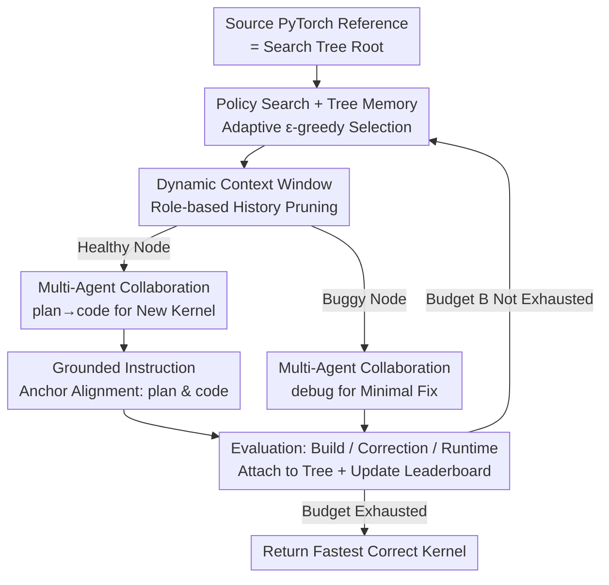

# STARK: Strategic Team of Agents for Refining Kernels

**Conference**: ICLR 2026  
**OpenReview**: [https://openreview.net/forum?id=nWaZTH1JMx](https://openreview.net/forum?id=nWaZTH1JMx)  
**Code**: None  
**Area**: Agent / LLM Code Generation / GPU Kernel Optimization  
**Keywords**: Multi-Agent, GPU Kernel Optimization, Policy Search, Tree Memory, KernelBench

## TL;DR
STARK reformulates GPU kernel optimization into an agent framework of "professional team collaboration + policy search on tree memory." By utilizing three specialized LLM agents (plan/code/debug), grounded instructions with anchors, role-customized dynamic context windows, and adaptive $\epsilon$-greedy search, it simulates the iterative tuning process of senior engineers. It achieves up to 16× runtime speedup compared to baseline agents on KernelBench.

## Background & Motivation

**Background**: The efficiency of GPU kernels (implementations of low-level operators like matrix multiplication and convolution) directly determines the training duration, inference latency, and deployment costs of large models. However, writing high-quality kernels is extremely difficult, requiring a delicate balance between thread scheduling, memory hierarchy, synchronization, and hardware features. Traditional approaches either rely on manual tuning by experts (effective but hard to scale) or use heuristic search via compilers and DSLs like TVM/Triton (which often struggle with irregular operators and hardware variations). The rise of LLMs offers new opportunities: they can not only generate correct code but also be guided to reason about hardware trade-offs, absorb profiling feedback, and iteratively rewrite implementations.

**Limitations of Prior Work**: Most existing works treat LLMs as "one-shot code generators" or "naive round-by-round refinement tools," failing to exploit their potential for structured exploration within the kernel design space. The authors specifically identify three issues:

**Key Challenge**: (1) **Naive Exploration Strategies**: Current agents refine code linearly, learning only from the previous attempt while ignoring information from a vast history of attempts, thus failing to balance exploration and exploitation and getting trapped in local optima. (2) **Monolithic Agent Design**: Kernel optimization requires distinct capabilities such as planning, implementation, and reflection. Burdening a single generalist LLM is inefficient. Furthermore, planning requires high temperature (to encourage diverse strategies) while coding requires low temperature (to ensure precision), a contradiction that a single fixed-temperature agent cannot resolve. (3) **Planning-Implementation Gap**: LLMs often conceive correct high-level optimization schemes (e.g., "apply memory tiling") but fail to write the corresponding valid CUDA code because expert-level kernel code is scarce in training datasets.

**Goal**: To enable LLM agents to systematically explore the kernel design space like an expert team, producing both correct kernels and significant runtime reductions.

**Key Insight**: The optimization process is viewed as the workflow of an engineering team—where different members are responsible for strategy, precise implementation, and debugging—performing directed search on a persistent "attempt tree" rather than blind sampling or nearsighted round-by-round modifications.

**Core Idea**: Replace the linear refinement of monolithic LLMs with "specialized multi-agents + policy search on tree memory + anchoring high-level instructions to specific code segments," allowing planning and implementation to fulfill their respective roles while fully reusing historical attempts.

## Method

### Overall Architecture

STARK organizes kernel refinement into three layers: (i) a **multi-agent workflow** that decouples planning, coding, and debugging; (ii) two coordination mechanisms—**grounded instructions** that anchor planned changes to specific code segments and **dynamic context windows** that present role-specific histories to each agent; and (iii) **policy search** to balance exploration and exploitation across iterative attempts. The system maintains a search tree $T$: the root node is the source PyTorch reference implementation, and each edge corresponds to "plan agent issues a grounded instruction → code agent (or debug agent) implements it as a new kernel." Each node stores a candidate kernel and its observations (runtime, correctness, compilation diagnostics). Node scores $s(n)$ are derived from kernel runtime (lower is better), with compilation failures or incorrect kernels marked as $+\infty$.

The main loop repeats: selecting a promising node using a policy → building context windows for each agent → the plan agent proposing optimizations and inserting anchors → the code agent implementing anchors into an executable kernel (if the selected node has a bug, the debug agent performs a minimal fix) → evaluating correctness and runtime → attaching the result as a child node back to the tree and updating the leaderboard $C$. The process continues until the budget $B$ of attempts is exhausted, finally returning the fastest correct kernel from the leaderboard.

### Key Designs

**1. Multi-Agent Collaboration: Assigning Specific Temperatures and Roles**

Addressing the pain point where monolithic agents struggle between high-temperature exploration and low-temperature precision, STARK splits kernel optimization into three roles: plan, code, and debug. The plan agent, based on role-specific context, proposes targeted transformations (e.g., fusion, vectorization, shared-memory tiling) for the source kernel or selected candidates and issues grounded instructions with anchors. The code agent consumes these instructions to generate executable GPU kernels. The debug agent performs repairs on "promising but failed" candidates by combining plan instructions with compilation/runtime diagnostics. In the implementation, all three roles use Claude Sonnet 4, but the plan agent uses a temperature $\tau=0.8$ to encourage strategic diversity, while the code and debug agents use $\tau=0.1$ to enforce precision. Modularization also allows for targeted fine-tuning of specific roles (e.g., the code agent) or the replacement of models with stronger planners or code-specialized models.

**2. Policy Search on Tree Memory: Replacing Blind Sampling with Adaptive $\epsilon$-greedy**

Addressing the limitations of blind best-of-K sampling and nearsighted iterative refinement, STARK reformulates optimization as a policy search on a persistent search tree. Each step involves four actions: selecting a node to expand based on the policy, calling plan/code (or debug) to generate a child candidate, evaluating correctness and runtime, and recording results back to the tree. After comparing MCTS, evolutionary, greedy, and $\epsilon$-greedy strategies, the authors found **$\epsilon$-greedy to be consistently optimal** under the same budget. However, kernel optimization has two domain-specific characteristics—**root dominance** (it is difficult even to exceed the source implementation) and **frequent compilation/runtime failures**. Thus, classic $\epsilon$-greedy is modified with four rules: (1) **Root Throttling**: Limits the number of direct children for the root to $n_{root}$; once reached, the root is no longer selectable to avoid redundant "first-hop" edits. (2) **Dead Branch Pruning**: If a node exceeds $n_{child}$ children and all have failed, it is marked as unselectable. (3) **High Exploration Rate**: A large $\epsilon$ ($0.3$–$0.4$) is used to counter local traps. (4) **Leaf-Biased Exploration**: With probability $\epsilon$, sampling is performed uniformly from all expandable leaves (not just failed nodes) to encourage jumping out of current failure sets.

**3. Grounded Instruction: Bridging the Planning-Implementation Gap**

To bridge the core gap where LLMs conceive correct strategies but fail to write correct CUDA, the plan agent must not only propose optimizations but also insert explicit span anchors into the kernel source. Using machine-verifiable tags (e.g., `<<<IMPROVE BEGINS>>> ... <<<IMPROVE ENDS>>>`), it precisely brackets target locations—such as a specific load/store, a loop body, or a launch configuration. The code agent receives this skeleton and fills in specific CUDA code to implement the instructions at each anchor. This approach tightens the alignment between plan and code, suppresses hallucinations, reduces the coder's search space, and improves traceability. The authors observed fewer misunderstandings and a significant reduction in broken kernels, particularly in complex Level 3 tasks (e.g., VGG).

**4. Dynamic Context Window: Tailoring History by Role**

Historical attempts contain rich signals, but different agents require different "views." STARK reconstructs a role-specific context window $W(i)$ for each agent upon selecting node $i$ (always including the root $n_{root}$). Let $p(i)$ be the parent, $S(i)$ be the set of siblings, $D(i)$ be the set of children, and $C$ be the global leaderboard. **The plan agent** uses a local + comparative global context $W_{plan}(i) = \{i, n_{root}\} \cup D(i) \cup \text{Top-}r(C)$: $D(i)$ allows it to reflect on and stack its previous instructions, while $\text{Top-}r(C)$ provides strong competitors as "ambition calibration" for transferring patterns like warp-shuffle reduction or shared-memory tiling. **The code agent** uses an expanded context $W_{code}(i) = \{i, n_{root}\} \cup D(i) \cup \{j : p(j) \in S(i)\}$, incorporating "children of siblings" which often share nearly identical skeletons, allowing successful patches to be migrated. **The debug agent** uses a local context $W_{debug}(i) = \{i, n_{root}\} \cup S(i)$: since most fixes are structural and local (e.g., boundary protection, stride alignment), they are highly transferable among siblings sharing the same skeleton.

## Key Experimental Results

The evaluation benchmark is **KernelBench**: given a PyTorch reference implementation, the task is to generate a functionally equivalent, faster custom GPU kernel. Three difficulty levels are used: Level 1 (Single operators), Level 2 (Fused operators), and Level 3 (Full architectures like ResNet/LSTM). Baselines include Torch Eager, `torch.compile` (default / max-autotune), Sampling Agent, and Reflexion Agent. Metrics include **Success rate**, **Fast1 rate** (proportion of kernels at least as fast as the Torch baseline), and **Speed** (ratio of baseline runtime to generated kernel runtime). All LLM agents use Claude Sonnet 4 with a budget of $B=30$.

### Main Results

Comparison against the Torch Eager baseline (Success / Fast1 / Speed):

| Level | Method | Success ↑ | Fast1 ↑ | Speed ↑ |
|-------|--------|-----------|---------|---------|
| Level 1 | Sampling Agent | 57.1% | 14.3% | 0.81× |
| Level 1 | Reflexion Agent | 92.6% | 28.6% | 1.24× |
| Level 1 | **STARK** | **100%** | **71.4%** | **3.03×** |
| Level 2 | Sampling Agent | 87.5% | 50% | 1.06× |
| Level 2 | Reflexion Agent | 100% | 75% | 0.88× |
| Level 2 | **STARK** | **100%** | **100%** | **2.69×** |
| Level 3 | Sampling Agent | 100% | 50% | 0.87× |
| Level 3 | Reflexion Agent | 67.5% | 25% | 0.79× |
| Level 3 | **STARK** | **100%** | **87.5%** | **1.58×** |

STARK achieves near-perfect Success rates across all levels, with Speed consistently exceeding 1× (baselines often generate kernels slower than Torch). Compared to baseline agents, the runtime acceleration is significant: Level 1 is over 10× faster than Sampling and 13.7× faster than Reflexion; Level 2 reaches up to 16×; Level 3 maintains 5–6×.

### Ablation Study

Decomposing agent components on Level 3 (relative to Torch Eager):

| Configuration | Fast1 ↑ | Speed ↑ | Description |
|---------------|---------|---------|-------------|
| Sampling Agent | 50% | 0.87× | Baseline |
| Search Agent | 67.5% | 0.89× | Single agent + Policy search |
| MA-Only | 67.5% | 1.11× | Multi-agent workflow + best-of-K (No search) |
| **STARK** | **87.5%** | **1.58×** | Full model |

### Key Findings
- Both policy search and multi-agent workflows **individually outperform the Sampling baseline**, but their combination (STARK) yields the most significant gains.
- STARK's advantage becomes more pronounced as task difficulty increases. While baselines begin to degrade in Level 2/3, STARK maintains high success rates and continuous acceleration.
- The true differentiator is not just correctness, but the ability to deliver actual speedups—baselines are occasionally correct but rarely faster, whereas STARK closes both the correctness and runtime gaps.

## Highlights & Insights
- **Temperature as a first-class design variable**: Using high temperature for planning and low temperature for coding/debugging within the same foundation model achieves role specialization, addressing the core contradiction of monolithic agents.
- **Grounded instructions bridge the gap via text anchors**: Forcing the LLM to mark exactly where it is working in the source code suppresses hallucinations and leaves verifiable traces.
- **Domain-customized $\epsilon$-greedy**: Rules like root throttling and dead branch pruning are derived from the unique "root dominance + frequent failure" observations of kernel optimization.
- **Dynamic context windows tailored by tree relationships**: Providing agents with specific historical views (e.g., plan sees top leaderboard entries while code sees cousins) is an excellent example of refining what history an agent should consume.

## Limitations & Future Work
- Due to compute constraints, experiments were conducted on a **representative subset** of KernelBench with a budget of $B=30$.
- The current implementation uses a single foundation model (Claude Sonnet 4) and hardware; generalization across hardware architectures and operator categories is a future direction.
- "Code synthesis fidelity" remains a bottleneck—LLMs often require multiple attempts to faithfully implement an instruction. Role-specific post-training (e.g., fine-tuning the code agent) is identified as future work.
- The design of node scoring (binary failure/success) lacks fine-grained credit assignment for "near-miss" attempts.

## Related Work & Insights
- **vs Sampling Agent (best-of-K)**: Sampling fails to utilize historical feedback; STARK performs directed search on tree memory.
- **vs Reflexion Agent (Iterative Refine)**: Reflexion is nearsighted and easily trapped; STARK utilizes global history and sibling branches.
- **vs Compilers like TVM/Triton**: Compilers rely on static heuristics; STARK leverages LLM reasoning to handle irregular operators.
- **vs AlphaTensor**: AlphaTensor operates in fixed search spaces; STARK directly modifies source code to implement novel structural changes.

## Rating
- Novelty: ⭐⭐⭐⭐ Combining multi-agent division, grounded instructions, and domain-customized search for kernel optimization effectively addresses key pain points.
- Experimental Thoroughness: ⭐⭐⭐⭐ Multiple difficulty levels, baselines, and ablation studies are included, though limited to a subset of benchmarks.
- Writing Quality: ⭐⭐⭐⭐ Clear logic from problems to mechanisms, well-defined symbols, and coherent presentation.
- Value: ⭐⭐⭐⭐ Kernel optimization is a core AI infrastructure problem; the achieved speedups and modular framework have high practical significance.

<!-- RELATED:START -->

## Related Papers

- [\[ICLR 2026\] AutoFigure: Generating and Refining Publication-Ready Scientific Illustrations](autofigure_generating_and_refining_publication-ready_scientific_illustrations.md)
- [\[ICLR 2026\] Dancing in Chains: Strategic Persuasion in Academic Rebuttal via Theory of Mind](dancing_in_chains_strategic_persuasion_in_academic_rebuttal_via_theory_of_mind.md)
- [\[ICLR 2026\] Presenting a Paper is an Art: Self-Improvement Aesthetic Agents for Academic Presentations](presenting_a_paper_is_an_art_self-improvement_aesthetic_agents_for_academic_pres.md)
- [\[ICLR 2026\] Language Agents for Hypothesis-driven Clinical Decision Making with Reinforcement Learning](language_agents_for_hypothesis-driven_clinical_decision_making_with_reinforcemen.md)
- [\[ICLR 2026\] Opponent Shaping in LLM Agents](opponent_shaping_in_llm_agents.md)

<!-- RELATED:END -->
