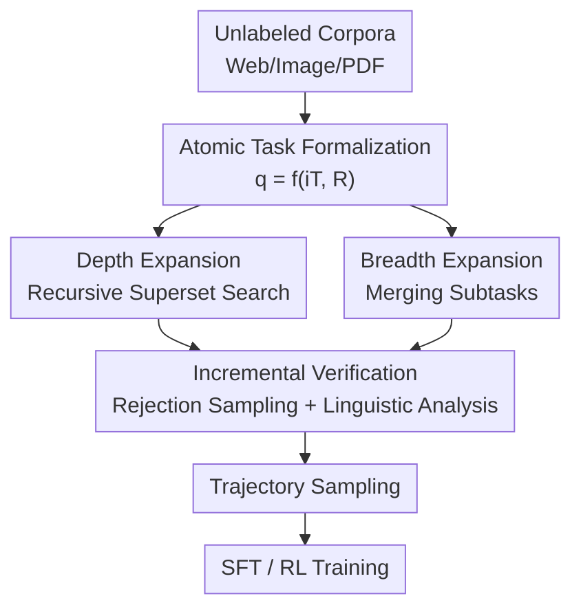

# TaskCraft: Automated Generation of Agentic Tasks

**Conference**: ICLR 2026  
**OpenReview**: [https://openreview.net/forum?id=UJFCyrYM1V](https://openreview.net/forum?id=UJFCyrYM1V)  
**Code**: https://github.com/OPPO-PersonalAI/TaskCraft  
**Area**: Agent  
**Keywords**: agentic task generation, tool calling, multi-hop reasoning, rejection sampling, controllable difficulty

## TL;DR
TaskCraft proposes the first workflow for fully automated generation of scalable, multi-tool, and verifiable agentic tasks. It starts by creating single-tool "atomic tasks," then incrementally increases difficulty through depth expansion (recursively finding supersets) and breadth expansion (merging subtasks), complemented by an efficient incremental verification process that only checks changes. This yields 41k tool-intensive tasks, and SFT/RL training on this data achieves SOTA performance across four agent benchmarks.

## Background & Motivation

**Background**: Agentic tasks (requiring multi-step problem solving + tool calling + adaptive reasoning) are becoming central evaluation targets in NLP/AI. Benchmarks like GAIA, BrowseComp, and HLE have advanced agent evaluation.

**Limitations of Prior Work**: The scale of these benchmarks is severely constrained by manual labeling costs—HLE required 1,000 experts to label 2,500 questions, making large-scale expansion impossible. Previous work using LLMs for data generation (e.g., Self-Instruct) mainly focused on static instruction-following, where queries do not require interaction with external tools and environments, thus failing to train or evaluate agents operating in dynamic environments.

**Key Challenge**: Training strong agents requires massive, difficulty-controllable tasks that "must be solved with tools." However, manual labeling is expensive and non-scalable, while pure LLM generation fails to produce tasks that truly rely on tool-chain execution.

**Goal**: Design an automated, scalable workflow to generate "chain-of-tool" agentic tasks while ensuring adjustable difficulty, tool dependency, and verifiability.

**Key Insight**: The authors abstract a single tool call into a minimal structure: given a task $q$, tool execution involves two steps: locating an input index $i_T$ (e.g., a stock data webpage), executing tool $T$ on it to obtain context $C$, and finally, the LLM applies a task-specified relation $R$ (e.g., "highest growth") on $C$ to derive the answer $a$. Thus, an agentic task can be minimally defined as a pair $(i_T, R)$.

**Core Idea**: By reformulating tasks into a parameterizable form $q = f_q(i_T, R)$, "increasing difficulty" becomes a structured expansion of $i_T$ and $R$. Depth expansion recursively replaces $i_T$ with subtasks requiring additional hops, while breadth expansion merges multiple tasks. Efficiency is maintained via incremental verification of newly added components.

## Method

### Overall Architecture

TaskCraft is a three-stage pipeline: **Atomic Task Generation → Progressive Expansion → Efficient Verification**. The starting point is a batch of unlabeled corpora (75% Web, 15% Image, 10% PDF). An input index $i_T$ is extracted, tool execution yields text context $C$, and an LLM selects a candidate answer $a$ from $C$ to reverse-derive its relation $R$. This constructs an atomic task $q = f_q(i_T, R)$. Atomic tasks are solvable with a single tool call and serve as "seeds" for complex tasks.

Following atomic generation, difficulty increases along two orthogonal axes: **Depth Expansion** recursively extends single-hop tasks into multi-hop (each hop depending on the previous output), and **Breadth Expansion** merges multiple subtasks into composite tasks requiring decomposition. Incremental verification is performed after each expansion—crucially, only the "added portion" is verified rather than re-running the entire task. Validated tasks are then used to sample trajectories for SFT and RL training.

### Key Designs

**1. Atomic Task Formalization: Decomposing "One Tool Call" into Parameterizable (Index, Relation)**

Directly letting LLMs "generate questions given an answer" results in poor tasks with low tool-calling rates, uncontrollable difficulty, and non-standardized tool requirements. TaskCraft explicitly parameterizes the task as $(q, a) = (f_q(i_T, R), a)$, where $i_T$ is the tool's input index (proper nouns like paper titles, song names, or PDF filenames) and $R$ is the relation applied to the retrieved context $C$. Because answer $a$ depends on $C$, the tool must be executed to derive the answer, structurally ensuring "tool necessity." This "structure-first, language-second" approach is more stable than "language-first" generation. Ablations show structured generation with $i_T$/$R$ achieves a 43.0% pass rate vs. 18.5% for pure LLM, with lower tool-calling variance ($\sigma^2$ 0.4 vs. 1.2).

**2. Depth Expansion: Extending Hops via Reversible "Superset Search"**

Depth expansion creates tasks requiring sequential tool executions where each step depends on the prior output. The challenge is extending an $n$-hop task $(q_n, a)$ to $(n+1)$-hop without circular references. The authors search for an intermediate subtask $(\hat{q}_{n+1}, i_T^n) = (f_q(i_T^{n+1}, R_{n+1}), i_T^n)$ by having a search agent find a **superset** $i_T^{n+1}$ of the current index $i_T^n$ (e.g., expanding a "lyric snippet" to the "full song title"). Finding a superset reduces the risk of loops. After the search agent retrieves $C$, the LLM identifies the relation $R_{n+1}$ (e.g., "this snippet is the third line of the lyrics"). The original $i_T^n$ in $q_n$ is then recursively replaced by this new subtask using $(q_{n+1}, a) = f_m(q_n, \hat{q}_{n+1}, i_T^n)$.

**3. Breadth Expansion: Merging Independent Subtasks**

Breadth expansion increases the number of parallel subtasks rather than depth. For two subtasks $q_1 \to a_1$ and $q_2 \to a_2$, the merged task is $(q_{width} = q_1 + q_2) \to a_1 + a_2$, where $+$ denotes an LLM merging and rewriting the questions into a coherent composite question. Solvers must decompose the composite question, call tools separately, and aggregate answers.

**4. Incremental Verification: Verifying Only New Components**

Re-verifying the entire task at every expansion step leads to exponential costs. TaskCraft uses two phases: **Atomic Task Verification** uses rejection sampling where a task is kept only if a tool-equipped agent succeeds while a tool-less LLM fails. **Expansion Verification** relies solely on linguistic analysis: a judge-LLM checks if $i_T^{n+1}$ and $R_{n+1}$ form a valid superset of $i_T^n$ and ensures the merged answer is not trivially deducible. This ensures efficiency by reserving expensive agent reasoning for atomic task creation while allowing the generation of tasks that exceed the agent's own difficulty threshold.

### Mechanism Example

Considering a task from Figure 5: "For the classic Disney animation set in Hawaii about an alien experiment and family bonds, when will its live-action spin-off be released?"
- Hop 1: Solve "What is this classic Disney animation?" $\to$ Answer *Lilo & Stitch* (the hidden intermediate index $i_T$).
- Hop 2: Search "When will the *Lilo & Stitch* live-action movie be released?" $\to$ Answer May 23, 2025.

The construction starts with an atomic task "When will *Lilo & Stitch* live-action be released?" Depth expansion then replaces the explicit index "Lilo & Stitch" with a descriptive subtask requiring an extra hop to identify.

### Loss & Training

Downstream training utilizes Tool-Integrated Reasoning (TIR) with explicit tags like `<tool>`, `<observation>`, and `<think>`. SFT uses trajectories from Oagents converted to TIR format. The RL stage employs DAPO. To ensure improvements are not just from learning output formats, a control group is trained on Multi-Hop QA (MHQA) data (HotpotQA, NQ). Bootstrap few-shot (DSPy-style) is used to optimize the four key prompts.

## Key Experimental Results

### Main Results

Downstream agent performance on GAIA / WebWalker / BrowserComp / HLE (Highlights from Qwen-2.5-32B-Instruct):

| Training Data | Paradigm | GAIA(%) | WebWalker | BrowserComp | HLE |
|----------|------|---------|-----------|-------------|-----|
| 5k MHQA | SFT | 38.8 | 36.8 | 5.6 | 10.8 |
| 7.5k MHQA | SFT | 42.7 | 41.6 | 5.8 | 12.6 |
| 7.5k TaskCraft | SFT | 60.2 | - | 22.4 | 20.2 |
| 5k MHQA + 2.5k TaskCraft | SFT | 60.2 | - | 21.0 | 20.0 |
| 5k MHQA + 2.5k TaskCraft + 8k TaskCraft | SFT+RL | **60.8** | - | **24.8** | **20.6** |

Replacing 2.5k MHQA with 2.5k TaskCraft data yielded 5–16× the improvement. The SFT-only TaskCraft model matched the performance of SOTA systems that relied on SFT+RL.

### Ablation Study

Effectiveness of tool context ($i_T$/$R$) on atomic task generation (Table 4):

| Configuration | Pass rate | Latency | Avg. Tool Calls | Call Var. $\sigma^2$ |
|------|-----------|------|--------------|----------------------|
| LLM only (no $i_T$/$R$) | 18.5% | 119.7s | 2.8 | 1.2 |
| Ours (Structured) | **43.0%** | **86.7s** | 2.1 | **0.4** |

Prompt learning improved the atomic task pass rate from 54.9% to 68.1%.

### Key Findings
- **Structured generation is key to efficiency**: Explicitly introducing $i_T$/$R$ doubled the pass rate and reduced tool-calling variance, proving pure LLM generation is inefficient for agentic tasks.
- **TaskCraft data is superior to standard QA**: TaskCraft provides 5–16× more gain than MHQA under identical volumes, proving the training value of "tool-essential" tasks.
- **Difficulty scales with modality**: Agent failure rates are significantly higher for PDF extraction and image-based reasoning, indicating the generated tasks cover a broad spectrum of difficulty.

## Highlights & Insights
- **Difficulty as structural operations on $(i_T, R)$**: Depth corresponds to recursive hiding, and breadth to subtask concatenation. This makes difficulty programmable and scalable rather than relying on prompt engineering.
- **Superset search prevents cycles**: Specifically searching for supersets of the current index is a simple yet effective trick to avoid circular dependencies in multi-hop tasks.
- **Rejection sampling defines "Tool Essentiality"**: Retaining tasks only where tool-equipped agents succeed and tool-less LLMs fail ensures the data is "agentic" by design.
- **Incremental verification saves compute**: By using linguistic analysis for expansion stages, the framework keeps costs manageable.

## Limitations & Future Work
- **Ideal retrieval assumption**: Atomic generation assumes an ideal search engine can pinpoint data based on $i_T$, which may degrade in noisy real-world retrieval.
- **Reliability of judge-LLM**: Expansion verification relies on LLM linguistic analysis, which is capped by the judge model's own capabilities (8.5% of depth expansions were not valid supersets).
- **Potential for expansion**: Future work could upgrade verification to lightweight tool-based checks or provide interfaces to specify targeted tool combinations.

## Related Work & Insights
- **vs. Self-Instruct**: While Self-Instruct focuses on static instruction following, TaskCraft focuses on chain-of-tool execution, filling the gap for agentic training data.
- **vs. GAIA/HLE**: These human-labeled benchmarks are high quality but limited in scale. TaskCraft provides a scalable source for training and pre-evaluation data.
- **vs. Search-o1**: TaskCraft focuses on "how to create task data," while systems like Search-o1 focus on inference workflows; the two are complementary.

## Rating
- Novelty: ⭐⭐⭐⭐⭐ First workflow for automated agentic task generation via structured $(i_T, R)$ expansion.
- Experimental Thoroughness: ⭐⭐⭐⭐ Extensive benchmarks and scales; RL comparisons are slightly sparse.
- Writing Quality: ⭐⭐⭐⭐ Clear abstractions, though expansion notations are dense.
- Value: ⭐⭐⭐⭐⭐ 41k tasks and significant performance gains for agent training.

<!-- RELATED:START -->

## Related Papers

- [\[ICLR 2026\] ToolACE-MT: Non-Autoregressive Generation for Agentic Multi-Turn Interaction](toolace-mt_non-autoregressive_generation_for_agentic_multi-turn_interaction.md)
- [\[ICLR 2026\] VitaBench: Benchmarking LLM Agents with Versatile Interactive Tasks in Real-world Applications](vitabench_benchmarking_llm_agents_with_versatile_interactive_tasks_in_real-world.md)
- [\[ICLR 2026\] MATHMO: Automated Mathematical Modeling Through Adaptive Search](mathmo_automated_mathematical_modeling_through_adaptive_search.md)
- [\[ACL 2026\] Supplement Generation Training for Enhancing Agentic Task Performance](../../ACL2026/llm_agent/supplement_generation_training_for_enhancing_agentic_task_performance.md)
- [\[ICLR 2026\] WebFactory: Automated Compression of Foundational Language Intelligence into Grounded Web Agents](webfactory_automated_compression_of_foundational_language_intelligence_into_grou.md)

<!-- RELATED:END -->
