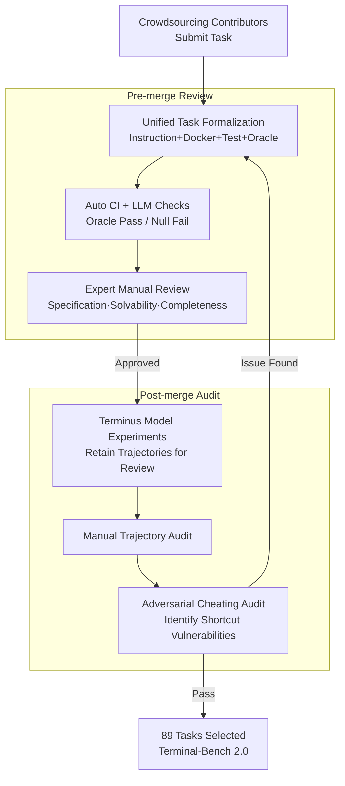

# Terminal-Bench: Benchmarking Agents on Difficult, Real-World Tasks in the Command Line Interface

**Conference**: ICLR 2026  
**OpenReview**: [https://openreview.net/forum?id=a7Qa4CcHak](https://openreview.net/forum?id=a7Qa4CcHak)  
**Code**: https://www.tbench.ai (Data and evaluation harness are open-sourced; experimental configurations are available at github.com/laude-institute/terminal-bench-experiments)  
**Area**: Agent  
**Keywords**: Agent benchmarks, Command Line/Terminal, Long-horizon tasks, Docker sandboxing, Failure mode analysis

## TL;DR
Terminal-Bench introduces an agent evaluation framework structured around a "terminal environment + Docker container + test verification + oracle solution" unit. It releases Terminal-Bench 2.0, a dataset of 89 hard tasks audited through hundreds of person-hours. Results demonstrate that even the most powerful frontier models/agents (GPT-5.2 + Codex CLI) achieve a solve rate of only ~63%, while small models settle around 15%. Based on these results, a failure mode taxonomy is provided to guide subsequent improvements.

## Background & Motivation
**Background**: AI agents are acquiring the ability to autonomously complete long-horizon tasks, with the terminal emerging as their most common operating interface. Tools like Cursor, Codex CLI, Claude Code, and Gemini CLI interact directly with the environment via shell commands such as `grep`, `find`, and `cat`, or custom tools for file I/O, code execution, and web retrieval. Due to its text-based, universal, and powerful nature, the terminal handles high-skill, high-value work in software engineering, scientific computing, cybersecurity, and machine learning.

**Limitations of Prior Work**: Existing agent benchmarks either fail to test real-world tasks (using synthetic environments or toy problems) or lack sufficient difficulty to distinguish between frontier models—many SWE-style benchmarks have reached high performance ceilings and no longer reflect true model capabilities. Furthermore, many benchmarks cover only narrow capabilities (e.g., translating natural language to Bash, optimizing shell scripts, or configuring environments), failing to reflect the diversity and long-term dependencies of terminal work.

**Key Challenge**: To be "realistic and difficult," tasks must be diverse, long-horizon, and require deep domain knowledge. However, this makes **correctness verification** extremely difficult: Does the instruction describe all acceptable end-states? Do tests capture these states? Might agents "cheat" via shortcuts that do not exist in reality? A natural tension exists between diversity/authenticity and verifiability.

**Goal**: (1) Design a unified, flexible task format capable of expressing difficult long-horizon tasks; (2) Construct a dataset strictly audited by humans that remains challenging for frontier models; (3) Evaluate mainstream models in a fair setting that decouples "model capability" from "agent scaffolding," while characterizing their failure modes.

**Key Insight**: Tasks are defined as a quadruple of "containerized environment + instruction + test + oracle solution," utilizing **outcome-driven** verification. By checking whether the final container state meets requirements—rather than checking specific commands—the framework ensures both flexibility and automated scoring.

**Core Idea**: Use "professional tasks performed by experts in real terminals" as task sources, combined with multi-round human + LLM auditing to ensure verifiability. A neutral scaffold is then used to push frontier models below a 65% success rate fairly.

## Method

### Overall Architecture
Terminal-Bench is not a model but a suite comprising a **task specification, a dataset, and an evaluation harness**. The fundamental unit is a task consisting of a natural language instruction (in `task.yaml`), a container environment built via Dockerfile, a set of verification tests (`tests/` + `run-tests.sh`), a human-written oracle solution (`solution.sh`), and a time limit. During evaluation, the agent is placed in the container with only the instruction and environment, exploring and modifying the environment through tool calls (editing files, running Bash). After the task, tests are copied into the container for execution, **testing only properties of the final container state** (e.g., file existence, bitwise consistency with a COBOL baseline), not the agent's commands or console output. This outcome-driven design allows multiple solutions per task and enables the adaptation of 26 existing benchmarks into the same format.

The most resource-intensive part of the framework is **auditing tasks to ensure reliability**. The authors utilize a multi-stage pipeline with "pre-merge review" and "post-merge audit" phases to ensure specification, solvability, and integrity:

Ultimately, 89 tasks were selected for Terminal-Bench 2.0 from 229 submissions by 93 contributors. Each task underwent approximately 3 hours of multi-person review, totaling hundreds of person-hours. During evaluation, the authors used the Harbor harness to run 32–100 containers in parallel within Daytona sandboxes, performing 32,155 trials across 6 agents and 16+ frontier models (at least 5 trials per combination).

### Key Designs

**1. Outcome-Driven Task Formalization: Automating Scoring for "Difficult and Diverse" Tasks**
The fundamental tension in benchmarking is that real tasks are diverse with non-unique solutions, making string-matching against standard answers difficult. Terminal-Bench defines tasks as a five-tuple: "instruction + Docker container + tests + oracle solution + time limit." Crucially, **tests check only the final state, not the process**. Agents can use any method as long as the final container state satisfies all requirements described in the instructions. This reduces "correctness" from "matching command sequences" to "checking final properties," accommodating tasks like "rewriting COBOL in Python with bitwise identical I/O," "compiling and running Linux from source," or "reverse engineering binaries." The oracle solution proves **solvability** (running it must pass all tests), while a null agent must fail to verify that tests are not too lenient.

**2. Multi-round Human + Adversarial Auditing: Treating "Verifiability" as a First-Class Citizen**
The primary risk of crowdsourced tasks is loose specification: instructions may not clarify all acceptable end-states (specificity), tasks might be unsolvable (solvability), or they may contain shortcuts that do not exist realistically (integrity, e.g., git tasks where future commits are not deleted, allowing agents to "peek"). The authors designed a two-phase pipeline: pre-merge automated CI + contributor checklists + LLM error detection + expert review; post-merge manual trajectory auditing and **adversarial cheating audits**. In the latter, a dedicated "cheating agent" searches for vulnerabilities to bypass tests, which auditors then verify. Any failures trigger a return to the revision stage. This process, averaging 3 reviewer-hours per task, reflects the authors' argument that manual verification is where "hard benchmarks" should invest most heavily.

**3. Terminus 2 Neutral Scaffold + Harbor Harness: Decoupling Model Capacity from Agent Engineering**
Interactive benchmarks often suffer from a fairness trap: many scaffolds are tuned for specific models (often from the same company). Comparing "Model A + Scaffold A" with "Model B + Scaffold B" obscures whether performance comes from the model or the engineering. The authors created Terminus 2 as a neutral testbed—it provides only a single tool (headless terminal) and uses Bash commands exclusively, allowing horizontal comparison under a minimalist scaffold. The framework reports both the peak score of each model under its "best-fit scaffold" and performance under Terminus 2. Harbor, the companion framework, enables scalable agent evaluation; Terminal-Bench 2.0 is distributed in Harbor format, reproducible with `harbor run -d terminal-bench@2.0`. This decoupling reveals that **model selection is generally more important than scaffold selection**.

**4. Dual-Level Failure Mode Taxonomy: Diagnostic Guidance for Improvement**
Beyond scores, the authors provide diagnostic error analysis. **Trajectory-level**: Based on the MAST multi-agent failure taxonomy, errors are categorized into Execution (violating specs, repeating steps, failing to stop), Coherence (reasoning-action inconsistency, context loss, drifting), and Verification (premature termination, missing/error in verification, weak verification). GPT-5 (High Reasoning) acted as a judge, achieving 93% Cohen's-κ with human labels on a calibration set. Results show frontier models (Opus 4.5, GPT-5.2) fail primarily on Execution, while open-source models (Qwen Coder) show more balanced and higher error rates. **Command-level**: LLM-as-judge reviewed Terminus 2 command pairs. Command failure rates ranged from 9.2% (Grok 4) to 26.7% (GPT-OSS-120B). In 3,800 sampled failures, the most common error was "command not found" (24.1%), followed by executable runtime failures (9.6%).

### A Complete Example
Take a COBOL rewrite task: The instruction is to "rewrite the COBOL program at `/app/src/program.cbl` in Python; output must be bitwise identical to the COBOL baseline." The agent enters the container, executes `ls data/`, uses `sed` to check file formats, runs the COBOL baseline to observe outputs, and writes a Python script. Upon completion, tests are executed to check properties like "existence of necessary files," "completeness of data files," and "account balance matching." Failure in `BOOKS.DAT` or balance mismatches results in a FAILED status. The exact commands or trial-and-error steps do not affect the score, embodying the outcome-driven design.

## Key Experimental Results

### Main Results
Evaluation of 6 agents × 16+ models across 32,155 trials. Each model uses its best-fit scaffold for the highest score:

| Model (Scaffold) | Solve Rate | Description |
| :--- | :--- | :--- |
| GPT-5.2 (Codex CLI) | 63% | Highest performance |
| Claude Opus 4.5 (Terminus 2) | 58% | Second |
| Gemini 3 Pro (Terminus 2) | 57% | Third |
| Kimi K2 Thinking (Terminus 2) | 36% | Strongest open-weight model |
| GPT-OSS-20B (Mini-SWE-Agent) | ~15% | Small model echelon |

Frontier proprietary models occupy the top 13 spots, yet none exceed 65%, indicating the benchmark remains challenging. The authors also found that the average number of turns and token usage do not correlate significantly with success rates. Costs per task ranged from \$1 to over \$100, with some agents running for nearly 2 hours and consuming ~100 million tokens.

### Ablation Study & Analysis

| Analysis Dimension | Key Figures | Description |
| :--- | :--- | :--- |
| Human vs. Empirical Difficulty | $r=0.436, p<0.001$ | Positive correlation; 93.3% of tasks rated "hard" by humans are also hard for models |
| Maximum Deviation | 54.5% | Tasks rated medium by humans but hard for models (require creativity/adversarial reasoning) |
| Completion Time Distribution | Expert: 95.9% in 1 day / Junior: 71.6% in 1 day | Specific tasks (fix-ocaml-gc) took experts ~1 day and juniors ~10 days |
| Command Error Rate | 9.2% (Grok 4) to 26.7% (GPT-OSS-120B) | Command-level failures |
| Most Common Command Failure | 24.1% | command not found (calling uninstalled or non-PATH programs) |

### Key Findings
- **Model > Scaffold**: Improvements from stronger models (up to +52 percentage points) far outweigh those from stronger scaffolds (+17 percentage points); prioritize model selection for performance.
- **Failures Signatures are Model-Specific**: Frontier models struggle with Execution (strict adherence), while open-source models need better consistency and self-monitoring.
- **Human Intuition Advantage**: Tasks where humans find them medium but models fail tend to involve creative or adversarial reasoning (e.g., XSS filter bypass, Corewars strategy) rather than pattern matching.

## Highlights & Insights
- The **Outcome-Driven + Oracle** dual-insurance is elegant: the oracle proves solvability, while null agents prove test rigor, separating scoring from correctness proof.
- **Adversarial Cheating Audits** are crucial for "open sandbox + internet" benchmarks. Proactively using agents to find vulnerabilities is more effective than waiting for leaderboard exploits.
- **Dual-Level Diagnosis (Trajectory + Command)** upgrades the benchmark from a "ranking" to a "roadmap." Identifying that "command not found" accounts for 24.1% of failures provides clear engineering targets for tool configuration.
- **Decoupling via Neutral Scaffolds** is a transferable methodology for any interactive benchmark: to compare models fairly, use a minimalist, uniform, and unbiased scaffold.

## Limitations & Future Work
- **Contamination/Cheating**: The benchmark allows internet access; agents could theoretically search for oracles. While not observed in tens of thousands of trajectories, it is not prevented by mechanism. Developers may also train on the dataset, though canary strings assist in decontamination.
- **Reproducibility and Internet Dependence**: Despite fixed package versions and Docker images, internet access introduces external dependencies (API changes, package availability, resource variances) that may cause environment drift.
- **Verification Difficulty**: The authors admit diversity comes at the cost of harder verification. Some tasks may still fall short of specifications, requiring community fixes.
- **Future Work**: Constructing private held-out test sets to prevent contamination; normalizing and automating adversarial audits; and scaling the coverage of failure taxonomy.

## Related Work & Insights
- **vs. SWE-Bench / SWE-Lancer / DevEval**: These focus on software engineering and some have saturated. Terminal-Bench emphasizes cross-domain, long-horizon tasks from experts in a **real shell** rather than synthetic environments.
- **vs. $\tau$-Bench / Berkeley Function Calling**: These measure narrow tool-calling abilities; Terminal-Bench measures generalized agency on a real computer.
- **vs. WebArena / OSWorld / AppWorld**: These are "computer use" benchmarks but lean towards GUI/Web or synthetic OS environments. Terminal-Bench focuses on the CLI as a source of high-value professional work.
- **vs. Narrow Terminal Benchmarks (Shell optimization / configuration)**: These test specific slices; Terminal-Bench covers generalized terminal agent operations.

## Rating
- Novelty: ⭐⭐⭐⭐ The framework (outcome-driven task format) is a known concept, but the engineering combination of "difficulty + realism + hundred-hour audit + adversarial cheating" and the dual-level failure taxonomy is highly valuable.
- Experimental Thoroughness: ⭐⭐⭐⭐⭐ Extensive trials (32,155) across 16+ models with multi-dimensional analysis.
- Writing Quality: ⭐⭐⭐⭐⭐ Clear structure, rich visualization, and honest discussion of verification challenges.
- Value: ⭐⭐⭐⭐⭐ Provides a high-quality, unsaturated (<65%) benchmark and diagnostic tools for next-generation agents.

<!-- RELATED:START -->

## Related Papers

- [\[ICLR 2026\] MCP-Bench: Benchmarking Tool-Using LLM Agents with Complex Real-World Tasks via MCP Servers](mcp-bench_benchmarking_tool-using_llm_agents_with_complex_real-world_tasks_via_m.md)
- [\[ICLR 2026\] VitaBench: Benchmarking LLM Agents with Versatile Interactive Tasks in Real-world Applications](vitabench_benchmarking_llm_agents_with_versatile_interactive_tasks_in_real-world.md)
- [\[ACL 2026\] AgencyBench: Benchmarking the Frontiers of Autonomous Agents in 1M-Token Real-World Contexts](../../ACL2026/llm_agent/agencybench_benchmarking_the_frontiers_of_autonomous_agents_in_1m-token_real-wor.md)
- [\[ICLR 2026\] OpenAgentSafety: A Comprehensive Framework for Evaluating Real-World AI Agent Safety](openagentsafety_a_comprehensive_framework_for_evaluating_real-world_ai_agent_saf.md)
- [\[ICLR 2026\] MCP Security Bench (MSB): Benchmarking Attacks Against Model Context Protocol in LLM Agents](mcp_security_bench_msb_benchmarking_attacks_against_model_context_protocol_in_ll.md)

<!-- RELATED:END -->
