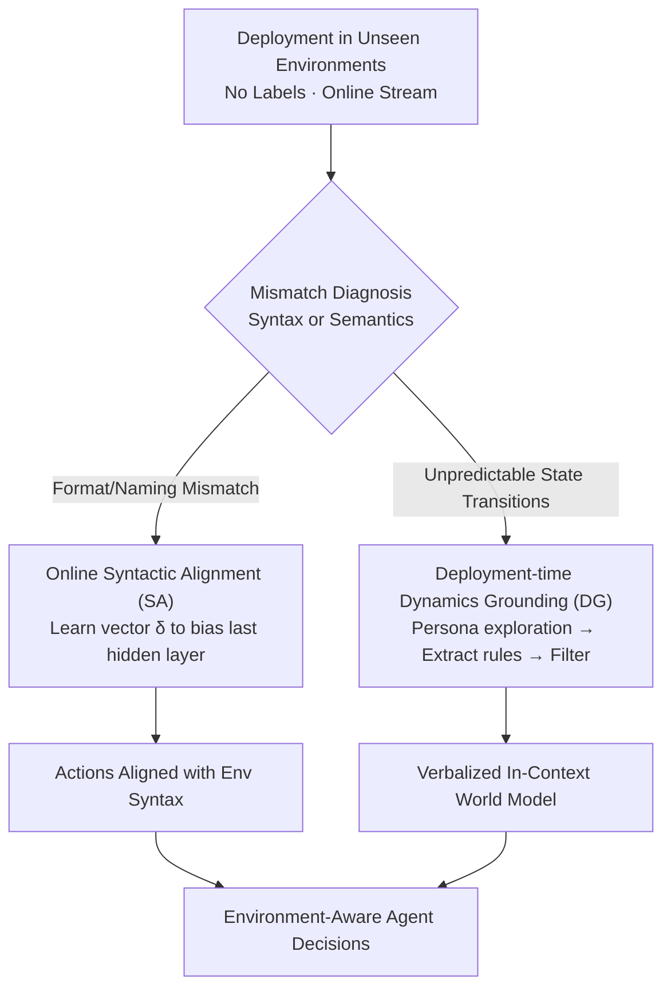

# Test-Time Adaptation for LLM Agents via Environment Interaction

**Conference**: ICLR 2026  
**OpenReview**: [https://openreview.net/forum?id=OH4PE0TDo0](https://openreview.net/forum?id=OH4PE0TDo0)  
**Code**: https://github.com/r2llab/GTTA  
**Area**: Agent  
**Keywords**: Test-Time Adaptation, LLM Agent, Syntactic Alignment, Dynamics Grounding, Environmental World Model

## TL;DR
Addressing generalization failures of LLM Agents in unfamiliar websites or toolsets, this paper decomposes failures into "syntactic mismatch" and "semantic mismatch." These are resolved via an online-learned lightweight adaptation vector (Syntactic Alignment, SA) and a persona-driven exploration to build a verbalized world model in-context (Dynamics Grounding, DG). This process requires no labeled trajectories or fine-tuning, increasing the success rate on the WebArena multi-site split from 2% to 23%.

## Background & Motivation

**Background**: LLM Agents perform well in web navigation and function calling, but their capabilities depend heavily on the environment formats and interaction patterns seen during pre-training. Performance often drops significantly when deployed to a completely new website or an unseen set of APIs.

**Limitations of Prior Work**: The authors attribute this "deployment generalization gap" to two **independent** failure modes. First is **syntactic mismatch**: the agent's priors conflict with the specific observation structure or element naming of the environment—e.g., it habitually generates `click("Search")` while the button is actually named `Go`. Second is **semantic mismatch**: the agent lacks a causal model of state transitions for the specific environment and cannot predict action consequences—e.g., it expects `Go` to show flight results but instead triggers a date confirmation pop-up.

**Key Challenge**: Existing remedies are unsuitable for "fast, online" deployment adaptation. One category relies on human or LLM-labeled demonstration trajectories, which are expensive and depend on prior environment knowledge. Another category, explicit world modeling (e.g., WMA), requires collecting massive interactions and fine-tuning a specialized model, which is computationally heavy and requires retraining for every new environment. Both paths involve significant overhead, whereas real deployment typically only provides "unsupervised interaction at test-time."

**Goal**: Close both syntactic and semantic gaps under the constraints of "no labeled trajectories, online streaming, and allowing unsupervised test-time exploration."

**Key Insight**: Since the two mismatch types have different mechanisms (one is a shifted output distribution, the other is a lack of a world model), they should be addressed with **targeted treatments**—parametric distribution biasing for syntactic issues and verbalized rule injection for semantic issues. Both rely solely on test-time interaction signals.

**Core Idea**: Systematically transfer the "Test-Time Adaptation (TTA)" paradigm from CV to LLM Agents. By using "online adaptation vectors" and "exploratory linguistic world models," the agent is aligned to unfamiliar environments at the moment of deployment with no labels and low cost.

## Method

### Overall Architecture

The method starts from a realistic problem setting: an agent enters an **unseen** environment without expert demonstrations or offline data. Tasks arrive in a stream, but the agent is allowed an unsupervised "blind exploration" before starting specific tasks. The model input is formalized as $I = [p; o; \{a\}_{i=1}^{T-1}]$, where $p$ is the task instruction, $o$ is the current observation, and $\{a\}$ is the action history.

Under this setting, the method first **diagnoses** whether a failure is syntactic or semantic, then follows two **parallel** adaptation paths: Syntactic Alignment (SA) for syntactic mismatch, which uses an adaptation vector to bias model output at each step; and Dynamics Grounding (DG) for semantic mismatch, which extracts environment state transition rules into natural language via persona-driven exploration. Both paths lead to more robust, environment-aware decision-making.

### Key Designs

**1. Mismatch Diagnosis: Splitting the gap into distinct syntactic and semantic pathologies**

The most critical step is "diagnosis" rather than the "treatment" itself. While prior work vaguely attributes poor performance to "poor generalization," this paper **operationally** splits it into two categories: syntactic mismatch refers to the misalignment between the agent's output distribution and environment-specific literal formats (labels, syntax, observation structure); semantic mismatch refers to the lack of a causal model for state transitions. This distinction dictates the need for different adaptation mechanisms: syntactic issues are corrected by parametrically shifting the output distribution, while semantic issues require injecting environment rules as knowledge.

**2. Online Syntactic Alignment (SA): Using a step-updated, episode-reset adaptation vector**

To address syntactic mismatch, the paper introduces a lightweight adaptation vector $\delta \in \mathbb{R}^d$, added as an **additive bias** to the hidden representation before the final projection layer to obtain adapted logits:

$$\text{logits}' = (H + \delta) W_{LM}^T$$

Crucially, $\delta$ is updated without labels by treating the **current context itself** as a self-supervisory signal. At each step, language modeling (next-token prediction) is performed on the input sequence, and a gradient descent step is taken on $\delta$ using cross-entropy loss:

$$\delta_{new} \leftarrow \delta_{old} - \eta \nabla_\delta \mathcal{L}_{CE}\big(f_{\theta,\delta}(I_{1:n-1}),\, I_{2:n}\big)$$

The model weights $\theta$ remain frozen. The intuition is that since environment observations already contain strings like `Go` or `dest field`, fitting the loss for these tokens pushes $\delta$ to prefer them, naturally correcting the syntax during generation. To prevent catastrophic forgetting across tasks, $\delta$ is **reset to a zero vector** at the start of each new episode.

**3. Deployment-time Dynamics Grounding (DG): Distilling rules into a verbalized world model**

For semantic mismatch, instead of training a parametric world model, a four-step **deployment-time** pipeline creates a verbalized in-context world model $E_{clean}$:
1. **Persona/Exploration Goal Synthesis**: Uses high-level environment descriptions to generate $N$ diverse "exploration personas" (e.g., "As a new user, I want to see what happens if I search for flights without selecting a date").
2. **Exploration + Rule Extraction**: An LLM agent interacts with the environment based on these personas. After each transition $(o, a, o')$, it summarizes the result into a human-readable rule $e$.
3. **Filtering and Merging**: A reasoning model (e.g., o3) filters out trivial or redundant rules to produce $E_{clean}$.
4. **Contextual Injection**: During test-time, $E_{clean}$ is prepended to the input $I' = [I; E_{clean}]$, allowing the agent to anticipate action consequences via in-context learning. 

## Key Experimental Results

### Main Results

Evaluated on WebArena (812 tasks), BFCLv3 (multi-turn function calling), and Tau-Bench, using GPT-4.1 / GPT-4o mini and Qwen2.5-14B-Instruct. Success Rate (%):

| Model | WebArena | BFCLv3 | Tau-Air | Tau-Retail |
|------|---------|--------|---------|-----------|
| GPT-4.1 | 30.0 | 55.5 | - | - |
| GPT-4.1 (+DG) | **35.0** (+5.0) | **64.0** (+8.5) | N/A | N/A |
| Qwen2.5-14B | 17.0 | 18.5 | 21.6 | 43.3 |
| Qwen2.5-14B (+SA) | 18.0 (+1.0) | 20.0 (+1.5) | **25.2** (+3.6) | **44.9** (+1.6) |
| Qwen2.5-14B (hybrid) | 21.0 (+4.0) | 21.0 (+2.5) | N/A | N/A |

DG provides the largest gains on strong instruction-following models like GPT-4.1. On WebArena, DG's power is most evident in the difficult **multi-site split**, where GPT-4.1's success rate jumped from 2% to 23%.

### Ablation Study

| Configuration | Key Metric | Description |
|------|---------|------|
| GPT-4o mini DG (Self-exploration) | 19.0 (+7.0) | **Self-exploration is better** than using GPT-4.1; DG is self-improving. |
| DG w/o Filtering | 61.0 | No rule filtering in BFCLv3. |
| DG w/ Filtering | 64.0 (+3.0) | Effective filtering of trivial/redundant rules. |
| SA Latency | +3.0% | Low overhead for real-time use. |

### Key Findings
- **DG value correlates with environment complexity**: In simple sites where transitions match common sense, explicit dynamics provide little new info. In unpredictable multi-site scenarios, DG offers massive gains (2% → 23%).
- **DG is self-improving**: Using the agent itself for exploration/extraction performs as well as using a stronger model.
- **Naïve SA+DG hybrid isn't always better**: On BFCLv3, the hybrid (21.0) was lower than DG alone (22.0), suggesting signals might interfere.
- **SA is robust to hyperparameters**: Gains are consistent across reasonable learning rates, though larger models (14B/32B) benefit from higher rates due to larger $\delta$ dimensions.

## Highlights & Insights
- **Operational Binary Diagnosis**: Decomposing generalization failure into syntax vs. semantics allows for targeted mechanisms.
- **Self-Supervised TTA via LM Loss**: SA treats existing strings in observations as free supervision to anchor the output distribution with minimal latency (+3%).
- **Verbalized, "Disposable" World Models**: DG replaces heavy parametric models with "Exploration → Rules → ICL," reducing costs from retraining 8B models to one-time exploration amortized across tasks.
- **Per-Episode Reset**: treating the adaptation vector as a temporary parameter avoids cross-task contamination, a key difference from static steering vectors.

## Limitations & Future Work
- **SA primarily validated on Qwen**: Needs broader architectural verification; current updates aren't normalized across hidden dimensions.
- **DG applies only to environments with explicit state transitions**: For purely conversational tasks without observable state changes, DG is currently inapplicable.
- **Integration of SA and DG is unresolved**: Simple combination can cause interference. Future work might involve a meta-controller to decide between lightweight SA or expensive DG.

## Related Work & Insights
- **vs WMA**: WMA requires training a specialized 8B model to predict states. DG uses verbalized, disposable in-context models, achieving 18.0 vs. WMA's 13.5 on GPT-4o mini.
- **vs Traditional Steering Vectors**: Standard steering uses fixed vectors for high-level traits; this work uses online-updated, episode-reset vectors for dynamic, context-aware alignment.
- **vs CV TTA**: Inherits the idea of unsupervised test-time parameter updates but replaces entropy minimization with language modeling loss for interactive LLM agents.

## Rating
- Novelty: ⭐⭐⭐⭐ The combination of binary diagnosis and two label-free TTA strategies is clear.
- Experimental Thoroughness: ⭐⭐⭐⭐ Diverse benchmarks and models, though absolute success rates remain low.
- Writing Quality: ⭐⭐⭐⭐ Strong correspondence between motivation and method.
- Value: ⭐⭐⭐⭐ Provides a practical, low-cost paradigm for adapting agents to new environments during deployment.

<!-- RELATED:START -->

## Related Papers

- [\[ICLR 2026\] GTA1: GUI Test-time Scaling Agent](gta1_gui_test-time_scaling_agent.md)
- [\[ICML 2026\] AdaMEM: Test-Time Adaptive Memory for Language Agents](../../ICML2026/llm_agent/adamem_test-time_adaptive_memory_for_language_agents.md)
- [\[ICLR 2026\] Pushing Test-Time Scaling Limits of Deep Search with Asymmetric Verification](pushing_test-time_scaling_limits_of_deep_search_with_asymmetric_verification.md)
- [\[ICLR 2026\] EvoTest: Evolutionary Test-Time Learning for Self-Improving Agentic Systems](evotest_evolutionary_test-time_learning_for_self-improving_agentic_systems.md)
- [\[ICLR 2026\] SimuHome: A Temporal- and Environment-Aware Benchmark for Smart Home LLM Agents](simuhome_a_temporal-_and_environment-aware_benchmark_for_smart_home_llm_agents.md)

<!-- RELATED:END -->
