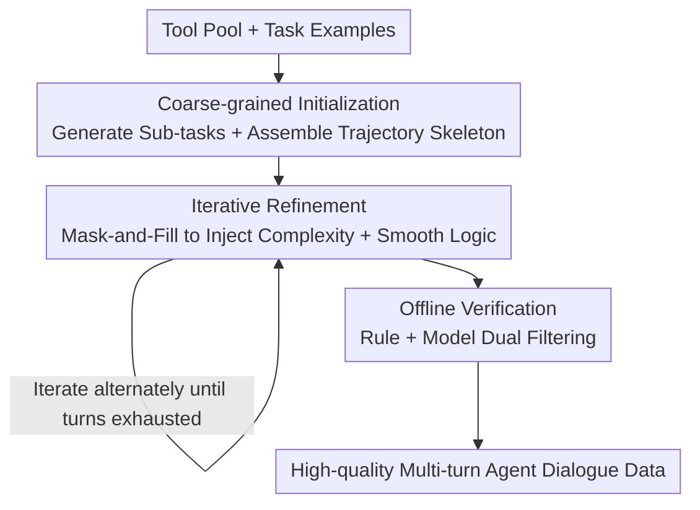

# ToolACE-MT: Non-Autoregressive Generation for Agentic Multi-Turn Interaction

**Conference**: ICLR 2026  
**OpenReview**: [https://openreview.net/forum?id=KznJt9Fhjc](https://openreview.net/forum?id=KznJt9Fhjc)  
**Code**: None  
**Area**: Agent / LLM Tool Calling / Data Synthesis  
**Keywords**: Agent data synthesis, Multi-turn tool calling, Non-autoregressive generation, Mask-and-fill, Offline verification  

## TL;DR
ToolACE-MT replaces the "turn-by-turn autoregressive" paradigm of multi-agent simulation for multi-turn tool-calling data with a non-autoregressive pipeline: "building the skeleton first, iterative refinement, and finally offline verification." It generates agent dialogue data with higher coherence and diversity using fewer API calls. The 8B model trained via Ours improved its multi-turn accuracy on BFCL-v3 from 9.25% to 40.25%.

## Background & Motivation

**Background**: To equip LLMs with agent capabilities (repeatedly calling tools in multi-turn dialogues and making dynamic decisions based on observations), high-quality "multi-turn + multi-step" interaction data is essential. The current mainstream method for data synthesis is **Multi-Agent Simulation (MAS)**: multiple LLMs play roles such as user, assistant, and tool to construct a complete trajectory through autoregressive dialogue turns.

**Limitations of Prior Work**: MAS has three major drawbacks. First, it is **expensive**—each turn must be generated based on all previous context; long dialogues result in token explosion. Second, it is **difficult to control**—task complexity and dialogue length are implicitly determined by model interactions, making fine-grained data design hard to enforce. Third, the most critical issue is the **lack of global vision**—the assistant is generated autoregressively and cannot see the overall task or dependencies between steps. This makes it difficult to optimize the overall structure or ensure consistency, leading to drops in factuality, tool-calling consistency, and task solvability. Essentially, it degrades into "distilling knowledge from a larger assistant model."

**Key Challenge**: Autoregressive generation is inherently "locally optimal"—each step only looks at the history and cannot see the future, whereas agent tasks require long-range planning and global consistency. MAS ties data quality to the capability of the specific LLM acting as the assistant.

**Goal**: To generate multi-turn agent data that is fast, controllable, and globally consistent, with an elastically scalable generation budget.

**Key Insight**: Ours draws inspiration from **Non-Autoregressive Translation (NAT) and Masked Language Models**—methods that first generate a coarse overall structure in parallel and then refine it iteratively, which has been proven efficient for language generation. This paradigm is shifted from the token level to the **turn level**: constructing the trajectory skeleton first (providing inherent global vision) and then performing local refinements.

**Core Idea**: Replace "autoregressive multi-agent simulation" with "non-autoregressive iterative generation"—first generate a dialogue skeleton that is structurally complete but semantically coarse, then inject complexity and coherence through mask-and-fill iterative refinement, and finally filter via offline verification.

## Method

### Overall Architecture

ToolACE-MT addresses the problem of "how to construct a multi-turn, multi-step agent dialogue trajectory $C=(o_0,a_1,o_1,\cdots,o_{n-1},a_n)$," where $o_0$ is the initial user message, $a_t$ is an action (function call or natural language response), and $o_t$ is the corresponding observation (tool output or user response). The pipeline proceeds through three serial phases: **Coarse-grained initialization → Iterative refinement → Offline verification**.

Unlike the turn-by-turn autoregressive nature of MAS, the key shift in ToolACE-MT is: **the structural skeleton of the entire trajectory is laid out in the first phase** (thereby possessing global vision), and subsequent phases only perform local mask-and-fill modifications on this skeleton. During initialization, trajectories are intentionally kept "clean and regular" (structurally complete but semantically shallow) for easier processing. The iterative refinement phase injects real-world complexity (clarifications, tool awareness, error simulation, etc.) and smooths the logic. The offline verification phase uses a combination of rules and models to filter unqualified samples.

### Key Designs

**1. Coarse-grained Initialization: Building a structurally complete but semantically coarse dialogue skeleton**

To address the lack of global vision in autoregressive methods, Ours lays out the entire trajectory structure at once. This involves two steps: **Task Initialization** first samples candidate tools from a predefined tool pool, then generates the overall task, including a set of sub-tasks $(u_1,u_2,\cdots,u_m)$ ($m$ is pre-specified for each instance), the tools required for each sub-task, and the number of tool-calling steps needed—this step acts as high-level planning. **Trajectory Initialization** kemudian assembles these in sub-task order: for each $u_t$, a sub-trajectory $C_t$ is generated based on its metadata and the prior sub-trajectories $(C_0,\cdots,C_{t-1})$. Finally, these are concatenated as $C=C_0\cup C_1\cup\cdots\cup C_m$.

Two deliberate constraints are applied: first, tool calls and outputs for each sub-task are **generated in parallel** to ensure consistency; second, the initial user query $o_t^0$ for a sub-task is forced to contain all necessary information (e.g., function argument values), and subsequent observations $o_t^s\ (s\neq0)$ are exclusively tool outputs. This ensures strictly alternating action types, simplifying post-processing. This phase **prioritizes structural integrity over semantic correctness**—content may be shallow or locally inconsistent, which is resolved in the next phase.

**2. Iterative Refinement: Injecting real-world complexity and smoothing logic via mask-and-fill**

The skeleton is too "clean" compared to real dialogues. Ours draws from Masked-Predict, alternating between two types of mask operations until all turns are refined or a preset limit is reached. **Complexity Injection** is implemented via mask-and-extend—replacing a specific turn with a placeholder $X$, then filling in revised content and **adding additional turns**. This is formalized as $(o_0,a_1,\cdots,a_t,o',a',o'',a_{t+1},\cdots,a_n)=f_{\text{LLM}}(\sigma,(o_0,a_1,\cdots,a_t,X,a_{t+1},\cdots,a_n))$, where $\sigma$ is the injection type. Types include: **Clarification** (incomplete user info), **Tool Awareness** (unsupported tasks/tool list updates), **Error Simulation** (failed tool calls/reflection), and **Non-FC Needs** (chitchat). A log is maintained to track modified turns to avoid redundant edits.

**Reasonability Refinement** uses mask-and-fill: randomly masking several **non-adjacent** turns and re-generating them with an LLM to check if tool parameters are appropriate and dialogue flow is smooth. Initially, all turns have equal selection probability, which **decreases after selection** to encourage coverage across the dialogue. To prevent degradation, an LLM judger decides whether to adopt the new content or keep the original.

**3. Offline Verification: Rule + Model double-check to filter hallucinations and inconsistencies**

Extensive LLM usage under long multi-turn contexts with large tool lists often leads to hallucinations. A final offline verification stage combines rules and models. **Rule-based** checks ensure compliance with dialogue/tool-calling formats, executability (when real tools are available), and catching hallucinations like referencing non-existent IDs. **Model-based** checks decompose evaluation into **multiple sub-problems**, each handled by an independent LLM specialist. This focuses on semantic coherence and complex hallucinations missed by rules. While refinement and verification overlap in function, experiments show they are complementary: refinement improves semantics and accuracy, while verification catches long-range inconsistencies and structural flaws.

### Loss & Training
This is a **data synthesis method** and does not introduce new loss functions. Downstream training uses LoRA fine-tuning (rank 16, alpha 32), global batch 64, learning rate $1\times10^{-4}$, cosine scheduler, and 0.1 warmup. For generation: sub-tasks per instance are sampled from $[2,5]$, with $[1,6]$ steps per sub-task; 1~3 complexity types are injected per instance, and reasonability refinement is performed up to 5 times.

## Key Experimental Results

8,000 training instances were constructed and compared against a MAS baseline using the same GPT-4o-2024-11-20 model, tool pool, and offline verification. The base model for main experiments is LLaMA3.1-8B-Instruct.

### Main Results

| Benchmark | Metric | Base 8B | MAS | ToolACE-MT |
|------|------|---------|-----|------------|
| BFCL-v3 | Multi-Turn Overall | 9.25 | 31.38 | **40.25** |
| BFCL-v3 | Single-Turn Non-Live | 84.21 | 80.29 | 84.94 |
| BFCL-v3 | Overall | 49.57 | 64.17 | **65.41** |
| ACEBench | Multi-Turn | 24.0 | 48.0 | **51.0** |
| ACEBench | Agent PA | 18.3 | 15.0 | **34.0** |
| τ-Bench | Avg. (Retail+Airline) | 16.1 | 15.9 | **20.6** |

ToolACE-MT improved the 8B base model's BFCL-v3 multi-turn performance from 9.25% to 40.25% (absolute +31%), surpassing LLaMA3.1-70B (12.5%) and DeepSeek-V3 (29.87%), and consistently outperforming MAS. On single-turn Non-Live, it maintained the baseline level (84.94%), whereas MAS dropped to 80.29%. A notable finding: the gain on Live single-turn was smaller than MAS, as models trained on multi-turn data tend to ask for clarification before calling tools—a trade-off between "cautious multi-turn planning" and "aggressive single-turn execution."

### Ablation Study

| Configuration | BFCL-v3 MT | BFCL-v3 Overall | Description |
|------|-----------|-------------|------|
| Full (ToolACE-MT) | 40.25 | 65.41 | Complete three-phase pipeline |
| − Offline Verification | 32.50 | 63.01 | Dropping verification drops overall by 2.4% |
| − Iterative Refinement | 20.88 | 52.10 | Dropping refinement causes massive drop |

### Data Efficiency & Quality

| Method | API Calls | Pricing (USD) | Verification Pass Rate | BFCL Overall |
|------|---------|-----------|-----------|-----------|
| MAS (GPT-4o) | 275k | 1,737 | 61.1 | 64.17 |
| ToolACE-MT (GPT-4o) | 188k | 1,380 | 72.3 | **65.41** |
| ToolACE-MT (GPT-4o-mini) | 394k | 148 | 48.7 | 60.13 |

In terms of statistics, ToolACE-MT dialogues have fewer user turns (3.4 vs 5.8) but more tool calls per turn (3.7 vs 2.3), reflecting a focus on efficient multi-step task completion. Coherence (Entailment Ratio 50.71 vs 43.60) and diversity (Entropy 9.28 vs 7.92, Distinct-3 0.357 vs 0.319) were both superior to MAS.

### Key Findings
- **Iterative Refinement is the Performance Driver**: Without it, BFCL multi-turn performance collapsed from 40.25% to 20.88%, as initial skeletons are often too simple or semantically flawed. Offline verification provided a smaller but steady contribution (-2.4% overall).
- **Two Stages are Complementary**: Verification is crucial when refinement iterations are low (~5% gap); as iterations increase to 15, the gap shrinks to under 2% but never disappears. Refinement fixes semantic coherence, while verification catches structural defects.
- **Generator Capability is the Upper Bound**: Using GPT-4o-mini led to a crash in pass rates (48.7%) and increased hallucinations. Even after filtering, the resulting model was inferior to the GPT-4o version (60.13% vs 65.41%), indicating high context requirements for tool-dense dialogues.
- **Efficient Task Completion**: On $\tau$-Bench, the Ours-trained model completed tasks in 13.7 assistant turns on average, compared to 15.4 for MAS. The non-autoregressive skeleton provides better global planning.
- **Base Model Generalizability**: Ours consistently outperformed MAS data when applied to Qwen2.5-7B and Qwen3-8B.

## Highlights & Insights
- **Shifting Non-Autoregressive/Diffusion Logic from Token to Turn Level**: The core insight is that the fundamental flaw of MAS is the lack of global vision. The NAT paradigm of "parallel skeleton construction + iterative refinement" naturally provides this vision.
- **"Clean Skeleton then Injecting Dirt" is Counter-intuitive but Effective**: Initializing for structural integrity rather than semantic correctness decouples "complexity creation" from "structural preservation." This allows refinement to be tracked and controlled.
- **Explicit Complexity Control + Scalable Budget**: Sub-task counts, steps, injection types, and refinement iterations are all explicit knobs. The number of refinements can be adjusted based on the budget (scaling curve in Figure 5).
- **"Divide and Conquer" Offline Verification**: Breaking quality assessment into sub-problems for independent LLM experts is more focused than a single LLM judgment, providing a transferable framework for long-text quality control.

## Limitations & Future Work
- **Heavy Dependency on Generator Context Window**: GPT-4o-mini and LLaMA3.1-8B struggle to generate enough usable data, limiting the method's accessibility to GPT-4o-level models.
- **Complexity Injection Saturates**: The authors admit that repeated complexity injection can hurt naturalness. Scaling currently relies on increasing reasonability refinement iterations.
- **Benchmark Reliability**: On $\tau$-Bench Airline, the base 8B model outperformed trained models due to an "empty action" evaluation loophole in the benchmark.
- **Future Directions**: Exploring combinations of cheaper generators with stronger verifiers, or integrating iterative refinement with agentic RL.

## Related Work & Insights
- **vs. Multi-Agent Simulation (MAS)**: MAS uses autoregressive interaction between roles. Ours replaces this with non-autoregressive skeletons and iterative refinement, resulting in lower costs (188k vs 275k calls) and higher quality.
- **vs. Two-stage Synthesis (Prabhakar et al. 2025)**: While both generate configurations first, the latter still falls back to MAS for trajectory collection, whereas Ours is non-autoregressive throughout.
- **vs. NAT / Mask-Predict**: Ours extends the token-level masked refinement paradigm to the dialogue **turn** level for a new application domain.

## Rating
- Novelty: ⭐⭐⭐⭐⭐ Translating NAT/Diffusion paradigms to turn-level agent data synthesis is a paradigm-level innovation.
- Experimental Thoroughness: ⭐⭐⭐⭐ Three benchmarks, multiple base models, and cost/scaling analysis provided; lacks large-scale validation with diverse real-world tools.
- Writing Quality: ⭐⭐⭐⭐ Clear three-phase description and effective diagrams.
- Value: ⭐⭐⭐⭐⭐ Agent data synthesis is high-demand; this method saves costs while improving quality.

<!-- RELATED:START -->

## Related Papers

- [\[ICLR 2026\] Evaluating Memory in LLM Agents via Incremental Multi-Turn Interactions](evaluating_memory_in_llm_agents_via_incremental_multi-turn_interactions.md)
- [\[ICLR 2026\] TaskCraft: Automated Generation of Agentic Tasks](taskcraft_automated_generation_of_agentic_tasks.md)
- [\[ICLR 2026\] FaSTA*: Fast-Slow Toolpath Agent with Subroutine Mining for Efficient Multi-turn Image Editing](fasta_fast-slow_toolpath_agent_with_subroutine_mining_for_efficient_multi-turn_i.md)
- [\[NeurIPS 2025\] T1: A Tool-Oriented Conversational Dataset for Multi-Turn Agentic Planning](../../NeurIPS2025/llm_agent/t1_a_tool-oriented_conversational_dataset_for_multi-turn_agentic_planning.md)
- [\[AAAI 2026\] Towards Trustworthy Multi-Turn LLM Agents via Behavioral Guidance](../../AAAI2026/llm_agent/towards_trustworthy_multi-turn_llm_agents_via_behavioral_guidance.md)

<!-- RELATED:END -->
