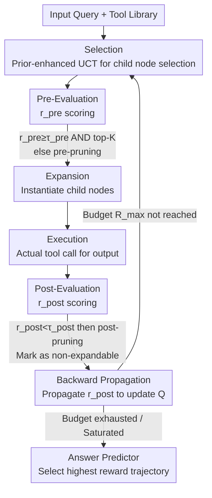

# ToolTree: Efficient LLM Agent Tool Planning via Dual-Feedback Monte Carlo Tree Search and Bidirectional Pruning

**Conference**: ICLR 2026  
**OpenReview**: [https://openreview.net/forum?id=Ef5O9gNNLE](https://openreview.net/forum?id=Ef5O9gNNLE)  
**Code**: https://github.com/SYang2000/ICLR_2026_ToolTree  
**Area**: Agent / Tool Planning  
**Keywords**: Tool Planning, Monte Carlo Tree Search, Bidirectional Pruning, LLM Agent, Training-free  

## TL;DR
ToolTree models multi-tool calling for LLM agents as a Monte Carlo Tree Search (MCTS), utilizing "pre-execution pre-evaluation + post-execution empirical evaluation" LLM scoring signals to simultaneously guide selection and pruning. Under fixed compute budgets, it enables agents to possess both foresight and the ability to backtrack based on real feedback, achieving approximately 10% higher accuracy than SOTA search paradigms across four tool planning benchmarks with peak efficiency.

## Background & Motivation

**Background**: For LLM agents to solve complex multi-step tasks, the core lies in "tool planning"—deciding not only which tools to select but also when and in what order to use them. Existing approaches are divided into two categories: greedy methods (e.g., ReAct, CoT), which independently pick the seemingly best tool at each step; and search-based methods (e.g., ToT, A\*/ToolChain\*, LATS), which expand multiple candidate branches and select the optimal one.

**Limitations of Prior Work**: Greedy methods lack long-term perspective; a single early error propagates irreversibly along a single trajectory. Furthermore, exploring only one path wastes potential computational utility. Search-based methods, while expanding multiple branches, face an exponential explosion of the branching factor with tool types, parameters, and state evolution, leading to high overhead and uncontrollable latency.

**Key Challenge**: Crucially, many search-based variants score "hypothetical thoughts" rather than "actually executed actions." Consequently, the ranking is decoupled from the actual utility of tools—benefits that manifest only after several steps are rarely back-propagated to reward early decisions. Achieving foresight, grounding in real results, and computational efficiency under a fixed budget remains a difficult trilemma.

**Goal**: Design a tool planning paradigm that possesses both foresight and hindsight, offering higher precision per unit of compute without requiring task-specific retraining.

**Key Insight**: The authors observe that tool calls provide two natural signals: prior to execution, one can quickly predict "whether this tool is likely useful"; after execution, one can judge "how much it actually contributed" based on the real output. Injecting both signals into the classic MCTS loop allows the search to focus quickly and accurately on branches that are "both probable and useful."

**Core Idea**: A dual-feedback MCTS using "pre-evaluation $r_{pre}$ to guide selection/expansion + post-evaluation $r_{post}$ to provide rollout rewards," paired with bidirectional pruning (pre- and post-execution) to compress the search tree onto high-value trajectories.

## Method

### Overall Architecture

ToolTree treats tool planning as a sequential decision process: each state $s$ encodes the current dialogue context and accumulated intermediate results, while each action corresponds to calling a candidate tool from a library $T_{lib}=\{t_1,\dots,t_m\}$. The goal is to find the trajectory that maximizes task utility within a fixed rollout budget $R_{max}$. Unlike older methods relying on independent planners, ToolTree integrates tool selection, execution, evaluation, and pruning directly into the MCTS loop.

The search is an iterative "look-execute-review" loop. After multiple iterations, an Answer Predictor generates the final answer from the tool trajectory with the highest reward. Each iteration consists of six stages: **Selection** (selecting child nodes from the root using prior-enhanced UCT) $\rightarrow$ **Pre-Evaluation** (LLM-based $r_{pre}$ scoring before execution) $\rightarrow$ **Expansion** (instantiating child nodes only if they pass pre-evaluation/pre-pruning) $\rightarrow$ **Execution** (actual API call to get output $o_{t+1}$) $\rightarrow$ **Post-Evaluation** (LLM-based $r_{post}$ scoring of real output) $\rightarrow$ **Backward Propagation** (propagating $r_{post}$ to update value estimates along the path). Pre-Evaluation, Post-Evaluation, and the driven bidirectional pruning constitute the primary contributions over vanilla MCTS.

### Key Designs

**1. Dual-Signal Evaluation: Foresight and Hindsight via Pre- and Post-Execution Feedback**

Classic MCTS balances exploration and exploitation but lacks knowledge of whether a tool call is reasonable before execution or useful after. This is why search methods using hypothetical thoughts suffer from credit assignment distortion. ToolTree adds two lightweight, training-free LLM signals. **Pre-evaluation** $r_{pre}(s,a)\in[0,1]$ uses an LLM judge to predict potential utility based on context $C$, tool cards (I/O schema, domain tags, examples), and a schema-valid parameter draft—this provides "foresight." **Post-evaluation** $r_{post}(s_t,a)=J(C_t,a,o_{t+1})\in[0,1]$ uses the same LLM judge to evaluate task consistency (accuracy proxy, relevance, constraint satisfaction) and robustness after receiving the real output $o_{t+1}$—this provides "hindsight." The key is that $r_{post}$ is calculated on **executed** actions, ensuring faithful credit assignment.

**2. Prior-Enhanced UCT Selection: Integrating Pre-Evaluation into the Selection Strategy**

To ensure pre-evaluation scores influence the search direction, ToolTree incorporates $r_{pre}$ as a prior term in the UCT exploration reward:

$$\text{UCT}(s,a) = Q(s,a) + \lambda\, r_{pre}(s,a)\sqrt{\frac{\ln N(s)}{N(s,a)}}$$

Where $Q(s,a)$ drives exploitation by accumulating post-evaluation rewards, $N(s)$ and $N(s,a)$ are visit counts, and $\lambda$ controls prior strength. Early rollouts are biased toward branches favored by pre-evaluation while maintaining exploitation pressure from $Q(s,a)$. Only valid actions $a\in A(s)$ compatible with the context are considered. Post-evaluation rewards update $Q(s,a)$ via a running mean $Q(s,a)\leftarrow Q(s,a)+\frac{r_{post}(s_t,a)-Q(s,a)}{N(s,a)}$, reflecting observed utility.

**3. Bidirectional Pruning: Compressing Budgets onto High-Value Trajectories**

The evaluation signals enable budget control on both sides. **Pre-pruning** occurs before expansion: when enumerating actions at a leaf state $s_t$, only actions where $r_{pre}(s_t,a)\ge\tau_{pre}$ and which fall within the top-K are retained to instantiate child nodes. This eliminates incompatible or low-yield branches before any tool call, reducing the branching factor. **Post-pruning** occurs after execution: if $r_{post}(s_t,a)<\tau_{post}$, the edge is marked as non-expandable, preventing budget waste on unproductive continuations. Additionally, deterministic caching uses $(a,\text{args})$ as keys to reuse outputs $o_{t+1}$ within rollouts. Together, these concentrate rollouts onto chains that are "predicted likely and proven useful."

### Mechanism Example

In medical VQA: Given an image + "Is the lung affected?". ToolTree starts from the root, where **Selection** picks tools using prior-enhanced UCT. Each candidate undergoes **Pre-Evaluation**; irrelevant tools (e.g., text retrieval) are removed via **pre-pruning** ($r_{pre}<\tau_{pre}$), and only top-K promising tools (e.g., segmentation, regional localization) are expanded. The selected tool is actually called during **Execution**. After receiving the output, **Post-Evaluation** is performed: if a branch produces irrelevant output ($r_{post}<\tau_{post}$), it is marked by post-pruning and no further budget is spent. Useful branches back-propagate $r_{post}$ to increase $Q$. After iterations, the search converges to a high-reward trajectory, enabling the Answer Predictor to correctly output "No," whereas a greedy method might have irreversibly chosen the wrong tool.

## Key Experimental Results

### Main Results

**Closed-set Tool Planning (GTA / m&m, typed I/O, Table 1, GPT-4o)**:

| Dataset | Metric | ToolTree | Second-best baseline | Gain |
|--------|------|----------|--------------|------|
| GTA | AVG | **66.95** | LATS 64.78 | +2.17 (>2.2 vs vanilla MCTS) |
| m&m | AVG | **88.61** | LATS 86.45 | +2.16 (>8 vs Zero-shot) |

**Open-set Tool Planning (ToolBench / RestBench, thousands of real APIs, Table 2, GPT-4o)**:

| Dataset | Metric | ToolTree | Second-best baseline | Gain |
|--------|------|----------|--------------|------|
| ToolBench | AVG | **69.04** | LATS 66.55 | ≈ +2.5 |
| RestBench–TMDB | AVG | **74.50** | LATS 71.35 | ≈ +3.1 |
| RestBench–Spotify | AVG | **71.36** | LATS 68.53 | +2.8 |

Greedy controllers (Zero-shot / ReAct / CoT) generally lag behind search-based methods, confirming the value of foresight even in small typed toolsets.

### Ablation Study

On GTA + GPT-4o, decoupling the dual-evaluation and bidirectional pruning (Table 3, Accuracy / Token Cost):

| Configuration | Accuracy ↑ | Token Cost ↓ | Description |
|------|---------|-------------|------|
| ToolTree (Full) | **76.44** | **18.2k** | Highest precision + lowest cost |
| – Pre-pruning | 75.28 | 20.4k | Tree widens, cost increases |
| – Pre-evaluation | 71.80 | 21.1k | Loss of foresight signal |
| – Post-pruning | 75.82 | 22.9k | No early termination of dead ends |
| – Post-evaluation | 68.94 | 22.9k | **Largest drop (>7 points)** |
| – Dual-pruning | 74.58 | 24.1k | Pruning removed on both sides |
| – Dual-evaluation | 66.70 | 24.3k | Degenerates toward vanilla MCTS |

### Key Findings

- **Post-evaluation is the most critical**: Removing it drops accuracy by over 7 points, proving that real feedback after execution is the most vital signal for guiding search.
- **Pruning tightens the search tree**: Removing pre-pruning increases median expanded nodes from ~70 to ~95; removing post-pruning increases median rollouts from ~33 to ~47. 
- **Efficiency-Time Trade-off**: While slower than ReAct/Best-First, ToolTree is comparable to ToT and often faster than LATS, achieving the highest accuracy-per-second.
- **Robustness to Retrievers**: ToolTree remains optimal across diverse retrievers (Contriever/RoBERTa) and shows the least degradation under weak retrieval, demonstrating the corrective power of dual evaluation.

## Highlights & Insights
- **Shifting the evaluation target from hypothetical thoughts to real execution results**: This is the fundamental difference from other search agents. $r_{post}$ ensures faithful credit assignment.
- **Pre-evaluation serves triple duty**: It acts as a UCT prior, an expansion gate (top-K), and a pre-pruning threshold, maximizing the utility of a single LLM scoring call.
- **Completely training-free**: Relying solely on LLM judges and thresholds, it requires no task-specific retraining and can be directly applied to various tool libraries.
- **Symmetrical beauty of bidirectional pruning**: Pruning by "possibility" before execution and "utility" after execution concentrates resources effectively.

## Limitations & Future Work
- **Dependency on LLM judge quality**: $r_{pre}$ and $r_{post}$ rely on LLM scoring; judge bias or instability can pollute selection and pruning.
- **Abundance of hyperparameters**: Thresholds ($\tau_{pre}, \tau_{post}$), top-K, and $\lambda$ require tuning for different toolsets.
- **Extra evaluation overhead**: Each candidate action requires LLM judge calls, which, while mitigated by pruning and caching, still incurs higher costs than greedy methods.
- **Future Directions**: Exploring smaller models or learned value networks to replace the LLM judge, and making thresholds adaptive or learnable.

## Related Work & Insights
- **vs Greedy (ReAct / CoT)**: These select the currently optimal tool independently, lacking long-term vision. ToolTree's tree search allows for foresight and backtracking.
- **vs Search (ToT / LATS)**: These often rank hypothetical reasoning. ToolTree performs credit assignment based on actual rewards and uses bidirectional pruning to tighten the tree, outperforming LATS by ~2-3 points on average.
- **vs Vanilla MCTS**: Standard MCTS is blind to tool-specific rationality and real output utility. ToolTree's injection of dual LLM signals accounts for essentially all its gains (76.44 vs 66.70).

## Rating
- Novelty: ⭐⭐⭐⭐ Systematically integrating dual-signal evaluation and bidirectional pruning into MCTS for tool planning is a clear and effective modular innovation.
- Experimental Thoroughness: ⭐⭐⭐⭐ Comprehensive coverage across closed/open benchmarks, multiple models, and multi-dimensional ablations.
- Writing Quality: ⭐⭐⭐⭐ Clear logic from motivation to implementation.
- Value: ⭐⭐⭐⭐ Training-free, plug-and-play, and significantly improves tool-based agent performance.

<!-- RELATED:START -->

## Related Papers

- [\[ICLR 2026\] Tree Search for LLM Agent Reinforcement Learning](tree_search_for_llm_agent_reinforcement_learning.md)
- [\[ICML 2025\] KBQA-o1: Agentic Knowledge Base Question Answering with Monte Carlo Tree Search](../../ICML2025/llm_agent/kbqa-o1_agentic_knowledge_base_question_answering_with_monte_carlo_tree_search.md)
- [\[ICLR 2026\] GTool: Graph Enhanced Tool Planning with Large Language Model](gtool_graph_enhanced_tool_planning_with_large_language_model.md)
- [\[AAAI 2026\] Prune4Web: DOM Tree Pruning Programming for Web Agent](../../AAAI2026/llm_agent/prune4web_dom_tree_pruning_programming_for_web_agent.md)
- [\[ICLR 2026\] OrchestrationBench: LLM-Driven Agentic Planning and Tool Use in Multi-Domain Scenarios](orchestrationbench_llm-driven_agentic_planning_and_tool_use_in_multi-domain_scen.md)

<!-- RELATED:END -->
