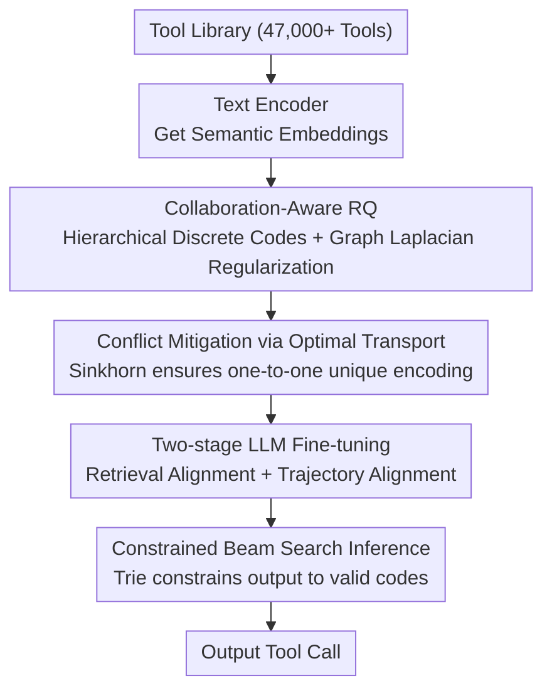

# ToolWeaver: Weaving Collaborative Semantics for Scalable Tool Use in Large Language Models

**Conference**: ICLR 2026  
**arXiv**: [2601.21947](https://arxiv.org/abs/2601.21947)  
**Code**: Yes  
**Area**: LLM Agent  
**Keywords**: Tool Use, Vector Quantization, Collaborative Semantics, Vocabulary Expansion, Generative Tool Retrieval

## TL;DR
ToolWeaver is proposed to represent each tool as a hierarchical discrete code sequence rather than a single token through collaboration-aware vector quantization. This achieves logarithmic vocabulary expansion (covering 47,000+ tools with only ~512 new tokens), comprehensively outperforming the ToolGen baseline on ToolBench while reducing language model perplexity degradation from 16.5x to 4x.

## Background & Motivation

**Background**: Generative tool use (e.g., ToolGen) represents tools as new tokens, allowing LLMs to "speak" tool names directly instead of retrieving from a candidate list. However, current "one-tool-one-token" methods face severe scalability issues.

**Limitations of Prior Work**:
- **Vocabulary Explosion**: 47,000 tools require 47,000 new tokens; linear growth leads to expansion of the embedding layer.
- **Catastrophic Language Degradation**: Massive new tokens pollute the language model; ToolGen pushes perplexity from 6.34 to 104.54 (16.5x).
- **Semantic Blind Spots**: Single tokens cannot encode collaborative relationships between tools; models must infer collaboration patterns from sparse tool ID co-occurrences.
- **Poor Cross-domain Generalization**: Single token IDs lack transferable semantic structures.

**Key Challenge**: There is a need for a compact representation for large-scale tool libraries that encodes both intrinsic semantics (function) and extrinsic collaborative patterns (co-usage) without destroying pre-trained language capabilities.

**Goal**: Design a logarithmic vocabulary expansion scheme that simultaneously encodes semantic and collaborative information.

**Key Insight**: Inspired by VQ-VAE, use Residual Vector Quantization (RQ) to quantize tool embeddings into multi-level discrete codes—$K^L$ tools require only $L \times K$ new tokens. Collaborative signals are then injected via Graph Laplacian regularization.

**Core Idea**: Utilize collaboration-aware residual quantization to encode tools as hierarchical token sequences, achieving logarithmic vocabulary expansion and collaborative semantic modeling.

## Method

### Overall Architecture
ToolWeaver aims to solve the problem where "one-tool-one-token" exhausts the vocabulary and ruins language performance when the tool library expands to 47,000+. It allows an LLM to directly "speak" the tool to be called in a compact and semantic way by replacing "one independent token" with "one hierarchical discrete code sequence." First, a text encoder obtains semantic embeddings for each tool. These are then quantized into $L$-level codes $[\iota_1, \iota_2, \ldots, \iota_L]$ using a collaboration-aware RQ-VAE, where each level selects a codeword from a shared codebook. Thus, tools share a small set of codeword combinations, requiring only $L \times K$ new tokens to cover the entire library. After quantization, Sinkhorn optimal transport is used to resolve conflicts where different tools might map to the same code, ensuring unique encoding. Finally, the LLM is fine-tuned in two stages (retrieval alignment + trajectory alignment), and constrained beam search is used during inference to restrict generation to valid codes.

### Key Designs

**1. Collaboration-Aware Residual Quantization: Using hierarchical codebooks to compress tools into a logarithmic vocabulary and embedding "co-usage" into the code**

This is the core of ToolWeaver, addressing both "vocabulary explosion" and "semantic blind spots." The quantization follows the residual logic of RQ-VAE: residuals of tool embeddings are quantized level-by-level to the nearest codeword. At level $l$, $\iota_{d,l} = \arg\min_k \|r_{d,l} - v_{l,k}\|^2$ is selected, and the residual is updated as $r_{d,l+1} = r_{d,l} - v_{l,\iota_{d,l}}$. Since $K$ codewords across $L$ levels can combine into $K^L$ codes, vocabulary growth becomes logarithmic—$L=4, K=128$ requires only 512 new tokens to cover 47,000+ tools.

The innovation lies in injecting collaborative signals. ToolWeaver constructs a normalized co-occurrence matrix $A_{uv} = C_{uv}/\sqrt{C_{uu} \cdot C_{vv}}$ from historical trajectories and adds a Graph Laplacian regularization term:

$$\mathcal{L}_{collab} = \sum_{u,v} A_{uv}\|\hat{z}_u - \hat{z}_v\|^2$$

This pulls tools that are "often called together" closer in the quantized embedding space, causing them to share more hierarchical codewords. This transforms collaborative relationships from sparse tool ID co-occurrences into dense code-level co-occurrences, allowing the LLM to learn collaboration patterns on a denser codeword level.

**2. Conflict Mitigation via Optimal Transport: Re-routing conflicting codes to ensure one-to-one mapping**

Dense hierarchical quantization may map multiple tools to the same code sequence. ToolWeaver applies a uniform distribution constraint on the final level codebook and formulates the "tool-to-codeword" assignment as an optimal transport problem, solved iteratively with the Sinkhorn-Knopp algorithm. This ensures each tool is fully assigned while each codeword is used evenly, spreading clustered tools across different codewords and providing unique identifiers smoothly.

**3. Constrained Beam Search Inference: Restricting generation to valid codes to prevent hallucinating tools**

Since tools are now multi-token sequences, free generation could produce "invalid codes" that do not correspond to any tool. ToolWeaver constructs a Prefix Tree (Trie) of all valid code sequences. During inference, it masks out invalid next tokens at each step based on the Trie, ensuring beam search only explores valid branches and the model only outputs existing tool codes.

### Loss & Training
The quantization phase objective is $\mathcal{L}_{tokenize} = \mathcal{L}_{recon} + \mathcal{L}_{quant} + \lambda\mathcal{L}_{collab}$, combining reconstruction, quantization, and collaboration regularization, with an optimal weight $\lambda=1.0$. LLM alignment is two-fold: Retrieval Alignment uses 489K query-tool pairs with $\mathcal{L}_{retrieval} = -\mathbb{E}[\log P(\boldsymbol{\iota}_d | q)]$ to teach the model to generate correct codes for queries; Trajectory Alignment uses 183K trajectories for standard SFT to embed tool codes into multi-step call processes.

## Key Experimental Results

### Main Results (ToolBench, 47,000+ Tools)

| Method | I1 NDCG@1 | I3 NDCG@1 | I3 SoPR | WikiText-2 PPL |
| :--- | :--- | :--- | :--- | :--- |
| BM25 | 26.92 | 10.00 | - | - |
| ToolRetriever | 75.92 | 28.00 | - | - |
| ToolGen | 88.50 | 81.00 | 36.34% | 104.54 |
| **ToolWeaver** | **91.16** | **88.00** | **52.19%** | **25.36** |

ToolWeaver leads in both retrieval and task completion while reducing language model degradation from 16.5x to 4x.

### Ablation Study

| Configuration | Key Finding |
| :--- | :--- |
| $\lambda=0$ (No collaboration) | I3 performance drops significantly, validating the necessity of collaborative signals for complex tasks. |
| $\lambda=1$ (Optimal) | Best performance across all metrics. |
| $\lambda=10$ (Over-constraint) | Performance drops as collaborative signals override semantic information. |
| W/O Semantic Init | NDCG drops by ~20, indicating semantic foundation is a critical prerequisite. |
| W/ Collaborative Guidance | I1 increases by 1-2, I3 by 4-5; higher complexity tasks benefit more. |
| Encoding Comparison | Atomic (ToolGen), Numerical, Hierarchical, and Semantic all underperform compared to ToolWeaver. |

### Key Findings
- **Logarithmic vs. Linear Expansion**: 512 new tokens vs. 47,000; token utilization efficiency increased by 16,400x.
- **Language Capability Protection**: PPL 25.36 vs. 104.54; Summarization F1 only dropped 0.31% vs. 2.93%.
- **Collaborative Signals are Critical**: I3 (cross-category multi-tool) improved most (+7 NDCG / +15.85 SoPR).
- **Semantic Initialization is Fundamental**: The largest single contributor, indicating high-quality tool representation is the baseline for everything.
- **Structural Padding is Insufficient**: Hierarchical or semantic name encoding is inferior to ToolWeaver’s learned collaborative encoding.

## Highlights & Insights
- **Logarithmic vocabulary expansion is a fundamental architectural improvement**: It transforms tool use from a "vocabulary expansion problem" to a "sequence generation problem," resolving the scalability bottleneck for large-scale tool libraries. This approach is generalizable to any large-scale discrete entity generation scenario.
- **Elegant design of collaborative regularization**: Instead of just encoding semantics, it injects usage patterns into the code space. This allows the LLM to learn tool combinations from code co-occurrence, which is much denser than tool ID co-occurrence.
- **Sinkhorn Optimal Transport for conflict resolution**: An elegant mathematical way to ensure uniqueness that is more robust than hard-coded deduplication.

## Limitations & Future Work
- Collaborative signals depend on high-quality co-occurrence data; sparse or biased usage patterns may cause degradation.
- Validated only on ToolBench; cross-domain transfer has not been tested.
- Constrained beam search increases inference overhead (not yet quantified).
- $\lambda$ requires empirical tuning; lack of automatic setting guidelines.

## Related Work & Insights
- **vs. ToolGen**: The one-tool-one-token baseline with poor scalability (linear vocabulary + PPL catastrophe); ToolWeaver outperforms it on all metrics.
- **vs. ToolRetriever**: A retrieval-based method, not generative; recall rate is limited in large-scale libraries.
- **vs. RQ-VAE in Vision/RecSys**: ToolWeaver extends RQ-VAE from image/item quantization to tool semantic quantization, with collaborative regularization being the key innovation.

## Rating
- Novelty: ⭐⭐⭐⭐⭐ Logarithmic vocabulary expansion + collaboration-aware quantization is a new paradigm for tool representation.
- Experimental Thoroughness: ⭐⭐⭐⭐ 47,000 tool scale, multiple ablations, and comprehensive language capability assessment.
- Writing Quality: ⭐⭐⭐⭐ Clear method description and thorough ablation analysis.
- Value: ⭐⭐⭐⭐⭐ Solves the core scalability bottleneck in generative tool use, offering direct engineering value for Agent systems.

<!-- RELATED:START -->

## Related Papers

- [\[ACL 2025\] Adaptive Tool Use in Large Language Models with Meta-Cognition Trigger](../../ACL2025/llm_agent/meco_metacognition_tool_use.md)
- [\[ICLR 2026\] GTool: Graph Enhanced Tool Planning with Large Language Model](gtool_graph_enhanced_tool_planning_with_large_language_model.md)
- [\[ACL 2026\] Feedback-Driven Tool-Use Improvements in Large Language Models via Automated Build Environments](../../ACL2026/llm_agent/feedback-driven_tool-use_improvements_in_large_language_models_via_automated_bui.md)
- [\[ICLR 2026\] Nemotron-Research-Tool-N1: Exploring Tool-Using Language Models with Reinforced Reasoning](nemotron-research-tool-n1_exploring_tool-using_language_models_with_reinforced_r.md)
- [\[ICLR 2026\] In-the-Flow Agentic System Optimization for Effective Planning and Tool Use](in-the-flow_agentic_system_optimization_for_effective_planning_and_tool_use.md)

<!-- RELATED:END -->
