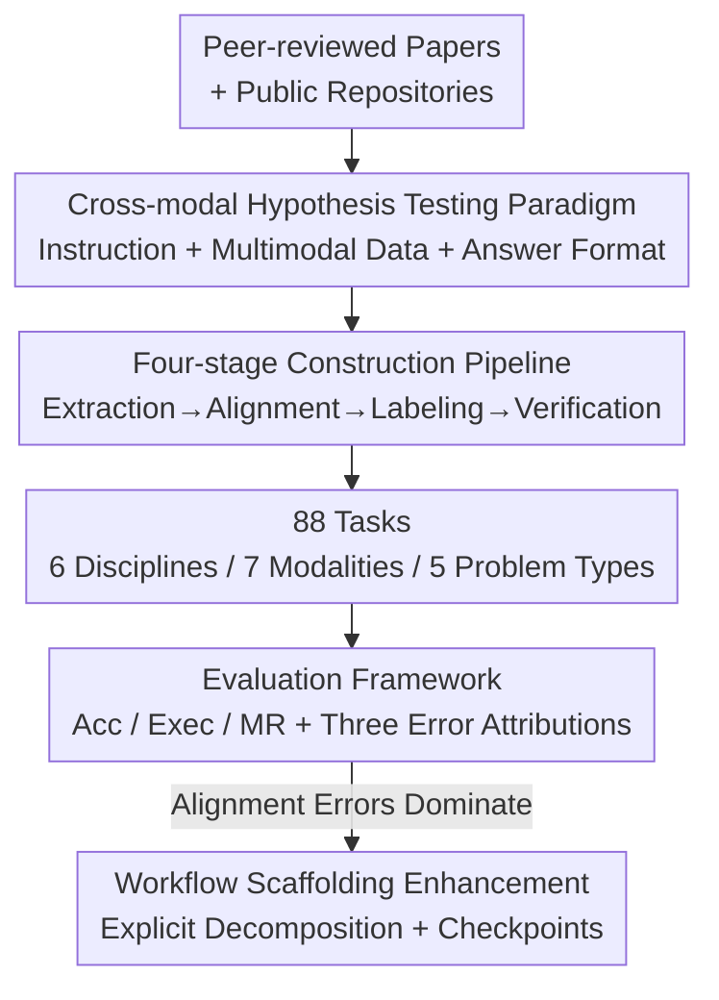

# Towards Multimodal Data-Driven Scientific Discovery Powered by LLM Agents

**Conference**: ICLR 2026  
**OpenReview**: [https://openreview.net/forum?id=kZHSvETWdi](https://openreview.net/forum?id=kZHSvETWdi)  
**Code**: https://github.com/usail-hkust/MoSciBench  
**Area**: Agent / Scientific Discovery / Multimodal  
**Keywords**: Scientific discovery agents, multimodal alignment, hypothesis testing, Benchmark, workflow scaffolding

## TL;DR
This paper proposes **MoSciBench**—the first benchmark for "multimodal, repository-level" data-driven scientific discovery. Starting from peer-reviewed papers, an 88-task cross-modal hypothesis testing dataset was constructed via a four-stage pipeline. Systematic evaluation reveals that even the strongest agent (o4-mini + ReAct) achieves only 48.9% accuracy, with over 60% of failures stemming from cross-modal alignment, while lightweight workflow scaffolding improves accuracy by an average of 5.7%.

## Background & Motivation
**Background**: LLM agents are being utilized to "automate science"—reading data, generating analysis pipelines, and executing via computational tools. Benchmarks like ScienceAgentBench and DiscoveryBench have formalized the workflow of "data preparation $\rightarrow$ analysis $\rightarrow$ modeling $\rightarrow$ verification."

**Limitations of Prior Work**: These benchmarks are almost entirely restricted to **unimodal, slice-level** tasks—where each task is tied to a single table or a single time series. Agents are evaluated within isolated modalities, and tasks are defined at a single-point/slice granularity, lacking the realism of "accessing an entire data repository and reasoning across files" found in real research.

**Key Challenge**: Real scientific discovery is inherently multimodal—climate research combines satellite imagery with spatio-temporal metadata, and health research correlates physiological signals with environmental variables. To capture this complexity, the **cross-modal alignment, modeling, and reasoning** capabilities of agents must be assessed. These are precisely what existing benchmarks lack, leading to a systematic overestimation of an agent's ability to conduct real research.

**Goal**: To construct a benchmark that realistically assesses multimodal, repository-level scientific discovery and systematically answers: how current agents perform, where they fail, and how to improve them.

**Key Insight**: Design each task as a "**cross-modal hypothesis testing workflow**"—agents must first align and fuse heterogeneous data before modeling and reasoning, explicitly exposing "cross-modal alignment" as a realistic bottleneck.

**Core Idea**: Replace "unimodal slice prediction" with "reverse construction of verifiable hypothesis tasks from peer-reviewed papers + mandatory multimodal alignment" to establish an objective, reproducible, and realistic testbed.

## Method

### Overall Architecture
MoSciBench consists of two parts: first, a **task paradigm**—defining each discovery task as an end-to-end cross-modal hypothesis testing workflow (input: a scientific instruction derived from a paper + a set of multimodal datasets; output: a verifiable answer to the hypothesis); second, a **four-stage construction pipeline**—extracting data from scientific papers, performing multimodal alignment, writing task instructions, and manual multi-round verification, resulting in 88 tasks covering 6 disciplines, 7 modalities, and 5 categories of discovery problems. On this basis, an **evaluation framework** is provided: modifying existing single-domain discovery agents for multimodal settings, assessing them using Accuracy / code execution success rate / modeling reasonableness, and attributing failures to alignment/modeling/reasoning errors to verify the gains of lightweight workflow scaffolding.

The data follows a serial processing pipeline of "paper $\rightarrow$ task," followed by an evaluation loop. The framework is illustrated below:

### Key Designs

**1. Cross-modal Hypothesis Testing Paradigm: Making "Alignment" Mandatory**

To address the issue that "existing tasks only operate within a single modality without testing alignment," this paper instantiates each task as a triplet: (i) a **task instruction** derived from a paper (providing scientific context, the hypothesis to be verified, and the expected answer format); (ii) a set or multiple sets of **multimodal datasets** as evidence; (iii) an **evaluation protocol** to determine if the output matches the gold standard hypothesis. Tasks must span 7 modalities—multi-sensor time series, tables, satellite imagery, mass spectrometry, molecular structures, genotype matrices, and HDF matrices. Data is released in a structured directory with previews; agents must not only load and preprocess but also perform **modal alignment via shared indices** (e.g., using subject IDs to link individual attributes with physiological time series, or geographic grids to align satellite images with environmental variables) before proceeding with analysis. Instructions are deliberately concise and open-ended, forcing agents to autonomously decide on exploration, preprocessing, and modeling steps, thereby explicitly incorporating cross-modal fusion—the hardest part of real research—into the assessment.

**2. Four-stage Construction Pipeline: Ensuring Objectivity and Reproducibility via Papers**

To address the issue that "task labeling is subjective and answers lack authoritative evidence," task construction is split into four controllable stages: ① **Raw Data Extraction**—selecting papers published with permissive licenses that propose clear data-driven scientific questions, extracting multimodal data, and registering metadata like variable names and spatio-temporal coverage; ② **Multimodal Processing and Alignment**—filtering features for missing values or anomalies, integrating multiple sources, standardizing units/timestamps/spatial references, and completing alignment using shared indices to produce aligned datasets; ③ **Task Instruction Formalization and Labeling**—translating research questions into instructions that preserve scientific intent without over-prescribing steps, accompanied by verifiable hypotheses, gold standard answers, and explicit answer formats (slots / true-false / categories), with minimal domain knowledge added where necessary without leaking solutions; ④ **Human Verification and Quality Control**—multi-round verification relying only on released datasets. Annotators also write **end-to-end executable scripts** to reproduce the workflow and automatically check numerical values/correlations/causal directions/prediction performance within tolerances. Tasks contradicting original gold standards during human verification are discarded, eventually ensuring 100% consistency between labels and ground-truth hypotheses.

**3. Hypothesis-Centric Evaluation + Three Error Attributions: Locating Real Bottlenecks**

To address the issue of "only reporting total scores without explaining exactly where agents fail," the evaluation uses **exact match**—categorical outputs require strict identity, while numerical values/lists/coordinates are judged against task-specific tolerances, making the evaluation automatic, objective, and reproducible. This is supplemented by the **Code Execution Success Rate (Exec)** and **Modeling Reasonableness (MR)**, scored 1–5 by gpt-4o-mini as a judge. Crucially, failures are explicitly decomposed into three types: **Alignment Errors** (conceptual or implementation modal mismatch), **Modeling Errors** (representation/planning/calculation), and **Reasoning Errors** (statistical or logical inference)—covering the entire agent workflow chain. Attribution for the strongest o4-mini + ReAct revealed: alignment errors account for 31.8%, modeling 13.6%, and reasoning only 5.7%, with a success rate of 48.9%. This concludes that **cross-modal alignment is the dominant bottleneck**, rooted in the inherent difficulty of fusing data of different formats, distributions, scales, and resolutions into computable representations while preserving domain information.

**4. Lightweight Workflow Scaffolding: Targeted Alignment Support**

Since most failures stem from alignment, the paper attempts to enhance agents via two methods for comparison: first, injecting **task-specific domain knowledge** into the context; second, injecting **lightweight human workflow scaffolding** (explicit task decomposition + checkpoints). The results are intriguing: simply injecting domain knowledge actually lowered the average accuracy from 48.4% to 44.9% (Climate 57.1% $\rightarrow$ 50.0%, Cheminformatics 33.3% $\rightarrow$ 26.7%), indicating that "force-feeding" knowledge introduces noise and mismatch. In contrast, lightweight workflow scaffolding raised the average to 54.1% (+5.7%), with Climate (57.1% $\rightarrow$ 71.4%) and Earth Science (35.7% $\rightarrow$ 50.0%) seeing the largest gains. The proportion of alignment errors dropped from 31.8% to 27.3%, and the successful cases increased from 53.4% to over 60%. This is entirely consistent with the error attribution—explicit decomposition and verification checkpoints directly improved alignment capabilities, thereby stabilizing overall performance.

### A Complete Example
Using an Earth Science task "determining the correlation direction between topographic complexity and precipitation variability" as an example: the agent receives the instruction + a repository-level directory (`Images/Img_relief/Relief_31S_53W.png` imagery, `Precipitation_data.csv` time series). It must first **align**—using the geographic grid ID (e.g., `31S_53W`) to bind the satellite image and precipitation time series to the same spatial unit; then **model**—extracting topographic complexity from the image, calculating precipitation variability from the time series, and computing the Pearson correlation; finally **reason**—evaluating significance and interpreting the correlation direction. Only an exact match with the gold standard answer (e.g., `[(3, -78)]`) counts as correct. Any alignment failure (imagery and time series not matching the grid) renders subsequent modeling and reasoning useless—this is the source of 60% of failures.

## Key Experimental Results

### Main Results
Evaluation of 4 LLM families × various agent frameworks (NoDataGuess / ReAct / DataVoyager / Reflexion / SelfDebug / RAG-ReAct) across 6 disciplines and 88 tasks, using macro-averaged Acc / Exec / MR:

| Base Model | Best Framework | Overall Acc | Note |
|----------|----------|-------------|------|
| o4-mini | ReAct | **48.9%** | Best overall, yet still less than half |
| o4-mini | Reflexion | 45.8% | Limited gains from repeated retries |
| DeepSeek-V3.1 | ReAct | 36.5% | Mid-tier |
| Qwen3-30B-A3B | RAG-ReAct | 37.3% | Upper limit for small models |
| gpt-5-mini | ReAct | 17.4% | Significantly lagging |
| Any | NoDataGuess | 0.0–10.5% | Reasoning from internal memory alone nearly collapses |

Three core observations: ① Multimodal discovery is significantly harder than unimodal, with the strongest reaching only ~48.9%; ② Data-driven approaches are indispensable—NoDataGuess accuracy collapses nearly to zero without data, while frameworks with data access are generally 20–40% higher; ③ Stronger base models lead to stronger agents, with capabilities scaling directly with the base.

### Ablation Study
Error attribution and enhancement comparison for the best ReAct (o4-mini):

| Configuration | Average Acc | Alignment Error % | Note |
|------|---------|-------------|------|
| ReAct (vanilla) | 48.4% | 31.8% | Alignment errors dominate; success rate 53.4% |
| ReAct + Domain Knowledge | 44.9% (−3.5%) | — | Noise from forced knowledge caused drops |
| ReAct + Scaffolding | **54.1% (+5.7%)** | 27.3% | Success rate rose to >60% |

### Key Findings
- **Alignment is the primary bottleneck**: Alignment errors (31.8%) are much higher than modeling (13.6%) and reasoning (5.7%)—cross-modal fusion (aligning different scales/resolutions/distributions) is the agent's true Achilles' heel.
- **Scaffolding outperforms knowledge injection**: Lightweight workflow scaffolding (explicit decomposition + checkpoints) consistently improved performance, whereas plain domain knowledge injection caused drops, suggesting "improving workflow efficiency is more effective than simply piling on knowledge."
- **Large variance across task types**: Causal inference was highest at 81.8% (LLMs follow structured hypothesis testing well when directions are clear), while correlation analysis (33.3%) and pattern discovery (35.7%) were lowest (requiring sensitivity to weak associations/latent structures, where current agents are fragile).
- **Divergence in cost-effectiveness**: Biomedical engineering had the best ROI (cost $0.57, score 0.65, CE 1.1), while Population Genomics and Earth Science had high costs (>$1.0) but low scores (CE 0.4); Reflexion was the most expensive ($1.34) but gains often did not justify the expense—indicating that optimizing workflow-level efficiency is more cost-effective than scaling models/compute.

## Highlights & Insights
- **Quantifying alignment as a first-principle bottleneck**: By using mandatory cross-modal task design + three-category error attribution, this paper uses data to pinpoint exactly why agents fail at research (alignment), rather than saying it is generally "hard," providing a clear target for future work.
- **Reverse task construction from papers**: Using gold standard hypotheses from peer-reviewed research as answers + end-to-end executable script verification ensures objectivity and enables automatic evaluation, providing a reusable paradigm for high-quality scientific discovery benchmarks.
- **Counter-intuitive conclusion: "Knowledge injection drops, scaffolding gains"**: This suggests that in agent systems, structural process constraints are more effective at stabilizing multi-step workflows than unstructured knowledge injection—an insight transferable to other long-chain agent tasks.

## Limitations & Future Work
- **Lack of native multimodal discovery agents**: This study "modifies" single-domain agents for multimodal settings; no agents specifically designed for cross-modal alignment were tested, which remains for future work.
- **Strict exact match evaluation**: Exact matching (with numerical tolerances) might be too conservative for open exploration tasks; the extent to which low scores in weak-signal tasks (correlation/pattern discovery) stem from evaluation strictness deserves further decomposition.
- **Scale and cost constraints**: 88 tasks with a 1-hour time limit per task is a trade-off between "breadth vs. feasibility," resulting in relatively limited coverage; high-dimensional noisy modalities (genotype matrices, geoscience data) are costly and inefficient, limiting large-scale evaluation.
- **Improvement ideas**: Internalizing workflow scaffolding as intrinsic alignment modules (auto-building shared indices, checkpoints) within the agent, rather than via external injection, may be the direction to further reduce alignment errors.

## Related Work & Insights
- **vs. ScienceAgentBench / DiscoveryBench**: These formalize discovery workflows but tie each task to a single modality, often evaluated at a single point/slice granularity; this paper uses repository-level, cross-modal, mandatory-alignment end-to-end tasks, which significantly increases difficulty and realism.
- **vs. Single-domain Discovery Agents (DataVoyager, etc.)**: This paper does not propose a new agent but instead brings these frameworks into a multimodal setting for horizontal evaluation, revealing their common alignment shortfalls through error attribution—positioning it as "evaluation + diagnosis" rather than "method."

## Rating
- Novelty: ⭐⭐⭐⭐⭐ First multimodal, repository-level scientific discovery benchmark; quantifies alignment as a bottleneck.
- Experimental Thoroughness: ⭐⭐⭐⭐⭐ 4 models × 6 frameworks × 88 tasks; includes error attribution, enhancement comparison, and cost-benefit analysis.
- Writing Quality: ⭐⭐⭐⭐ Clear structure and observations, although slight discrepancies in accuracy figures (48.4/48.9/48.94) exist.
- Value: ⭐⭐⭐⭐⭐ Provides a rigorous testbed for LLM scientific discovery agents and clearly identifies alignment as the next frontier.

<!-- RELATED:START -->

## Related Papers

- [\[ICLR 2026\] NewtonBench: Benchmarking Generalizable Scientific Law Discovery in LLM Agents](newtonbench_benchmarking_generalizable_scientific_law_discovery_in_llm_agents.md)
- [\[ICLR 2026\] SR-Scientist: Scientific Equation Discovery With Agentic AI](sr-scientist_scientific_equation_discovery_with_agentic_ai.md)
- [\[ICLR 2026\] Expanding the Capability Frontier of LLM Agents with ZPD-Guided Data Synthesis](expanding_the_capability_frontier_of_llm_agents_with_zpd-guided_data_synthesis.md)
- [\[ICLR 2026\] TusoAI: Agentic Optimization for Scientific Methods](tusoai_agentic_optimization_for_scientific_methods.md)
- [\[ICLR 2026\] CoMind: Towards Community-Driven Agents for Machine Learning Engineering](comind_towards_community-driven_agents_for_machine_learning_engineering.md)

<!-- RELATED:END -->
