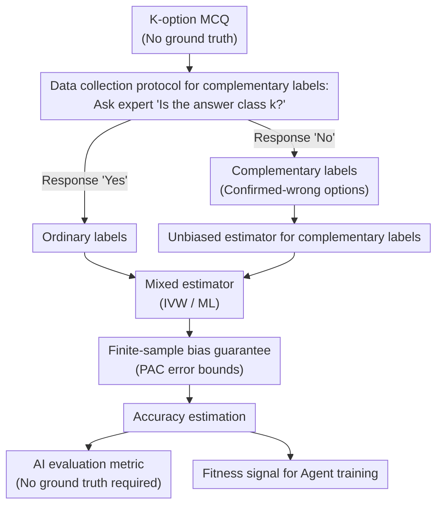

# Towards Scalable Oversight via Partitioned Human Supervision

**Conference**: ICLR2026  
**arXiv**: [2510.22500](https://arxiv.org/abs/2510.22500)  
**Code**: Open-sourced  
**Area**: LLM Agent  
**Keywords**: Scalable oversight, complementary labels, partitioned human supervision, unbiased estimation, Agent training

## TL;DR

A scalable oversight framework based on partitioned human supervision is proposed. When tasks exceed the capability of a single expert, complementary labels (excluding incorrect options) provided by domain experts are used to construct an unbiased accuracy estimator, enabling the evaluation and training of AI systems without requiring full ground-truth annotations.

## Background & Motivation

- As AI systems approach or exceed human expert levels, obtaining high-quality human supervision signals for evaluation and training becomes increasingly difficult.
- In cross-disciplinary, highly difficult tasks, even the best experts are only proficient in a narrow domain.
- Existing alignment pipelines (SFT, RLHF, RLVR) assume that humans can reliably evaluate or design verifiers.
- **Key Insight**: While domain experts may not provide the correct answer, they can reliably exclude incorrect options within their domain.
    - A cardiologist: "This is not a cardiovascular disease."
    - An oncologist: "This is unrelated to oncology."
- These "complementary label" signals are weak but highly available and reliable.

## Core Problem

When full ground-truth annotations are unavailable, how can weak signals provided by partitioned experts ("this option is wrong") be utilized to evaluate and train AI systems?

## Method

### Overall Architecture

The method transforms the fact that "no one knows the correct answer, but every expert can negate incorrect options in their field" into a statistical estimation problem. The workflow involves: first using a binary inquiry protocol to collect complementary labels (confirmed-wrong options) from partitioned experts; constructing an unbiased estimator for accuracy $A$ based on these labels; merging complementary labels with a small amount of ordinary labels into a mixed estimator with lower variance; applying finite-sample confidence bands to the estimation error; and finally using this accuracy estimate as both an AI evaluation metric and a fitness signal for agent training.

### Key Designs

**1. Data collection protocol for complementary labels: Converting weak negation signals from partitioned experts into modelable random variables**

The task is set as a $K$-option multiple-choice question (MCQ), where each question has an unknown true label $Y \in \{1, \ldots, K\}$. The system assigns $K$ annotators to be responsible for one category each. For a single question, one annotator is randomly selected and asked: "Is the answer class $k$?". A "Yes" answer yields an ordinary label, while a "No" answer yields a **complementary label** $\bar{Y}$—an option confirmed to be incorrect. The key assumption is that complementary labels are uniformly distributed across all incorrect options, i.e., $p(\bar{Y}=k|Y) = \frac{1}{K-1}$ for all $k \neq Y$. This protocol only requires experts to make binary judgments instead of providing answers, allowing stable collection of reliable signals even when tasks exceed individual expert capabilities.

**2. Unbiased estimator for complementary labels: Inferring accuracy from "not hitting a wrong option"**

An indicator variable $W = \mathbb{I}\{\hat{Y} \neq \bar{Y}\}$ is defined, representing that the model prediction $\hat{Y}$ does not overlap with the complementary label. Its empirical mean is taken as $\hat{q} = \frac{1}{n_c}\sum_{i=1}^{n_c} w_i$. Since complementary labels are uniformly sampled from incorrect options, a linear relationship exists between $\hat{q}$ and true accuracy. Corollary 1 provides the unbiased estimate $\hat{A}_{\text{comp}} = (K-1)\hat{q} - (K-2)$. Its variance is $\text{Var}(\hat{A}_{\text{comp}}) = \frac{(A+K-2)(1-A)}{n_c}$. From this, the amount of complementary labels $n_c$ required to match the variance of $n_o$ ordinary labels is solved as $n_c = \left(1 + \frac{K-2}{A}\right) n_o$. As accuracy increases, fewer complementary labels are needed, making weak signals more economical for high-performance models.

**3. Mixed estimator: Reducing variance through complementarity between ordinary and complementary labels**

When both label types exist, the method merges them into a tighter estimate. Inverse Variance Weighting (IVW) assigns weights based on the reciprocal of respective variances: $\hat{A}_{\text{IVW}} = \hat{w}\hat{A}_{\text{ord}} + (1-\hat{w})\hat{A}_{\text{comp}}$, where $\hat{w} = \frac{\widehat{\text{Var}}(\hat{A}_{\text{comp}})}{\widehat{\text{Var}}(\hat{A}_{\text{ord}}) + \widehat{\text{Var}}(\hat{A}_{\text{comp}})}$. Maximum Likelihood (ML) writes the log-likelihood for joint observations. Since it is quadratic with respect to $A$, a closed-form solution exists: $\hat{A}_{\text{ML}} = \frac{-\beta + \sqrt{\beta^2 - 4\alpha\gamma}}{2\alpha}$, where $\alpha = N$, $\beta = (K-2)(T_o+T_c) + (K-3)S_o - S_c$, and $\gamma = -(K-2)S_o$. Both are provided in closed form, avoiding iterative optimization to achieve precision near full annotation.

**4. Finite-sample bias guarantee: Applying calculable confidence bands to estimation errors**

To ensure the estimators can be reliably used for evaluation and training, the method provides non-asymptotic PAC-style error bounds. For the complementary label estimator, Theorem 2 takes the minimum of the Hoeffding bound and the empirical Bernstein bound: $|\hat{A}_{\text{comp}} - A| \leq (K-1)\min\left\{\sqrt{\frac{\log(2/\delta)}{2n_c}}, \sqrt{\frac{2\hat{q}(1-\hat{q})}{n_c-1}\log\frac{4}{\delta}} + \frac{7\log(4/\delta)}{3(n_c-1)}\right\}$, which automatically tightens in low-variance regions. For the mixed estimator, Theorem 4 provides a Bernstein-style bound: $|\hat{A}_{\text{mix}} - A| \leq \sqrt{2v\log\frac{2}{\delta}} + c\log\frac{2}{\delta}$.

## Key Experimental Results

### Statistical Validation (GPT-5-nano)

| Estimator | MMLU-Pro | MedQA | GPQA | MATH | MATH(CoT) | Average |
|-----------|----------|-------|------|------|-----------|---------|
| Ord (Ordinary) | 78.33±1.73 | 92.89±1.35 | 64.17±1.67 | 47.56±3.91 | 84.89±0.77 | 73.57 |
| Comp-$n_o$ (Equal qty) | 77.00±12.49 | 92.67±1.53 | 59.17±3.82 | 48.44±10.78 | 80.44±2.78 | 71.54 |
| Comp-Var (Var matched) | 75.67±2.15 | 90.61±1.43 | 63.67±5.01 | 41.10±3.17 | 81.35±0.29 | 70.48 |
| **IVW** | **77.97±1.58** | **91.86±1.11** | **65.14±1.38** | **44.87±3.82** | **83.86±0.83** | **72.74** |
| ML | 77.94±1.58 | 91.65±1.08 | 65.11±1.38 | 44.75±3.79 | 83.65±1.04 | 72.62 |
| Ord-Eval (Full ref) | 77.97 | 92.66 | 59.52 | 44.21 | 83.89 | – |

- IVW and ML mixed estimators achieve the best balance between bias and variance.
- Variance increases significantly when complementary labels replace ordinary labels 1:1, but approaches ordinary labels after variance matching.

### Agent Training

- In ADAS and AFlow agent search frameworks, the complementary label estimator replaces accuracy as the fitness signal.
- Agents effectively achieve self-improvement even without full ground-truth annotations.
- The feasibility of using weak signals as training signals is demonstrated.

## Highlights & Insights

1. **Unique problem perspective**: Modeling expert knowledge as "partitioning + exclusion" via complementary labels cleverly utilizes human specialization.
2. **Theoretical completeness**: Rigorous mathematical derivation from unbiased estimation to variance analysis and finite-sample guarantees.
3. **High practicality**: Simple collection protocol (binary judgment) significantly lowers the annotation barrier.
4. **Dual application**: The same framework evaluates AI (without ground truth) and trains AI (agent training signal).
5. **Efficient IVW and ML estimators**: A small number of complementary labels can achieve estimation precision close to full annotation.

## Limitations & Future Work

- The uniform sampling assumption ($p(\bar{Y}=k|Y) = 1/(K-1)$) may not strictly hold in practice.
- Only MCQ settings were validated; adaptation to open-ended generation tasks requires additional work.
- Agent training experiments are a proof-of-concept; larger-scale validation is needed.
- Quality of complementary labels depends on expert reliability—scenarios where experts make mistakes were not fully discussed.
- Variance of complementary labels increases sharply when $K$ is very large (as seen in Eq. 5).

## Related Work & Insights

| Scalable Oversight Method | Core Assumption | Relationship to Ours |
|---------------------------|-----------------|----------------------|
| Weak-to-strong generalization | Strong models can exceed weak supervisors | Orthogonal: Provides new source of weak signals |
| Easy-to-hard generalization | Evaluation is easier than generation | Orthogonal: Does not assume easier evaluation |
| Debate | Adversarial arguments reveal truth | Orthogonal: Based on expert exclusion |
| Constitutional AI | AI self-generates feedback | Orthogonal: Uses weak human signals |
| Recursive decomposition | Tasks can be decomposed into sub-tasks | Orthogonal: Based on specialization partitions |

## Rating

- Novelty: ⭐⭐⭐⭐⭐ — Highly original problem setting; first application of complementary labels in AI alignment.
- Experimental Thoroughness: ⭐⭐⭐⭐ — Sufficient statistical validation, though agent training scale is limited.
- Writing Quality: ⭐⭐⭐⭐⭐ — Rigorous theoretical derivation and sound experimental design.
- Value: ⭐⭐⭐⭐⭐ — Provides a practical and feasible solution for scalable oversight of superhuman tasks.

<!-- RELATED:START -->

## Related Papers

- [\[ICLR 2026\] Repurposing Synthetic Data for Fine-grained Search Agent Supervision](repurposing_synthetic_data_for_fine-grained_search_agent_supervision.md)
- [\[ACL 2026\] SynthAgent: Adapting Web Agents with Synthetic Supervision](../../ACL2026/llm_agent/synthagent_adapting_web_agents_with_synthetic_supervision.md)
- [\[ICLR 2026\] AgentSynth: Scalable Task Generation for Generalist Computer-Use Agents](agentsynth_scalable_task_generation_for_generalist_computer-use_agents.md)
- [\[ICLR 2026\] Grounding Computer Use Agents on Human Demonstrations](grounding_computer_use_agents_on_human_demonstrations.md)
- [\[ICLR 2026\] ToolWeaver: Weaving Collaborative Semantics for Scalable Tool Use in Large Language Models](toolweaver_weaving_collaborative_semantics_for_scalable_tool_use_in_large_langua.md)

<!-- RELATED:END -->
