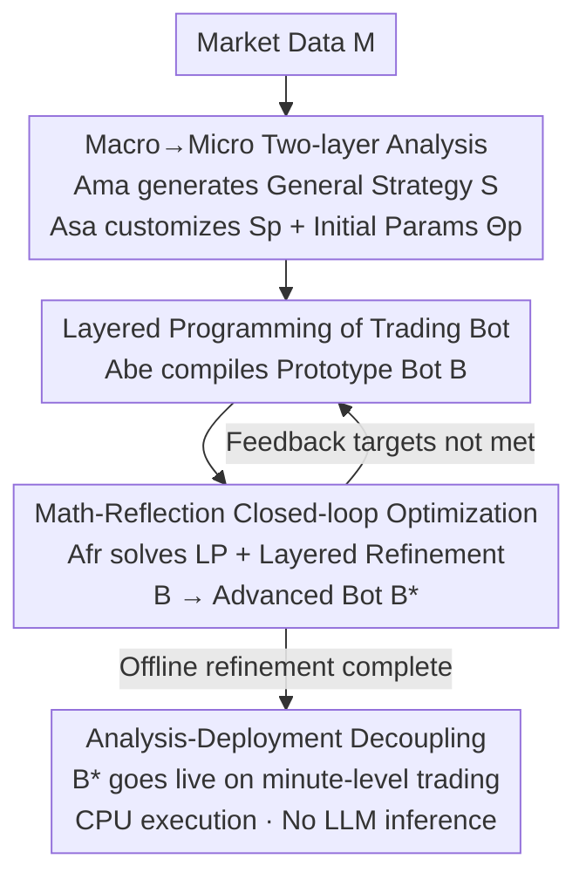

# Trade in Minutes! Rationality-driven Agentic System for Quantitative Financial Trading

**Conference**: ICLR 2026  
**OpenReview**: [https://openreview.net/forum?id=ROEwZAxqyS](https://openreview.net/forum?id=ROEwZAxqyS)  
**Code**: None  
**Area**: Agent / Quantitative Finance  
**Keywords**: Multi-Agent System, Quantitative Trading, Analysis-Deployment Decoupling, Mathematical Reflection Optimization, Minute-level Trading

## TL;DR
TiMi (Trade in Minutes) is a "rationality-driven" multi-agent quantitative trading system. It utilizes three specialized LLMs (semantic analysis, programming, and mathematical reasoning) to offline refine trading strategies into standalone programmable trading bots. These bots are then deployed for minute-level live trading, completely decoupling "heavy reasoning" from "fast execution." It achieves stable returns, low latency, and superior risk control across 200+ stock indices and crypto pairs.

## Background & Motivation
**Background**: Utilizing LLM-based financial trading agents is currently a trending area. The mainstream approach follows "anthropomorphic role-playing"—assigning agents roles such as news analysts, sentiment analysts, or traders with different risk appetites to reach buy/sell decisions through multi-agent debate/negotiation (e.g., FinMem, TradingAgents). These methods excel at processing textual information like news and research reports.

**Limitations of Prior Work**: The authors identify three specific issues. First, **emotional bias**: anthropomorphic simulations naturally introduce subjective judgment and emotional noise into decision-making. Second, **unreliable peripheral information**: relying on unstructured "side information" like social media news and project reports is particularly dangerous for retail traders, as these often contain misleading signals and time lags, leading to missed opportunities or adverse volatility. Third, **low deployment efficiency**: in live trading, every transaction requires going through a long multi-agent reasoning and negotiation process, resulting in high computational overhead and execution latency, which manifests as slippage and opportunity cost in volatile markets.

**Key Challenge**: Anthropomorphic agents pursue "strategy depth," whereas quantitative trading requires "mechanical rationality" and "minute-level response speed." Existing methods bind reasoning and execution together, making it impossible to achieve both simultaneously—either deep but slow, or fast but shallow.

**Goal**: To reconcile strategy depth with the mechanical rationality necessary for quantitative trading. Specifically: de-emotionalizing market analysis, using objective technical indicators for data selection, and ensuring low-latency deployment.

**Key Insight**: The authors observe that existing work rarely utilizes the advancements of LLMs in **coding** and **mathematical reasoning**, which are the keys to achieving mechanical rationality. Since live trading must be fast, LLMs should not be run during live execution. Instead, the LLM "thinking" should be shifted entirely offline to produce a programmable bot that runs independently of LLM reasoning.

**Core Idea**: Replace "continuous multi-agent reasoning" with "analysis-deployment decoupling." Specialized LLMs are used offline to compile strategies into programmable trading bots and iteratively optimize them. Only these lightweight bots are deployed for live trading, achieving both strategy depth and minute-level efficiency.

## Method

### Overall Architecture
TiMi models the entire trading lifecycle as $(\mathcal{M}, \mathcal{W}, \mathcal{S}, \mathcal{F}, \mathcal{J})$ (Market, Window, Strategy Space, Feedback, Evaluation Function), aiming to maximize $\mathcal{J}(\pi_\Theta)$. The system is coordinated by **four specialized agents**: Macro Analysis agent $\mathcal{A}_{ma}$, Strategy Adaptation agent $\mathcal{A}_{sa}$, Bot Evolution agent $\mathcal{A}_{be}$, and Feedback Reflection agent $\mathcal{A}_{fr}$, which respectively invoke semantic analysis $\phi$, coding $\psi$, and mathematical reasoning $\gamma$.

The pipeline is divided into **three phases**, the first two being offline and the last one being live:

- **Policy Phase**: $\mathcal{A}_{ma}$ identifies macro market patterns from technical indicators and generates a general strategy set $\mathcal{S}$; $\mathcal{A}_{sa}$ customizes these into pair-specific rules $\mathcal{S}_\mathcal{P}$ and initial parameters $\Theta_\mathcal{P}$; $\mathcal{A}_{be}$ compiles these into a prototype trading bot $\mathcal{B}$.
- **Optimization Phase**: The prototype bot $\mathcal{B}$ runs in historical/simulated markets to collect feedback $\mathcal{F}$ (execution backlogs, risk outliers); $\mathcal{A}_{fr}$ converts feedback into mathematical optimization problems to solve for refined parameters $\Theta^*$ and hierarchical feedback $\mathcal{F}^*$, which are then used by $\mathcal{A}_{be}$ for layered refinement to iterate into an advanced bot $\mathcal{B}^*$.
- **Deployment Phase**: The advanced bot $\mathcal{B}^*$, having passed simulation tests, is deployed directly for live trading. It runs on CPU with low latency and requires no further LLM reasoning.

### Key Designs

**1. Analysis-Deployment Decoupling: Shifting "Heavy Reasoning" Offline, Deploying Lightweight Bots**

This is the central tenet of TiMi, directly addressing the latency of running multi-agent systems in live trading. The system separates complex reasoning (Policy + Optimization, offline) from time-sensitive execution (Deployment, live). The offline phase repeats refinement with specialized agents to produce a bot $\mathcal{B}^*$ with tuned parameters and frozen logic; the live phase only executes this bot on CPU without LLM calls.

The efficiency gain is quantified by $\eta = \frac{c_{agent}\times n}{c_{policy}+c_{optimization}+c_{bot}\times n}$, where $c_{agent}/c_{bot}$ represents the inference cost per trade for the agent/bot, and $n$ is the number of actions. As $n$ increases in volatile markets, $\lim_{n\to\infty}\eta = \frac{c_{agent}}{c_{bot}}$. Typically $c_{bot} \ll c_{agent}$, so the more frequent the trading, the greater the efficiency advantage of decoupling. Measured deployment latency is only 137ms, approximately 180× faster than the continuous reasoning in TradingAgents (25,071ms). Decoupling also allows the optimization phase to be thorough without real-time constraints.

**2. Macro→Micro Two-layer Analysis: De-emotionalizing Strategy Initialization with Technical Indicators**

Addressing "emotional bias" and "unreliable peripheral info," TiMi discards role-playing and news reading in favor of **objective technical indicators** (volume, amplitude, etc.) across two layers. In the first layer, $\mathcal{A}_{ma}$ performs macro analysis: recognizing periodic patterns in short time windows. $\mathcal{A}_{ma}$ extracts features from all observable market states to generate a statistically significant general strategy set: $\mathcal{A}_{ma}(\mathcal{M},\mathcal{W};\mathcal{I}) = \phi(\{\psi_i(\mathcal{M},w)\}) \to \mathcal{S}$, where $\psi_i$ is the programming process applying indicator $i$ to window $w$.

The second layer is pair-wise customization by $\mathcal{A}_{sa}$: since different pairs behave heterogeneously, it uses semantic analysis $\phi(\mathcal{S},p)\to\mathcal{S}_p$ to select strategies and mathematical reasoning $\gamma(\mathcal{S}_p,p)\to\Theta_p$ to calibrate parameters. This covers ranking strategies by historical performance, calibrating parameters based on volatility profiles, and setting adaptive risk rules. This combination of "market-level significance + pair-level flexibility" is statistically superior to one-size-fits-all strategies—removing $\mathcal{A}_{sa}$ (unified strategy) nearly doubles the Max Drawdown (MDD) to 28.4%.

**3. Layered Programming Trading Bot: Compiling Strategies into Refinable Modular Code**

To be executable, strategies must become code. $\mathcal{A}_{be}$ (Code LLM) decomposes the trading bot $\mathcal{B}$ into three layers: the **Strategy Layer** encapsulates decision logic (signal generation, position sizing); the **Function Layer** provides computational mechanisms (indicators, preprocessing, execution routines); and the **Parameter Layer** manages all tunable values. This structure naturally supports hierarchical refinement.

To ensure structural integrity across optimization rounds, three **Programming Laws** $\mathcal{L}$ are defined: ① Functional Cohesion—each component does one thing; ② Unidirectional Dependency—dependencies only flow from higher to lower layers; ③ Parameter Outsourcing—all tunable values must be extracted from implementation code. These laws facilitate $\mathcal{A}_{fr}$'s refinement: outsourcing parameters allows math optimization to touch only the parameter layer, while unidirectional dependency ensures low-level changes don't corrupt high-level logic.

**4. Math-Reflection Closed-loop Optimization: Converting Risk Cases to Linear Programming for Optimal Parameters**

This is the core of TiMi’s "rationality," focusing on how to iterate without introducing emotion. In the optimization phase, the bot collects feedback $\mathcal{F}$ from historical/simulated markets. $\mathcal{A}_{fr}$ uses mathematical reasoning $\gamma$ in three steps: organizing risk scenarios from feedback, converting them into linear programming (LP) problems, and solving for the optimal parameter set within the constrained space to maximize performance:

$$\Theta^* = \arg\max_{\Theta\in C(\Theta)} \sum \omega_i \mathcal{J}_i(\Theta,\mathcal{F}) \quad \text{s.t.}\quad C(\Theta) = \{\Theta\in\mathbb{R}^n \mid A(R)\Theta \preceq b(R)\}$$

Where $C(\Theta)$ is the feasible space, $\omega_i, \mathcal{J}_i$ are objective weights and metrics (e.g., win rate), and $A(R), b(R)$ are constraint matrices/vectors derived from risk scenarios $R=\gamma(\mathcal{F})$. $\mathcal{A}_{fr}$ identifies trade-offs between competing objectives to establish Pareto-efficient configurations.

Following parameter solved, **Layered Optimization** is applied: following a "principle of minimal intervention," it first fine-tunes the Parameter Layer. If targets (e.g., risk simulations) are still not met, it upgrades to the Function Layer to replace algorithms; only as a last resort does it modify the Strategy Layer rules. This progression maintains strategy continuity while establishing a natural complexity gradient.

### Loss & Training
TiMi does not train models; it "assembles" existing specialized LLMs: DeepSeek-V3 for semantic analysis, Qwen2.5-Coder-32B-Instruct for programming, and DeepSeek-R1 for mathematical reasoning. It uses a hybrid of local small models and API-based large models for efficiency. Agents communicate via a hybrid protocol of XML envelopes and JSON payloads. The system also performs **programmatic posterior checks**: validating scripts and mathematical solutions in a controlled sandbox to catch execution backlogs and ensure outputs meet predefined constraints before deployment.

## Key Experimental Results

### Main Results
Evaluated across 200+ stock index futures and crypto pairs. Metrics: Annualized Rate of Return (ARR), Sharpe Ratio (SR), Max Drawdown (MDD). Live trading results from Jan–Apr 2025 (representative methods):

| Category / Method | Altcoin ARR%↑ | Altcoin SR↑ | Altcoin MDD%↓ | Supported Pairs (NP)↑ | Frequency |
|--------|------|------|------|------|------|
| Quant · Grid Trading | 1.8 | 0.15 | 28.4 | 213 | hourly |
| Quant · OFI | 5.4 | 0.52 | 29.3 | 213 | second |
| ML/RL · DDPG | 5.9 | 0.54 | 38.1 | 150* | daily |
| ML/RL · PatchTST | 6.4 | 0.63 | 35.4 | 120* | daily |
| LLM-agent · FinMem | 3.8 | 0.39 | 23.7 | 50* | daily |
| LLM-agent · TradingAgents | 5.5 | 0.57 | 28.3 | 28* | daily |
| **TiMi (Ours)** | **13.7** | **0.86** | 32.8 | **213** | **minute** |

TiMi achieved live ARR of 6.4% in stock indices, 8.0% in mainstream crypto, and 13.7% in altcoins, showing the strongest advantage in high-volatility markets. TiMi supports 213 pairs, equal to quantitative methods and far exceeding ML/RL and existing agent methods (which struggle with convergence or data requirements). In 2024 backtests, TiMi’s altcoin SR reached 1.27, demonstrating robustness in reflexive assets where traditional momentum and pure semantic analysis struggle.

In terms of efficiency, TiMi's latency is 137ms, comparable to quant methods and 180× faster than TradingAgents. Capital utilization (63.7%) and profit-loss ratio per unit of capital (1.53) also lead. Data requirements are lower—attaining a Sortino ratio of 0.91 on altcoins requires only >4h of market indicators, whereas TradingAgents requires >3d to reach 0.58.

### Ablation Study
Component ablation in 2024 crypto markets:

| Configuration | ARR%↑ | SR↑ | MDD%↓ | Real-world Deployment |
|------|------|------|------|------|
| TiMi Full System | 20.9 | 1.23 | 15.3 | Stable |
| $\mathcal{A}_{fr}$ Parameter-only | 12.5 | 0.92 | 16.3 | Logic Inconsistent |
| $\mathcal{A}_{fr}$ Semantic-only | 1.1 | 0.05 | 25.1 | Stable |
| w/o $\mathcal{A}_{sa}$ (Unified Strategy) | 15.2 | 0.95 | 28.4 | Stable |
| w/o $\mathcal{A}_{fr}$ (Prototype Bot $\mathcal{B}$) | 1.1 | 0.05 | 25.1 | Unstable Execution |

### Key Findings
- **$\mathcal{A}_{sa}$ Manages Risk**: Removing the adaptation agent nearly doubled MDD (15.3%→28.4%), proving pair-wise customization is vital for "unifying risk exposure across heterogeneous assets."
- **Balanced Optimization is Necessary**: Semantic reflection alone maintains stability but stagnates profit (ARR 1.1%). Parameter-only optimization shows theoretical gains but leads to "code-parameter mismatch" and logic inconsistency in live trading. Only the full closed-loop is effective.
- **Iteration Effectiveness**: Bot evolution trajectories show that unoptimized $\mathcal{B}$ stagnates. $\mathcal{B}(1)$ shows spikes but degrades, while the stabilized $\mathcal{B}(3)$ converges to $\mathcal{B}^*$ with sustained returns >20%.
- **Performance Distribution**: TiMi has the lowest variance ($\sigma=11.03\%$) and risk events <2%, making it more reliable than the volatile DDPG ($\sigma=29.64\%$).

## Highlights & Insights
- **"Offline Compile, Live Execute" Paradigm**: Downgrading the LLM agent from "live decision-maker" to "offline strategy compiler" solves latency, cost, and emotional bias simultaneously. This is the most ingenious design of the paper.
- **Math Optimization over LLM Debate**: Using LP to find Pareto-optimal parameters in a constrained space is more "mechanically rational" than subjective negotiation and is inherently verifiable via sandbox checks.
- **Modular Laws for Refinable Code**: The combination of Parameter Outsourcing and Unidirectional Dependency allows the math engine to precisely target layers, providing a "minimal intervention" principle applicable to other agentic code-refining systems.
- **Task-Specific LLM Delegation**: Utilizing specialized models (DeepSeek-V3, Qwen2.5-Coder, DeepSeek-R1) based on their strengths, rather than a single general-purpose model, is a pragmatic engineering approach for complex agent systems.

## Limitations & Future Work
- **Reliance on Technical Indicators**: By intentionally ignoring news/fundamentals to avoid emotion, TiMi may react slowly to "Black Swan" events or policy shifts. It bets on the existence of periodic patterns in short windows.
- **Fixed Strategy Shapes**: Implementation focuses heavily on minute-level grid strategies; whether it generalizes to entirely different strategy families (e.g., market making, complex arbitrage) remains to be fully verified.
- **Overfitting Risk in Offline Optimization**: Deeply optimizing parameters for Pareto efficiency on historical data creates a risk of overfitting. While 2025 live tests show generalization, robustness under major market regime shifts requires long-term monitoring.

## Related Work & Insights
- **vs. TradingAgents/FinMem**: Traditional anthropomorphic agents debate over news with latencies of 1.8k–25k ms, supporting only a few dozen pairs. TiMi uses objective indicators and offline compilation to achieve 137ms latency and 200+ pair support with doubled returns. The core shift is from "Agent as Decision Maker" to "Agent as Offline Optimizer."
- **vs. Classic Quantitative Strategies**: Rules-based strategies are stable but rigid. TiMi maintains quant-level latency while gaining the adaptive capabilities that rules-based strategies lack through its LLM-driven closed-loop optimization.
- **vs. ML/RL Methods**: End-to-end learning methods like DDPG suffer from convergence issues and high variance. TiMi replaces end-to-end learning with mathematical planning for parameter optimization, resulting in significantly lower variance and higher reliability.

## Rating
- **Novelty**: ⭐⭐⭐⭐⭐ (The decoupling paradigm and math-based LP optimization are truly anti-mainstream and effective compared to role-playing frameworks.)
- **Experimental Thoroughness**: ⭐⭐⭐⭐⭐ (Covers 200+ pairs, three market types, live tests, and extensive efficiency and distribution analysis.)
- **Writing Quality**: ⭐⭐⭐⭐ (Formalization is clear and diagrams are helpful, though the density of symbols and parameters makes for a high initial reading barrier.)
- **Value**: ⭐⭐⭐⭐⭐ (Provides a reusable decoupling paradigm for deploying LLM agents in high-frequency, low-latency scenarios.)

<!-- RELATED:START -->

## Related Papers

- [\[NeurIPS 2025\] Orchestration Framework for Financial Agents: From Algorithmic Trading to Agentic Trading](../../NeurIPS2025/llm_agent/orchestration_framework_for_financial_agents_from_algorithmic_trading_to_agentic.md)
- [\[ICLR 2026\] An Information Theoretic Perspective on Agentic System Design](an_information_theoretic_perspective_on_agentic_system_design.md)
- [\[ICLR 2026\] In-the-Flow Agentic System Optimization for Effective Planning and Tool Use](in-the-flow_agentic_system_optimization_for_effective_planning_and_tool_use.md)
- [\[ICLR 2026\] OrchestrationBench: LLM-Driven Agentic Planning and Tool Use in Multi-Domain Scenarios](orchestrationbench_llm-driven_agentic_planning_and_tool_use_in_multi-domain_scen.md)
- [\[ICLR 2026\] When AI Agents Collude Online: Financial Fraud Risks by Collaborative LLM Agents on Social Platforms](when_ai_agents_collude_online_financial_fraud_risks_by_collaborative_llm_agents_.md)

<!-- RELATED:END -->
