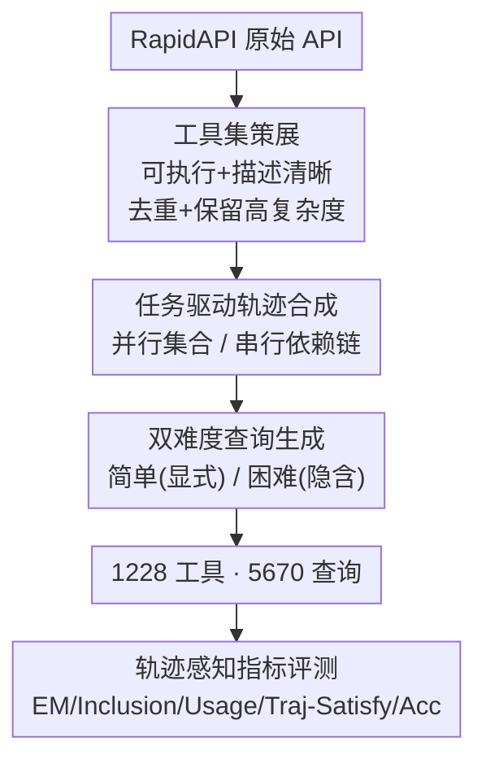

# TRAJECT-Bench: A Trajectory-Aware Evaluation Benchmark for Agent Tool Calling

**Conference**: ICLR 2026  
**OpenReview**: [https://openreview.net/forum?id=TZWnWvsQ0X](https://openreview.net/forum?id=TZWnWvsQ0X)  
**Code**: https://github.com/PengfeiHePower/TRAJECT-Bench  
**Area**: Agent  
**Keywords**: Tool Calling, Agent Evaluation, Trajectory Evaluation, RapidAPI, Tool Retrieval

## TL;DR
TRAJECT-Bench constructs 5,670 "parallel/serial" tool calling trajectories and "simple/hard" dual-difficulty queries using 1,228 executable real APIs. It refines evaluation from "whether the final answer is correct" to trajectory-level diagnostics focusing on "whether tools were selected correctly, parameters filled accurately, and sequence/dependencies met," thereby revealing specific failure modes of LLMs in tool calling (similarity confusion, parameter blind selection) and the scaling bottleneck from "short trajectories to medium-length trajectories."

## Background & Motivation

**Background**: Large Language Models (LLMs) are increasingly serving as the "brains" of agents, utilizing external "hands" (search engines, production-grade APIs, file/system operations) to complete real-world tasks. Evaluating the tool-calling capabilities of LLMs has led to the emergence of benchmarks such as MetaTool, API-Bank, ToolBench, Gorilla, BFCL, and ToolQA.

**Limitations of Prior Work**: The authors identify three missing gaps in existing evaluations. First, **Trajectory complexity is underestimated**—some benchmarks use small-scale or simulated tools, and most only test short, low-depth tool sequences, whereas real agents face large toolsets and complex tasks requiring multiple tool collaborations. Second, **Query complexity is underestimated**—many benchmarks explicitly include API names in the prompt, while real users use indirect, implicit colloquial expressions, requiring the model to infer "which tool to use and how to fill parameters." Third, **Focus on final answer only**—ToolBench only provides pass rates/win rates, and BFCL relies heavily on overall accuracy. This prevents locating the root cause when an answer is wrong (Is it a wrong tool? Disordered sequence? Incorrect parameters?), and it cannot decouple "tool-calling capability" from "general reasoning capability"—prior research observes that models can sometimes guess the correct answer using internal knowledge even if they call the wrong tools.

**Key Challenge**: The "black box" metric of final answer accuracy conflates three orthogonal capabilities: tool selection, parameterization, and sequencing/dependency. This makes it impossible to see at which step a failure occurs or whether success is due to genuine tool use or internal knowledge.

**Goal**: To construct a benchmark that treats tool calling as a first-class evaluation objective, providing (1) tool calling trajectories of varying complexity, (2) queries of different difficulties for the same trajectory, and (3) fine-grained metrics characterizing tool calling capabilities from multiple perspectives.

**Core Idea**: By using "real executable tools + task-driven trajectory synthesis + dual-difficulty queries + trajectory-aware metrics," tool calling is decomposed into several diagnostic dimensions. This provides both final accuracy and information on whether the model is stuck on tool selection, parameter filling, or sequencing.

## Method

### Overall Architecture
TRAJECT-Bench is essentially a pipeline for "data construction + evaluation." On the data side, tools from 10 real domains (Travel, Maps, Finance, Weather, E-commerce, News/Media, Gaming, Email, Education, Music) are filtered from RapidAPI into a high-fidelity, executable toolset $\mathcal{T}$. Then, driven by task types, trajectories are synthesized via two branches—**Parallel Trajectories** (tools are independent and form an unordered set) and **Serial Trajectories** (tools form a dependency chain where subsequent steps consume previous outputs). Each trajectory is paired with **Simple** and **Hard** versions of semantically aligned queries. The final dataset includes 1,228 tools and 5,670 queries. On the evaluation side, this data is fed to SOTA LLMs, reporting both final answer accuracy and a set of **Trajectory-Aware Metrics** (Exact Match, Inclusion, Tool Usage, Trajectory Satisfaction), further evaluating three settings: "Retrieval-based Tool Selection," "Native Agentic Tool Calling," and "ReAct Agents."

### Key Designs

**1. High-Fidelity Tool Curation: Building Evaluation on Real, Executable, and Discriminative Tools**

Existing benchmarks either use simulated tools or include many vaguely described or non-functional APIs from RapidAPI, leading to unreliable evaluations. The authors manually curated the tools based on four criteria: (1) **Executable with meaningful output**—actually calling each tool with multiple parameter combinations, discarding those with errors, and using LLMs to summarize output formats or delete semantically trivial outputs; (2) **Clear and action-oriented descriptions**—merging original sparse documentation with real I/O observed during validation (e.g., if a original description was only "Get price (symbol)", and testing revealed a 50-item limit and returns `{price, currency, timestamp}`, these behaviors are merged into a clarified description); (3) **Minimal functional overlap**—deduplicating functionally equivalent APIs (e.g., multiple flight search endpoints) to avoid ambiguity in trajectory evaluation, though approximate tools with different parameterizations are kept to increase difficulty; (4) **Controlled tool complexity**—manually retaining tools with complex parameters (many fields, rich types/constraints) and removing overly simple ones (e.g., no input required) to stress-test tool calling capabilities. This resulted in the high-fidelity toolset $\mathcal{T}$.

**2. Task-Driven Dual-Structure Trajectory Synthesis: Covering Breadth and Depth with Parallel and Serial Structures**

To ensure trajectories are both realistic and controllable, the authors do not generate tool sequences out of thin air but derive them from **real task types** (e.g., "Real-time itinerary monitoring and assistance" in Travel, "Creating math and science learning materials" in Education). Trajectories are modeled into two basic structures. **Parallel Trajectories**: LLMs are prompted to synthesize logically valid plans based on task type descriptions and domain tools, following two rules: a specified number of tools must be used (usually 3 to 10+), and each call is self-contained (inputs fixed in advance). These are encoded as "unordered sets of tool calls with complete inputs." **Serial Trajectories**: Due to strong dependencies, it is difficult for LLMs to directly output correct chains end-to-end. Instead, the authors first build a directed tool graph $G_T=(V,E)$, where each tool is a node and a directed edge $t_1\rightarrow t_2$ is drawn if $t_1$'s output can serve as $t_2$'s input (e.g., an IATA code returned by `GetAllIATA` can be fed into `airportInfo`). Sequence templates $t_1\rightarrow t_2\rightarrow\cdots\rightarrow t_{n_{traj}}$ are manually designed, with explicit labels for parameter binding. Finally, LLMs complete the details to generate parameterized trajectories (5 per template). This ensures logical consistency and allows scalable, transparent evaluation across different depths.

**3. Dual-Difficulty Queries: Decoupling Query Difficulty from Trajectory Complexity**

For each trajectory, the authors provide two semantically aligned query versions. The **Simple version** provides direct, precise instructions, explicitly naming required tools and key parameters. The **Hard version** uses natural cues and implicit expressions to convey the same constraints, simulating real-world colloquial user goals (e.g., saying "hotels with good word-of-mouth" instead of "sort hotels by rating"). The value of this design lies in fixing the trajectory while varying query difficulty to attribute failures to the "intent inference" layer—if the simple version is correct but the hard version fails, the bottleneck is not tool knowledge but inferring which tool to use and which parameters to fill from indirect cues. All trajectories and queries undergo automated LLM validation + manual review to reduce ambiguity.

**4. Trajectory-Aware Evaluation Metrics: From "Is the answer correct" to "Which step went wrong"**

This is the core differentiator. Besides final answer (5) **Acc** (judged by an LLM judge), the authors introduce four trajectory-level metrics: (1) **Exact Match (EM)**—whether the set of predicted tool names matches the ground truth (names only, no parameters); (2) **Inclusion**—the proportion of ground truth tools included in the predicted trajectory; (3) **Tool Usage**—whether predicted parameters (schema constraints, format, values) match the ground truth; (4) **Traj-Satisfy**—scoring by an LLM judge (default Claude-4) on the extent to which the predicted trajectory resolves the query when no gold trace is available, simulating real scenarios without standard answers. Retrieval-based methods also report (6) **retrieval rate**. EM, Inclusion, and Usage correspond to "choosing the correct toolset," "recalling tools," and "filling parameters correctly," respectively.

## Key Experimental Results

### Main Results
Evaluation of 10 SOTA models in the in-domain tool setting. Parallel query results (abridged):

| Model | Simple-EM | Simple-Acc | Hard-EM | Hard-Acc |
|------|---------|----------|---------|----------|
| Claude-4 | 0.846 | 0.905 | 0.445 | 0.517 |
| Gemini-2.5-pro | 0.851 | 0.911 | 0.442 | 0.498 |
| DeepSeek | 0.833 | 0.889 | 0.439 | 0.458 |
| qwen3-235b-A22B | 0.844 | 0.898 | 0.440 | 0.479 |
| Kimi-k2 | 0.815 | 0.902 | 0.321 | 0.448 |
| Claude-3.7 | 0.676 | 0.714 | 0.135 | 0.246 |
| Gemini-2.5-flash | 0.714 | 0.782 | 0.216 | 0.263 |

All models show a sharp decline from **Simple to Hard** (Claude-4 EM 0.846→0.445), suggesting that inferring tools and parameters from indirect cues is a universal weakness. Traj-Satisfy is highly synchronized with EM, supporting the LLM judge as an effective proxy for EM. Serial queries are generally lower than simple parallel queries, indicating that inter-step dependencies and order pose additional challenges.

### Retrieval-Based Tool Selection (RQ2)

| Model | Setting | Simple-EM | Simple-Acc | Hard-Retrieval Rate | Hard-EM |
|------|------|---------|----------|-------------|---------|
| Claude-4 | No retrieval (In-domain) | 0.846 | 0.905 | — | 0.445 |
| Claude-4 | ToolLM-IR + Domain | 0.906 | 0.916 | 0.578 | 0.028 |
| Claude-4 | ToolLM-IR + All | 0.852 | 0.879 | 0.475 | 0.014 |
| Claude-3.7 | bge-large + Domain | 0.681 | 0.708 | 0.585 | 0.035 |

Key Finding: When the retrieval pool is restricted to the domain, retrieval provides **almost no gain for simple queries**. However, **retrieval becomes a severe bottleneck for hard queries**—retrieval rates are mostly around 50%, causing all downstream metrics to collapse (Hard-EM drops to the 0.01~0.03 range). The root cause is that retrievers rely heavily on semantic similarity and fail to capture real intents behind implicit queries.

### Agentic and ReAct (RQ3)
- **Native Agentic Tool Calling**: Comparing native tool-calling interfaces vs. providing context, performance is similar (Claude-4 Simple-EM 0.832 agentic vs. 0.846 context).
- **ReAct Agent**: Iterative calling + retrieval consistently improves results. For hard parallel queries, Claude-4 performance improves from 0.445 EM (single model) to 0.463 (ReAct), and further to 0.473 with dynamic retrieval. This suggests that iterating based on execution results provides a stronger basis for accurate retrieval and usage.

### Key Findings
- **Scaling Bottleneck at "Short to Medium" Trajectories**: EM declines for all models as the number of tools increases, with the **steepest drop occurring between 3 and 5 tools**.
- **Inclusion is Generally Higher than EM**: Models can recall some correct tools but fail to complete the entire set.
- **Four Failure Modes**: ① Similar tool confusion; ② Parameter blind selection (ignoring parameters and focusing only on descriptions); ③ Redundant calls (conservative "cover everything" style or hallucinations); ④ Intent inference failure under hard queries.

## Highlights & Insights
- **Decomposing Tool Calling into Diagnostic Dimensions**: EM/Inclusion/Usage allow for locating exactly where a "wrong answer" originated—a practical improvement over reporting final accuracy.
- **"Same Trajectory, Dual-Difficulty Query" Experimental Design**: Decouples "intent inference difficulty" from "tool knowledge difficulty," a method transferable to any evaluation requiring a split between "understanding vs. execution."
- **The "3→5 Tools Scaling Cliff" Insight**: Directs research focus from reaching 10 tools back to the robustness of medium-length trajectories, directly informing data construction for training.
- **Retrieval Collapse on Hard Queries**: Challenges the reliability assumption of the common practice of "retrieval first." Semantic similarity is insufficient for implicit intent, suggesting a need for intent-aware tool retrieval.

## Limitations & Future Work
- **Trajectory structures only cover two basic topologies** (parallel and serial). Richer graph structures (hybrid/branching) are left for future work.
- **Heavy reliance on LLMs for data synthesis** (trajectories, queries, descriptions, and judging).
- **Fixed to 10 domains**. While the pipeline is extensible, whether conclusions hold for long-tail industrial APIs remains to be verified.
- Future Directions: The authors suggest incorporating precise tool-calling trajectory data into training and exploring intent-aware retrieval.

## Related Work & Insights
- **vs ToolBench**: ToolBench also uses RapidAPI but only reports pass/win rates. TRAJECT-Bench treats the selection strategy as part of the evaluation and introduces trajectory-level diagnostics.
- **vs Gorilla / BFCL**: These ground calls in public APIs and score execution, but trajectory structure and scalability are not core evaluation dimensions. This paper explicitly models sequence structure and tool count scaling.
- **vs ToolQA**: ToolQA focuses on tool-enhanced reasoning and query difficulty, but its tools are not real/executable and lack trajectory structures.

## Rating
- Novelty: ⭐⭐⭐⭐ The combination of trajectory-aware metrics + dual-difficulty queries + dual-structure synthesis is synthesized systematically for the first time.
- Experimental Thoroughness: ⭐⭐⭐⭐⭐ Covers 10 SOTA models × Parallel/Serial × Simple/Hard × Retrieval/Agentic/ReAct, including scaling curves and failure mode attribution.
- Writing Quality: ⭐⭐⭐⭐ Clear logic from motivation to findings. Capacity comparison in Table 1 is intuitive.
- Value: ⭐⭐⭐⭐⭐ Provides executable toolsets + fine-grained diagnostics + actionable insights (scaling cliff, retrieval bottleneck).

<!-- RELATED:START -->

## Related Papers

- [\[ICLR 2026\] A$^2$FM: An Adaptive Agent Foundation Model for Tool-Aware Hybrid Reasoning](a2fm_an_adaptive_agent_foundation_model_for_tool-aware_hybrid_reasoning.md)
- [\[ICLR 2026\] WARC-Bench: Web Archive based Benchmark for GUI Subtask Executions](warc-bench_web_archive_based_benchmark_for_gui_subtask_executions.md)
- [\[ICLR 2026\] SimuHome: A Temporal- and Environment-Aware Benchmark for Smart Home LLM Agents](simuhome_a_temporal-_and_environment-aware_benchmark_for_smart_home_llm_agents.md)
- [\[AAAI 2026\] Verification-Guided Context Optimization for Tool Calling via Hierarchical LLMs-as-editors](../../AAAI2026/llm_agent/verification-guided_context_optimization_for_tool_calling_via_hierarchical_llms-.md)
- [\[ICLR 2026\] Benchmarking LLM Tool-Use in the Wild](benchmarking_llm_tool-use_in_the_wild.md)

<!-- RELATED:END -->
