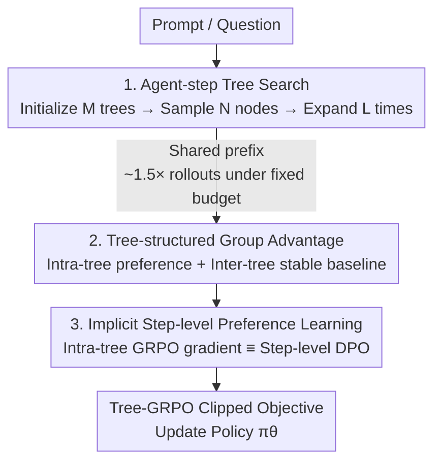

# Tree Search for LLM Agent Reinforcement Learning

**Conference**: ICLR 2026  
**OpenReview**: [https://openreview.net/forum?id=ZpQwAFhU13](https://openreview.net/forum?id=ZpQwAFhU13)  
**Code**: https://github.com/AMAP-ML/Tree-GRPO  
**Area**: Agent / Reinforcement Learning  
**Keywords**: Agent RL, Tree Search, Process Supervision, GRPO, Multi-turn Tool Use

## TL;DR
The authors replace "independent chain sampling" in multi-turn agent RL with "agent-step tree search sampling." By sharing prefixes, approximately $1.5\times$ trajectories are sampled under a fixed token/tool-call budget. The tree branching structure implicitly converts sparse outcome rewards into step-level process supervision (theoretically equivalent to step-level DPO), consistently outperforming chain-based GRPO across 11 QA datasets.

## Background & Motivation

**Background**: RL has become a mainstream paradigm for LLM post-training, where outcome rewards alone can develop strong reasoning capabilities in single-turn tasks like mathematics and coding. Recent work extends this to multi-turn agent scenarios, where LLMs interact with environments via ReAct "Thought-Action-Observation" loops to complete long-horizon tasks. Currently, group-based algorithms like GRPO are dominant: for each prompt, $N$ complete trajectories are sampled independently, and the group mean serves as a baseline to estimate advantages.

**Limitations of Prior Work**: Directly applying chain-based GRPO to agents poses two major challenges. First, **sampling budget is extremely high**: agent trajectories often reach tens of thousands of tokens and involve multiple tool calls (e.g., expensive search APIs), yet independent trajectories are highly redundant, causing the rollout phase to dominate training time. Second, **supervision is extremely sparse**: trajectories grow linearly with interaction turns, but rewards remain as scalars at the final outcome. Every step in a long trajectory receives the same credit (see equation $A(H)=A(\{\tau_0,\alpha_0,o_0\})=\dots=A(\{\tau_T,\alpha_T,o_T\})$), making it impossible to distinguish which step contributed to success or failure, leading to imbalanced learning signals or training collapse.

**Key Challenge**: Even with significantly increased sampling budgets, more trajectories are still supervised by the same sparse outcome signals. "Budget" and "supervision granularity" are coupled by chain-based sampling; increasing the budget does not resolve sparsity, while saving the budget hinders exploration.

**Goal**: To simultaneously achieve "sampling budget efficiency" and "fine-grained process signal generation" for agent RL under the constraints of **outcome-only rewards and limited budgets**.

**Key Insight**: Agent tasks naturally possess a clear step structure, where a (Thought, Action, Observation) tuple forms a semantically self-contained decision unit. Organizing sampling as a tree where trajectories share common prefixes allows for more trajectory rollouts within a fixed budget. Crucially, each branching point in the tree provides a natural comparison of "different continuations for the same prefix," where differences in outcome rewards serve as step-level preference signals.

**Core Idea**: Replace independent chain sampling with **agent-step tree search sampling** and implement two-level "intra-tree + inter-tree" group advantage estimation. This implicitly converts outcome rewards into step-level preference learning objectives, termed Tree-GRPO.

## Method

### Overall Architecture

Tree-GRPO modifies the standard GRPO pipeline of "sampling—advantage estimation—strategy update" by replacing each stage with a tree-structured version. Given a prompt (question), the process involves: first building $M$ trees using an initialize-then-expand approach (each node is a full agent step) to sample more rollouts than chain-based methods; then performing two-level group advantage estimation—intra-tree grouping constructs process/preference signals at branching points, while inter-tree grouping provides a stable baseline; finally, the combined advantages are used in a GRPO-style clipped objective for policy updates. Theoretical analysis shows the intra-tree gradient structure is equivalent to step-level DPO, explaining how outcome rewards generate step-level supervision.

### Key Designs

**1. Agent-step Tree Search Sampling: Extracting more rollouts from a fixed budget**

To address high sampling budgets and trajectory redundancy, independent sampling is replaced with tree search. Since classical MCTS depends on sequential expansion that bottlenecks throughput in parallel LLM engines, the authors use **initialize-then-expand**: ① **Initialization**—parallelly sample $M$ complete chain trajectories per prompt $x_i$ as initial trunks; ② **Sampling**—randomly pick $N$ non-leaf nodes from each tree; ③ **Expansion**—for each selected node, feed the context $H^i_{<t}$ from root to node into the policy to generate remaining parts as new branches. Repeating ② and ③ for $L$ times yields $M\times(L\times N+1)$ rollouts.

The critical unit is the **agent step**, where each node corresponds to a full $(\tau,\alpha,o)$ step. This ensures semantic consistency and constrains budgets in both token and tool-call dimensions. The total expected budget for tree search is:
$$E[B_{\text{tree}}] = M\cdot B + L\cdot N\cdot B/2.$$
Tree search yields ~1.5× more trajectories than chain sampling under identical budgets. Reducing $M$ or increasing $N, L$ further improves rollout count but narrows exploration due to more shared prefixes.

**2. Intra-tree + Inter-tree Two-level Group Advantage: Converting sparse rewards to process signals**

To solve sparse supervision, the tree structure itself generates process signals. Differences in outcome rewards backpropagated from leaf nodes at **each branching point** naturally form a preference learning objective for different subtrees. The deeper the subtree, the finer the process signal. **Intra-tree group advantage** $\hat{A}_{\text{Intra-tree}}$ is calculated using rollouts within the same tree via group normalization:
$$\hat{A}_{\text{Intra/Inter-tree}}(H_i) = \big(R(H_i) - \text{mean}(\{R(H_j)\})\big) / \text{std}(\{R(H_j)\}).$$
However, few branches per tree can lead to high variance in $\hat{A}_{\text{Intra-tree}}$. Thus, a cross-tree **inter-tree group advantage** $\hat{A}_{\text{Inter-tree}}$ provides a stable baseline. The final advantage is:
$$\hat{A}_{\text{tree}}(H_i) = \hat{A}_{\text{Intra-tree}}(H_i) + \hat{A}_{\text{Inter-tree}}(H_i),$$
which is applied to the GRPO clipped objective with $\beta D_{KL}$ regularization.

**3. Implicit Step-level Preference Learning: Proving Intra-tree GRPO is equivalent to step-level DPO**

The authors provide a theoretical foundation for why outcome rewards generate step-level supervision. Under a binary preference assumption, the step-level DPO gradient and the intra-tree GRPO gradient share a **unified form**:
$$\nabla_\theta J_{\text{unified}}(\theta) = \underbrace{w}_{\text{weight}}\cdot\underbrace{\big(\nabla_\theta\log p_\theta(H^{\text{win}}_{\ge t}) - \nabla_\theta\log p_\theta(H^{\text{loss}}_{\ge t})\big)}_{\text{Preference advantage gradient}},$$
differing only in the weight $w$. This indicates that intra-tree GRPO implicitly performs step-level preference optimization in an **online rollout** setting, inheriting the fine-grained benefits of step-level DPO without offline pair construction.

### Loss & Training
The final objective follows the GRPO token-level clipped target, replacing group advantages with $\hat{A}_{\text{tree}}$ and retaining $\beta D_{KL}(\pi_\theta\|\pi_{\text{ref}})$ regularization:
$$J_{\text{Tree-GRPO}}(\theta) = \mathbb{E}\Big[\tfrac{1}{G}\sum_i \tfrac{1}{|H_i|}\sum_t \min\big(r_{i,t}\hat{A}_{\text{tree}}, \text{clip}(r_{i,t},1-\epsilon,1+\epsilon)\hat{A}_{\text{tree}}\big) - \beta D_{KL}\Big].$$
The default training budget per prompt is equivalent to 4 complete trajectories.

## Key Experimental Results

Evaluated on 11 datasets across 3 QA task types using Qwen2.5 and Llama3.2 (1.5B to 14B). Metrics: EM for multi-hop/single-hop QA, F1 for Web-Agent QA.

### Main Results

On multi-hop QA requiring multi-turn interaction, the gain of Tree-GRPO over chain-based GRPO is most significant for smaller models:

| Model | Task | Chain-based GRPO | Tree-GRPO | Gain |
|------|------|-----------|-----------|----------|
| Qwen2.5-1.5b | Multi-hop QA Avg | 11.3 | **19.1** | +69% |
| Qwen2.5-1.5b | Single-hop QA Avg | 43.4 | **47.5** | +9.5% |
| Llama3.2-3b | Multi-hop QA Avg | 26.7 | **36.8** | +38% |
| Qwen2.5-3b | Multi-hop QA Avg | 31.8 | **36.8** | +16% |
| Qwen2.5-14b | Multi-hop QA Avg | 41.8 | **45.3** | +8.4% |

Smaller models (<7B) show minimal improvement via ReAct prompting alone, whereas Tree-GRPO enables multi-turn tool use even for Qwen2.5-1.5B. Gains in single-hop QA are limited as most questions require only one retrieval step (tree depth ~2).

### Ablation Study

Budget ablation (Qwen2.5-3B, Multi-hop QA Avg) shows Tree-GRPO utilizes low budgets more effectively, exceeding chain-based performance with 1/4 the budget:

| Budget per prompt | Chain | Tree | Gain |
|----------------|------|------|----------|
| ≈2 | 14.9 | 31.6 (M=1,N=2,L=1) | +112% |
| ≈4 | 31.8 | 36.8 (M=2,N=2,L=1) | +16% |
| ≈8 | 31.4 | 36.4 (M=2,N=6,L=1) | +16% |
| ≈16 | 33.9 | 37.3 (M=4,N=5,L=1) | +10% |

Advantage configuration ablation (Budget ≈4) validates the necessity of two-level advantages:

| Configuration | Multi-hop Avg | Description |
|----------|---------|------|
| Chain-based | 31.8 | Baseline |
| Only $\hat{A}_{\text{Intra-tree}}$ (M=2,N=2) | collapse | High variance due to few branches |
| Only $\hat{A}_{\text{Inter-tree}}$ (M=2,N=2) | 33.8 (+6.3%) | Exceeds chain due to sampling efficiency |
| $\hat{A}_{\text{Intra}}+\hat{A}_{\text{Inter}}$ | **36.8 (+16%)** | Full version, optimal stability |

### Key Findings
- **Intra-tree advantages collapse without enough branches**: With only $N=2$ rollouts per tree, $\hat{A}_{\text{Intra-tree}}$ leads to collapse; $\hat{A}_{\text{Inter-tree}}$ is required for stabilization.
- **Tighter budgets favor tree search**: Relative gains are as high as 112% at a budget of ~2.
- **Encourages longer interactions**: Tree-GRPO increases average tool calls from 2.4 to 3.0 in multi-hop QA, favoring long-horizon exploration over shortcuts.
- **Robustness**: Tree-GRPO is more robust to hyperparameters (learning rate warmup and KL coefficient) than chain-based methods.

## Highlights & Insights
- **Unified solution for budget and supervision**: Shared prefixes reduce rollout redundancy and naturally provide process signals at branching points, requiring only outcome rewards without PRMs or offline DPO data.
- **Agent-step granularity**: Unlike prior tree-based RL using token/sentence nodes, anchoring nodes on agent steps aligns with decision boundaries and constrains tool-call budgets.
- **Bridging Online RL and Step-level DPO**: Proving the gradient isomorphism allows Tree-GRPO to benefit from DPO's fine-grained optimization online without generating pairs.
- **Initialize-then-expand**: This strategy resolves the conflict between tree search and parallel inference engines, which is crucial for engineering tree search into online RL.

## Limitations & Future Work
- **Limited gains in Web-Agent QA**: Primarily due to the lack of high-quality training sets for open-source web-agent benchmarks.
- **Low utility in shallow trees**: In single-hop scenarios (depth ~2), process signals degrade into trajectory signals.
- **Hyperparameter sensitivity**: A trade-off exists between $M, N, L$ (rollout count vs. exploration breadth).
- Future directions include expanding toolsets beyond search engines, collecting high-quality agent training data, and implementing adaptive node selection for expansion.

## Related Work & Insights
- **vs. Chain-based GRPO/GSPO**: These methods treat trajectories as independent and use identical credit for all steps; Tree-GRPO shares prefixes to save budget and generates step-level signals.
- **vs. Token/Sentence Tree RL (VinePPO, SPO)**: These are ill-suited for agents; Tree-GRPO uses agent steps as semantically self-contained units.
- **vs. Offline Step-level DPO**: These require complex offline data pipelines; Tree-GRPO is online and "pair-free."
- **vs. PRMs**: PRMs require expensive step-level annotations; Tree-GRPO automatically derives process signals from outcome rewards.

## Rating
- Novelty: ⭐⭐⭐⭐⭐ 
- Experimental Thoroughness: ⭐⭐⭐⭐⭐ 
- Writing Quality: ⭐⭐⭐⭐ 
- Value: ⭐⭐⭐⭐⭐ 

<!-- RELATED:START -->

## Related Papers

- [\[ICLR 2026\] ToolTree: Efficient LLM Agent Tool Planning via Dual-Feedback Monte Carlo Tree Search and Bidirectional Pruning](tooltree_efficient_llm_tool_planning_via_dual-feedback_monte_carlo_tree_search_a.md)
- [\[ICLR 2026\] WebSeer: Training Deeper Search Agents through Reinforcement Learning with Self-Reflection](webseer_training_deeper_search_agents_through_reinforcement_learning_with_self-r.md)
- [\[ACL 2026\] LiTS: A Modular Framework for LLM Tree Search](../../ACL2026/llm_agent/lits_a_modular_framework_for_llm_tree_search.md)
- [\[ICLR 2026\] Language Agents for Hypothesis-driven Clinical Decision Making with Reinforcement Learning](language_agents_for_hypothesis-driven_clinical_decision_making_with_reinforcemen.md)
- [\[ICLR 2026\] MobileRL: Online Agentic Reinforcement Learning for Mobile GUI Agents](mobilerl_online_agentic_reinforcement_learning_for_mobile_gui_agents.md)

<!-- RELATED:END -->
