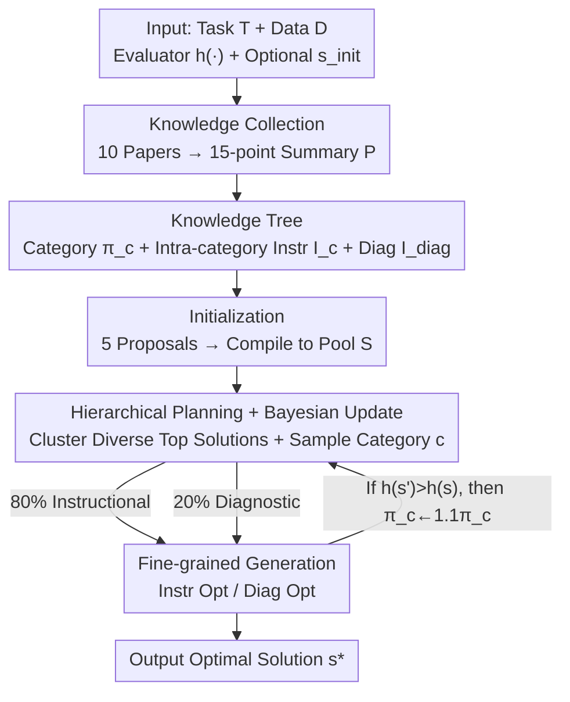

# TusoAI: Agentic Optimization for Scientific Methods

**Conference**: ICLR 2026  
**OpenReview**: [https://openreview.net/forum?id=0M6BfcAVMW](https://openreview.net/forum?id=0M6BfcAVMW)  
**Code**: https://github.com/Alistair-Turcan/TusoAI  
**Area**: Agent / Scientific Discovery / AutoML  
**Keywords**: Scientific Method Optimization, LLM Agent, Knowledge Tree, Bayesian Sampling, Single-cell Analysis

## TL;DR
TusoAI is an agent specifically designed for "scientific computing method development." Given a task description, data, and an evaluation function $h(\cdot)$, it organizes domain knowledge into a knowledge tree and utilizes hierarchical planning with Bayesian updates combined with diagnostic fine-grained optimization to iteratively improve solutions within a candidate pool. TusoAI consistently outperforms expert methods, MLE agents, and general scientific agents across 11 scientific tasks. Furthermore, it improved SOTA methods on two genetics challenges and discovered new biological insights missed by previous methods.

## Background & Motivation
**Background**: Scientific discovery is frequently bottlenecked by the manual development of computational tools for experimental data analysis. Scientists must iteratively review literature, test modeling hypotheses with empirical data, and implement insights into efficient code—a process that often takes multiple expert groups several years to develop a robust method. While LLMs have demonstrated capabilities in literature review, data reasoning, and domain-specific code generation, existing systems fall into two categories: "scientific analysis agents" (e.g., Biomni, Stella, ChemCrow), which excel at assembling analysis pipelines using **existing tools**, and "machine learning engineering (MLE) agents" (e.g., AIDE, DS-Agent, MLE-STAR), which can **design new algorithms** for general ML tasks.

**Limitations of Prior Work**: Neither category is fully suited for "scientific method development." Scientific analysis agents do not create new algorithms but merely call existing tools. Although MLE agents can create new algorithms, they assume that knowledge is structured, existing ML models are reusable, and the search space is fixed—assumptions that typically do not hold in scientific research. Domain knowledge in science is highly **unstructured** (scattered across papers), ready-made models often **do not exist**, and optimization targets and search spaces **evolve continuously** throughout the research process. Traditional AutoML/NAS systems are constrained by pre-defined search spaces and cannot effectively incorporate domain priors.

**Key Challenge**: Method development requires both **exploration diversity** (to avoid getting stuck in local optima with superficial tweaks) and **solution quality** (to avoid wasting computational budget on blind trials). Simultaneously, it must integrate unstructured domain knowledge into every optimization step rather than relying solely on the LLM's parametric priors.

**Goal**: To develop an agent capable of autonomously developing and optimizing scientific computing methods by integrating structured domain knowledge, systematic hypothesis exploration, and iterative diagnostics into a single optimization loop.

**Key Insight**: The system mimics the cycle scientists use for method development: reading literature to establish priors, attempting different optimization strategies by category, and refining methods based on intermediate output diagnostics. A critical observation is that explicitly organizing domain knowledge into a tree of "categories + intra-category instructions" allows for both diversity (sampling by category) and relevance (instructions derived from papers), while Bayesian updates can learn the belief of "which category is more useful at this moment."

**Core Idea**: By employing a "Knowledge Tree + Bayesian Hierarchical Planning + Diagnostic Fine-grained Optimization" triad, the agent integrates domain-knowledge-driven iterative optimization, allowing it to continuously refine new methods by modifying only **a single function** within a large codebase.

## Method

### Overall Architecture
TusoAI formalizes the problem as finding a solution $s^*$ in the general solution space $S_{full}$ (e.g., all Python scripts) that maximizes the evaluation function: $s^* = \arg\max_{s} h(s)$, where $h(\cdot)$ can be AUC, a mean of multiple metrics, or a domain-specific measure (such as enrichment of inferred disease genes relative to an expert set). Inputs include a task description $T$, dataset $D$, evaluator $h(\cdot)$, and an optional initial solution $s_{init}$ (warm start, such as an existing SOTA method). Because it **operates on only a single function within an arbitrarily large codebase**, it can flexibly transform scientific methods that include extensive scaffolding.

The process consists of three major steps: **Step 1: Domain Knowledge Collection**—retrieving up to 10 relevant papers from Semantic Scholar by citation count and generating a refined 15-point technical summary $P=\{P_i\}$ for each, ensuring subsequent instructions reflect domain best practices rather than pure LLM priors. **Step 2: Knowledge Tree Construction**—using a "draft-then-refine" approach to create a two-layer structure: optimization strategy **categories** $\mathcal{C}$ (each with a utility probability $\pi_c$) and **intra-category instructions** $I_c$, plus a predefined diagnostic category $I_{diag}$. **Step 3: Iterative Optimization**—initializing a candidate solution pool $S$, then repeatedly selecting diverse top solutions within a time budget (default 8 hours). For each solution, there is an 80% probability of instructional optimization and a 20% probability of diagnostic optimization, with Bayesian updates adjusting category probabilities and a feedback list suppressing redundancy.

### Key Designs

**1. Knowledge Tree: Organizing Unstructured Knowledge into "Categories + Intra-category Instructions"**

Scientific domain knowledge is scattered and varied. Generic LLM instructions like "optimize this model" lack direction and lead to repetition. TusoAI addresses this with the Knowledge Tree. The first layer consists of **optimization strategy categories** $\mathcal{C}$, which can be general (e.g., "regularization," "architecture") or domain-specific (e.g., "single-cell noise modeling," "genetic feature interaction"). Each category has a utility probability $\pi_c$; initially, categories earlier in the pipeline (e.g., "feature preprocessing") are weighted higher. The second layer contains **intra-category instructions** $I_c$: an agent $A_{instr}$ drafts 10 items from the task description, then refines them with 10 additional items from each paper summary $P_i$. Each category also maintains a feedback list $F_c$ to accumulate summaries of previous changes and their effects. A predefined diagnostic category $I_{diag}$ provides instructions for "logging training curves / checking distributions / verifying hypotheses." This ensures knowledge is structured yet samplable, maintaining both diversity (across categories) and relevance (derived from real papers).

**2. Hierarchical Planning + Bayesian Update: Proactive Exploration of Diverse Solutions**

Agents often get trapped in "superficial tweaks" near local optima. TusoAI employs a two-layer strategy. First is **diverse top solution selection**: the current solution pool is clustered by code-text similarity. Within each cluster, the **shortest** solution among the top 0.1% performers is selected to mitigate overfitting and encourage conciseness while preserving cluster-level diversity. Second is **Bayesian category sampling**: in each round, a category is sampled as $c \sim \mathrm{Cat}(\{\pi_c\}_{c\in\mathcal{C}})$. If the optimization improves performance ($h(s') > h(s)$), a Bayesian update $\pi_c \leftarrow 1.1\,\pi_c$ (followed by normalization) is performed, increasing the belief that this category contains useful instructions. This transforms the importance of strategies from static priors into an adaptive distribution. The planning layer also narrows its parallel width over time ($N_{top}\leftarrow\max(1, N_{top}-1)$ every 2 rounds) to focus on refinement. Ablations show that removing Bayesian sampling significantly reduces efficiency (optimization time increased from 2.3h to 3.0h).

**3. Fine-grained Generation: Integrating Instructional and Diagnostic Optimization**

Understanding complex data patterns requires more than just following instructions; it requires **diagnosing intermediate outputs**, much like a human scientist. TusoAI chooses between two paths for each top solution: **Instructional Optimization (80%)**—samples a category $c$, selects the most promising of 3 candidate instructions from $I_c$, and optimizes $s$ into $s'$ using recent feedback in $F_c$. A feedback agent $A_{feedback}$ then records the change (e.g., "built kNN on top 50 PCs instead of all genes, speed increased but performance dropped"). **Diagnostic Optimization (20%)**—selects a diagnostic instruction from $I_{diag}$, runs $s$ to collect diagnostic logs (training curves, distribution checks), and produces an improved solution $s'$ based on these logs. Each implementation attempt is limited to 10 minutes and 2 bug-fix cycles to prevent inefficient implementations from exhausting the budget. These two paths, combined with the knowledge tree, allow the agent to both "modify by strategy" and "modify by evidence."

### A Complete Example
In a single-cell **denoising** task, TusoAI started from scratch and successfully performed five key modifications to reach peak performance: (1) introduction of Non-negative Matrix Factorization (NMF), (2) modeling dropout rates, (3) modeling Poisson noise, (4) adding iterative refinement, and (5) adding a sparsity balancing step. Notably, it generated many **lower-performance intermediate solutions** before converging—this "broad exploration + feedback memory" allowed it to search the solution space effectively. The final NMF-based solution was distinct from existing methods like ALRA, representing a **newly designed method rather than a simple tool call**.

## Key Experimental Results

### Main Results
Evaluation spanned 11 scientific tasks: 6 single-cell analysis tasks (Denoise, Label projection, Batch integration, SVG, Deconvolution, Visualization) + 5 scientific deep learning tasks (Spherical vision, NinaPro prosthesis control, ECG diagnosis, Satellite monitoring, DeepSEA gene prediction). Each task ran for 8 hours.

| Single-cell Tasks | Avg | Avg Rank | Description |
|--------|------|----------|------|
| Expert | 0.57 | 3.7 | Top-tier human-designed methods |
| AIDE* (MLE agent) | 0.52 | 3.0 | Second-best average rank |
| Biomni* | 0.49 | 3.7 | Science analysis agent |
| ChatGPT-Agent* | 0.57 | 3.5 | GPT-5 backend |
| **TusoAI*** | **0.66** | **1.2** | Code generated from scratch, leading overall |

On the 5 scientific deep learning tasks, TusoAI achieved an average score of 0.70 and an average rank of 2.8 (second best was 4.0), performing comparably to or better than expert methods (0.69) and DARTS (0.71). All generated methods were computationally efficient.

### Ablation Study

| Configuration | Avg | Avg Rank | Description |
|------|------|---------|------|
| TusoAI (default) | 0.66 | 2.0 | Full model |
| No categories | 0.57 | 3.2 | No category structure, all instructions in one set |
| No Bayesian | 0.55 | 3.4 | Uniform category sampling |
| No diagnosis | 0.64 | 2.0 | Diagnostic optimization disabled |
| No knowledge | 0.46 | 3.8 | No domain knowledge, generic instructions only |

### Key Findings
- **Domain knowledge is the primary contributor**: Removing domain knowledge (No knowledge) caused the most significant performance drop (0.66→0.46) and decreased code diversity from 0.48 to 0.33.
- **Bayesian updates drive efficiency**: Without them, the average rank dropped most and optimization time rose from 2.3h to 3.0h, proving that adaptive sampling accelerates convergence.
- **Diversity as a mediator**: TusoAI maintained significantly higher code diversity than AIDE. While AIDE repeatedly proposed minor variants, TusoAI explored distinct algorithms.
- **Smaller models are sufficient and cost-effective**: Low-latency models like GPT-4o-mini and Claude-3.5-Haiku performed as well as or better than GPT-5, which tended to "over-engineer" methods (300+ lines), making them harder to refine. Over 8 hours, GPT-4o-mini cost \$0.24 compared to \$22.3 for GPT-5.
- **Impact in real-world genetics**: In optimizing scDRS, causal simulation power increased by >40% and discovered 21% more associations (17 vs 14) in 24 hours (budget \$0.37). In optimizing pgBoost, enrichment improved by up to 13.8%, discovering 7 new variant-gene links missed by original methods.

## Highlights & Insights
- **Single-function modification**: By operating only on a specific function, TusoAI can be integrated into massive real-world codebases like scDRS or pgBoost, which are too large for agents to rewrite entirely.
- **Decoupling diversity and relevance**: Categories ensure exploration in different directions, while paper-derived instructions ensure those directions are sound. Bayesian updates then learn which direction is currently effective.
- **Simulating scientific intuition with diagnostic loops**: The 80/20 mix of instructional and diagnostic optimization encodes the dual nature of research—following literature and reacting to data.
- **"Worse" intermediate solutions as a feature**: The trajectory of denoising shows that non-monotonic performance is the price of broad exploration, which ultimately leads to better convergence.

## Limitations & Future Work
- **Reliance on the evaluation function $h(\cdot)$**: Optimization follows $h$ exclusively. If the metric is biased or unreliable (common in science), the agent may optimize in the wrong direction.
- **Budget assumptions**: The 10-minute implementation limit and 8-hour total budget are empirical. Their suitability for long-training deep learning tasks requires further analysis.
- **Comparability caveats**: Difficulty varies across tasks; an average rank of 1.2 in single-cell is not directly comparable to 2.8 in deep learning.
- **Concurrent work**: Comparison with some concurrent agents (e.g., Aygün et al., 2025) is difficult due to the lack of open-source code.
- **Future directions**: Incorporating evaluation uncertainty into Bayesian updates (using confidence intervals for $\pi_c$) and allowing the knowledge tree to expand online could improve robustness.

## Related Work & Insights
- **vs AIDE (MLE agent)**: AIDE treats ML engineering as code optimization and tree search, favoring incremental changes. TusoAI uses a knowledge tree and Bayesian sampling to actively maintain diversity, resulting in higher performance on non-standard scientific tasks.
- **vs Biomni / ChatGPT-Agent**: These agents assemble pipelines from existing tools. TusoAI is distinct because it **creates** new computational algorithms.
- **vs MLE-STAR / DS-Agent**: These rely on retrieving candidate models from the web and assuming a fixed search space. TusoAI addresses scientific scenarios where models don't exist and knowledge is unstructured.
- **vs Traditional AutoML / NAS**: These are limited by predefined search spaces. TusoAI combines principled optimization targets with heuristic search driven by LLMs to handle evolving research scenarios.

## Rating
- Novelty: ⭐⭐⭐⭐⭐ The triad of Knowledge Tree, Bayesian Planning, and Diagnostic Optimization is specifically tailored for method development; "single-function" modification allows real-world integration.
- Experimental Thoroughness: ⭐⭐⭐⭐⭐ Comprehensive coverage across 11 tasks, 4 ablations, multiple backends, and 2 real-world genetics case studies with new biological findings.
- Writing Quality: ⭐⭐⭐⭐ Formalization and pseudocode are clear, though many details are deferred to the appendix.
- Value: ⭐⭐⭐⭐⭐ Demonstrated tangible potential by improving SOTA genetics methods and producing interpretable new discoveries.

<!-- RELATED:START -->

## Related Papers

- [\[ICLR 2026\] SR-Scientist: Scientific Equation Discovery With Agentic AI](sr-scientist_scientific_equation_discovery_with_agentic_ai.md)
- [\[ICLR 2026\] AutoFigure: Generating and Refining Publication-Ready Scientific Illustrations](autofigure_generating_and_refining_publication-ready_scientific_illustrations.md)
- [\[ICLR 2026\] Towards Multimodal Data-Driven Scientific Discovery Powered by LLM Agents](towards_multimodal_data-driven_scientific_discovery_powered_by_llm_agents.md)
- [\[ICLR 2026\] NewtonBench: Benchmarking Generalizable Scientific Law Discovery in LLM Agents](newtonbench_benchmarking_generalizable_scientific_law_discovery_in_llm_agents.md)
- [\[ACL 2026\] BAPO: Boundary-Aware Policy Optimization for Reliable Agentic Search](../../ACL2026/llm_agent/bapo_boundary-aware_policy_optimization_for_reliable_agentic_search.md)

<!-- RELATED:END -->
