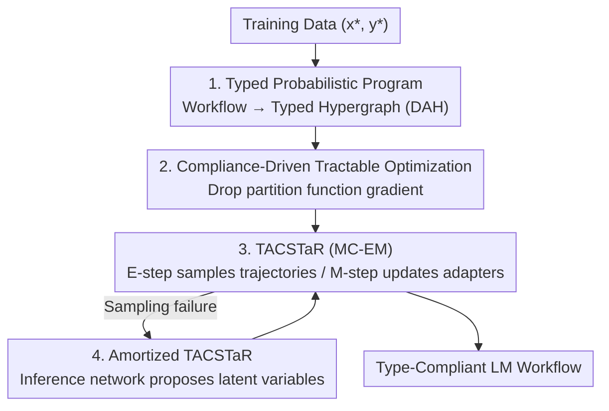

# Type-Compliant Adaptation Cascades: Adapting Programmatic LM Workflows to Data

**Conference**: ICLR 2026  
**OpenReview**: [https://openreview.net/forum?id=aJmXct3igl](https://openreview.net/forum?id=aJmXct3igl)  
**Area**: Agent / LLM Workflows  
**Keywords**: Typed Probabilistic Programs, LM Workflow Adaptation, PEFT, MC-EM, Unnormalized Likelihood

## TL;DR
This paper recasts workflows composed of multiple LLM calls and deterministic logic as "typed unnormalized probabilistic programs." By using lightweight PEFT adapters as learnable parameters and a TACSTaR (MC-EM) training algorithm—proven unbiased even when dropping the partition function gradient—the entire pipeline can be trained end-to-end via gradients. This approach significantly outperforms discrete prompt optimization baselines like DSPy on structured reasoning tasks such as FinQA and MGSM-SymPy.

## Background & Motivation
**Background**: Connecting LLMs into multi-step workflows or agentic systems (e.g., DSPy, LangChain, ReAct) has become the mainstream approach for building complex reasoning systems. These pipelines rely on chaining model calls and inserting deterministic logic to achieve multi-step reasoning and external interaction.

**Limitations of Prior Work**: The dominant paradigm for adapting these systems is "optimizing discrete prompts within the pipeline," which is notoriously brittle. Optimization degenerates into a difficult discrete search problem over heuristics, making it expensive and hard to scale. Crucially, it fails to provide formal guarantees for "format/type compliance" required in structured tasks—prompt optimization can only "hope" the model outputs valid SymPy expressions or JSON.

**Key Challenge**: The root cause is treating the workflow as a "black-box system with fixed parameters where only inputs (prompts) are adjustable." This leaves the only optimization knob as prompt text (discrete, non-differentiable), while the model weights that determine behavior remain frozen. Furthermore, the pipeline lacks formal constraints ensuring that intermediate products are valid objects of a specific type.

**Goal**: (1) Enable end-to-end, gradient-based training of entire workflows instead of relying on discrete prompt search; (2) Integrate "type compliance" as a first-class citizen in the framework to strictly enforce format constraints in structured tasks.

**Key Insight**: The authors propose a perspective shift—rather than optimizing prompts fed into a fixed system, optimize the "program parameters themselves." By viewing the workflow as a parameterized probabilistic program with latent variables, each step becomes a probabilistic transformation supported by a PEFT adapter, with types acting as hard support constraints. Adaptation thus transforms from ad-hoc discrete search into clean gradient optimization aimed at maximizing data likelihood.

**Core Idea**: Formalize "typed LM workflows" as unnormalized probabilistic programs (limiting the support of each transformation via type contracts). The authors prove that the bias introduced by "directly optimizing unnormalized likelihood while ignoring the partition function gradient" vanishes as the model learns type compliance, resulting in a tractable training paradigm called TAC with theoretical guarantees.

## Method

### Overall Architecture
TAC (Type-Compliant Adaptation Cascade) can be summarized as follows: it represents the workflow—from "input problem → a series of typed intermediate products → final answer"—as a **Directed Acyclic Hypergraph (DAH)**. In this graph, nodes are "typed data containers" and edges are "transformations." Transformations are either learnable LM adapters (PEFT/LoRA) or fixed deterministic functions (e.g., Python scripts). The entire graph is treated as an **unnormalized joint distribution** over all node values, trained using the TACSTaR algorithm (MC-EM).

Using the example in the paper (Figure 1b): English math problem $Q_{en}$ (input node) → LM adapter generates step-by-step reasoning $R$ → another adapter converts reasoning into a formal arithmetic expression $E$ → deterministic SymPy function computes answer $A$ (output node). Intermediate nodes like $R$ and $E$ are unobserved in the labeled data (latent variables), which constitutes the primary training challenge.

The pipeline operates in four steps: first, construct the workflow as a typed probabilistic program (Design 1). To make this unnormalized model trainable, define a tractable optimization objective by "dropping the partition function gradient" with theoretical guarantees (Design 2). Use TACSTaR's alternating E/M steps to optimize it—the E-step samples valid execution trajectories, and the M-step updates adapters (Design 3). When naive sampling fails to hit valid trajectories, use an amortized inference network to propose better latent variables (Design 4).

### Key Designs

**1. Modeling workflows as "Typed Unnormalized Probabilistic Programs"**

To address the issue of workflows being treated as fixed black boxes without structural guarantees, TAC formalizes workflows as a Directed Acyclic Hypergraph $C=(Z,E)$. Nodes $z_m$ are data containers with type $\tau \in \mathcal{T}$, storing string representations of objects. Hyperedges $e_k$ map source nodes to target nodes and are of two types: **LM adapter edges** (stochastic transformations via PEFT) and **deterministic algorithm edges** (fixed functions). Crucially, types are implemented as hard support constraints: an LM adapter defines an unnormalized distribution $\tilde p(y \mid x; \theta) = p_{\text{LM}}(y \mid x; \theta) \, \mathbb{I}(z_t \in \text{valid}(\tau_o))$. Probability mass is non-zero only if the output string is a valid object of type $\tau_o$. Because the model might assign probability to invalid strings, the total mass is $\le 1$, making the distribution **unnormalized**. Bridging between strings and typed objects is achieved via `parse` (verifying/converting strings to type objects) and `canon` (converting objects to unique canonical strings, where `parse(canon(o), \tau) = o`). This is implemented using Langfun/Pydantic/PyGlove, supporting base, composite, and recursive types. This allows the graph to function both as a "program" for forward execution and a "distribution" where the score of a trajectory is the sum of conditional log-probabilities: $\log \tilde p_\theta(Z^*) = \sum_k \log \tilde p_\theta(\{z_t^*\}_{t \in T_k} \mid \{z_s^*\}_{s \in S_k}; e_k)$.

**2. Compliance-Driven Tractable Optimization: Dropping Partition Function Gradients**

In unnormalized models, standard MLE requires the gradient of the partition function $Z_\theta = \sum_{Z'} \tilde p_\theta(Z')$, which is typically intractable and high-variance. The authors propose optimizing the unnormalized log-likelihood $L'(\theta) = \log \tilde p_\theta(Z^*)$ directly. While this identifies a potential bias, it can be rewritten as $L'(\theta) = L(\theta) + \log Z_\theta$. Thus, optimizing $L'$ is equivalent to **simultaneously** maximizing the normalized likelihood $L(\theta)$ and the model's type compliance, as $\log Z_\theta$ is maximized at $0$ when all mass falls on valid outputs ($Z_\theta \to 1$). Theoretically, Theorem 1 states that under well-specified assumptions, the unnormalized MLE solution equals the true MLE solution $\theta^*$. Theorem 2 provides a bias bound: if $\|\nabla_\theta p_{\text{LM}}\|$ is bounded by $G$, then $\nabla_\theta \log Z_\theta \le 2G(1 - Z_\theta)$. The **bias is bounded by the degree of type violation $(1 - Z_\theta)$**. As the model becomes more compliant, the bias vanishes.

**3. TACSTaR: Extending STaR to Typed Workflow Training via MC-EM**

Since intermediate nodes are typically latent, the authors use Monte Carlo EM and extend the Self-Taught Reasoner (STaR) into the TACSTaR algorithm. The **E-step** samples complete valid trajectories $Z^*$ consistent with training data. It first attempts a standard forward pass; if it fails, it utilizes a "rationalization fallback." This fallback TAC conditions on the correct answer $(x^*, y^*)$ to sample intermediate variables (similar to inverse rendering), guiding the generation of latent trajectories self-consistent with the ground truth. The **M-step** maximizes the unnormalized likelihood $L'(\theta)$ using these samples to update adapter parameters. An engineering advantage is that the gradient $\nabla_\theta \log \tilde p_\theta(Z^*) = \sum_k \nabla_\theta \log \tilde p_\theta(\cdot; e_k)$ is linearly decomposable over hyperedges, making the M-step "embarrassingly parallel" across multiple GPUs.

**4. Amortized TACSTaR: Replacing Heuristics with Inference Networks**

The basic TACSTaR relies on a fixed fallback heuristic in the E-step, which can be inefficient for complex tasks. Amortized TACSTaR parameterizes this heuristic by training an inference network TAC $C'$. The inference network's nodes match $C$, but its input represents the pair $(x^*, y^*)$. $C'$ is trained to approximate the true posterior $p_\theta(z_m \mid z_1, z_2)$ of $C$ given $(x^*, y^*)$. By minimizing the KL divergence between the inference network $q_\phi$ and the approximated posterior $\hat p$ (via self-normalized importance sampling), the system learns how to "guess" intermediate steps, providing task-adaptive proposals that improve training stability and efficiency.

### Loss & Training
The objective is the tractable unnormalized log-likelihood $L'(\theta) = \log \tilde p_\theta(Z^*)$, optimized via TACSTaR's MC-EM. Adapters use **Rank-1 LoRA** added to attention weights. The parameter count is extremely low (approx. 570k for gemma-1.1-7b-it, 1.41M for gemma-2-27b-it). LoRAs are initialized with zero-init. `parse`/`canon` operations are managed by Langfun.

## Key Experimental Results

### Main Results
On reasoning-heavy tasks (MGSM, MGSM-SymPy, FinQA, MuSR), TAC was compared against DSPy (using MIPROv2 / BootstrapFewShot and XGrammar for constrained decoding) as a strong baseline across three model families. TAC consistently outperformed the baseline, with the largest gains observed on smaller models and highly structured tasks.

| Task | Model | DSPy | TAC | Gain |
|------|------|------|-----|------|
| FinQA | Qwen3-8B | 12.0% | 24.7% | +12.7 |
| FinQA | gemma-2-27b-it | 12.7% | 34.0% | +21.3 |
| FinQA | gemma-1.1-7b-it | 0.7% | 9.7% | +9.0 |
| MGSM-SymPy | gemma-2-27b-it | 57.1% | 75.9% | +18.8 |
| MGSM | gemma-1.1-7b-it | 1.6% | 27.3% | +25.7 |
| MuSR | gemma-1.1-7b-it | 36.5% | 62.6% | +26.1 |

On MGSM, TAC also outperformed untyped STaR (e.g., 27.3% vs. 10.5% for gemma-1.1-7b-it), proving that the "typed structure" itself provides significant benefits.

### Ablation Study

| Configuration | Task | Standard TACSTaR | Amortized TACSTaR | Note |
|------|------|--------------|----------------|------|
| Amortized Inference | MGSM | 82.2 | 82.4 | Negligible difference |
| Amortized Inference | FinQA | 36.0 | 41.7 | +5.7, highest gain on complex tasks |
| Amortized Inference | HotPotQA | 32.0 | 34.0 | +2.0 |

| Inference Mode (MuSR) | Renormalized Classification (Cla.) | Unconstrained Generation (Gen.) |
|------|------|------|
| gemma-1.1-7b-it | 62.6 | 62.1 |
| gemma-2-27b-it | 65.0 | 51.6 |

**Type Compliance Speed** (MGSM, gemma-1.1-7b-it): The data parsing failure rate dropped from 83.0% (Epoch 1) to 1.0% (Epoch 2), reaching 0.4% by Epoch 4.

### Key Findings
- **Stricter structures and smaller models favor TAC**: Massive gains were observed on FinQA and MGSM-SymPy.
- **Amortized inference is valuable for difficult tasks**: It provides mission-critical adaptive proposals when valid latent trajectories are hard to sample.
- **Type compliance is achieved rapidly**: The estimated compliant mass $Z_\theta$ quickly approaches 1, validating the theoretical claim that bias vanishes during training.
- **No label leakage**: Langfun's validation only checks against type definitions, not ground truth labels. The performance gap between adapted and unadapted models indicates the model genuinely learns reasoning.

## Highlights & Insights
- **"Dropping the intractable term" equals "encouraging compliance"**: The rewriting of $L'(\theta) = L(\theta) + \log Z_\theta$ is the most elegant part of the paper—a necessary engineering simplification is theoretically justified as optimizing for structure.
- **Types as Hard Support Constraints**: By embedding the indicator function $\mathbb{I}(z \in \text{valid}(\tau))$ into the density, structural compliance is no longer a "request" made to the model via prompts but a fundamental constraint of the model's distribution.
- **Flexibility of Training/Inference Decoupling**: Being a probabilistic framework, TAC allows for rationalization fallbacks during training, amortized inference networks, and renormalized posterior selection for classification—all within a single framework.

## Limitations & Future Work
- **Well-specified Assumption**: Theorems 1 and 2 rely on the assumption that the model family can perfectly model the compliant output space; this may only be an asymptotic property for small models.
- **Infrastructure Dependency**: The system relies heavily on `parse`/`canon` via Langfun/Pydantic/PyGlove. The reliability of custom complex types (e.g., those requiring an external LLM for semantic coherence) remains an open question.
- **Experimental Scope**: Evaluations were conducted on dataset subsets with Rank-1 LoRA. Scaling to long-horizon agentic workflows (multi-turn tool use, long-term interaction) is yet to be explored.
- **Future Directions**: Improving sampling hit rates for deeper hypergraphs and exploring the stability of amortized inference networks combined with Reinforcement Learning.

## Related Work & Insights
- **vs. DSPy (Prompt Optimization)**: DSPy optimizes discrete prompts in a fixed system; TAC optimizes program parameters (PEFT weights) via gradients. TAC is more token-efficient and superior for structured tasks.
- **vs. Original STaR**: STaR is single-step and untyped; TACSTaR generalizes it to multi-step typed workflows using MC-EM with rationalized fallbacks.
- **vs. LM Cascades (Dohan et al., 2022)**: Both view LLM chains as unnormalized distributions, but TAC is specifically designed for end-to-end adaptation, treating the cascade as a trainable object rather than just an inference mechanism.

## Rating
- Novelty: ⭐⭐⭐⭐⭐ Casting workflows as typed unnormalized probabilistic programs with vanishing bias is both novel and theoretically grounded.
- Experimental Thoroughness: ⭐⭐⭐⭐ Covers various tasks and models with deep analysis, though limited to dataset subsets and Rank-1 LoRA.
- Writing Quality: ⭐⭐⭐⭐ Clear formalization and consistent running examples, though theoretical sections may be dense for some readers.
- Value: ⭐⭐⭐⭐⭐ Provides a robust training paradigm for compliant LLM systems, highly relevant for structured agentic workflows.

<!-- RELATED:START -->

## Related Papers

- [\[ICLR 2026\] Test-Time Adaptation for LLM Agents via Environment Interaction](test-time_adaptation_for_llm_agents_via_environment_interaction.md)
- [\[ICLR 2026\] Mix-ECom: Towards Mixed-Type E-Commerce Dialogues with Complex Domain Rules](mix-ecom_towards_mixed-type_e-commerce_dialogues_with_complex_domain_rules.md)
- [\[ICLR 2026\] FlowSearcher: Synthesizing Memory-Guided Agentic Workflows for Web Information Seeking](flowsearcher_synthesizing_memory-guided_agentic_workflows_for_web_information_se.md)
- [\[ACL 2026\] SynthAgent: Adapting Web Agents with Synthetic Supervision](../../ACL2026/llm_agent/synthagent_adapting_web_agents_with_synthetic_supervision.md)
- [\[ICLR 2026\] Open Data Synthesis for Deep Research](open_data_synthesis_for_deep_research.md)

<!-- RELATED:END -->
