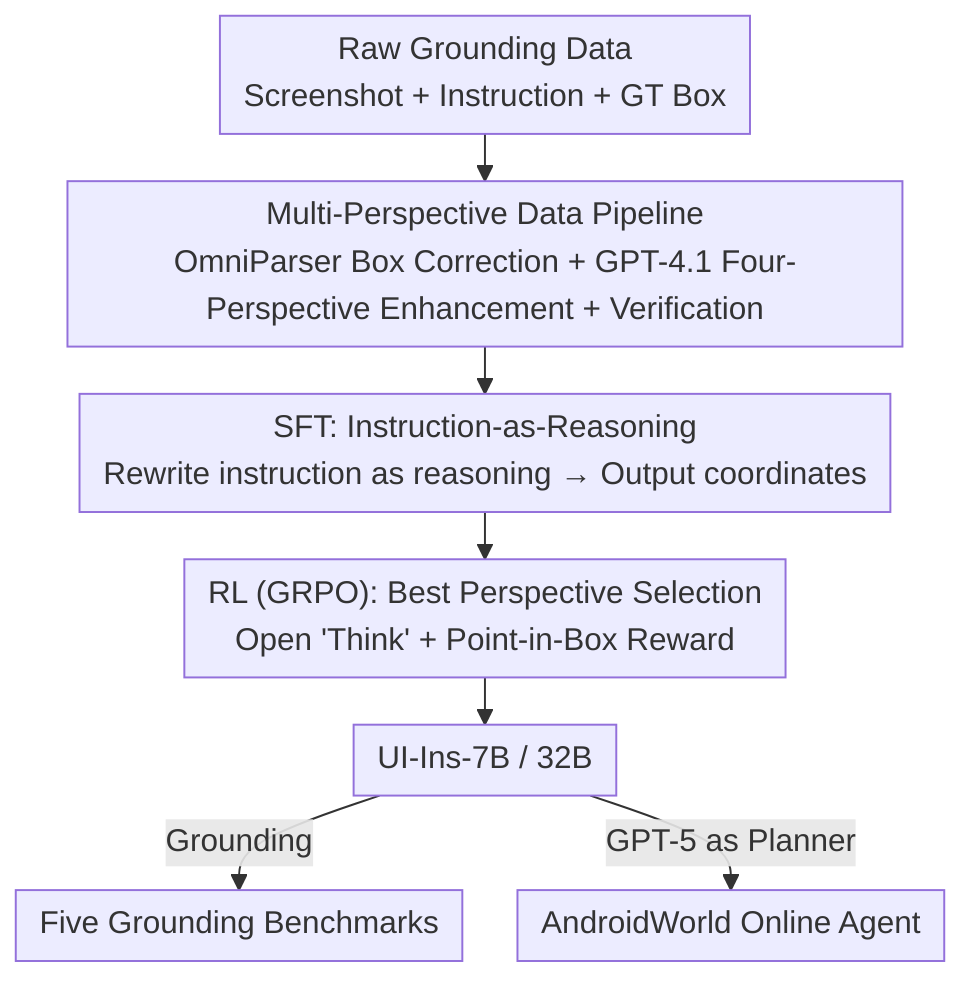

# UI-Ins: Enhancing GUI Grounding with Multi-Perspective Instruction-as-Reasoning

**Conference**: ICLR 2026  
**OpenReview**: [https://openreview.net/forum?id=dsQHm7YX9c](https://openreview.net/forum?id=dsQHm7YX9c)  
**Code**: Yes (The paper states that all code and models are released)  
**Area**: Agent / Multimodal VLM  
**Keywords**: GUI grounding, Multi-perspective instructions, Instruction-as-Reasoning, SFT+GRPO, Data cleaning

## TL;DR
This paper upgrades "natural language instructions" from passive inputs to active reasoning paths (Instruction-as-Reasoning). It uses a data pipeline to clean noisy annotations and expand each instruction into four perspectives: appearance, function, location, and intent. Subsequently, SFT is employed to teach the model to treat "rewriting instructions into a specific perspective" as explicit reasoning, followed by GRPO to enable the model to autonomously select or combine the most effective perspectives. The resulting UI-Ins-7B/32B achieves SOTA on five GUI grounding benchmarks (UI-I2E-Bench 87.3%, ScreenSpot-Pro 57.0%) and attains a 74.1% success rate on the AndroidWorld online agent.

## Background & Motivation
**Background**: GUI grounding is a core capability of GUI agents. Given a screenshot $S$ and a natural language instruction $I$, the model $f$ outputs the coordinates $p=(x_p,y_p)$ of the target actionable element. Mainstream approaches treat the instruction as a static input string, focusing on improving visual encoding, coordinate regression, or reward design, while "the instruction itself" remains largely unoptimized as a variable.

**Limitations of Prior Work**: The authors identify two long-neglected issues. The first is **instruction quality**: manual inspection of 1,909 samples from OS-Atlas, AMEX, and Widget Captioning revealed that 23.3% of instructions have substantive defects, such as "ambiguity" (one instruction matching multiple elements) or "mismatch" (no corresponding element in the interface). Training on such "dirty" data degrades downstream accuracy. The second is **instruction diversity**: existing models are mostly trained as mappings from a "single fixed-style instruction → action," lacking multi-perspective reasoning capabilities.

**Key Challenge**: Humans flexibly switch perspectives when describing the same target. To close a window, one might say "click the red X" (appearance), "close the file manager" (function), "that button in the top right" (location), or "get rid of this interface" (intent), **strategically choosing the most effective one** for the context. Conversely, models are often locked into a single style, losing this flexibility. Controlled experiments on ScreenSpot-Pro showed that rewriting original instructions into four perspectives and testing Qwen2.5-VL-7B zero-shot led to appearance, function, and intent perspectives significantly outperforming the original. The ideal upper bound (Combined, selecting the best perspective for each sample) yielded a **76% relative improvement** over the original instructions, indicating significant untapped potential within the model.

**Goal**: ① Clean instruction data to establish a reliable training foundation; ② Enable models to use multi-perspective instructions as reasoning paths and dynamically select the optimal perspective during inference.

**Key Insight & Core Idea**: Different instruction types are not just "synonymous rewritings" but represent different analytical angles for identifying the same UI element. Thus, instructions are redefined from "static inputs" to "dynamic reasoning paths"—the **Instruction-as-Reasoning** paradigm. The model must not only understand the command but also proactively select the most effective reasoning process to infer user intent. This is implemented via a two-stage SFT+GRPO training process: SFT teaches "explicit reasoning via multi-perspective instructions," and RL incentivizes "selecting/synthesizing the optimal perspective for each scenario."

## Method

### Overall Architecture
The approach follows two main tracks: a **data pipeline** to clean existing grounding data and expand it into a multi-perspective corpus, followed by **Instruction-as-Reasoning two-stage training** to feed this corpus into the model. The data pipeline uses OmniParser V2 to detect interface elements and IoU to correct or filter original GT boxes and mismatched instructions. GPT-4.1 then generates four-perspective instructions (appearance, function, location, intent) for the target element and performs consistency checks. In the training phase, SFT requires the model to output a "rewritten instruction of a specific perspective" as explicit reasoning before the coordinates. In the RL stage, GRPO changes reasoning to an open "think-then-act" format, using a point-in-box reward to incentivize the model to select/combine optimal perspectives. The final products, UI-Ins-7B/32B, can perform grounding directly or act as executors under a GPT-5 planner for online agents.

### Key Designs

**1. Multi-Perspective Data Pipeline: Clean and Expand via Four Perspectives**

To address the 23.3% defective instructions and single-perspective training data, the pipeline consists of two steps. The preprocessing stage uses OmniParser V2 to detect all UI elements and corrects or filters the original GT boxes using a simple IoU method. This binds a reliable spatial anchor to each instruction and filters out mismatched or ambiguous instructions, reducing the defect rate from 23.3% to below 8% (a manual check of 1,542 samples showed 93.5% exact matches). The enhancement stage uses highlighted screenshots as input, prompting GPT-4.1 to generate high-quality rewritings from four analytical perspectives: appearance, function, location, and intent. To suppress LLM hallucination and ensure strict one-to-one mapping, each generated instruction undergoes a second GPT-4.1 verification. This transforms instructions from "fixed inputs" into a corpus of "selectable analytical perspectives."

**2. SFT Stage: Rewriting Instructions as Explicit Reasoning Chains**

The goal of SFT is to instill multi-perspective reasoning capabilities. The model is trained to generate an intermediate reasoning text—a rewritten instruction from a specific perspective (e.g., "Analyzing from an appearance perspective... I will click the icon that looks like a picture")—before outputting the final coordinates. The training objective maximizes the log-likelihood of the target sequence across the dataset:

$$\max_{\theta}\sum_{(S,I,Y_{gt})\in D}\log P(Y_{gt}\mid S,I;\theta),\quad Y_{gt}=R_{gt}\oplus p_{gt}$$

where $\oplus$ represents sequence concatenation, $R_{gt}$ is a rewritten instruction **randomly sampled** from the sample's valid perspectives, and $p_{gt}$ is the GT coordinate. This unified objective optimizes both Reasoning Generation and Grounded Prediction. Compared to direct coordinate regression, this explicitly incorporates "switching perspective thinking" into the output format, laying the foundation for RL to explore diverse reasoning.

**3. RL Stage: Selecting the Optimal Perspective via GRPO**

While SFT teaches "how to reason via multiple perspectives," it does not teach "which path is better." The RL stage uses Group Relative Policy Optimization (GRPO) to address this. The prompt is changed from "listing four predefined perspectives" to an open-ended "think-then-act" format, **no longer feeding preset perspectives**, thus encouraging the model to explore a larger reasoning space (including merging perspectives or creating new ones). The reward is a point-in-box function: 1 if the predicted point falls inside the GT box, 0 otherwise. The advantages for a group of $G$ rollouts are normalized by the group mean and variance:

$$\hat{A}_{i,t}=\frac{r_i-\frac{1}{G}\sum_{i=1}^{G}r_i}{\sqrt{\frac{1}{G}\sum_{i=1}^{G}\left(r_i-\frac{1}{G}\sum_{i=1}^{G}r_i\right)^2}}$$

Optimization follows $\mathcal{L}=-\frac{1}{G}\sum_{i=1}^{G}\frac{\pi(o_i\mid I,S)}{\pi_{old}(o_i\mid I,S)}\hat{A}_{i,t}$. Through iteration, the model learns to prefer reasoning paths that stably lead to correct coordinates, forming a context-aware strategy. A highlighted benefit is that the diverse reasoning injected during SFT allows for diverse rollouts in the RL stage, **avoiding the policy collapse** (highly homogenous responses and failed exploration) common in SFT models that only use coordinates as ground truth.

## Key Experimental Results

### Main Results
Data is sourced from OS-Atlas, Omniact, Android Control, AMEX, and AgentNet (covering Windows/MacOS/Linux/Android), all cleaned via the pipeline. The backbone is Qwen2.5-VL-7B / 32B.

| Benchmark | Metric | UI-Ins-32B (Ours) | Prev. SOTA | Description/Notes |
| :--- | :--- | :--- | :--- | :--- |
| UI-I2E-Bench | Avg. | **87.3** | GTA1-32B 83.5 | Larger gain on implicit subset (+6.6%) |
| MMBench-GUI L2 | Avg. | **84.9** | GTA1-32B 83.4 | Advanced subset +24.5% vs. Qwen2.5-VL-32B |
| ScreenSpot-Pro | Avg. | **57.0** | GTA1/UI-Tars-32B 53.6 | Icon subset 30.0 |
| ScreenSpot-V2 | Avg. | **94.9** | 93.2 | Leading even near saturation |
| ShowDown | Avg. | **73.8** | 71.1 | — |

The 7B version also leads across the board: UI-I2E 81.1 / MMBench-GUI L2 83.1 / ScreenSpot-Pro 52.2 / V2 94.0 / ShowDown 73.1. A consistent trend is that **the harder the task, the greater the gain**: on MMBench-GUI L2, the advantage of UI-Ins-7B over Qwen2.5-VL-7B expanded from 134.2% in "Basic" to 159.4% in "Advanced."

Online agent: Using UI-Ins-7B as executor and GPT-5 as planner, a success rate of **74.1%** was achieved on AndroidWorld, surpassing Gemini 2.5 Computer Use (69.7) and UI-TARS-2 (73.3). This is an absolute 24.1 point increase over the Qwen2.5-VL-7B base under the same configuration.

### Ablation Study

| Configuration | MMBench-GUI L2 | UI-I2E | ScreenSpot-Pro | Description/Notes |
| :--- | :--- | :--- | :--- | :--- |
| W/o SFT & RL | 63.4 | 56.0 | 24.4 | Base model |
| RL only | 72.4 | 69.2 | 37.0 | Lacks exploration priors |
| SFT only | 76.3 | 70.1 | 37.1 | Fails to select optimal perspective |
| SFT + RL (Ours) | **83.1** | **81.1** | **52.2** | Both stages indispensable |

| Analysis | Key Comparison | Conclusion |
| :--- | :--- | :--- |
| Necessity of Reasoning | Removing reasoning and regressing coordinates directly | Performance drops significantly across all benchmarks |
| IR vs. Free-Form Reasoning (FFR) | RL with FFR: -6.4% on SS.Pro for UI-Tars-1.5; With IR: +5.1% (+9.9% on Qwen) | Unstructured FFR degrades performance; structured IR is effective |
| Mitigating Policy Collapse | Standard SFT+RL: -5.7% (Qwen), -12.7% (JEDI-7B); IR SFT+RL: +24.0% | IR SFT serves as exploratory warm-up, preventing RL collapse |
| Data Pipeline | Defect rate 23.3% → <8% | Clean data training leads to consistent improvements |

### Key Findings
- **Two-stage Complementarity**: SFT handles "multi-perspective reasoning ability," while RL handles "selecting the optimal path." Removing either stage leads to significant drops (~15 points on ScreenSpot-Pro).
- **Format Over Presence**: Free-form reasoning (FFR) is difficult to optimize in RL and can cause degradation, whereas constraining reasoning to Instruction Rewriting (IR) ensures stable performance gains—the most counter-intuitive insight of the paper.
- **Diversity as a Stabilizer**: IR-style SFT allows the model to produce diverse rollouts during RL, directly resolving the "SFT on coordinates → homogenous responses → policy collapse" issue prevalent in grounding tasks.
- **Emergent Capabilities**: Post-training, the model not only selects between the four predefined perspectives but also combines them into coherent reasoning (5,245 reasoning types across 1,477 UI-I2E samples) and creates new ones like "group affiliation" or "UI state," which were not seen during training.

## Highlights & Insights
- **Reproblematizing "Instructions"**: Unlike prior work focusing on vision or rewards, this paper targets the often-ignored input instructions. It proves that multi-perspective analysis is an untapped gold mine (76% potential gain) and identifies dirty data (23.3% defect rate) as a bottleneck.
- **The "Instruction-as-Reasoning" Paradigm**: Constraining reasoning to task reformulation from another perspective solves the difficulty of optimizing FFR in GRPO for grounding. This is transferable to tasks like query rewriting or tool selection.
- **SFT as RL Exploration Warm-up**: Injecting diversity via SFT to prevent RL collapse provides a concrete solution for SFT+RL coordination, beyond just adjusting KL coefficients.

## Limitations & Future Work
- Heavy reliance on external models: Data cleaning depends on OmniParser V2 and GPT-4.1. The cost and potential systematic biases (e.g., preference for certain descriptions) of GPT-4.1 generation are not fully discussed.
- The perspective space is predefined into four categories. Although emergent perspectives were observed, the theoretical rigor of these four categories across all GUI domains needs further validation.
- The reward is a simple 0/1 point-in-box signal. It may be insensitive to task granularity (e.g., large boxes where any point is "correct") and might overestimate precision. Online experiments rely on GPT-5 as a planner; the model's end-to-end planning capability was not isolated.
- Defect rate statistics are based on manual checks of limited samples (1,909 and 1,542), so actual metrics may vary.

## Related Work & Insights
- **vs. GTA1 / InfiGUI-G1**: While these focus on visual features or rewards, UI-Ins upgrades instructions to reasoning perspectives, widening the gap on difficult/implicit subsets.
- **vs. UI-TARS / UGround**: UI-Ins (7B) with a GPT-5 planner outperforms UI-TARS-2 on AndroidWorld, showing that grounding precision gains translate efficiently to agent performance.
- **vs. Phi-Ground**: Both identify policy collapse when using coordinate-only SFT for RL. UI-Ins solves this via IR-style SFT diversity injection rather than modifying the RL objective.

## Rating
- Novelty: ⭐⭐⭐⭐⭐ Redefining instructions as dynamic reasoning paths is a rare and innovative perspective shift.
- Experimental Thoroughness: ⭐⭐⭐⭐⭐ Comprehensive coverage across five benchmarks, online agents, and multiple ablation studies revealing deep insights.
- Writing Quality: ⭐⭐⭐⭐ Clear logical loop from motivation to verification; minor OCR-like noise in labels does not hinder understanding.
- Value: ⭐⭐⭐⭐⭐ SOTA models are released, and the "Instruction-as-Reasoning" paradigm and "SFT for RL stability" insights are highly transferable.

<!-- RELATED:START -->

## Related Papers

- [\[CVPR 2026\] Towards GUI Agents: Vision-Language Diffusion Models for GUI Grounding](../../CVPR2026/llm_agent/towards_gui_agents_vision-language_diffusion_models_for_gui_grounding.md)
- [\[ICLR 2026\] GUI-Shift: Enhancing VLM-Based GUI Agents through Self-supervised Reinforcement Learning](gui-shift_enhancing_vlm-based_gui_agents_through_self-supervised_reinforcement_l.md)
- [\[CVPR 2026\] BAMI: Training-Free Bias Mitigation in GUI Grounding](../../CVPR2026/llm_agent/bami_training-free_bias_mitigation_in_gui_grounding.md)
- [\[NeurIPS 2025\] BTL-UI: Blink-Think-Link Reasoning Model for GUI Agent](../../NeurIPS2025/llm_agent/btlui_blinkthinklink_reasoning_model_for_gui_agent.md)
- [\[ICLR 2026\] An Information Theoretic Perspective on Agentic System Design](an_information_theoretic_perspective_on_agentic_system_design.md)

<!-- RELATED:END -->
