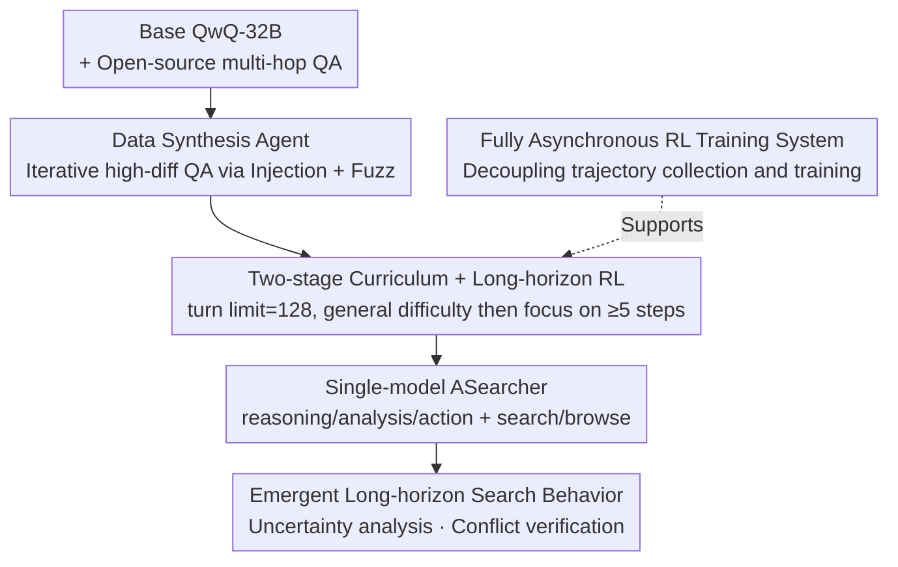

# Unlocking Long-Horizon Agentic Search with Large-Scale End-to-End RL

**Conference**: ICLR 2026  
**OpenReview**: [https://openreview.net/forum?id=MfPDdPUGKi](https://openreview.net/forum?id=MfPDdPUGKi)  
**Code**: Anonymous link (to be released after peer review)  
**Area**: Agent / Reinforcement Learning / Search Agent  
**Keywords**: Search Agent, End-to-End RL, Long-Horizon Exploration, Data Synthesis, Asynchronous Training

## TL;DR
Without relying on distillation data from commercial large models or acting as an external plugin tool, the search agent ASearcher is trained on a single QwQ-32B using pure end-to-end RL. By "automatically synthesizing high-difficulty QA data + setting the tool-call limit per trajectory to 128 steps for long-horizon exploration," the model spontaneously develops expert-level search behaviors such as uncertainty analysis and conflict checking. Using only basic search tools, it achieves performance comparable to commercial Deep Research systems on GAIA/xBench/Frames.

## Background & Motivation

**Background**: Search agents represent one of the most prominent categories of LLM agents—connecting models to search engines and browsers to answer knowledge-intensive questions through multi-turn tool calls. Currently, to achieve strong performance, open-source search agents almost invariably depend on commercial large models: either by collecting trajectories from powerful models like Claude-Sonnet-4 or Gemini-2.5-Pro for SFT cold-starts (e.g., AFM), or by directly assembling different commercial models into multi-model frameworks as specialized sub-modules for audio transcription, visual QA, or complex reasoning (e.g., MiroThinker).

**Limitations of Prior Work**: This dependence on closed-source models introduces two problems. First, the capability ceiling is locked by commercial models; open-source solutions are essentially "distilling" rather than "learning" how to search independently. Second, complex multi-model frameworks are difficult to reproduce and scale. A fundamental question arises: Can performance comparable to commercial systems be achieved without relying on any commercial models?

**Key Challenge**: Real-world search tasks are far more complex than simple "lookups." For instance, "How many gold medals did China win at the 2012 London Olympics?"—38 were recorded at the time, but two walking event disqualifications due to doping a decade later resulted in China receiving an additional medal, totaling 39. An agent must reconcile historical records and identify the root causes of conflicts within noisy, contradictory multi-source information to provide the correct answer. This deep retrieval capability requires long-horizon multi-turn exploration. However, previous RL search works often set very small training turn limits (e.g., 4 steps) for multi-hop QA, causing models to only learn short-range tool usage without ever exploring complex strategies.

**Goal**: To provoke long-horizon deep retrieval capabilities using pure RL, a single model, and only basic search tools. This is decomposed into two sub-problems: where the training data comes from (without relying on commercial models) and how to ensure the model truly explores long-horizon strategies during training.

**Core Idea**: The authors bet on a "DeepSeek-R1 style spontaneous RL emergence" approach: by providing sufficiently difficult training data and a large enough exploration space (pulling the turn limit to 128), pure end-to-end RL can push a single model from an average of 1.67 tool calls to over 20 calls, triggering the emergence of complex search behaviors such as reflection, external information citation, and conflict verification.

## Method

### Overall Architecture

ASearcher aims to solve "how to train an ordinary large model into a long-horizon search expert using pure RL without relying on commercial models." The entire pipeline is divided into three parts: first, a **data synthesis agent** automatically generates 25,600 high-difficulty QAs as training fuel; next, this data is fed to the RL in a **two-stage curriculum**, with the tool-call limit per trajectory set to 128 steps to force the model into long-horizon exploration; since 128-step ultra-long trajectories cause massive execution time variance, a **fully asynchronous RL training system** is used to decouple trajectory collection from weight updates, ensuring training efficiency. The resulting ASearcher is a **single-model agent** that outputs reasoning/analysis/action segments in each turn, calling only basic search and browse tools without relying on external models during runtime.

### Key Designs

**1. Single-model Agent Design: One model handles reasoning, planning, action, and webpage summarization**

Addressing the pain point where "open-source solutions rely on multi-commercial-model frameworks," ASearcher does the opposite: the entire agent runs on a single model. In each turn, after receiving the user's question and historical context, the model generates three consecutive segments: **Reasoning** for internal thought, analyzing currently held information, evaluating progress, reflecting on previous results, inferring unresolved aspects, and formulating subsequent plans; **Analysis** for condensing reasoning, extracting key conclusions, and providing the next plan; and **Action** for the final decision, either providing a final answer to terminate or initiating a tool call. A key engineering detail is that the reasoning segment is often long and noisy, so it is **not written into the subsequent history**; only analysis and action enter the history to keep the context clean. There are only two tools—`<search>` connects to a search engine to return relevant snippets and URLs, and `<access>` connects to a browser to return webpage content. Since real webpages often exceed 32K tokens, the model splits webpages into 10k character blocks and summarizes them itself. This "all-in-one single model" design proves that long-horizon search capabilities can be endogenous to a single model rather than requiring external specialized sub-models.

**2. Data Synthesis Agent: Iteratively creating high-uncertainty QA via Injection and Fuzzing**

Pure RL lacks high-difficulty training data, and it cannot be created by commercial models—this is the most core design of the paper. The authors constructed a data synthesis agent driven by QwQ-32B (as shown in Fig. 3 of the original paper). Starting from a seed question, it iteratively makes the question more difficult while maintaining a list of supporting facts to ensure the question strictly aligns with reliable sources. Each step automatically chooses between two actions: **Injection**, which selects an entity in the question, retrieves a related fact from external sources like Wikipedia, and injects it into the question to enrich its context; and **Fuzzing**, which deliberately blurs details in the question to increase uncertainty (e.g., replacing "Catskill Mountain Railroad" with "a historic mountain railroad"), forcing the model to search for restoration. Synthesized questions undergo strict quality verification: basic quality checks (clarity and solvability), difficulty measurement (requiring QwQ-32B to answer without tools; failure indicates sufficient difficulty), and answer uniqueness checks (ensuring incorrect answers generated during difficulty measurement do not become another valid answer). Finally, questions that can be answered correctly without tools are filtered out, resulting in 25,600 high-quality QAs that require multi-turn tool calls. Combined with open-source data from HotpotQA and 2WikiMultiHopQA filtered by the model (304k → 16k difficult samples), this constitutes the full training set.

**3. Two-stage Curriculum + Large Turn Limit Long-horizon RL: Forcing long-horizon strategies via progressive difficulty and wide exploration space**

Having difficult data is not enough; the model must actually reach the long horizon during training. The authors use a **training turn limit of 128**—far larger than the 4-10 steps in previous work—providing the model a wide enough exploration space to discover complex search strategies. Ablations show that cutting the turn limit to 10 causes GAIA scores to drop from 58.7 to 49.2 and the average tool calls to plummet from 26.59 to 3.48, proving the large turn limit is key to unlocking long-horizon capabilities. Simultaneously, a **two-stage curriculum** is used: Stage 1 trains on the total data covering various difficulties (including simple questions requiring only 1-2 calls) to let the model master basic tool usage and reasoning; Stage 2 removes all QA solvable in fewer than 5 tool calls, continuing training only on long-horizon difficult problems to specifically activate stable long-horizon search. Ablations continuing training only with Stage 1 data resulted in only 5.40 tool calls and an xBench score of 43.0, verifying the necessity of the progressive curriculum. The optimization uses **GRPO**: sampling $G$ trajectories for each problem and calculating the advantage $\hat{A}_i$ using relative rewards within the group, with the objective:

$$J_{\text{GRPO}}(\theta) = \mathbb{E}_{x\sim D,\{\tau_i\}\sim\pi_{\theta_{old}}}\Big[\frac{1}{G}\sum_{i=1}^{G}\frac{1}{\sum_t|a_t^i|}\sum_t\sum_j \min\big(r_{t,j}\hat{A}_i,\ \text{clip}(r_{t,j},1-\epsilon,1+\epsilon)\hat{A}_i\big)\Big]$$

where $r_{t,j}$ is the token-level probability ratio of the new and old policies. Rewards are sparse (judging correctness via LLM-as-Judge at the end of the trajectory) and format rewards are removed (as QwQ-32B naturally follows formatting). **Dynamic filtering** is added to remove queries where all trajectories in a group have the same reward (zero advantage, no training signal), improving training efficiency.

**4. Fully Asynchronous RL Training System: Isolating ultra-long trajectory execution variance from training**

The 128-step turn limit introduces a thorny engineering problem: a few ultra-long trajectories can have dozens more tool calls than shorter ones, making single trajectory runtime highly unpredictable (Fig. 4 in the original paper shows that extremely long trajectories, though few, slow down the whole process). Traditional batch-generation RL (like one-step-off) still requires a batch to wait for the slowest trajectory even if rollout and training overlap, leading to significant GPU idle time. This work adopts **fully asynchronous training** based on AReaL, decoupling at two levels: **Asynchronous trajectory rollout**—each trajectory independently sends requests to the tool server and LLM inference engine without blocking others, so one trajectory waiting for a tool response doesn't delay others; and **Decoupling rollout from training**—long trajectories no longer block generation and can survive across multiple weight versions. Once the training side collects enough trajectories for a batch, it immediately starts a training step. This keeps GPUs near full capacity during the generation phase, with the entire ASearcher training consuming approximately 16k H800 GPU hours. While this design does not improve model capability directly, it is the prerequisite for making "128-step long-horizon RL" computationally feasible.

### Loss & Training

The process is modeled as an MDP $(S, A, T, R)$: state $S$ includes history, search results, and scraped webpages; action $A$ consists of tokens generated by the model (tool calls extracted from tags like `<search>...</search>`); the goal is to maximize the reward $J(\pi)=\mathbb{E}[\sum_t R(s_t,a_t)]$. Optimization uses GRPO + dynamic filtering as described above, with sparse trajectory-level rewards from LLM-as-Judge. Base model: QwQ-32B, turn limit=128, batch size=64, AdamW learning rate 2e-6.

## Key Experimental Results

### Main Results

Benchmarks: Frames (824 questions, multi-source info synthesis), GAIA (103-question text-only subset, multi-turn tools + step-by-step solving), xBench-DeepSearch (100 Chinese expert-level difficult questions), HLE (500 expert-level interdisciplinary questions). The primary metric is Pass@1 under LLM-as-Judge (ASearcher evaluated with 4 seeds).

| Method | No Commercial LLM | GAIA | xBench | Frames | HLE |
|------|:--:|:--:|:--:|:--:|:--:|
| OpenAI DeepResearch (Commercial) | - | 67.0 | - | - | 26.6 |
| Kimi-Researcher (Commercial) | - | - | 69.0 | 78.8 | 26.9 |
| WebSailor-32B | ✓ | 53.2 | 53.3 | 69.8 | - |
| AFM-RL-32B (Multi-agent) | ✗ | 55.3 | - | - | 18.0 |
| MiroThinker-32B-DPO (Multi-tool) | ✗ | 60.9 | 56.0 | 74.8 | 20.6 |
| **ASearcher (Single-model, Search only)** | ✓ | **58.7** | **51.1** | **74.5** | **21.5** |
| + Summary=DeepSeek-V3 | ✗ | 60.3 | 56.4 | 76.6 | 23.4 |
| + Test-time Search (K=16) | ✗ | **71.8** | **75.0** | **83.4** | **24.6** |

Using only a single model and basic search tools, ASearcher outperforms a wide range of 32B-class open-source agents, even matching MiroThinker-32B-DPO (which uses additional multi-tools) on GAIA/Frames. With zero-shot enhancements—replacing webpage summarization with DeepSeek-V3 and applying test-time scaling with $K=16$ parallel rollouts (aggregating 16 independent conclusions with DeepSeek-V3)—it reaches GAIA 71.8, xBench 75.0, and Frames 83.4, competing directly with commercial systems like Kimi-Researcher, OpenAI DeepResearch, and o3.

### Ablation Study

All ablations continued training for 200 steps from the Stage 1 checkpoint and were evaluated on GAIA and xBench.

| Configuration | Tool Calls during Training | GAIA | xBench |
|------|:--:|:--:|:--:|
| ASearcher (Full) | 26.59 | 58.7 | 51.1 |
| w. Turn Limit=10 | 3.48 | 49.2 | 39.3 |
| w. Stage 1 Data only | 5.40 | 51.6 | 43.0 |
| w. AFM Data | 4.12 | 50.9 | 39.9 |

### Key Findings
- **Large turn limit is the lifeline of long-horizon capability**: Reducing the training turn limit from 128 to 10 crashed average tool calls from 26.59 to 3.48 and dropped GAIA scores by 9.5 points—complex search strategies simply cannot be learned if the exploration space is too narrow.
- **Two-stage curriculum is indispensable**: Continuing training only on Stage 1 data resulted in just 5.40 tool calls and an xBench score of 43.0; the second stage focusing on difficult questions (≥5 steps) is critical for stable long-horizon search.
- **Data quality trumps data quantity**: Training with the same 128 turn limit but using data from concurrent work AFM resulted in only 4.12 tool calls and significantly lower performance, highlighting the high difficulty and quality of the synthesized data in this study.
- **Capabilities are emergent, not taught**: During training, the frequency of reflection keywords like "however/wait/alternatively" and external citation keywords like "doc/mention" continuously increased (especially after step 200 of Stage 2), confirming the "emergence through RL stimulation" paradigm similar to DeepSeek-R1.

## Highlights & Insights
- **The Data Synthesis Agent is the true moat**: The combination of Injection (adding facts to increase complexity), Fuzz (blurring details to increase uncertainty), and three-step quality verification (clarity/difficulty/uniqueness) creates a self-driven question-generating machine that doesn't rely on commercial models and can precisely control difficulty. This mindset can be migrated to any agentic RL task requiring difficult, verifiable training data.
- **Reasoning-not-in-history is a clever engineering decision**: It allows the model to benefit from the large reasoning model’s internal thought process while avoiding the pollution of subsequent context with long, noisy reasoning text—a practical trick for managing context length in long-horizon multi-turn scenarios.
- **Elevating "System Efficiency" to match algorithm importance**: Fully asynchronous RL directly addresses the bottleneck of high variance in long-horizon trajectories. Without it, 128-step training would be computationally impossible. This serves as a reminder for those doing agentic RL: the turn limit is not just a hyperparameter to be tuned up; it requires dedicated training system design.
- **Zero-shot migration to external tools**: Although it is a single model during training, it can seamlessly replace its webpage summarizer with a stronger DeepSeek-V3 and stack test-time scaling during inference, indicating that this agent design's interfaces are general and composable.

## Limitations & Future Work
- **Runtime enhancement still relies on commercial/strong models**: While the single-model version is strong (GAIA 58.7), truly matching commercial systems requires DeepSeek-V3 as a summarization tool and $K=16$ test-time scaling, the latter of which involves significant inference costs (16x parallel rollouts).
- **Restricted to basic search/browse tools**: Currently only search and browse are connected; performance on real-world tasks requiring images, audio, or code sandboxes (scenarios covered by MiroThinker) has not yet been verified. Whether the reward design and data synthesis remain valid when extending to richer toolsets remains to be seen.
- **Reward dependence on LLM-as-Judge**: Sparse trajectory-level LLM judging contains noise and potential bias, which might distort results for open-ended questions that are difficult to verify automatically.
- **High training cost**: 16k H800 GPU hours plus long-horizon rollouts with a 128 turn limit pose a high barrier to entry for reproduction. Exploring how to retain long-horizon emergence with fewer compute resources is a direction worth pursuing.

## Related Work & Insights
- **vs AFM / MiroThinker (Open-source agents relying on commercial models)**: These rely on commercial models like Claude/Gemini for SFT data collection or as specialized sub-modules. ASearcher uses pure RL, a single model, and zero commercial dependence, yet matches or exceeds them on GAIA/Frames—the core difference being "learning search independently" vs. "distilling commercial models."
- **vs Search-R1 / Multi-hop QA RL work**: These works set very small turn limits (e.g., 4), learning only short-range tool usage and showing serious hallucinations in case studies. ASearcher uses a 128 turn limit + high-difficulty synthesized data to learn long-horizon strategies like decomposing complex queries, enumerating candidates, and grounded verification.
- **vs DeepSeek-R1**: This paper migrates the R1 paradigm—that "reasoning capabilities can be fully stimulated by RL"—to search agents. Treating "long-horizon search intelligence" as a capability that can be incentivized by RL emergence is a direct methodological resonance and extension.

## Rating
- Novelty: ⭐⭐⭐⭐ While the pure RL single-model route is not entirely new, the combination of "self-driven data synthesis + 128-step long-horizon exploration + fully asynchronous system" to match commercial systems is highly persuasive.
- Experimental Thoroughness: ⭐⭐⭐⭐⭐ Four major benchmarks covering commercial, general LLM, and open-source baselines; three sets of ablations (turn limit, curriculum, data quality) precisely answer key questions.
- Writing Quality: ⭐⭐⭐⭐ Clear motivation, using the Olympic gold medal example to effectively explain the difficulties of long-horizon retrieval; both system and algorithm sections are well-detailed.
- Value: ⭐⭐⭐⭐⭐ Provides a complete and reproducible recipe (data + algorithm + system) for training a strong search agent without commercial models, offering great value to the open-source agentic RL community.

<!-- RELATED:START -->

## Related Papers

- [\[ACL 2026\] MemSearcher: Training LLMs to Reason, Search and Manage Memory via End-to-End RL](../../ACL2026/llm_agent/memsearcher_training_llms_to_reason_search_and_manage_memory_via_end-to-end_rein.md)
- [\[ICLR 2026\] MC-Search: Evaluating and Enhancing Multimodal Agentic Search with Structured Long Reasoning Chains](mc-search_evaluating_and_enhancing_multimodal_agentic_search_with_structured_lon.md)
- [\[ICLR 2026\] AgentGym-RL: An Open-Source Framework to Train LLM Agents for Long-Horizon Decision Making via Multi-Turn RL](agentgym-rl_an_open-source_framework_to_train_llm_agents_for_long-horizon_decisi.md)
- [\[ICLR 2026\] Repurposing Synthetic Data for Fine-grained Search Agent Supervision](repurposing_synthetic_data_for_fine-grained_search_agent_supervision.md)
- [\[ICLR 2026\] MEM1: Learning to Synergize Memory and Reasoning for Efficient Long-Horizon Agents](mem1_learning_to_synergize_memory_and_reasoning_for_efficient_long-horizon_agent.md)

<!-- RELATED:END -->
