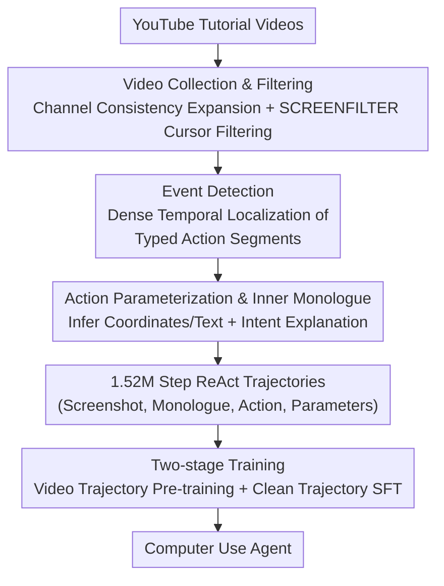

# VideoAgentTrek: Computer Use Pretraining from Unlabeled Videos

**Conference**: ICLR 2026  
**OpenReview**: [https://openreview.net/forum?id=xxYPqm1qWz](https://openreview.net/forum?id=xxYPqm1qWz)  
**Code**: https://videoagenttrek.github.io (SCREENFILTER and VIDEO2ACTION open-sourced)  
**Area**: Agent  
**Keywords**: Computer use agent, inverse dynamics, unsupervised pre-training, GUI video mining, long-horizon planning

## TL;DR
This paper proposes VideoAgentTrek, which employs an inverse dynamics module, VIDEO2ACTION, to automatically recover operation trajectories with precise action parameters (1.52 million steps) from 39,000 unlabeled YouTube screen-recorded tutorials. Through a two-stage process of "continual pre-training + supervised fine-tuning," the OSWorld-Verified success rate of computer use agents is increased from 9.3% to 15.8% (a 70% relative improvement).

## Background & Motivation
**Background**: Training Computer Use Agents (CUAs, capable of clicking buttons, typing text, and navigating interfaces) requires massive interactive trajectories of "screenshots + precise action parameters." Each step must record the screenshot, action type (click/type), and parameters (click coordinates $(x,y)$ or input strings). While recent Vision-Language Models make such agents increasingly feasible, their development is constrained by data volume.

**Limitations of Prior Work**: Manual annotation of such trajectories is extremely expensive. It is impractical to manually record every click and input at the scale required for robust generalization across various applications and operating systems. Current data generation paths have shortcomings: manual annotation is accurate but narrow and costly; programmatic synthesis in instrumented environments is scalable but limited by simulator APIs and differs from real UIs; web-crawled tutorials/screen recordings are diverse but generally lack precise temporal boundaries and action parameters.

**Key Challenge**: Millions of screen-recorded tutorials (e.g., Excel tutorials, software demos) on the internet **implicitly** contain the necessary supervision signals—the cursor movement, text entry, and interface responses are visible. However, this resource remains underutilized because videos lack the structured action labels required for training: cursors move but are not tracked, text appears but is not extracted, and the timing of actions is implicit rather than annotated.

**Goal**: Transform "passively watched screen recordings" into "active training trajectories"—that is, automatically recover "what action happened when and with what parameters" from raw pixel changes without ground-truth labels.

**Key Insight**: Borrow the concept of **inverse dynamics** (mapping observations back to actions) from the robotics field. By training specialized models to detect when actions occur and infer their parameters, unlabeled videos can be converted into labeled interaction data.

**Core Idea**: Use a learned inverse dynamics module (VIDEO2ACTION) to reverse-engineer raw screen recordings into (screenshot, action, parameters) triplets, bypassing manual annotation and transforming web videos into supervision signals for computer use agents at scale.

## Method

### Overall Architecture
VideoAgentTrek is an end-to-end pipeline that converts "web tutorial videos" into "agent training supervision" through three serial stages: **Video Collection & Preprocessing** → **VIDEO2ACTION Inverse Dynamics** → **Two-stage Agent Training**. The first stage uses a "channel consistency" approach to snowball tutorial video collection from seed keywords, then employs a lightweight cursor detector, SCREENFILTER, to retain segments containing real GUI interactions. The second stage, VIDEO2ACTION, performs dense event detection on each segment (extracting action clips with types and precise timestamps), followed by action parameterization (inferring click coordinates/input text), and finally appends an "inner monologue" to explain intent, assembling them into ReAct-style trajectory steps $(I_k, r_k, a_k, \pi_k)$. The third stage mixes the mined large-scale video trajectories with manual demonstrations and GUI grounding data for two-stage training: continual pre-training on noisy but broad video trajectories to stabilize perception/grounding, followed by SFT on clean manual trajectories to converge the policy.

### Key Designs

**1. Channel Consistency Self-discovery + SCREENFILTER: Low-cost curation of clean GUI corpora from noisy web videos**

The biggest challenge in mining web videos is noise—search results often include PPT presentations or talking heads without interaction. This paper uses a two-step solution. For collection, it leverages the observation of "channel consistency": YouTube channels usually have stable content types and quality. Starting from seed keywords like "Excel tutorial" or "How to use Windows," if sampling reveals $\geq 80\%$ of a channel's videos are qualified, the entire channel is added to the candidates without individual review, and its tags are used for iterative expansion. This step prioritizes **recall over precision** (leaving noise for later filtering), eventually snowballing from a few manual seeds to 55,000 candidate videos (~10,000 hours). For filtering, it uses SCREENFILTER—a lightweight cursor detection model based on YOLOv8x: it retains only segments where "the cursor is present in at least 80% of frames for more than 6 consecutive seconds" (allowing 2-second gaps for temporal smoothing), refining 10,000 hours of raw video into 7,377 hours of genuine GUI interaction content.

**2. Action Event Detection: Reforming GUI operations as "prompt-free dense temporal event detection"**

To recover actions from recordings, the first task is locating "when and what action occurred." This is modeled as prompt-free dense event detection: given a recording $v$ of length $T$, the model $f_\theta(v)\to S=\{(a_k, t^s_k, t^e_k)\}_{k=1}^K$ outputs a set of events with types $a_k$ and compact timestamps $(t^s_k, t^e_k)$ in one go, rather than per-frame classification or query-based retrieval. Implementation-wise, Qwen2.5-VL-7B is equipped with video grounding capabilities and undergoes full-parameter fine-tuning to generate ordered, typed event intervals directly from raw clips. The training supervision requires no manual labeling: raw demonstration logs with "screen recording + timestamped HID events" are collected using OpenCUA's tools and automatically converted into temporal grounding supervision. This reforms "keyframe detection" into "multi-class temporal event detection + tight boundary localization."

**3. Action Parameterization + Inner Monologue: Completing segments into trainable ReAct steps**

Knowing a "click occurred" is insufficient; the model needs to know "where it clicked" and "what was typed," as well as "why." Action parameterization uses a recognizer $h_\phi(v_k)\to(\hat a_k, \pi_k)$ to predict the action type and parameters for each detected segment $v_k=v[t^s_k:t^e_k]$—outputting coordinates $(x,y)$ for click segments and input text $\langle content\rangle$ for type segments. It is also based on Qwen2.5-VL-7B, fine-tuned with parameter labels derived from OpenCUA logs. Since dense detection and parameterization only recover "what happened on screen," missing the "reason for each step," GPT-5 Medium is used to generate a short inner monologue $r_k$ for each step. By inputting action types, parameters, screenshots before/after the action, and 1 minute of ASR subtitles both before and after the action, it outputs a reason clarifying intent, local plans, and expected state changes (e.g., "Enter query in search box to display results"). This completes trajectories into ReAct triplets $(I_k, r_k, a_k, \pi_k)$, providing structured supervision for planning and credit assignment.

**4. Two-stage Training: Stabilizing grounding with noisy videos, then converging policy with clean worker trajectories**

Automatically mined trajectories are large-scale but inevitably noisy; using them directly for SFT might hinder policy learning. Borrowing the insight that "decoupling perception/grounding from policy learning improves robustness," a two-stage curriculum is designed. The base is Qwen2.5-VL-7B (a general VLM with only 4.5% success on OSWorld). Stage 1 uses approximately 26 billion tokens corresponding to 1.52 million video trajectory steps for one epoch of training (mixed with some GUI grounding pairs). Data is arranged as interleaved vision-language sequences where frames and step-by-step text outputs are inline; loss is only calculated on the text portion. This stage stabilizes basic GUI interaction patterns on broad but imperfect supervision. Stage 2 continues training on approximately 8 billion tokens of clean, manually-annotated trajectories, using a user/assistant dialogue template where loss is only calculated on assistant turns to converge the policy on task-relevant precise behaviors.

### Loss & Training
Both stages use masked language modeling supervision: Stage 1 treats images as conditions and only counts loss on text tokens (26B tokens, 1 epoch); Stage 2 uses chat templates and only counts loss on assistant turns (8B tokens). For data mixing, Stage 1 primarily consists of VideoAgentTrek video trajectories (~26B) + OSWorld-G GUI grounding pairs (~1B), with manual demonstrations from OpenCUA / AGUVIS (~8B, covering Windows/macOS/Android) also involved.

## Key Experimental Results

### Main Results
On the online benchmark OSWorld-Verified (369 Ubuntu desktop tasks) and the offline benchmark AgentNetBench (100 representative Windows/macOS tasks), video pre-training brings consistent gains:

| Benchmark | Metric | Base Model | Stage 2 Only (SFT) | Stage 1+2 | +Test-time Scaling |
|------|------|----------|------------------|-----------|-------------|
| OSWorld-Verified | Success Rate | 4.5% | 9.3% | 14.13% | **15.78%** |
| AgentNetBench | Step SR | 38.5% | 64.1% | **69.3%** | — |

On OSWorld, the full method shows a 70% relative improvement over the pure SFT baseline (9.3%→15.8%) and more than triples the performance of the base model. On AgentNetBench, it exceeds the pure SFT by 5.2 points.

### Ablation Study
Data scale ablation based on Stage 1 video token usage (0% / 50% / 100%), with Stage 2 SFT held constant:

| Stage 1 Data Vol. | AgentNetBench Step SR | OSWorld-Verified Task SR@50 | Description |
|----------------|---------------------|------------------------------|------|
| 0% (SFT only) | 64.1% | 9.3% | No video pre-training |
| 50% | 68.1% | 13.3% | Half-volume video pre-training |
| 100% | 69.3% | 15.7% | Full volume, monotonic increase |

Additionally, for VIDEO2ACTION's inverse dynamics quality: action event detection achieved an overall precision of 0.88, recall of 0.70, and F1 of 0.78 on a held-out test set (pointer-based actions like click/scroll are reliable, while keyboard actions like press/type have lower recall due to weak visual cues); action parameterization achieved an overall accuracy of 0.658 on 500 in-the-wild samples.

### Key Findings
- **Data scale is monotonically effective**: As video tokens increase from 0→50%→100%, both benchmarks rise steadily, establishing a clear "pre-training data volume $\leftrightarrow$ CUA performance" relationship.
- **Video pre-training unlocks test-time scaling**: Increasing the step budget from 20 to 50 leaves the SFT-only baseline stagnant (at 9.3%), while the Stage 1+2 model rises from 14.13% to 15.78%—indicating that long video trajectories teach models to decompose sub-goals and survive intermediate failures.
- **Long-horizon supervision is the source of gain**: VideoAgentTrek corpora have an average trajectory length of 39.25 steps, with 42.1% exceeding 20 steps and 14.5% reaching over 50 steps, far longer than existing CUA datasets. This long-horizon nature provides the aforementioned planning capabilities.
- **Larger gains online**: Relative improvements on OSWorld (online, more sensitive to visual changes) are more significant than on the offline AgentNetBench, suggesting video diversity is crucial for real-world robustness.

## Highlights & Insights
- **Applying Robotics Inverse Dynamics to GUI**: Following VPT's proof that unlabeled videos can train agents through inverse dynamics, this paper applies the concept to GUI—using a two-stage "dense event detection + parameterization" to achieve millisecond-level timing and parameter extraction, a level of precision general video grounding frameworks lack.
- **Channel Consistency as a Scaling Key**: Replacing "video-by-video review" with "whole-channel batching + post-filtering" reduces manual supervision to seed verification. This "high recall + strong filtering" trade-off is transferable to any web data mining task.
- **Supervision from IID Logs**: Detectors and parameterizers are supervised using OpenCUA's "recording + timestamped event logs," bypassing the "lack of ground truth boxes in GUI" deadlock.
- **Test-time Scaling as a Diagnostic for Pre-training**: Using "whether increasing budget improves performance" to distinguish if a model has truly learned long-horizon planning or just repetitive steps is a clever evaluation perspective.

## Limitations & Future Work
- **Weak Recovery of Keyboard-only Actions**: Actions with subtle visual evidence, like press/type, show low detection recall (press 0.08) and parameterization accuracy (drag 0.366, press 0.362), implying noise in these actions within mined trajectories.
- **Manual Evaluation of Parameterization**: Lack of ground truth target boxes forces reliance on human blind evaluation for 500 in-the-wild samples; the overall accuracy of 0.658 suggests trajectory quality is not yet perfect.
- **Absolute Success Rate Remains Low**: While 15.8% on OSWorld is a large relative jump, the absolute value is still far from a practical CUA; scalability on larger models beyond 7B is untested.
- **Monologue Dependence on GPT-5**: The reasons $r_k$ are generated post-hoc by a large model, which may deviate from true human intent and introduces dependency on closed-source models.

## Related Work & Insights
- **Vs. Manual/Synthetic Data (OpenCUA, AGUVIS)**: They rely on instrumentation or scripts for exact labels but are limited in coverage/cost. Ours reverse-engineers wild videos, trading some precision for the diversity and scale of hundreds of applications across Windows/macOS/Web.
- **Vs. General Temporal Video Grounding**: Existing methods focus on "what happened when" at a semantic level but lack the millisecond precision and parameter extraction needed for GUI interaction.
- **Vs. VPT**: VPT uses inverse dynamics in gaming (Minecraft) for behavioral cloning; ours transfers this paradigm to GUI and adds ReAct-style monologue supervision, emphasizing long-horizon planning.

## Rating
- Novelty: ⭐⭐⭐⭐ Systematically applying inverse dynamics + channel consistency mining to GUI recordings with a complete engineering pipeline.
- Experimental Thoroughness: ⭐⭐⭐⭐ Dual online/offline benchmarks + data scaling ablation + quality assessment of inverse dynamics, though parameterization relies on manual blind testing.
- Writing Quality: ⭐⭐⭐⭐ Clear three-stage pipeline description, complete charts, though some appendix details must be checked separately.
- Value: ⭐⭐⭐⭐ Provides a reproducible path to scale Causality (CUA) supervision via internet recordings; SCREENFILTER / VIDEO2ACTION are open-sourced with high utility.

<!-- RELATED:START -->

## Related Papers

- [\[ICLR 2026\] Efficient Agent Training for Computer Use](efficient_agent_training_for_computer_use.md)
- [\[ICLR 2026\] R-WoM: Retrieval-augmented World Model for Computer-use Agents](r-wom_retrieval-augmented_world_model_for_computer-use_agents.md)
- [\[ICLR 2026\] SCUBA: Salesforce Computer Use Benchmark](scuba_salesforce_computer_use_benchmark.md)
- [\[ICLR 2026\] ScaleCUA: Scaling Open-Source Computer Use Agents with Cross-Platform Data](scalecua_scaling_open-source_computer_use_agents_with_cross-platform_data.md)
- [\[ICLR 2026\] Grounding Computer Use Agents on Human Demonstrations](grounding_computer_use_agents_on_human_demonstrations.md)

<!-- RELATED:END -->
