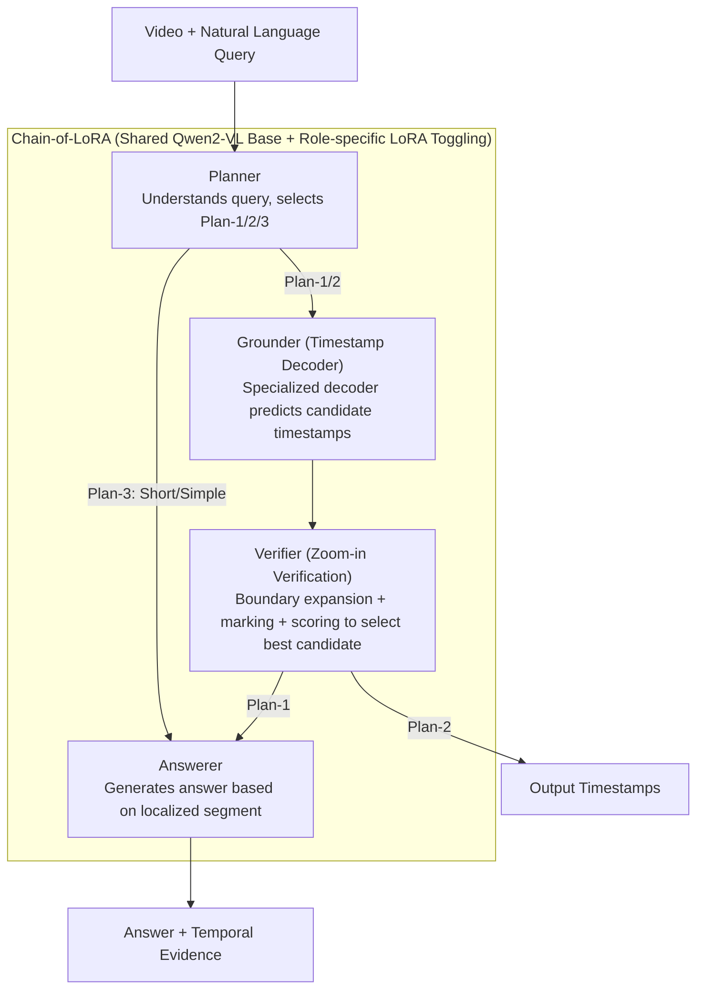

# VideoMind: A Chain-of-LoRA Agent for Temporal-Grounded Video Reasoning

**Conference**: ICLR 2026  
**arXiv**: [2503.13444](https://arxiv.org/abs/2503.13444)  
**Code**: [https://github.com/yeliudev/VideoMind](https://videomind.github.io/)  
**Area**: LLM Agent  
**Keywords**: Video Reasoning, Temporal Grounding, LoRA, Multimodal Agent, Video Question Answering

## TL;DR

VideoMind is proposed as a role-based video-language agent framework that achieves temporal-grounded video reasoning through the collaboration of four roles: Planner, Grounder, Verifier, and Answerer. The core innovation is the Chain-of-LoRA mechanism, which enables seamless role switching on a unified base model by toggling LoRA adapters. The 2B model variant outperforms GPT-4o and Gemini-1.5-Pro.

## Background & Motivation

Video understanding faces unique challenges in the temporal dimension: effective video reasoning requires not only identifying visual appearances but also understanding how they evolve over time. Existing methods encounter two major bottlenecks:

**Visual CoT lacks temporal grounding capabilities**: While Chain-of-Thought methods on static images can generate detailed reasoning steps, they cannot explicitly locate or review specific segments in a video, leading to poor performance in long video reasoning.

**Efficiency issues in existing video agent solutions**: Agent systems based on multiple independent components (e.g., specialized models for different tasks) suffer from high memory overhead and poor flexibility, while multi-task joint training often leads to task interference.

Human strategies for processing long videos provide inspiration: **Decompose the problem → Locate relevant segments → Review to confirm details → Synthesize the answer**. VideoMind aims to simulate this cognitive process while maintaining high efficiency.

## Method

### Overall Architecture

VideoMind addresses "temporally grounded reasoning" in long videos—requiring both the correct answer and the specific timestamps (in seconds) that support it. It defines four specialized roles on a single Qwen2-VL backbone, linked into a function-calling chain. The Planner understands the query and decides which roles to invoke; the Grounder predicts the start and end timestamps of relevant segments; the Verifier reviews candidate segments to select the most reliable one; and the Answerer generates a natural language answer based on the localized segment (or the entire video). Crucially, these roles are not four independent models but share the same base, each equipped with a set of LoRA adapters, allowing for intra-model role switching by swapping LoRA weights.

### Key Designs

**1. Planner: Adaptive Reasoning Plan Selection**

Executing all four steps is not always cost-effective—short videos or common-sense questions do not require localization followed by verification. Forcing grounding can waste computation and introduce noise that misleads the answer. The Planner first understands the query and selects from three predefined plans: Plan-1 (Grounding → Verifying → Answering) when both an answer and temporal evidence are needed; Plan-2 (Grounding → Verifying) when only timestamps are required; and Plan-3 for short videos or simple questions where it answers directly. Roles are chained using JSON-style function calls `{"type": "<role>", "value": "<argument>"}`, with the Planner outputting the scheduling sequence. Ablations show that this adaptive scheduling only performs grounding for approximately 40% of samples, improving accuracy from 69.2 to 70.0 by focusing compute on samples that truly require localization.

**2. Grounder's Timestamp Decoder: Detector-style Decoding for Temporal Localization**

A pain point in video temporal grounding is that letting an LLM directly generate text like "from 12.3 to 18.7 seconds" lack geometric constraints and precision. The VideoMind Grounder introduces a `<REG>` token; when generated, its hidden state is fed into a specialized decoder alongside all visual tokens. It first uses 1D average pooling to compress each frame into a vector $\mathbf{h}_v' \in \mathbb{R}^{T \times D_L}$, followed by linear projection to reduce dimensionality to $\mathbf{e}_v = E_v(\mathbf{h}_v') \in \mathbb{R}^{T \times D}$, then fused with query features via a three-layer Transformer encoder. The core is the subsequent **Temporal Feature Pyramid**—four levels of Conv1D layers perform step-wise downsampling (retaining 1, 1/2, 1/4, 1/8 of the sequence length), enabling short and long events to be predicted in parallel across different scales. The decoder head includes frame-level foreground/background classification, boundary regression for start/end offsets, and a contrastive term to enhance frame-query matching. This "detector-style" structure transforms localization from fuzzy text generation into supervised geometric regression, allowing the 2B model to surpass GPT-4o in mIoU.

**3. Verifier's Zoom-in Strategy: Simulating Human "Review and Confirm"**

A single prediction from the Grounder may yield several plausible candidates; identifying the most accurate one requires secondary screening. The Verifier expands the boundaries of each candidate segment by 50% on both sides to incorporate context and inserts `<SEG-START>` and `<SEG-END>` tokens into the sequence to explicitly mark boundaries, clarifying for the model "where to look." It then performs a binary judgment (Yes/No). Using teacher forcing, the logits $L_y, L_n$ for the two answer tokens are extracted, and $\text{Sigmoid}(L_y - L_n)$ serves as the confidence score for ranking candidates. This "expand + mark + score" review process increases grounding mIoU by approximately 3.2.

**4. Chain-of-LoRA: Compressing Multiple Roles into One Model**

Using four independent models for the roles (All-Distributed) achieves high performance but causes memory explosion, while joint training (All-in-One) leads to capacity interference between roles. VideoMind has all roles share the same LMM backbone, while each role is assigned a specific set of LoRA adapters (the Grounder additionally includes the timestamp decoder). During inference, all LoRA parameters remain in memory; switching roles only involves toggling the corresponding LoRA weights without the overhead of reloading the entire model. Consequently, it matches the performance of the All-Distributed approach while reducing memory usage from 16.6G to 4.2G, enabling "multi-agent collaboration" with zero-cost switching within a single model.

### Loss & Training

The Grounder's training involves a weighted sum of three losses. Classification uses Focal Loss to mitigate extreme foreground/background imbalance: $\mathcal{L}_{cls} = -\lambda_{cls}\alpha(1-\hat{c}_i)^\gamma \log(\hat{c}_i)$, with $\alpha=0.9, \gamma=2.0, \lambda_{cls}=5.0$. Boundary regression uses L1 Loss: $\mathcal{L}_{reg} = \lambda_{reg}(|b_i^s - \hat{b}_i^s| + |b_i^e - \hat{b}_i^e|)$, with $\lambda_{reg}=1.0$. A contrastive loss $\mathcal{L}_{con}$ with temperature $\tau=0.07$ and weight $\lambda_{con}=0.05$ is added to strengthen discriminative representations. Each role is trained as a separate LoRA on its specific data: the Planner uses 39K samples (NExT-QA 34K + QVHighlights 5K), the Grounder mixes 7 sources totaling 210K, the Verifier uses 232K (DiDeMo 165K + TACoS 43K + QVHighlights 24K), and the Answerer uses the original model without fine-tuning.

## Key Experimental Results

### Main Results (Grounded VideoQA)

Comparison on CG-Bench (average video length 27 minutes):

| Method | Params | long-acc. | mIoU | rec.@IoU | acc.@IoU |
|------|--------|-----------|------|----------|----------|
| GPT-4o | – | 45.2 | 5.62 | 8.30 | 4.38 |
| Gemini-1.5-Pro | – | 37.2 | 3.95 | 5.81 | 2.53 |
| Qwen2-VL | 72B | 41.3 | 3.58 | 5.32 | 3.31 |
| **VideoMind (Ours)** | **2B** | 31.0 | **5.94** | **8.50** | **4.02** |
| **VideoMind (Ours)** | **7B** | **38.4** | **7.10** | **9.93** | **4.67** |

Video Temporal Grounding on Charades-STA:

| Method | Params | R@0.3 | R@0.5 | R@0.7 | mIoU |
|------|--------|-------|-------|-------|------|
| UniTime | 7B | – | 59.1 | 31.9 | 52.2 |
| **VideoMind** | **7B** | **73.5** | **59.1** | **31.2** | **50.2** |

General VideoQA (Video-MME / MLVU / LVBench):

| Method | Params | Video-MME All | MLVU M-Avg | LVBench |
|------|--------|------|------|---------|
| GPT-4o | – | 71.9 | 54.5 | 30.8 |
| Gemini-1.5-Pro | – | 75.0 | – | 33.1 |
| **VideoMind** | **2B** | 55.4 | 58.7 | **35.4** |
| **VideoMind** | **7B** | 58.2 | **64.4** | **40.8** |

### Ablation Study (Chain-of-LoRA Comparison)

Performance and efficiency comparison of different role integration strategies (2B model):

| Method | Memory | NExT-GQA mIoU | NExT-GQA Acc | Charades R@0.5 | Video-MME All |
|------|------|-----------|----------|------------|-----------|
| Qwen2-VL-2B | 4.1G | – | 69.6 | – | 53.0 |
| + CoT (Textual) | 4.1G | – | 69.7 | – | 52.8 |
| + All-in-One (Joint) | 4.2G | 28.0 | 70.5 | 47.8 | 53.6 |
| + All-Distributed (4× Models) | **16.6G** | 28.6 | 71.4 | 51.1 | 55.4 |
| + **Chain-of-LoRA** | **4.2G** | **28.6** | **71.4** | **51.1** | **55.4** |

Chain-of-LoRA achieves the same performance as the 16.6G All-Distributed setup with only 4.2G memory.

### Key Findings

1. **Textual CoT is ineffective for video reasoning**: +CoT shows negligible improvement (69.7 vs 69.6), indicating that videos require visual-centric reasoning strategies.
2. **Capacities interfere during joint training**: All-in-One joint training performance is significantly lower than the distributed approach (47.8 vs 51.1 R@0.5), validating the necessity of LoRA separation.
3. **Verifier improves grounding by 3.2 mIoU**: Reviewing candidate segments brings consistent improvements.
4. **Value of Planner adaptive scheduling**: Performing grounding for only 40% of samples (and answering directly for the rest) increased accuracy from 69.2 to 70.0.

## Highlights & Insights

1. **Elegance of Chain-of-LoRA**: Instead of maintaining multiple full models, it enables seamless switching between roles by toggling lightweight LoRAs, compressing a "multi-agent" system into a single model.
2. **2B Model Outperforming GPT-4o in Temporal Grounding**: On CG-Bench mIoU and rec.@IoU, the small 2B model beats GPT-4o, suggesting that specialized temporal localization is more critical than general-purpose capability.
3. **Precision Advantage of the Timestamp Decoder**: Compared to generating timestamp text via a language model, the specialized decoder and feature pyramid design provides a fundamental boost in localization accuracy.
4. **Zoom-in Verification Strategy**: By expanding boundaries and using special markings, the model simulates human behavior to enhance boundary sensitivity and verification accuracy.

## Limitations & Future Work

1. **Independent Optimization for Roles**: Although LoRAs are lightweight, the overall training pipeline remains complex as each role requires independent data preparation and tuning.
2. **Lack of Audio Modality**: Currently only processes visual and textual inputs, neglecting information contained in audio.
3. **Predefined Reasoning Plans**: The Planner selects from three fixed plans, lacking more flexible dynamic planning capabilities.
4. **Future Directions**: Potential for joint optimization of multiple roles and integration of the audio modality.

## Related Work & Insights

- **Relation to VideoChat-TPO**: TPO also focuses on temporal reasoning, but VideoMind integrates multiple capabilities more efficiently through the LoRA mechanism.
- **Comparison with OpenAI o1 Series Reasoning**: While o1 relies on textual reasoning chains, VideoMind extends test-time computation through a visual-centric role chain (Locate → Verify → Answer).
- **Temporal Feature Pyramid**: Adopts multi-scale designs from temporal detection methods like ActionFormer and embeds them into the LMM framework.

## Rating

- Novelty: ⭐⭐⭐⭐ (Chain-of-LoRA is novel and elegant; the agentic role-division is valuable)
- Experimental Thoroughness: ⭐⭐⭐⭐⭐ (Comprehensive evaluation across 15 benchmarks, solid ablations, and clear visualizations)
- Writing Quality: ⭐⭐⭐⭐ (Clear structure, rich diagrams, and detailed technical descriptions)
- Value: ⭐⭐⭐⭐⭐ (Open-source code, strong cross-task generalization, highlights advantages of small models; significantly advances video agents)

<!-- RELATED:START -->

## Related Papers

- [\[ICLR 2026\] Memory-T1: Reinforcement Learning for Temporal Reasoning in Multi-session Agents](memory-t1_reinforcement_learning_for_temporal_reasoning_in_multi-session_agents.md)
- [\[ACL 2026\] ChartAgent: A Multimodal Agent for Visually Grounded Reasoning in Complex Chart Question Answering](../../ACL2026/llm_agent/chartagent_a_multimodal_agent_for_visually_grounded_reasoning_in_complex_chart_q.md)
- [\[CVPR 2026\] Refer-Agent: A Collaborative Multi-Agent System with Reasoning and Reflection for Referring Video Object Segmentation](../../CVPR2026/llm_agent/refer-agent_a_collaborative_multi-agent_system_with_reasoning_and_reflection_for.md)
- [\[ACL 2026\] SafeMCP: Proactive Power Regulation for LLM Agent Defense via Environment-Grounded Look-Ahead Reasoning](../../ACL2026/llm_agent/safemcp_proactive_power_regulation_for_llm_agent_defense_via_environment-grounde.md)
- [\[ICLR 2026\] SimuHome: A Temporal- and Environment-Aware Benchmark for Smart Home LLM Agents](simuhome_a_temporal-_and_environment-aware_benchmark_for_smart_home_llm_agents.md)

<!-- RELATED:END -->
