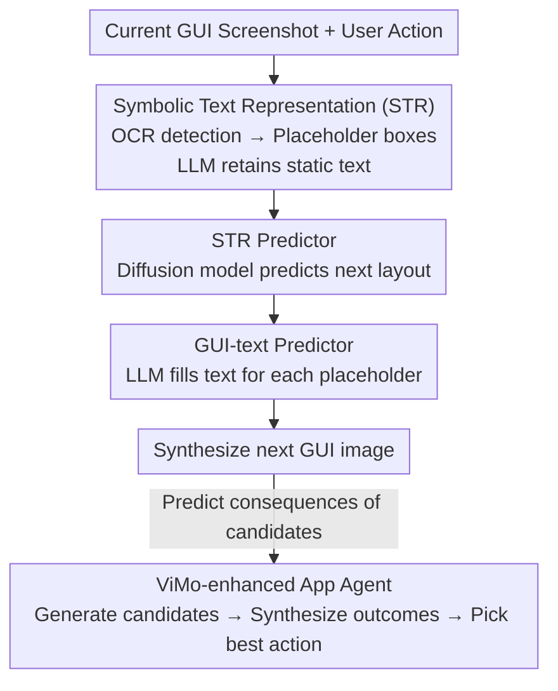

# ViMo: A Generative Visual GUI World Model for App Agents

**Conference**: ICLR 2026  
**OpenReview**: [https://openreview.net/forum?id=mWoMyDEfbM](https://openreview.net/forum?id=mWoMyDEfbM)  
**Paper**: [Project Page](https://ai-agents-2030.github.io/ViMo/)  
**Code**: See project page  
**Area**: Agent / World Model / GUI Generation  
**Keywords**: App Agent, GUI World Model, Symbolic Text Representation, Diffusion Model, Long-horizon Planning

## TL;DR
ViMo is the first "visual" GUI world model—given a current mobile screen screenshot and a user action, it directly generates the **future GUI image** after the action is executed. To solve the long-standing problem of blurry small text in pixel-level generation, it decouples the interface into "graphics" and "text" streams for separate generation. Using a symbolic placeholder representation called STR, a diffusion model handles the graphical layout while an LLM fills the placeholder boxes with text. The predicted results of the world model are then fed to an App agent for more accurate action selection.

## Background & Motivation

**Background**: App agents based on LLM/VLM (intelligent agents that automatically operate mobile apps to complete tasks) have gained significant traction. They execute tasks by reading GUI screenshots and imitating human clicks or swipes. To prevent agents from taking unnecessary detours in complex tasks, a popular approach is to introduce a **world model**: predicting "what the interface will look like after this action" before actual execution to compare the consequences of different actions.

**Limitations of Prior Work**: Existing GUI/Web world models are almost entirely **language-modal**—they describe the "next observation" as a piece of text or HTML. However, text descriptions naturally fail to capture critical visual details of the interface: the position and color of a button, whether it is highlighted, or the exact arrangement of elements in a pop-up. These details are precisely what an agent uses to judge if an "action was successful and where to click next." Another seemingly direct alternative is to run actions in a real simulator, but operations like payments or duplicate orders are difficult to roll back once executed, making them unsuitable for large-scale planning through trial and error.

**Key Challenge**: Why not simply use image generation (like InstructPix2Pix or Stable Diffusion) to draw the future GUI pixel-by-pixel? Because **text accounts for a massive proportion** of a GUI, and pixel-level generation of text is extremely unreliable—even a few pixels of error can make small fonts messy and unreadable. Graphics (layout, colors, widget shapes) can tolerate slight pixel errors, but text cannot. Thus, a fundamental tension arises: **graphics generation requires "pixel-level approximation," while text generation requires "character-level precision."** Using the same pixel generator for both inevitably compromises one or the other.

**Goal**: To create a world model capable of generating **visually credible and textually readable** future GUI images, and to demonstrate that such a visual world model can effectively improve the decision accuracy of App agents.

**Key Insight**: Since graphics and text have entirely different accuracy requirements, **do not let them share the same generation process**. Leave graphics to diffusion models (good at layout/color) and text to LLMs (good at semantic understanding and precise character output).

**Core Idea**: Use a "Symbolic Text Representation" (STR) to replace all text in the interface with unified placeholder boxes. This way, the diffusion model only needs to predict "where the placeholder boxes appear and their size" (reduced to a localization problem), and then the LLM fills in actual text by looking at the predicted layout—**replacing "direct text drawing" with "localize first, fill text later."**

## Method

### Overall Architecture

ViMo splits the task of "predicting the next GUI frame" into two parallel pipelines: a **graphics stream** and a **text stream**, which are then merged for the final output. Given the current GUI image $x_k$ and a user action $a$, the world model $f$ predicts $x_{k+1}^a = f(x_k, a)$, the next frame after the action.

The process involves four steps: ① **STR Construction**—Detect all text in the current interface via OCR and cover them with unified placeholder boxes (white background, black border). An LLM filters and retains "static text" like keyboards and clocks. This yields $\text{STR}_{x_k}$; ② **STR Predictor**—A fine-tuned diffusion model takes $\text{STR}_{x_k}$ and action $a$ to predict the next symbolic representation $\text{STR}_{x_{k+1}^a}$ (where the layout has changed, but text is still placeholders); ③ **GUI-text Predictor**—An LLM localizes and numbers each predicted box, then fills in the appropriate text based on context; ④ **Synthesis + Application**—Text is pasted back into the boxes based on coordinates to obtain the final GUI image, which is then used as an "outcome predictor" for the App agent to select the optimal action.

### Key Designs

**1. Symbolic Text Representation (STR): Reducing "Text Drawing" Difficulty to "Box Localization"**

This is the foundation of the paper, directly addressing the core pain point of blurry small text in pixel generation. In STR, an OCR model detects all text areas in a GUI image, and each segment is covered by a **unified placeholder box** (a rectangle with white fill and a black border), leaving only graphical content. Thus, the model no longer needs to draw every character correctly but only predicts the position and size of these boxes—transforming text generation into **dimensionality-reduced** localization. The original paper describes this as relaxing "semantic text generation" into "predicting text symbols for position and size."

A critical detail in STR is **Static Text Preservation**. Text on keyboards, number pads, or clock faces does not change semantically and has complex spatial arrangements. Using an LLM to predict these is error-prone. Therefore, an LLM **identifies and preserves these static texts in the pixel domain**, excluding them from the placeholder/prediction workflow. Ablation studies show that preserving static text significantly contributes to step accuracy (dropping from 49.20 to 47.28 on T3A if removed).

**2. STR Predictor: Letting the Diffusion Model Handle Layout Changes**

With STR, predicting the next frame becomes a clean image editing problem suitable for diffusion models. The authors fine-tune a pre-trained Stable Diffusion: first encoding $\text{STR}_{x_k}$ into latent space $z = \mathcal{E}(\text{STR}_{x_k})$, adding noise to get $z_t$, and then training a U-Net to denoise. Conditioning is based on timestamp $t$, action text $a$, noise $z_t$, and image condition $\mathcal{E}(\text{STR}_{x_k})$, with the objective:

$$L = \mathbb{E}_{\mathcal{E}(\text{STR}_x),\,\epsilon\sim\mathcal{N}(0,I),\,t}\big[\|\epsilon - \epsilon_\theta(z_t, \mathcal{E}(\text{STR}_{x_k}), t, a)\|_2^2\big].$$

To utilize the image condition, it follows the InstructPix2Pix approach by adding extra channels to the first convolutional layer to concatenate $\mathcal{E}(\text{STR}_{x_k})$ with $z_t$. Since the target is a text-free placeholder representation, the diffusion model can focus entirely on how layout, colors, and widget shapes evolve. Another design choice is **using natural language instructions ("click the plus icon") instead of abstract commands (click + coordinates)** as conditions, which better leverages the pre-trained diffusion model's language understanding.

**3. GUI-text Predictor: Letting the LLM Fill Precise Text Based on Layout**

In the next-frame STR provided by the diffusion model, box positions are fixed but empty. An LLM then generates the exact text for each box. Specifically, **color matching and edge detection** are used to locate all placeholders in the predicted STR, assigning each a unique ID token $\mathcal{T}$. Then, the LLM predicts the content based on context:

$$\text{text}_{x_{k+1}^a} = \text{LLM}(\text{STR}_{x_{k+1}^a},\, x_k,\, a,\, \mathcal{T}).$$

The LLM sees the predicted layout, the current frame, the action, and all box IDs to infer what should appear (e.g., filling an email address just typed by the user). Text is then pasted back with adaptive font sizes and colors based on box dimensions and surrounding pixels. This moves text generation back to the semantic/character tasks LLMs excel at.

**4. ViMo-enhanced App Agent: Integrating Outcome Prediction into Decision Making**

The authors designed a three-step process to integrate ViMo: ① **Generate candidates**—The agent produces $n$ candidate actions $\mathcal{A}=\{a_1,\dots,a_n\}$ based on current state $x_k$ and goal $g$; ② **Synthesize outcomes**—For each $a_i$, ViMo predicts the resulting interface $x_{k+1}^{a_i}$; ③ **Select optimal action**—An LLM selector $S(\cdot)$ picks the best (action, predicted interface) pair. The selector uses two rounds: first filtering valid/invalid candidates with confidence scores, then performing a fine-grained comparison between the top two. This handles cases where scores are close, requiring explicit comparison for accuracy.

## Key Experimental Results

### Main Results

GUI generation quality (GUI quality)—Metrics include GUI consistency $s_{gc}$, instruction accuracy $s_{ia}$, action readiness $s_{ar}$, and their harmonic mean $s_h$:

| Method | Auto $s_h$ | Auto $\Delta s_h$ | User Study $s_h$ | User $\Delta s_h$ |
|------|-----------|------------------|---------------|------------------|
| HTML-vision | 0.72 | +5.39% | 0.23 | +282.61% |
| IP2P* (Fine-tuned) | 0.69 | +10.20% | 0.63 | +39.68% |
| UI-diffuser | 0.44 | +71.82% | 0.27 | +225.93% |
| **ViMo (Ours)** | **0.76** | — | **0.88** | — |

ViMo improves auto-metrics by 29.14% and user study benchmarks by 182.74%. Notably, HTML-vision and UI-diffuser perform well in auto-eval but fail in human studies, indicating a lack of visual realism/functional coherence.

App agent step accuracy:

| Agent | Overall | With ViMo | Gain |
|-------|---------|-------------|---------|
| T3A (Textual) | 43.13 | **49.20** | +14.07% |
| M3A (Multimodal) | 46.01 | **50.16** | +9.01% |

Comparison of world models (all using M3A, step acc.): No world model 46.01; Change-text 47.28; HTML-vision 48.89; **ViMo 50.16**. Visual models generally outperform textual ones, and ViMo is the best among visual models.

### Ablation Study

| Config (Conditions) | T3A | M3A | Description |
|------|------|------|------|
| Without ViMo | 43.13 | 46.01 | Baseline |
| Static Text + Abstract Commands | 42.81 | 45.05 | Commands performed worse than baseline |
| No Static Text + Instructions | 47.28 | 48.88 | Language instructions improved performance |
| Static Text + Instructions (Full) | **49.20** | **50.16** | Best combined performance |

### Key Findings
- **Instructions > Commands**: Replacing "click + coordinates" with "click the plus icon" is the biggest single factor. It leverages pre-trained model knowledge, raising T3A from 42.81 to 49.20.
- **Static Text Preservation** works best with instructions: Its independent effect was negligible, suggesting synergy between design elements.
- **Prediction horizon isn't "the longer the better"**: Recursive prediction for 3 steps performed worse than 1-2 steps due to error accumulation. One step was chosen for performance/efficiency.

## Highlights & Insights
- **Graphics-Text Decoupling is the Core Insight**: Graphics tolerate pixel approximation, while text needs character precision. Separating them through STR is a surgical solution to the "blurry text" problem in generative GUI.
- **STR as Dimensionality Reduction**: Shifting from "drawing characters" to "predicting box size and location" is a powerful idea applicable to any task involving image-embedded symbols (e.g., charts, forms).
- **Pragmatic Static vs. Dynamic Distinction**: Recognizing that keyboards/clocks are spatially complex but semantically static shows clarity in identifying what to generate versus what to bypass.
- **Two-round Selector**: Based on the observation that the gap between the top two candidates is often $\le 0.1$, explicit pairwise comparison proves to be a robust LLM decision trick.

## Limitations & Future Work
- **GUI-text Prediction Speed**: Text prediction takes ~30s per frame, far slower than the 8s for graphics. This is a bottleneck for real-time interaction.
- **Dependency on OCR/Filtering Quality**: Errors in initial OCR or static text detection propagate through the pipeline.
- **Long-horizon Error Accumulation**: Performance drops beyond 2 steps, limiting potential for truly "long-range" planning.
- **Evaluation Scale**: The partial split (57 episodes) and user study sample size should be expanded for greater statistical robustness.

## Related Work & Insights
- **vs Language/HTML World Models**: They miss visual details like element position and color. ViMo's image generation allows visual agents to outperform textual ones.
- **vs Pure Pixel Image Generation**: Prior models draw graphics and text together, blurring the latter. ViMo's STR-based decoupling leads to significantly higher user study scores ($s_h$ 0.88 vs 0.63).
- **vs Real Simulator Execution**: ViMo serves as an "imaginative" world model, allowing agents to rehearse consequences safely without the risks associated with irreversible real-world actions (e.g., payments).

## Rating
- Novelty: ⭐⭐⭐⭐⭐ First visual GUI world model with a highly effective decoupling strategy.
- Experimental Thoroughness: ⭐⭐⭐⭐ Broad coverage across quality and agent performance, though evaluation splits are small.
- Writing Quality: ⭐⭐⭐⭐ Clear motivation and illustrations.
- Value: ⭐⭐⭐⭐⭐ Provides a practical, plug-and-play world model for long-horizon planning in App agents.

<!-- RELATED:START -->

## Related Papers

- [\[ICLR 2026\] R-WoM: Retrieval-augmented World Model for Computer-use Agents](r-wom_retrieval-augmented_world_model_for_computer-use_agents.md)
- [\[ICLR 2026\] MemGen: Weaving Generative Latent Memory for Self-Evolving Agents](memgen_weaving_generative_latent_memory_for_self-evolving_agents.md)
- [\[ICLR 2026\] PerfGuard: A Performance-Aware Agent for Visual Content Generation](radiometrically_consistent_gaussian_surfels_for_inverse_rendering.md)
- [\[ICLR 2026\] Dual-Scale World Memory for LLM Agents towards Hard-Exploration Problems](dual-scale_world_memory_for_llm_agents_towards_hard-exploration_problems.md)
- [\[ICLR 2026\] VitaBench: Benchmarking LLM Agents with Versatile Interactive Tasks in Real-world Applications](vitabench_benchmarking_llm_agents_with_versatile_interactive_tasks_in_real-world.md)

<!-- RELATED:END -->
