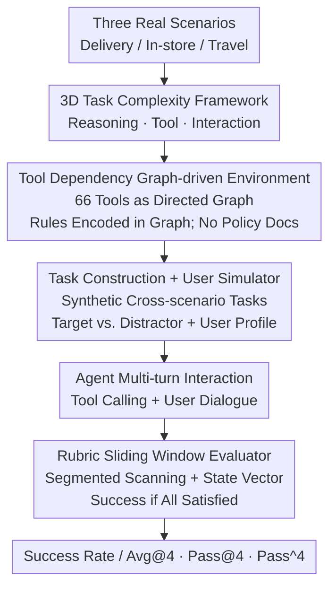

# VitaBench: Benchmarking LLM Agents with Versatile Interactive Tasks in Real-world Applications

**Conference**: ICLR 2026  
**OpenReview**: [https://openreview.net/forum?id=rtcX9qOBaz](https://openreview.net/forum?id=rtcX9qOBaz)  
**Code**: https://vitabench.github.io  
**Area**: Agent / LLM Evaluation  
**Keywords**: Agent Benchmark, Tool Calling, Multi-turn Interaction, User Simulator, Rubric Evaluation

## TL;DR
VitaBench abstracts three major life service scenarios—food delivery, in-store consumption, and online travel—into a sophisticated "life service" simulation environment containing 66 tools and 400 tasks. It replaces domain policy documents with tool dependency graphs to force autonomous exploration by agents and employs a rubric sliding window evaluator for scoring. Results indicate that even the strongest models achieve only a 30% success rate on cross-scenario tasks.

## Background & Motivation
**Background**: As the reasoning and tool-calling capabilities of LLMs enhance, agent benchmarks have evolved from single-turn API calls to multi-turn interaction scenarios. This has led to the emergence of benchmarks like $\tau$-bench, $\tau^2$-bench, ToolSandbox, and UserBench, which target "real-world" applications.

**Limitations of Prior Work**: Existing benchmarks only cover specific facets of real-world complexity. Early benchmarks (e.g., ToolBench, Gorilla) focus on function calling and parameter accuracy by increasing the number of tools or adding distractors, while ignoring dependencies between tools and environment states. Benchmarks like $\tau$-bench impose lengthy domain-specific policy documents and restricted action spaces, reducing "autonomous exploration" to "following instructions." Furthermore, many benchmarks fail to treat users as environmental components that introduce uncertainty, whereas real deployments are challenged by user ambiguity, changes of mind, and hidden intentions.

**Key Challenge**: A gap exists between laboratory benchmarks and real-world deployment. What exactly constitutes "task complexity" for agents in real applications? No existing benchmark simultaneously pressures agents across multiple dimensions of complexity.

**Goal**: This study aims to define the components of agent task complexity in the real world and construct a benchmark that maximizes difficulty across these dimensions.

**Key Insight**: Drawing from task complexity theory (Liu & Li, 2012), the authors decompose agent task complexity into three dimensions: reasoning complexity (amount of environmental information to be integrated), tool complexity (number of nodes and edge density when toolsets are modeled as graphs), and interaction complexity (user behavioral attributes and dynamics introduced by multi-turn dialogues).

**Core Idea**: Use tool dependency graphs to encode domain rules into the tool structure itself (eliminating policy documents and forcing autonomous exploration), synthesize cross-scenario tasks from multiple real user requests, and utilize a rubric sliding window evaluator for robust scoring.

## Method

### Overall Architecture
VitaBench is not a single model but a benchmark suite comprising "environment + tasks + evaluation." It focuses on three life service domains: Delivery, In-store, and Online Travel Agency (OTA). It defines 66 API tools and models the pre- and post-dependencies between tools as a directed graph, effectively embedding rules within the graph. The authors synthesized 400 tasks (100 cross-scenario tasks for main results and 300 single-scenario tasks), each with an independent environment: annotated user profiles, spatio-temporal contexts, service databases with "target items + distractors," and a rubric split into atomic criteria. During evaluation, the agent uses function-calling to interact with tools and database records while engaging in multi-turn dialogues with an LLM-based user simulator. The resulting trajectory is scanned by a rubric sliding window evaluator that maintains a state vector for criterion fulfillment. Success is defined only if all criteria are met.

The workflow consists of a two-stage construction pipeline and an evaluation loop:

### Key Designs

**1. 3D Task Complexity Framework: Decomposing "Real-world Difficulty" into Three Quantifiable Axes**

This framework serves as the conceptual foundation, addressing the issue that existing benchmarks only measure specific aspects of difficulty. Based on a POMDP formalization $(U, S, A, O, T, r)$, where the state is split into database state and user state $S = S_{db} \otimes S_{user}$, and user transition $T_{user}$ is stochastic (implemented by an LLM), task complexity is defined as $C_{task} = \langle C_{reason}, C_{tool}, C_{interact}\rangle$. Reasoning complexity is characterized by observation space entropy $H(O)$ and partial observability $\eta = 1 - \frac{|O|}{|S|}$. Tool complexity is quantified by the toolset graph $G=(V,E)$, involving node count $|V|$, edge density $\rho = \frac{|E|}{|V|(|V|-1)}$, and task-relevant subgraph coverage $\frac{|V_{task}|}{|V|}$. Interaction complexity is composed of user profile attributes, behavioral attributes (cooperativeness, goal ambiguity), and the evolving user state $S_{user}$. Analysis shows that tool complexity correlates strongly with task difficulty; cross-scenario tasks, despite having fewer items than the In-store domain, have the highest tool complexity (66 tools, 512 dependency edges) and the lowest success rate (16.2%).

**2. Tool Dependency Graph-driven Policyless Environment: Encoding Rules into Tool Structures**

To address the limitation where agents simply follow instructions from lengthy policy documents (as in $\tau$-bench), the authors annotate each tool with preconditions (states required for execution) and postconditions (expected outcomes). For example, `modify_order` requires `get_order_detail` to be executed first to obtain information. This natural workflow dependency is encoded directly into the graph. This provides two benefits: first, agents must infer "to do A, I must satisfy B," increasing reasoning complexity and restoring "autonomous exploration." Second, this structure supports flexible combinations of tools from different scenarios, allowing the same mechanism to generate both single-scenario and cross-scenario tasks. This is the root cause for VitaBench’s 50–100 interaction turns per task without explicit policy documents.

**3. Task Construction and Controlled User Simulator: Forcing Real Interaction via Distractors and Progressive Disclosure**

Task data comprises user profiles, task instructions, environment information, and rubrics. User profiles are derived from real platform data and anonymized, involving various emotional expressions (impatient, anxious, indifferent) and interaction styles (detail-oriented, dependent, logical). Instructions synthesize multiple user requests into complex goals. The environment info deliberately mixes "target items" (satisfying all constraints) with "distractors" (violating at least one constraint) to create a large search space. The user simulator possesses the full requirements but only reveals them progressively; implicit constraints must be actively queried by the agent. To prevent excessive stochasticity, the simulator uses prompts to maintain persona consistency and avoid fatal errors, balancing realism with reproducibility (information fidelity 9.48/10, persona consistency 9.34/10).

**4. Rubric Sliding Window Evaluator: Robust Judgment of Long, Multi-solution Trajectories**

Real-world trajectories are long (50–100 turns) and multi-solution (recommendation or planning behaviors may not alter the final database state), often exceeding the context length of evaluator models. The authors manually design a rubric $R = \{r_1, \dots, r_k\}$ for each task, consisting of atomic, objective, binary criteria (e.g., "restaurant within 500m," "user is vegetarian"). The evaluator splits the trajectory as overlapping windows $W_i$ with $\delta$ turns of overlap, extracting rubric-related info and maintaining a state vector $s \in \{0,1\}^k$. If a criterion is met in any window, its bit is set to 1; if retracted later, it is reset to 0. Success is defined by $\text{score} = \mathbb{1}[\sum_j s_j = k]$. Ablations show that removing the rubric causes Cohen's $\kappa$ with human judgment to plummet from 0.828 to below 0.07, and removing the sliding window drops $\kappa$ to 0.604.

## Key Experimental Results

### Main Results
Evaluation was conducted on 24 advanced models (categorized as thinking / non-thinking), running 4 trials per task at temperature 0.0. Reported metrics include Avg@4, Pass@4, and Pass^4.

| Setting | Best Model | Avg@4 | Pass@4 | Pass^4 |
|------|---------|-------|--------|--------|
| Cross-scenario (Main) | o3 (high) | 30.0 | 61.0 | 6.0 |
| In-store | LongCat-Flash-Thinking | 56.8 | 85.0 | 25.0 |
| Delivery | o3 (high) | 53.5 | 83.0 | 24.0 |
| OTA | o3 (high) | 37.8 | 66.0 | 10.0 |

Cross-scenario success rates drop significantly from over 50% in single domains to 30.0%, exposing fundamental weaknesses in action space expansion and cross-domain coordination. Difficulty does not scale with database size; the In-store domain has the most items but is the easiest due to fewer reasoning points.

### Ablation Study

| Configuration | Task Acc. | Rubric Acc. | Cohen's $\kappa$ | Note |
|------|----------|-------------|-----------|------|
| Baseline (Sliding Window + Rubric) | 95.0 | 88.5 | 0.828 | Full evaluator |
| w/o Sliding Window | 90.0 | 87.6 | 0.604 | Long context bias |
| w/o Rubric | 22.0 | – | 0.018 | $\kappa$ collapse (near random) |
| w/o Both | 32.0 | – | 0.067 | Same as above |

Interaction complexity ablation: Comparing Default User, Neutral User, and Solo Agent. Claude-4-Sonnet's performance increases from 21.25 to 27.75 when user interaction is removed, proving that user interaction itself is a significant source of difficulty.

### Key Findings
- **Rubrics are the lifeblood of the evaluator**: Removing rubrics collapses $\kappa$ from 0.83 to 0.02. Sliding windows resolve the context length limitations of judgment models.
- **Exploration is useful but unstable**: Pass@4 increases with more sampling, suggesting complex environments reward exploration, but Pass^4 is near zero, indicating extremely poor consistency even in the strongest models.
- **Thinking is more accurate and efficient**: Thinking models average 23.8% vs. 17.9% for non-thinking models, taking fewer turns (61.1 vs. 69.9) due to better step-by-step decomposition and precise clarification.
- **Failures are dominated by reasoning errors**: In cross-scenario tasks, reasoning errors account for 61.8% (decision 42.1% + constraint conflict 17.1%), tool usage errors 21.1%, and interaction errors 7.9%. Agents show poor self-awareness and weak error-correction capabilities.

## Highlights & Insights
- **Replacing policy documents with graphs** is a masterstroke: it encodes business rules into tool constraints, eliminating long prompts while increasing reasoning complexity and enabling natural cross-scenario combinations.
- **Quantifiable Framework**: The authors use $H(O)$, edge density $\rho$, and reasoning points to prove that tool complexity, rather than database scale, determines difficulty.
- **Sliding Window + Rubric Evaluation**: This paradigm is transferable to any agent task with long trajectories and multiple solutions. It upgrades the "state comparison" method of $\tau$-bench to a continuous maintenance of atomic criteria.
- **Users as Stochastic Environmental Components**: The progressive disclosure and knowledge boundaries of the user simulator force clarification, making it much more realistic than providing all instructions at once.

## Limitations & Future Work
- The potential for self-reinforcement / collusion bias remains since both the evaluator and user simulator are LLMs; while objective rubrics mitigate this, model-family preferences may persist.
- The simulator uses "controlled" realism for reproducibility; there is a trade-off between realism and stability, and the gap between simulators and truly unconstrained human users remains.
- The binary success metric might mask incremental improvements, although fine-grained rubric scores are available for detailed analysis.
- The 66 tools are still simplified abstractions. Real online systems involve more complex edge cases like concurrency and varied error handling.

## Related Work & Insights
- **vs. $\tau$-bench / $\tau^2$-bench**: While they introduced stateful execution and tool dependencies, VitaBench removes explicit policy documents, increases turns (50–100), and pressures agents across reasoning, tools, and interaction simultaneously.
- **vs. UserBench**: UserBench captures preference-driven interactions; VitaBench integrates this with composite goals, cross-scenario coordination, and dense tool dependencies.
- **vs. ToolSandbox / DialogTool**: VitaBench unifies environment, user, and tool graphs into a single POMDP and complexity framework, integrating the strengths of previous specialized benchmarks.

## Rating
- Novelty: ⭐⭐⭐⭐⭐ (Graph-based rules + 3D complexity framework + Sliding window rubrics).
- Experimental Thoroughness: ⭐⭐⭐⭐⭐ (24 models, 400 tasks, cross-model verification + error attribution).
- Writing Quality: ⭐⭐⭐⭐ (Clear formalization, though highly dense with symbols and appendices).
- Value: ⭐⭐⭐⭐⭐ (Significant headroom for model improvement; a high-quality benchmark for real-world agents).

<!-- RELATED:START -->

## Related Papers

- [\[ICLR 2026\] MCP-Bench: Benchmarking Tool-Using LLM Agents with Complex Real-World Tasks via MCP Servers](mcp-bench_benchmarking_tool-using_llm_agents_with_complex_real-world_tasks_via_m.md)
- [\[ACL 2026\] Shopping Companion: A Memory-Augmented LLM Agent for Real-World E-Commerce Tasks](../../ACL2026/llm_agent/shopping_companion_a_memory-augmented_llm_agent_for_real-world_e-commerce_tasks.md)
- [\[ICLR 2026\] Benchmarking LLM Tool-Use in the Wild](benchmarking_llm_tool-use_in_the_wild.md)
- [\[ICLR 2026\] TaskCraft: Automated Generation of Agentic Tasks](taskcraft_automated_generation_of_agentic_tasks.md)
- [\[ICLR 2026\] OpenAgentSafety: A Comprehensive Framework for Evaluating Real-World AI Agent Safety](openagentsafety_a_comprehensive_framework_for_evaluating_real-world_ai_agent_saf.md)

<!-- RELATED:END -->
