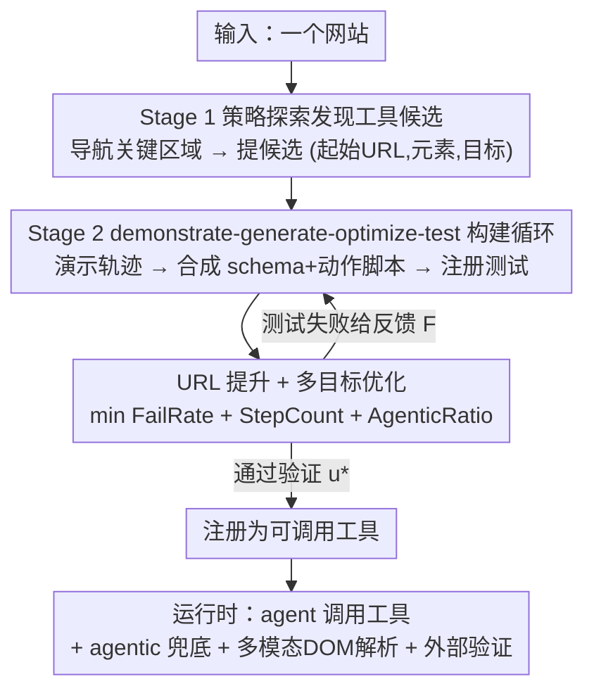

# WALT: Web Agents that Learn Tools

**Conference**: ICLR 2026  
**OpenReview**: [https://openreview.net/forum?id=cgIDqcJcoI](https://openreview.net/forum?id=cgIDqcJcoI)  
**Code**: https://github.com/SalesforceAIResearch/WALT  
**Area**: Agent  
**Keywords**: Web Agent, Tool Learning, Browser Automation, Reverse Engineering, URL Promotion

## TL;DR
WALT reverse-engineers functions already designed into websites (search, filter, sort, post, CRUD) into a set of deterministically callable tools. This shifts web agents from "reasoning step-by-step how to click and fill" to "directly calling `search(query)`," achieving SOTA on VisualWebArena (52.9%) and WebArena (50.1%) with fewer steps and lower reliance on LLM inference.

## Background & Motivation

**Background**: Making agents directly operate browsers to complete tasks is a promising direction. The mainstream approach involves dense LLM reasoning at every step—observing screenshots (often with Set-of-Mark bounding boxes) or parsing HTML, then executing atomic UI actions like clicking, typing, and navigating, relying on ReAct, chain-of-thought, or MCTS to select the next action.

**Limitations of Prior Work**: This incremental UI reasoning is highly fragile under dynamic layouts and long-horizon tasks. For a task like "find the cheapest blue kayak," traditional agents must reason how to use search boxes, locate filter controls, and determine sorting options while managing element selection and timing, often requiring 8+ brittle UI steps. Humans naturally think in terms of "website functions": search for kayak → filter by price → find the first blue one, abstracting away implementation details to focus on intent rather than interface mechanics.

**Key Challenge**: Existing "skill discovery" work attempts to reuse interaction patterns but suffers from two fundamental flaws. First, **where skills come from**: they are either mined from successful trajectories (solidifying existing behavior without expanding capabilities) or fabricated by the agent as imagined automations (often producing unintuitive, over-specialized, or irrelevant skills). Second, **how skills are implemented**: both approaches manifest skills as fragile UI action sequences sensitive to dynamic elements and design changes.

**Goal**: Discover and implement a set of **reliable, reusable, site-specific** high-level operations to make task execution both efficient and robust.

**Key Insight**: Website designers have already engineered "automations" like search bars, filters, sorting mechanisms, comment systems, and navigation controls into the site. Rather than having an agent learn fragile approximations of these patterns, it is better to "expose" the functions already existing within the site as tools.

**Core Idea**: Replace "agent-imagined skills" with "reverse-engineering existing website functions." By turning potential website features into callable deterministic tools with validated input schemas, the agent no longer reasons about "how" but focuses on calling `search(X)`, `filter(Y)`, and `sort(Z)`, shifting compute from brittle step-by-step reasoning to reliable tool calls.

## Method

### Overall Architecture

WALT remodels browser automation as "tool discovery and usage": tools are high-level, callable operations that abstract away fragile low-level interactions. Formally, given a set of websites $W=\{w_1,\dots,w_n\}$ and tasks $T$, whereas ordinary agents use atomic actions $A_{prim}=\{a_{click}, a_{type}, a_{navigate},\dots\}$ to solve tasks, WALT aims to discover and implement tools $u: S \to Goal$ (where $S$ represents structured input parameters and $Goal$ the target result) to be added as high-level actions $A_{tools}$ to the agent's action space.

The entire pipeline consists of two stages and is completed **entirely offline** (tools are discovered during an exploration phase and called during runtime, ensuring efficiency and reliability): **Stage 1** involves a browser agent strategically exploring websites to propose tool candidates; **Stage 2** executes a demonstrate-generate-optimize-test loop for each candidate to build it into a verified executable tool. Each tool is backed by an action script that **prioritizes determinism** (URL/DOM operations) and inserts agentic steps only when necessary. Only tools that pass validation are exposed to the agent at runtime.

### Key Designs

**1. Stage 1: Strategic Exploration for Tool Discovery**

To address the "where skills come from" issue—where mining trajectories limits behavior and imagination produces junk—WALT employs a browser agent $B_{browser}$ to **systematically explore user-facing website sections** and actively identify reusable functional patterns. It is prompted to navigate to key areas (content browsing, discovery/search, communication interfaces) and perform targeted interactions to discover interactive elements: hovering to reveal menus, clicking to expose navigation structures, and interacting with forms to understand input fields.

After exploration, the agent strategically proposes a set of tool candidates with **clear user intent**, optimizing for coverage (functional diversity) and minimizing redundancy. Each candidate $\tilde{u}=(s_i, E_i, G_i)$ specifies a starting URL $s_i$, relevant interactive elements $E_i$, and a specific goal $G_i$. Thus, discovered tools naturally correspond to "existing site functions" (discovery: search/filter/sort; communication: post/comment/like; content management: add/edit/delete) rather than arbitrary skills.

**2. Stage 2: demonstrate-generate-optimize-test Construction Loop**

To address the "how skills are implemented" issue—where simple UI sequences are too brittle—WALT uses a four-step loop to transform a candidate $\tilde{u}$ into a validated tool. **Demonstrate**: $B_{browser}$ demonstrates the function and records a detailed trajectory $X$ (atomic actions, DOM states with stable selectors/fallbacks, URL changes, and real test inputs $I_{test}$), using multiple input combinations to reverse-engineer the underlying structure (e.g., identifying required vs. optional fields and valid value ranges). **Generate**: A specialized tool-building agent $B_{tool}$ synthesizes the trajectory into an executable tool containing three parts: a structured input schema $S$ with validated data types (e.g., converting dropdowns to enums, marking optional fields, providing examples), a tool description of purpose/preconditions/results, and a sequential action script. Script steps categories include: navigation (URL/route changes), extraction (capturing DOM state), UI interaction (click/type), and agentic (dynamic interaction). $B_{tool}$ is **deliberately biased toward deterministic operations** (navigation and interaction) to improve robustness and efficiency, allowing agentic steps only for dynamic or ambiguous interfaces (e.g., lazy loading, uploads).

**3. URL Promotion + Multi-objective Optimization**

This process refines tools from "functional" to "fast, stable, and deterministic." **Optimize**: After generating the script, $B_{tool}$ attempts to reverse-engineer parameterizable URL routes (e.g., `?query=X&category=Y`), replacing multi-step UI sequences with a single navigation step. **Validate**: The tool $(u, S, I_{test})$ is registered as a callable action, and a new $B_{browser}$ executes it end-to-end on verified inputs $I_{test}$. Failures generate structured feedback $F$ (selector drift, missing enum values, timing issues, semantic mismatches), which $B_{tool}$ uses to refine selectors (prioritizing stable hashes), complete the schema, or revert aggressive URL promotions. Formally, Stage 2 iterations minimize:

$$\min \; \text{FailRate}(u, I_{test}) + \text{StepCount}(u) + \text{AgenticRatio}(u)$$

where FailRate is the portion of failed test cases (accuracy), StepCount is the number of atomic operations (efficiency), and AgenticRatio is the portion of steps requiring LLM inference (determinism). This loop continues until a verified tool $u^*$ is obtained or the budget is exhausted—marking the essential difference from prior one-off script extraction: WALT involves **stress testing and iterative optimization**.

**4. Runtime Fallbacks + Two Universal Tools**

Even stable tools may encounter unexpected issues (e.g., major site updates). WALT equips the agent with an **agentic fallback**: if a script fails during runtime, it temporary spawns a fresh agent to handle the task as a fail-safe. Additionally, two universal tools are exposed: a **Multimodal DOM Parser**, which converts HTML into interleaved markdown and visual inputs for simultaneous text-vision reasoning, and an **External Verification Tool**, which independently checks agent-reported results (following the SGV/WebJudge approach) to mitigate LLM self-approval bias. Together, these ensure that deterministic tools handle high-frequency paths while fallbacks and verification manage long-tail robustness.

### Example: Learning a search tool on VisualWebArena

Take the search tool in Fig.1: **Proposal** — The browser agent explores the site and proposes a search candidate based on the search interface. **Demonstration** — $B_{browser}$ runs a sample search (query="bicycle", category="bikes"), recording DOM interactions (typing in search box, selecting category, submitting) and observing URL changes. **Generation** — $B_{tool}$ analyzes the trajectory, generates an initial UI-based script, then applies URL promotion for a more efficient route-based implementation, while extracting validated category enums (Bikes=7, Cars+trucks=10...) for the input schema. **Validation** — Testing with diverse inputs results in failures (e.g., missing a category option) which triggers schema refinement until passing.

The final tool looks like this (simplified): `search_listings(sPattern: string[≥4], [sCategory]: enum[Boats=8,...], [bPic]: bool, [sPriceMin/Max]: float)`, with the precondition "callable from any page." The script is two steps: `goto(base/index.php?page=search)` then `goto(...?sPattern=X&sCategory=Y&...)`. Thus, "8+ brittle UI steps" are compressed into "1 robust call."

## Key Experimental Results

The base agent uses GPT-5 as the VLM planner and GPT-5-mini as the executor. Observations include screenshots, SoM boxes, and interactive element lists. Max 30 steps with replanning every 15 steps. The verification LLM is GPT-5-mini. Implementation is built on browser-use/workflow-use.

### Main Results

Success rates on VisualWebArena (910 vision-grounded tasks across three sites):

| Method | Classifieds | Shopping | Reddit | Average |
|------|-------------|----------|--------|------|
| GPT-4V+SoM | 9.8 | 17.1 | 19.3 | 16.4 |
| TreeSearch | 26.5 | 29.0 | 20.5 | 26.4 |
| Computer-Use (Claude) | 36.7 | 21.9 | 27.5 | 27.0 |
| ExaCT | 41.0 | 32.3 | 28.7 | 33.7 |
| SGV | 52.0 | **57.0** | 33.0 | 50.2 |
| **WALT (Ours)** | **64.1** | 53.4 | **39.0** | **52.9** |
| Human | 91.7 | 88.4 | 87.1 | 88.7 |

WALT achieves the highest average score (52.9%), with Classifieds being +12.1 absolute points higher than SGV and Reddit being +6.0 higher, nearly doubling the performance of Claude Computer-Use. On WebArena (812 tasks, 6 splits), it averages 50.1%, ranking best in 5 out of 6 splits and roughly 9 points higher than the strongest skill induction method, ASI (40.4%).

| Method | Gitlab | Map | Shopping | CMS | Reddit | Multi | Average |
|------|--------|-----|----------|-----|--------|-------|------|
| AWM | 28.9 | 39.4 | 34.8 | 39.0 | 51.9 | 18.8 | 35.5 |
| ASI | 32.2 | 43.1 | 40.1 | 44.0 | **54.7** | 20.8 | 40.4 |
| Hybrid Agent (w/ API docs)| 44.4 | 45.9 | 25.7 | 41.2 | 51.9 | 16.7 | 38.9 |
| **WALT (Ours)** | **57.0** | **58.7** | **41.2** | **56.2** | 48.5 | **20.8** | **50.1** |

### Ablation Study

Backbone-based ablation on VisualWebArena-Classifieds (9 tools available):

| Configuration (backbone / tools / dom / verify) | Avg. Steps ↓ | Success Rate ↑ |
|------|---------|---------|
| gpt-5-mini / none / text / self | 8.9 | 57.5 |
| gpt-5-mini / **discovered** / text / self | 6.5 (−27%) | 61.5 (+7.0) |
| gpt-5-mini / **human demo** / text / self | 7.4 | 66.0 (Upper) |
| gpt-5-mini / none / **multimodal** / self | 7.5 | 59.0 (+2.6) |
| gpt-5-mini / none / text / **external** | 11.0 | 59.4 (+3.3) |
| gpt-5-mini / **discovered+multimodal+external** | 7.0 (−21.3%) | **64.1** |

Online-Mind2Web (139 real sites, 300 tasks): WALT autonomously discovers **252 verified tools**. On 238 tasks without environment errors, it shows a **+20.5%** relative success rate gain (42.9→51.2) and +23.3% efficiency (10.8→8.2 steps) over the no-tool baseline, approaching the Claude Computer-Use leaderboard (51.2% vs 51.7%) without site-specific training. Tool composition: URL Promotion 31.7%, UI Only 15.1%, Agentic 23.8%, Mixed 29.4%.

### Key Findings
- **Tools are the primary driver of gains**: A baseline with the same architecture but no tools performs significantly worse, proving gains aren't just from a stronger GPT-5; tools provide up to 30.7% relative improvement and 1.4× efficiency.
- **Stronger backbones benefit more**: Better reasoning improves "tool selection and composition" rather than low-level operations; and all backbones share the same (GPT-5 discovered) tools, showing that **learned tools are transferable across models**.
- **WALT nearly matches the human demonstration upper bound**: Human-demonstrated tools reach 66.0%, while fully automated WALT reaches 64.1% with 5% fewer steps.
- **Agentic steps are rare**: Only 3 out of 9 tools contain at least one agentic step; the shortest scripts correspond to URL promotion (discovery type), while the longest are deterministic UI interactions (content-management type).
- **Amortizable costs**: On Online-Mind2Web, 252 out of 305 candidates (82.6%) were verified, with an average of 1.75 attempts per tool and 1.81 tools per site. At ~$1.67 per tool and $0.12 per task inference cost, the investment pays off after ~14 reuses.

## Highlights & Insights
- **Reframing as "reverse-engineering site functions" is the key insight**: Instead of having agents invent skills, expose robust automations site designers already built. This addresses both "imagined skills are unreliable" and "UI sequences are brittle."
- **Triple-objective optimization (FailRate + StepCount + AgenticRatio) is effective**: Simultaneously optimizing for accuracy, efficiency, and determinism. AgenticRatio explicitly encodes "minimizing LLM reliance" into the objective.
- **URL Promotion is the high-value feature**: Folding multi-step UI sequences into a single parameterized navigation is fast and immune to layout changes.
- **Cross-model transferability**: Once discovered, tools can be reused by any backbone. Discovery can be centralized on the strongest models, while inference can be offloaded to cheaper ones.

## Limitations & Future Work
- **Offline discovery has a per-website cost**, and tool quality depends on both exploration coverage and what the site exposes; highly dynamic UIs, A/B testing, CAPTCHAs, and strong anti-automation can hinder determinism or URL promotion.
- **Schemas may miss rare parameter values**, selectors may drift after major site designs, and complex interactions like file uploads still require agentic steps.
- **Real-world challenges**: 62 tasks on Online-Mind2Web failed due to bot detection (35) or timeouts (27), and 22 sites (e.g., apartments.com, UPS.com) were untestable due to anti-scraping measures.
- Future work: **Online patching** for selector/schema drift, extracting universal web patterns (standardized forms for search/filter/sort) for generalization, and hybrid integration with official APIs or external MCP servers.

## Related Work & Insights
- **vs Skill Discovery (SkillWeaver / AWM / ASI)**: These usually mine skills from successful trajectories and assemble fragile UI sequences, essentially solidifying existing behavior. WALT systematically explores site functions, employing schema validation, selector stabilization, URL reverse-engineering, and targeted agentic fallbacks.
- **vs API-based Agents (Hybrid Agent, etc.)**: These assume API documentation is available; WALT **assumes no API documentation** and autonomously reverse-engineers callable tools with validated schemas (WebArena 50.1% vs Hybrid 38.9%).
- **vs Test-time Search (MCTS / reflective-MCTS)**: These rely on runtime search to select better action sequences, which remains incremental reasoning. WALT moves the heavy lifting to offline tool construction, allowing runtime to focus on high-level planning and reliable calls.

## Rating
- Novelty: ⭐⭐⭐⭐⭐ Reframing site functions into deterministic tools is a clean paradigm shift.
- Experimental Thoroughness: ⭐⭐⭐⭐⭐ Extensive results across three major benchmarks and 139 real sites with detailed cost/step analysis.
- Writing Quality: ⭐⭐⭐⭐⭐ Clear progression from motivation to the demonstrate-generate-optimize-test loop.
- Value: ⭐⭐⭐⭐⭐ Discover-once, reuse-anywhere tools with explicit contracts provide a practical path for maintainable browser automation.

<!-- RELATED:START -->

## Related Papers

- [\[ICLR 2026\] Web-CogReasoner: Towards Multimodal Knowledge-Induced Cognitive Reasoning for Web Agents](web-cogreasoner_towards_multimodal_knowledge-induced_cognitive_reasoning_for_web.md)
- [\[ICLR 2026\] How Dark Patterns Manipulate Web Agents](how_dark_patterns_manipulate_web_agents.md)
- [\[ICLR 2026\] ST-WebAgentBench: A Benchmark for Evaluating Safety and Trustworthiness in Web Agents](st-webagentbench_a_benchmark_for_evaluating_safety_and_trustworthiness_in_web_ag.md)
- [\[ICLR 2026\] Go-Browse: Training Web Agents with Structured Exploration](go-browse_training_web_agents_with_structured_exploration.md)
- [\[ICLR 2026\] WebFactory: Automated Compression of Foundational Language Intelligence into Grounded Web Agents](webfactory_automated_compression_of_foundational_language_intelligence_into_grou.md)

<!-- RELATED:END -->
