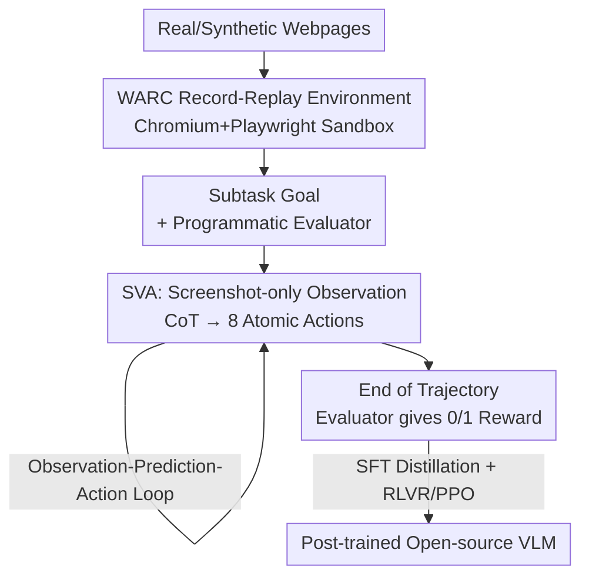

# WARC-Bench: Web Archive based Benchmark for GUI Subtask Executions

**Conference**: ICLR 2026  
**OpenReview**: [https://openreview.net/forum?id=Hgw56DUFzD](https://openreview.net/forum?id=Hgw56DUFzD)  
**Code**: https://sanjari-orb.github.io/warc-bench/ (Project Page)  
**Area**: Agent / Multimodal VLM  
**Keywords**: GUI Agent, Subtask Execution, Web Archive, Verifiable Reward, RLVR

## TL;DR
This paper introduces WARC-Bench, which uses Web Archive files to "freeze" real websites into sandbox-replayable interactive environments. It constructs an evaluation set of 438 tasks focusing on "medium-granularity subtasks" (e.g., date selection, slider dragging, scrolling containers to extract info) with automated scoring via programmatic verifiable rewards. Experiments show that even the strongest closed-source models achieve only 64.8% success, while an open-source 72B model trained by the authors via SFT + RLVR reaches 52.3%, surpassing most frontier models.

## Background & Motivation
**Background**: Web Agent research is currently split between two extremes. One end is **visual grounding**, testing single-step mapping such as "output the pixel coordinates of the 'Japanese' button" (e.g., ScreenSpot). The other end is **long-range multi-step navigation**, testing complete workflows like "order green Levi's women's jeans under $50 on Amazon" (e.g., WebArena, Mind2Web).

**Limitations of Prior Work**: Real browser tasks are actually composed of many **intermediate-granularity "subtasks"**—scrolling to explore a page, interacting with date pickers/dropdowns/menu bars, scrolling to extract entities, filling forms, modifying spreadsheet cells, or dragging sliders. Such tasks—where a single-sentence instruction to a human requires multiple atomic UI actions (1–20 steps)—are nearly absent in existing real GUI benchmarks. Grounding is too simple to cover interaction, while long-range navigation merges this layer into end-to-end success rates, making individual diagnosis impossible.

**Key Challenge**: Is poor long-range performance due to "failed planning" or an "inability to perform basic sub-capabilities like selecting a date or scrolling common containers"? Existing benchmarks conflate the two; furthermore, many benchmarks either rely on simulated environments (WebArena, OSWorld) with high expansion costs or run on live sites (risking write operations, lacking isolation, and relying on inconsistent human or LLM scoring).

**Goal**: (1) Formally define "GUI subtasks" as a level between grounding and long-range navigation; (2) Create a realistic, isolated, deterministically scored, and easily extensible subtask evaluation set; (3) Verify whether "performing well on subtasks" accurately predicts long-range navigation capability; (4) Explore how to train open-source models to compete with frontier closed-source models.

**Key Insight**: Use **Web Archive (WARC) files** to record real webpages along with HTML/CSS/JS/images/HTTP headers for high-fidelity replay in Chromium. This preserves complex controls and dense layouts of real sites while naturally supporting sandbox isolation, determinism, and scalability (adding environments equals adding a recording) without touching live online sites.

**Core Idea**: Evaluate an overlooked intermediate capability layer—GUI subtask execution—using "recorded-replayed real webpages + programmatic verifiable rewards," and prove it predicts long-range navigation better than grounding or low-fidelity widget tasks.

## Method

### Overall Architecture
WARC-Bench is not just a model but an **evaluation suite + accompanying Agent + training recipe**. It addresses how to reliably evaluate and enhance an Agent's subtask execution on real webpages. The framework consists of three parts: first, using **WARC recording-replay** to turn real/synthetic webpages into interactive sandbox environments, each paired with a natural language **subtask goal** and a **programmatic evaluator**; second, allowing an Agent (the author-designed **SVA** or various computer-use agents) to run an "observation-prediction-action" loop, receiving a 0/1 reward from the evaluator at the end of the trajectory; finally, using these verifiable rewards to drive **SFT + RLVR** training to elevate open-source VLMs to frontier levels.

### Key Designs

**1. WARC Record-Replay Environment: Reality, Isolation, and Scalability via Snapshots**
To solve the trade-off between live sites (non-isolated) and simulated environments (unrealistic/hard to scale), the authors record the **complete state** of webpages using Web Archive files. This includes not just HTML, but CSS, JS, images/videos, and even HTTP headers/metadata. The resulting trajectories are **fully replayable** clones of real interactions. They implemented a lightweight WARC replayer using Playwright in Chromium, similar to ReplayWeb.page, and wrapped tasks as Gym environments compatible with BrowserGym or verl-agent. This design achieves four attributes: **High Fidelity** (real replication), **Task Isolation** (each task runs an independent copy), **Scalability** (adding environments is just recording a page), and **Diverse Observation Space**. The trade-off (noted limitation) is that unrecorded interactions or those unreplayable from stored HTML/JS (like Cloudflare/anti-bot sites or URIs with session IDs) require careful handling.

**2. Programmatic Verifiable Rewards: Path-Independent and Deterministic Scoring**
Subtask evaluation suffers if scoring is "correct but judged wrong" or fluctuates via LLM. This work pairs each task with a **code-based evaluator** that checks the **final state** of the webpage. This makes evaluation **independent of the Agent's specific path**—success is defined solely by whether the page reached the correct state. Evaluators support 4 types: (a) JS functions (e.g., `document.querySelector('#riskslider').value=='4'`), (b) URL matching, (c) String matching, and (d) JSON matching (for information extraction). Since goals are designed with unique final states, these programmatic rewards serve as both evaluation metrics and the RLVR reward signal.

**3. Dual-source Data Construction: Balancing Realism and Scale**
To ensure coverage and realism, the authors identified **15 common subtask categories** (Menu navigation, Form filling, Data extraction, Table manipulation, Datepicker, Icon recognition, Drag & drop, List navigation, Dropdown, Location, Search autocomplete, Document editing, Dialog, Pagination, Calculation). Data was built two-fold: **Real Side** with 29 recordable sites (GitHub, Zendesk, Google Earth, etc.) where goals were **human-annotated**; **Synthetic Side** using an LLM pipeline to generate 62 webpages with rich UI widgets, later **manually verified** for correctness. The final set includes 1497 subtasks: **Train 1059 (Synthetic) / Dev 238 (Real+Synthetic) / Test 200 (All Real)**. Testing on purely real sites highlights the gap between synthetic and real-world performance.

**4. SVA + SFT/RLVR Training Recipe: Boosting Open-source Models**
For fair evaluation and as a training backbone, the authors designed the **Subtask Vision Agent (SVA)**: it takes "Goal + Current Screenshot + Action Space + History (up to 5 steps)" and outputs CoT plus an action. It uses **screenshot-only observation** (discarding accessibility trees/DOM to avoid context overhead and faithfully represent modern UI) with 8 atomic actions (click, complete, drag&release, hover, key press, scroll, type, wait). SVA is simpler yet stronger than many specialized computer-use agents. Training occurs in two stages: **SFT via Teacher Distillation** (collecting ~12k trajectories from strong teacher models across Common Crawl and component libraries) and **RLVR via PPO** on 1059 synthetic Gym tasks using a simple success (+10) or failure (0) reward signal.

## Key Experimental Results

### Main Results
Success Rate on WARC-Bench Test set (200 real tasks). CUA denotes the manufacturer's provided computer-use agent; others use SVA. Results are averages of 3 runs:

| Model | Dev[TOTAL] | Test | Note |
|------|-----------|------|------|
| Claude Sonnet 4.0 (SVA) | 83.61 | **64.83** | Highest overall |
| Claude Sonnet 3.7 | 81.93 | 59.83 | Second highest |
| GPT-5 (o1) | 69.89 | 51.33 | |
| Claude Sonnet 4.0 (CUA) | 78.96 | 47.17 | SVA outperforms dedicated CUA |
| OpenAI computer-use-preview (CUA) | 58.96 | 33.83 | |
| Qwen2.5-VL 72B (Base) | 61.06 | 37.33 | Strongest open-source base |
| **Ours-72B-SFT** | 75.88 | 48.33 | +11 over Base |
| **Ours-72B-RLVR** | **84.31** | **52.33** | +4 over SFT, beats most frontiers |
| Qwen2.5-VL 7B (Base) | 15.54 | 4.67 | |
| Ours-7B-SFT | 66.54 | 27.33 | +22.7 over Base |
| Ours-7B-RLVR | 72.13 | 29.17 | |

Key Signals: (1) Even the best models only reach 64.8%, showing subtasks remain difficult; (2) **SVA design generally outperforms manufacturer CUA** for the same model; (3) SFT distillation significantly boosts performance (7B: 4.67%→27.33%, 72B: 37.33%→48.33%); (4) RLVR further improves performance, showing that training on synthetic data lifts performance on real-world tasks.

### Cross-benchmark Correlation Analysis

| Model | WARC-Bench(test) | WebArena(no map) | MiniWoB++ | ScreenSpot V2 |
|------|------------------|------------------|-----------|---------------|
| Qwen2.5-VL 72B | 37.33% | 15.68% | 53.87% | **88.05%** |
| GPT-5 (o1) | 51.33% | 34.06% | 52.27% | 26.39% |
| Claude 4 Sonnet | **64.83%** | **37.96%** | **71.73%** | 85.06% |
| Ours-72B-RLVR | 52.33% | 26.80% | 59.20% | 82.44% |

Core Findings: **Grounding (ScreenSpot) and low-fidelity widget (MiniWoB++) tasks correlate poorly with long-range navigation (WebArena)**. For example, Qwen2.5-VL 72B leads in grounding but fails in long-range tasks. Conversely, **WARC-Bench rankings align with WebArena**, suggesting subtask execution is a prerequisite for long-range navigation. Additionally, models fine-tuned on subtasks show improvements across almost all benchmarks (except pure grounding) including the long-range WebArena.

### Key Findings (RLVR Behavioral Analysis)
- **Greatest Gains in Dynamic Tasks**: Categories requiring exploration and precise interaction, such as filling forms, menu navigation, and date-pickers, saw the most improvement (e.g., datepicker 0.655→0.964).
- **Higher Efficiency**: RLVR models use scrolling more effectively for exploration and produce shorter trajectories, averaging **0.94 fewer steps** than SFT models.
- **Real vs. Synthetic Gap**: All models perform worse on real tasks than on synthetic ones, confirming that synthetic data cannot fully replace real-world test sets.

## Highlights & Insights
- **Using WARC files as evaluation environments** is the cleverest move: it leverages a mature archiving format to achieve realism, isolation, scalability, and safety, lowering the cost of "creating real GUI environments" to simply "recording a session."
- **Verifiable rewards serve two purposes**: The same programmatic evaluators provide deterministic scoring and act as RLVR reward signals, eliminating the need for a separate reward model.
- **Insights on the "Intermediate Layer"**: Clearly identifying the subtask layer between grounding and long-range tasks—and proving its predictive power for long-range success—provides empirical justification for this focus.
- **SVA outperforming vendor CUAs** suggests that screenshot-only observations with a minimal action space and short history may be more efficient than many current complex computer-use frameworks.

## Limitations & Future Work
- **WARC Replay Coverage**: Interactions not recorded or not replayable from stored HTML/JS (e.g., anti-bot sites, dynamic session URIs) remain out of reach, potentially introducing selection bias.
- **Subtasks are still "Short-range"**: Defined within 1–20 atomic actions; long-range planning and cross-page state maintenance are not evaluated.
- **Dominance of Synthetic Training Data**: The training set is purely synthetic, and RLVR is performed only in synthetic environments; real-world improvements rely on transfer.
- **Reliance on Unique Final States**: Programmatic scoring assumes a single correct final state, which may miss valid alternative solutions in open-ended information extraction or editing tasks.

## Related Work & Insights
- **vs. WebArena / OSWorld**: These test long-range navigation but are costly to expand. WARC-Bench targets intermediate subtasks and expands easily via recording.
- **vs. Mind2Web / Online-Mind2Web**: Mind2Web is offline, non-interactive, and lacks deterministic final-state rewards.
- **vs. ScreenSpot V2 / MiniWoB++**: These are shown to correlate weakly with long-range capabilities, whereas WARC-Bench provides a stronger predictive signal.

## Rating
- Novelty: ⭐⭐⭐⭐⭐ First real GUI subtask benchmark based on Web Archive; insightful positioning of "intermediate granularity."
- Experimental Thoroughness: ⭐⭐⭐⭐⭐ Covers closed/open/CUA models, cross-benchmark correlation, and SFT/RLVR behavioral analysis.
- Writing Quality: ⭐⭐⭐⭐ Clear motivation and complete charts; some implementation details are relegated to the appendix.
- Value: ⭐⭐⭐⭐⭐ Bridges an evaluation gap and provides a verifiable reward-driven training recipe for Web Agents.

<!-- RELATED:START -->

## Related Papers

- [\[ICLR 2026\] ST-WebAgentBench: A Benchmark for Evaluating Safety and Trustworthiness in Web Agents](st-webagentbench_a_benchmark_for_evaluating_safety_and_trustworthiness_in_web_ag.md)
- [\[CVPR 2026\] GUI-CEval: A Hierarchical and Comprehensive Chinese Benchmark for Mobile GUI Agents](../../CVPR2026/llm_agent/gui-ceval_a_hierarchical_and_comprehensive_chinese_benchmark_for_mobile_gui_agen.md)
- [\[ICLR 2026\] SMAN-Bench: A Cross-System Benchmark for Mobile Agents under Single- and Multi-path, Ambiguous, and Noisy Tasks](sman-bench_a_cross-system_benchmark_for_mobile_agents_under_single-_and_multi-pa.md)
- [\[ICLR 2026\] Terminal-Bench：在命令行界面上对智能体进行困难、真实任务的基准测试](terminal-bench_benchmarking_agents_on_hard_realistic_tasks_in_command_line_inter.md)
- [\[ICLR 2026\] TRAJECT-Bench：一个轨迹感知的智能体工具调用评测基准](traject-bencha_trajectory-aware_benchmark_for_evaluating_agentic_tool_use.md)

<!-- RELATED:END -->
