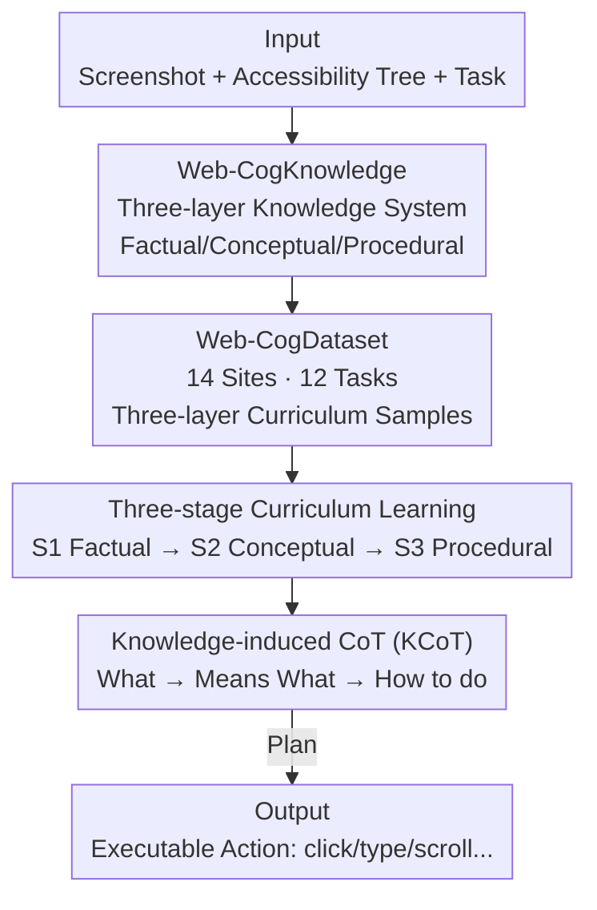

# Web-CogReasoner: Towards Multimodal Knowledge-Induced Cognitive Reasoning for Web Agents

**Conference**: ICLR 2026  
**OpenReview**: [https://openreview.net/forum?id=siXHlHBYIe](https://openreview.net/forum?id=siXHlHBYIe)  
**Project Page**: [https://Gnonymous.github.io/Web-CogReasoner](https://Gnonymous.github.io/Web-CogReasoner)  
**Code**: https://github.com/Gnonymous/Web-CogReasoner (Available)  
**Area**: Agent / Multimodal VLM  
**Keywords**: Web Agent, Bloom's Taxonomy, Knowledge-induced CoT, Curriculum Learning, Multimodal

## TL;DR
By drawing on Bloom's Taxonomy, this paper decouples Web Agent capabilities into two stages: "Knowledge Content Learning" and "Cognitive Processes." It constructs a three-layered Web-CogKnowledge system (Factual/Conceptual/Procedural), a supporting Web-CogDataset, and a Web-CogBench. Through three-stage curriculum learning and knowledge-induced CoT, Web-CogReasoner is trained. With only 7B parameters, it surpasses open-source agents of the same scale on multiple web navigation benchmarks and demonstrates strong generalization on unseen tasks due to structured knowledge.

## Background & Motivation

**Background**: Web Agents have evolved from early rule-based systems to current multimodal solutions based on LLM/LVM. Text-based agents convert HTML or Accessibility Trees into natural language prompts for reasoning; vision-based agents map screenshots directly to actions; and hybrid models fuse both paths. Multimodal Large Language Models (MLLMs) enable agents to "see" webpages and interact with digital environments like humans.

**Limitations of Prior Work**: While LLM/LVMs pre-trained on general corpora provide a solid foundation, they encounter performance bottlenecks in specialized web tasks due to a lack of systematic and specialized webpage knowledge. Furthermore, previous "knowledge enhancement" methods often lack systematic or theoretical grounding, involving unstructured data injection without a clear strategy regarding what knowledge to inject or in what order.

**Key Challenge**: The authors argue that the root cause lies in confounding "knowledge" with "cognitive reasoning." For an agent to perform effective cognitive reasoning, it must **first** possess a sufficient knowledge base. Without a solid foundation of factual and conceptual knowledge, training high-level planning and exploration capabilities directly yields suboptimal results. In other word, knowledge acquisition and reasoning application are two distinct issues that should be addressed hierarchically.

**Goal**: To formally decompose Web Agent capabilities into two sequential stages—Knowledge Content Learning (learning "what it is") and Cognitive Processes (learning "how to do it")—and provide a knowledge system, training data, and evaluation metrics for each stage.

**Key Insight**: The authors adopt Bloom's Taxonomy from educational psychology, which is a "shallow-to-deep" pedagogical theory: first establish facts and concepts, then develop complex procedural abilities. This aligns with human learning trajectories—accumulating knowledge through education before learning to apply, innovate, and create. Mapping this paradigm to the web domain provides a natural training curriculum.

**Core Idea**: Utilizing a three-layer curriculum of "Factual Knowledge → Conceptual Knowledge → Procedural Knowledge" combined with explicit Knowledge-induced Chain-of-Thought (KCoT) to enable the web agent to first memorize the web world, then understand it, and finally explore it.

## Method

### Overall Architecture

The workflow consists of four steps: "Framework Construction → Data Synthesis → Benchmark Establishment → Model Training." First, the **Web-CogKnowledge** system is proposed based on Bloom's Taxonomy, dividing web knowledge into Factual, Conceptual, and Procedural layers, corresponding to Memorizing, Understanding, and Exploring cognitive abilities. Second, multimodal metadata is collected from 14 real websites to build the **Web-CogDataset**, covering 12 fine-grained tasks (approximately 81K / 27K / 62K samples for each layer). Task difficulty scales from identifying element attributes to multi-step goal-oriented interactions under real-world constraints. Third, a subset is selected to form **Web-CogBench** (876 questions) to evaluate agents across memory, understanding, and exploration dimensions. Finally, knowledge is injected into Qwen2.5-VL-7B using three-stage curriculum learning (S1→S2→S3) to train **Web-CogReasoner**. During inference, the task is modeled as a Partially Observable Markov Decision Process (POMDP) $P=(S,A,O,K,T,R)$. For each step, it receives a screenshot and an Accessibility Tree to generate a **Knowledge-induced CoT (KCoT)**: asking "what is on the page" (Factual), "what does it mean" (Conceptual), and "how to complete the task" (Procedural), converting prompts into executable actions.

### Key Designs

**1. Web-CogKnowledge: Categorizing Web Knowledge via Bloom's Taxonomy**

Addressing the pain point that "prior knowledge enhancement lacked theoretical support and clarity on what knowledge to inject," the authors map the two stages of Bloom's Taxonomy (Knowledge Learning / Cognitive Process) to the web domain, defining three layers. **Factual Knowledge** refers to specific information extracted from web content, such as identifying individual element attributes or predicting direct consequences of an interaction. **Conceptual Knowledge** involves semantic relationships and abstract patterns behind structure, such as inferring component functions, understanding page intent/layout, and interpreting multimodal content. **Procedural Knowledge** includes the operational know-how for completing tasks, such as planning, decision-making, and sequential execution (e.g., executing goal-oriented action sequences, inferring user intent from behavior, or handling pop-up interruptions). Each layer corresponds to a cognitive ability required for web reasoning, anchoring the "memorize-understand-explore" chain to specific knowledge types.

**2. Web-CogDataset: 12 Progressive Tasks for Knowledge Injection**

Knowledge categorization requires data for training. The authors crawled metadata from 14 representative websites and designed 12 fine-grained task families aligned with the three knowledge layers. The Factual layer (~81K) includes element attribute identification, child element prediction, page change prediction, next page prediction, and source element prediction. The Conceptual layer (~27K) includes element understanding, webpage understanding, and Caption & QA. The Procedural layer (~62K) includes user intent prediction, pop-up closing, single-step web tasks, and noisy multi-step web tasks. These tasks are designed with increasing difficulty—from identifying the "role" and "name" of an element to real-world tasks like "finding real estate in Houston under a $500 budget." This replicates human learning trajectories, ensuring high-level reasoning is built upon solid perceptual and conceptual foundations.

**3. Three-stage Curriculum Learning: Layered S1→S2→S3 Injection**

This implements the core claim that "knowledge must precede reasoning." The authors perform Supervised Fine-Tuning (SFT) on Qwen2.5-VL-7B. Instead of mixing all data, they incrementally inject data according to the order of Factual (S1) → Conceptual (S2) → Procedural (S3). Ablation studies show specific gains for each stage: adding S1 Factual knowledge increased the Memorizing score from 67.6 to 85.5 (+17.9); adding S2 Conceptual knowledge raised Understanding from 64.2 to 75.5 (+11.3); and S3 Procedural knowledge raised Exploring from 65.8 to 85.0 (+19.2), with the overall score reaching 84.4. A critical dependency was observed: an S3-only model had decent Exploring scores (78.0) but poor overall performance (60.66), while S1+S3 nearly doubled the success rate on the WebVoyager subset (23.47%) compared to S3-only (13.14%)—confirming that procedural exploration depends on an accurate factual foundation.

**4. Knowledge-induced CoT (KCoT): Explicit Step-by-step Reasoning**

KCoT serves to activate latent knowledge during inference. It explicitly breaks reasoning into three chains: Factual (identifying elements/states), Conceptual (inferring roles/interaction meanings), and Procedural (planning goal-oriented steps), forming a flow of "Task Prompt → KCoT → Plan → Action." In an Apple Store example, the model outputs a task review, layout description, and key element analysis before performing task decomposition and action output (e.g., `Action: Type [20]; 90028`). Ablation showed that with full S1+S2+S3 data, removing KCoT plummeted the online success rate from 42.9% to 25.35%, proving KCoT is the bridge between "possessing knowledge" and "dynamically applying knowledge."

### Example: Finding a Store by ZIP Code on the Apple Website

Given the task: "Find Apple Stores close to the zip code 90028," the agent receives a screenshot and Accessibility Tree of the "Find a Store" page. The **Factual layer** identifies elements: navigation bar, search box `[20] search 'find store'`, store list, etc. The **Conceptual layer** understands their meaning: the search box filters by location/ZIP, and store items link to details. The **Procedural layer** plans: enter the ZIP code into the search box, then check the updated list. The model outputs: `Action: Type [20]; 90028`. KCoT connects "seeing-meaning-doing" into an interpretable chain.

### Loss & Training

The base model is Qwen2.5-VL-7B using imitation learning-style SFT. Inputs are tuples of screenshots, Accessibility Trees, and reasoning trajectories. Training proceeds incrementally through S1 (Factual) → S2 (Conceptual) → S3 (Procedural). The action space includes `click / type / scroll / dbclick / go_back / go_forward / stop / Restart / Wait`. While current training relies on IL, the authors plan to introduce Reinforcement Learning (RL) in the future to enhance exploration and discovery of procedural knowledge.

## Key Experimental Results

### Main Results

On Web-CogBench (876 questions across Memorizing/Understanding/Exploring), Web-CogReasoner surpasses all open-source baselines and approaches top commercial models at 7B scale:

| Model | Memorizing | Understanding | Exploring | Overall |
| :--- | :--- | :--- | :--- | :--- |
| Claude Sonnet 4 | — | — | — | 76.8 |
| Gemini 2.5 Pro | — | — | — | 80.2 |
| Qwen2.5-VL-7B (Base) | 67.6 | 61.0 | 77.9 | 69.8 |
| UI-TARS-7B-SFT | — | — | — | 46.4 |
| **Web-CogReasoner (Ours)** | **90.8** | 74.1 | **85.0** | **84.4** |

Notably, UI-TARS scored high on VisualWebBench (86.0%) but only 46.4% on Web-CogBench, indicating that strong visual perception does not equate to robust cognitive reasoning. Web-CogReasoner reached 86.3% on VisualWebBench, integrating both capabilities.

Online task performance:

| Benchmark | Metric | Qwen2.5-VL-7B | OpenWebVoyager-IL | OpenWebVoyager-Max | **Ours** |
| :--- | :--- | :--- | :--- | :--- | :--- |
| WebVoyager | Success Rate | 2.2% | 18.1% | 26.2% | **30.2%** |
| Mind2Web Cross-Task | Success Rate | 1.0% | 6.3% | 20.5% | 17.0% |
| Mind2Web Cross-Web | Success Rate | 1.0% | 6.6% | 11.7% | 10.1% |

Ours outperformed OpenWebVoyager-Max on WebVoyager. On Mind2Web, it outperformed OpenWebVoyager-IL without task-specific fine-tuning, demonstrating strong generalization.

### Ablation Study

| Config | Memorizing | Understanding | Exploring | Overall | Note |
| :--- | :--- | :--- | :--- | :--- | :--- |
| Base (Qwen2.5-VL-7B) | 67.6 | 61.0 | 77.9 | 69.8 | Base |
| + S1 Factual | 85.5 (+17.9) | 64.2 | 60.1 | 72.1 | Memory spike |
| + S2 Conceptual | 88.1 | 75.5 (+11.3) | 65.8 | 78.3 | Understanding spike |
| + S3 Procedural | 90.8 | 74.1 | 85.0 (+19.2) | 84.4 | Exploration spike |
| S3 only | 52.8 | 46.4 | 78.0 | 60.7 | Poor without foundation |
| S1+S3 | 85.1 | 53.5 | 82.3 | 76.2 | Factual reinforces high-level |

The role of KCoT (WebVoyager 4-site subset): S1+S2+S3 **w/o KCoT** scored 25.35%, while **w/ KCoT** jumped to 42.9%.

### Key Findings
- **Curriculum stages precisely improve corresponding cognitive dimensions**: S1 → Memorizing (+17.9), S2 → Understanding (+11.3), S3 → Exploring (+19.2), validating the knowledge layering.
- **Lower-level knowledge is a prerequisite for higher-level capability**: S1+S3 success rate nearly doubled S3-only on WebVoyager, proving exploration depends on factual foundations.
- **KCoT is the "Activator" of knowledge**: Online success rate nearly halved (42.9% → 25.35%) without it, proving explicit reasoning is needed to apply knowledge.
- **Generalization advantage is most prominent in unseen tasks**: Structured knowledge keeps the model robust in cross-task/cross-site scenarios like Mind2Web.

## Highlights & Insights
- **Systematic mapping of Bloom's Taxonomy to Web Agent training**: This provides a theoretical framework for "what to inject and in what order," rather than just increasing data volume.
- **Clean decoupling of "Knowledge vs. Reasoning"**: Ablations clearly separate "latent knowledge in data" from "knowledge activation through explicit reasoning."
- **Combination of Curriculum Learning and explicit Hierarchical CoT is transferable**: This paradigm could theoretically be applied to GUI agents or embodied navigation.
- **7B model approaching commercial model performance**: Scoring 84.4 on Web-CogBench (surpassing Claude Sonnet 4) shows the high leverage of structured knowledge on small models.

## Limitations & Future Work
- **Reliance on Imitation Learning**: Current work lacks autonomous exploration from Reinforcement Learning, which is planned for future work.
- **Gap in online generalization**: On Mind2Web, Ours still lags behind commercial giants (e.g., Claude 40.2%/21.7%).
- **Site-dependent knowledge base**: The framework is built around 14 sites; scaling to structurally different or highly dynamic sites may require broader knowledge coverage.
- **Conceptual layer data volume**: The Understanding dimension slightly dipped after S3 (+S3, 75.5 → 74.1), suggesting minor interference between conceptual and procedural training.

## Related Work & Insights
- **vs. OpenWebVoyager**: While OpenWebVoyager uses end-to-end imitation, this work introduces three-layer knowledge curricula and KCoT, exceeding the "Max" variant of OpenWebVoyager in zero-shot settings.
- **vs. UI-TARS**: UI-TARS focuses on visual perception but lacks structured cognitive knowledge, leading to lower performance on reasoning-heavy benchmarks.
- **vs. GUI Understanding (CogAgent, etc.)**: While those focus on perception (OCR, localization), this work integrates perception into Factual/Conceptual layers and adds a Procedural layer for planning and execution.

## Rating
- Novelty: ⭐⭐⭐⭐⭐ Systematically maps Bloom's Taxonomy to Web Agent curricula and reasoning.
- Experimental Thoroughness: ⭐⭐⭐⭐ Solid proof via four benchmarks and detailed ablations, though online competitiveness against top commercial models is still developing.
- Writing Quality: ⭐⭐⭐⭐ Clear framework and diagrams; some definitions require referring to the appendix.
- Value: ⭐⭐⭐⭐⭐ 7B model approaching commercial performance with open-source data/code; demonstrates high transferability.

<!-- RELATED:START -->

## Related Papers

- [\[ACL 2025\] Explorer: Scaling Exploration-Driven Web Trajectory Synthesis for Multimodal Web Agents](../../ACL2025/llm_agent/explorer_scaling_exploration-driven_web_trajectory_synthesis_for_multimodal_web_.md)
- [\[ICLR 2026\] WALT: Web Agents that Learn Tools](walt_web_agents_that_learn_tools.md)
- [\[ICLR 2026\] How Dark Patterns Manipulate Web Agents](how_dark_patterns_manipulate_web_agents.md)
- [\[ICLR 2026\] WebArbiter: A Principle-Guided Reasoning Process Reward Model for Web Agents](webarbiter_a_principle-guided_reasoning_process_reward_model_for_web_agents.md)
- [\[ICLR 2026\] ST-WebAgentBench: A Benchmark for Evaluating Safety and Trustworthiness in Web Agents](st-webagentbench_a_benchmark_for_evaluating_safety_and_trustworthiness_in_web_ag.md)

<!-- RELATED:END -->
