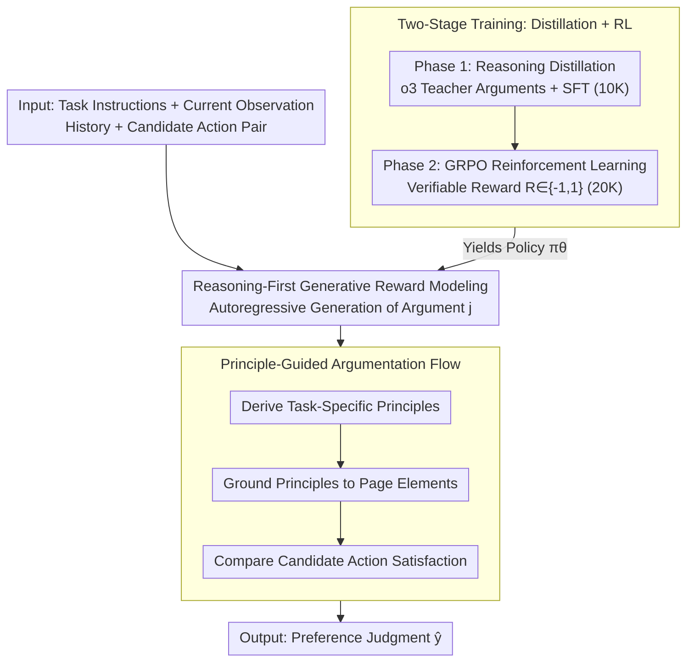

# WebArbiter: A Principle-Guided Reasoning Process Reward Model for Web Agents

**Conference**: ICLR2026  
**arXiv**: [2601.21872](https://arxiv.org/abs/2601.21872)  
**Code**: [WebArbiter Project Page](https://webarbiter.github.io/)  
**Area**: LLM Agent  
**Keywords**: Web Agent, Process Reward Model, Reasoning-First, Principle-Guided, Reinforcement Learning, Reasoning Distillation

## TL;DR
WebArbiter proposes a reasoning-first, principle-guided process reward model (WebPRM) that formalizes reward modeling as a text generation task. Through a two-stage training process involving reasoning distillation and reinforcement learning, the 7B model outperforms GPT-5 by 9.1 percentage points on WebPRMBench.

## Background & Motivation
- **Background**: Web Agents involve long-horizon, multi-step decision-making and irreversible actions, requiring step-level supervision.
- **Limitations of Prior Work**: Outcome Reward Models (ORM) provide only sparse and delayed feedback, potentially misjudging failed trajectories as successes. Existing WebPRMs have significant flaws:
    - **Scalar WebPRM**: Compresses progress into coarse-grained scores, lacking interpretability and weak grounding.
    - **Checklist WebPRM**: Relies on fragile template matching, failing under layout or semantic changes.
    - **LLM-as-Judge**: High cost, poor scalability, and prone to hallucinations.
- **Key Challenge**: How to construct a process reward model that is both interpretable and robust, capable of resisting surface correlations while providing an auditable reasoning chain?

## Method

### Overall Architecture
WebArbiter reformulates process reward modeling as a "rationale-first, conclusion-later" text generation task. Web navigation is modeled as a POMDP $\mathcal{E} = (\mathcal{S}, \mathcal{A}, \mathcal{O})$. Given task instructions, current page observations, historical action reasoning, and a pair of candidate actions, the model first autoregressively generates a principle-guided structured argument before outputting a preference judgment. The pipeline has two axes: during inference, inputs pass through **Generative Reward Modeling** to write arguments, where the internal reasoning follows a **Principle-Guided Flow** to reach a final judgment; during training, a strong teacher (o3) is used to **distill** the initial reasoning strategy, followed by **GRPO Reinforcement Learning** using verifiable rewards to align judgments with correctness signals. The base model is Qwen2.5-3B/7B-Instruct, fine-tuned using LoRA.

### Key Designs

**1. Reasoning-First Generative Reward Modeling: Turning Judgments into Auditable Arguments**

Traditional scalar WebPRMs compress progress into a coarse score, and checklist WebPRMs rely on fragile template matching; neither explains "why a specific action is better." WebArbiter adopts a generative approach: it concatenates instructions $\mathcal{I}$, the current observation $o_p$, historical actions and reasoning $(a_{<p}, c_{<p})$, and two candidate action pairs $(a_p^1, c_p^1)$ and $(a_p^2, c_p^2)$ into a compact input $x = (\mathcal{I}, o_p, a_{<p}, c_{<p}, (a_p^1, c_p^1), (a_p^2, c_p^2))$. The model then autoregressively generates an argument $j$ of length $L$:

$$\pi_\theta(j | x) = \prod_{l=1}^{L} \pi_\theta(j_l | x, j_{<l})$$

The final judgment $\hat{y}$ is output at the end of the argument. The overall training goal is to match the judgment with the ground truth label $\max_{\pi_\theta} \mathbb{E}_{(x,y) \sim \mathcal{D}_{\text{Train}}, \hat{y} \sim \pi_\theta(j|x)} [\mathbb{1}(\hat{y} = y)]$. Since the justification is explicitly written, the reward signal transforms from a "number" into a "readable, verifiable chain." Training data is repurposed from WebPRM Collection (Chae et al., 2025), where positive actions are taken from expert demonstrations $A^+$ and negative actions from rejected trajectories $A^-$.

**2. Principle-Guided Argumentation Flow: Resisting Surface Correlation via Dynamic Principles**

**Design Motivation**: Checklist methods hardcode "what is correct" into templates, which fail when layouts or semantics change. WebArbiter does not use fixed templates; instead, the model derives task-specific principles from the instructions and current state within the argument, grounds these principles to page elements, compares candidate satisfaction levels, and finally outputs a preference. This "Derive Principles $\rightarrow$ Grounding $\rightarrow$ Compare Candidates $\rightarrow$ Judge" structure ensures decisions are evidence-based. Ablations show that removing explicit principles drops BoN accuracy from 74.60 to 55.16, proving principles are core to robust generalization.

**3. Two-Stage Training: Learning to Reason then Maximizing Accuracy**

**Mechanism**: Cold-starting RL on an Instruct model causes performance to rise on Mind2Web while collapsing elsewhere, as the model cannot yet generate stable arguments. Phase one, Reasoning Distillation, uses o3 to generate principle-guided arguments and applies standard SFT cross-entropy to fit the teacher's token-by-token output:

$$\mathcal{L}_{\text{SFT}}(\theta) = -\frac{1}{K} \sum_{i=1}^{K} \sum_{l=1}^{L_i} \log \pi_\theta(\hat{j}_l^{(i)} | x^{(i)}, \hat{j}_{<l}^{(i)})$$

This uses 10K samples to solidify the "ability to reason." Phase two uses the distilled model as a reference policy $\pi_{\text{ref}}$ for GRPO on the remaining 20K samples. The reward $R(x, \hat{y}) \in \{-1, 1\}$ is determined solely by the judgment's correctness. The goal is to maximize reward while using a KL constraint to stay close to the reference policy:

$$\mathcal{L}_{\text{RL}}(\theta) = \max_{\pi_\theta} \mathbb{E}_{(x,y) \sim \mathcal{D}_{\text{RL}}, \hat{y} \sim \pi_\theta(j|x)} [R(x, \hat{y})] - \beta \mathbb{D}_{\text{KL}}(\pi_\theta \| \pi_{\text{ref}})$$

SFT provides a stable starting point, and RL acts as an amplifier; their combination significantly outperforms either used in isolation.

## WebPRMBench Benchmark

### Data Distribution
- Spans 4 Web environments: Mind2Web, WebArena, AssistantBench, WorkArena.
- Contains 1,150 step-level preference instances (each with 1 correct + 4 rejected actions).

### Assessment Metrics
**Pairwise Acc**:
$$\text{Acc}_{\text{Pairwise}} = \frac{1}{|\mathcal{D}|} \sum_{(a^+, a^-)} \mathbb{1}[\pi_\theta(a^+) \succ \pi_\theta(a^-)]$$

**Best-of-N (BoN) Acc**: A stricter metric requiring the correct action to outperform all 4 distractors:
$$\text{Acc}_{\text{BoN}} = \frac{1}{|\mathcal{D}|} \sum_{i=1}^{|\mathcal{D}|} \prod_{q=1}^{4} \mathbb{1}[\pi_\theta(a_i^+) \succ \pi_\theta(a_i^{-_q})]$$

## Key Experimental Results

### WebPRMBench Main Results

| Model | Mind2Web BoN | WebArena BoN | AssistantBench BoN | WorkArena BoN | Avg BoN |
|------|-------------|-------------|-------------------|-------------|---------|
| GPT-4o | 52.62 | 66.67 | 66.67 | 55.19 | 60.29 |
| GPT-5 | 62.39 | 71.64 | 63.33 | 64.62 | 65.50 |
| Claude-3.7-Sonnet | 57.90 | 64.10 | 61.30 | 60.60 | 60.98 |
| DeepSeek-R1 | 57.37 | 60.21 | 56.18 | 63.89 | 59.41 |
| WebShepherd-8B | 73.69 | 43.88 | 30.00 | 25.53 | 43.28 |
| **WebArbiter-7B** | **89.53** | **68.66** | **70.00** | **70.19** | **74.60** |

WebArbiter-7B exceeds GPT-5 in Avg BoN Acc by **9.1 percentage points** and surpasses the previous SOTA, WebShepherd-8B, by **31.32 percentage points**.

### Training Strategy Ablation Study

| Method | Mind2Web BoN | WebArena BoN | AssistantBench BoN | WorkArena BoN | Avg BoN |
|------|-------------|-------------|-------------------|-------------|---------|
| Instruct (Baseline) | 39.18 | 42.79 | 53.33 | 35.85 | 42.78 |
| + Cold Start RL | 86.00 | 35.80 | 33.60 | 37.90 | 48.33 |
| + Cold Start RL + Principles | 88.00 | 46.30 | 48.90 | 51.80 | 58.75 |
| + SFT (No Principles) + RL | 94.34 | 41.50 | 40.20 | 44.60 | 55.16 |
| **WebArbiter (SFT+Principles+RL)** | **89.53** | **68.66** | **70.00** | **70.19** | **74.60** |

### WebArena-Lite Search Results
In reward-guided trajectory search, WebArbiter outperforms WebShepherd by up to **7.2 percentage points**.

## Key Findings

### 1. Cold Start RL is Unstable
- Performing RL directly on the Instruct model improves Mind2Web but degrades performance in other environments.
- This indicates that RL without a foundation in reasoning distillation is unstable for cross-environment generalization.

### 2. Principles are Essential
- Removing explicit principles while keeping reasoning reduces BoN Acc from 74.60 to 55.16 (-19.44).
- Principles ground the judgment and provide resistance to surface correlations.

### 3. SFT is a Necessary Prerequisite for RL
- Reasoning distillation provides a stable starting point, allowing RL to function effectively as an amplifier.
- The combination of SFT + RL significantly outperforms either method used alone.

## Highlights
1. **Reasoning-First Paradigm**: Shifts reward modeling from score prediction to auditable reasoning generation, greatly enhancing interpretability.
2. **Dynamic Principle Guidance**: Derives principles from task instructions and state rather than relying on fixed templates, ensuring high adaptability.
3. **Robust Cross-Environment Generalization**: Trained only on Mind2Web, yet achieves state-of-the-art results across 4 distinct environments.
4. **Small Model Outperforming Large Models**: The 7B model surpasses GPT-5 and DeepSeek-R1.
5. **Two-Stage Training Strategy**: Reasoning distillation and RL serve as highly complementary components.

## Limitations & Future Work
- Training data is limited to 30K samples from a single environment (Mind2Web); scaling to multi-environment data may yield further improvements.
- Currently supports only pairwise comparisons; multi-candidate settings require further validation.
- Relies on text-based observations (accessibility tree) and does not yet utilize visual information.
- Reasoning generation increases inference latency; trade-offs are needed for real-time deployment.
- Negative samples in WebPRMBench are model-generated, potentially introducing distributional bias.

## Related Work & Insights
- **Vs. WebShepherd (Checklist WebPRM)**: WebArbiter dominates in new environments (WorkArena BoN 70.19 vs 25.53).
- **Vs. Scalar WebPRM (Miao et al., 2025)**: Provides an auditable reasoning chain instead of a black-box numerical score.
- **Vs. LLM-as-Judge**: Specialized 7B model significantly outperforms general-purpose models like GPT-5.
- **Novelty**: First to apply reasoning PRMs specifically to the Web Agent domain, following general reasoning RM literature (Chen et al., 2025).

## Rating
- **Novelty**: ⭐⭐⭐⭐⭐ (Reasoning-first + principle-guided WebPRM design is fresh; two-stage training is innovative)
- **Experimental Thoroughness**: ⭐⭐⭐⭐⭐ (4-environment benchmark, multiple baselines, detailed ablations, and search verification)
- **Writing Quality**: ⭐⭐⭐⭐ (Clear structure, though notation-heavy)
- **Value**: ⭐⭐⭐⭐⭐ (7B model beats GPT-5, open-sourced WebPRMBench, significant contribution to Web Agents)

<!-- RELATED:START -->

## Related Papers

- [\[ACL 2026\] Exploring Reasoning Reward Model for Agents](../../ACL2026/llm_agent/exploring_reasoning_reward_model_for_agents.md)
- [\[ICLR 2026\] Empowering LLM Tool Invocation with Tool-call Reward Model](empowering_llm_tool_invocation_with_tool-call_reward_model.md)
- [\[ICML 2026\] Process Reward Agents for Steering Knowledge-Intensive Reasoning](../../ICML2026/llm_agent/process_reward_agents_for_steering_knowledge-intensive_reasoning.md)
- [\[ICLR 2026\] Web-CogReasoner: Towards Multimodal Knowledge-Induced Cognitive Reasoning for Web Agents](web-cogreasoner_towards_multimodal_knowledge-induced_cognitive_reasoning_for_web.md)
- [\[ICLR 2026\] DreamPhase: Offline Imagination and Uncertainty-Guided Planning for Large-Language-Model Agents](dreamphase_offline_imagination_and_uncertainty-guided_planning_for_large-languag.md)

<!-- RELATED:END -->
