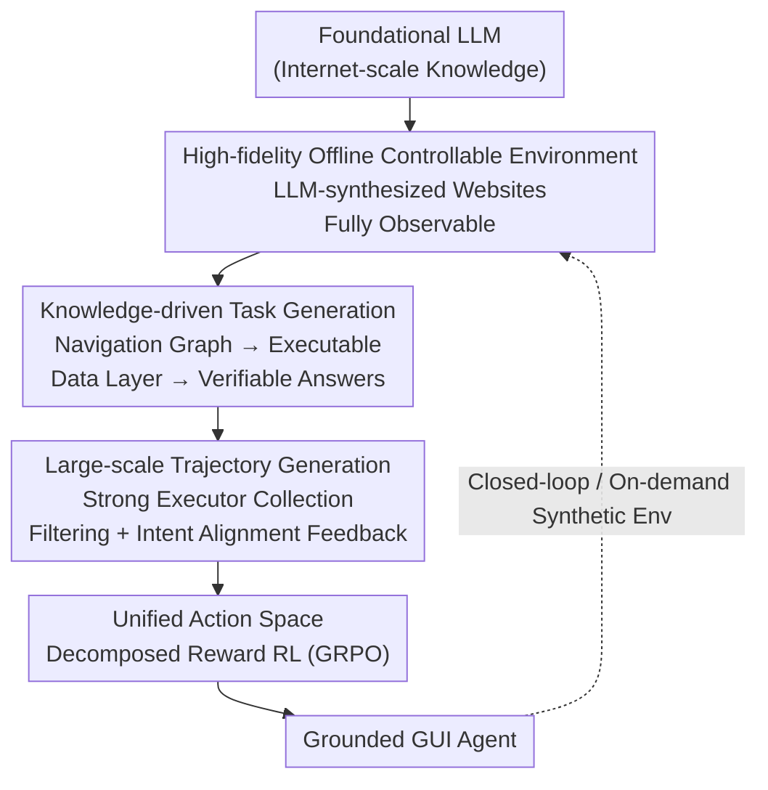

# WebFactory: Automated Compression of Foundational Language Intelligence into Grounded Web Agents

**Conference**: ICLR 2026  
**OpenReview**: [https://openreview.net/forum?id=HaIEP2PD4S](https://openreview.net/forum?id=HaIEP2PD4S)  
**Code**: The paper claims the full toolchain (environment / task generator / training / evaluation) has been open-sourced; however, the repository address is not provided in the main text ⚠️ Refer to the original paper  
**Area**: Agent / Reinforcement Learning / GUI Agents  
**Keywords**: GUI Agent, Web Agent, Offline Environment Synthesis, Knowledge-driven Task Generation, GRPO Reinforcement Learning

## TL;DR
WebFactory redefines "training GUI agents" as a problem of distilling internet knowledge compressed within LLMs into executable grounded actions. By using a fully automated closed-loop pipeline—high-fidelity offline website synthesis via LLMs → knowledge-driven verifiable task generation → trajectory collection via strong LLMs → RL training with decomposed rewards—a 3B agent trained on only 10 synthetic websites achieves performance levels comparable to agents trained on equivalent human-annotated data and generalizes to real-world websites such as Amazon, Airbnb, and Booking.

## Background & Motivation

**Background**: There are currently two mainstream routes for training GUI/Web agents. One involves letting agents explore and learn on live websites, while the other relies on large-scale human-annotated interaction trajectories and manually built high-fidelity environments. Both treat "data volume" as the core bottleneck to overcome.

**Limitations of Prior Work**: Both routes have inherent flaws. While the live web offers infinite scale, it is plagued by non-determinism (the same action results in different outcomes), security risks (accidental operations on real accounts/payments), and noise, making research non-reproducible. The manual route suffers the opposite—annotating thousands of trajectories is extremely costly and biased, and manually replicating a high-fidelity website environment typically takes weeks for experts, making it impossible to scale.

**Key Challenge**: A fundamental trade-off exists between scalability and control. Live web solutions offer scale without control, while manual solutions offer control without scale. Neither provides a "large-scale yet reproducible" training signal.

**Goal**: The authors argue for a shift in perspective—the real bottleneck is not the volume of data, but the **intelligence compression efficiency** of mapping latent LLM knowledge to executable actions. Thus, the goals are decomposed into: (1) creating a high-fidelity yet fully controllable and reproducible environment; (2) automatically generating guaranteed executable and verifiable tasks within it; (3) automatically collecting high-quality trajectories for training; and (4) achieving all this without human intervention.

**Key Insight**: Instead of treating the LLM as a "fine-tuned component," it should be viewed as an "architect building its own body." The LLM synthesizes websites, tasks, and trajectories through code generation. Since the environments are offline copies created by the LLM, they are **fully observable**, transforming traditionally unreliable task generation into a deterministic process.

**Core Idea**: Construct an "Intelligence Compression Factory" to end-to-end compress descriptive internet knowledge within the LLM into executable behaviors grounded in GUIs.

## Method

### Overall Architecture
WebFactory is a fully automated, closed-loop, and scriptable reinforcement learning pipeline. The input is a foundational LLM (carrying internet-scale descriptive knowledge), and the output is a grounded GUI agent capable of clicking, typing, and retrieving on real web pages. The pipeline operates serially across four stages, all occurring within LLM-synthesized offline websites to bypass the non-determinism and security risks of the live web.

First, LLM code generation is used to create a set of high-fidelity, fully observable offline websites. Second, utilizing full observability, the "knowledge specifications" (navigation graphs + page semantics + standard interaction flows) of each site are extracted to automatically synthesize tasks guaranteed to be executable and verifiable with unique ground-truth answers. Third, a strong LLM executor (OpenAI's computer-use-preview) performs these tasks in the offline environment to collect trajectories, which are then cleaned through filtering and "behavioral intent alignment feedback." Fourth, the cleaned trajectories are fed into GRPO-style RL to optimize the student policy using "decomposed rewards" within a unified action space. Finally, a script-based evaluation based on key-node alignment is used for validation, requiring no manual review.

### Key Designs

**1. High-fidelity Offline Controllable Web Environment: Making "Data Creation" Safe and Reproducible**

**Design Motivation**: This addresses the core contradiction between uncontrollable live webs and expensive manual environments. Instead of crawling real sites, the authors use an LLM-aided synthesis pipeline to automatically generate realistic websites including layouts, workflows, and content, rapidly expanding training domains at low cost. These environments eliminate deployment barriers: sites start with pre-authenticated sessions and seed user profiles (bypassing Login/MFA), CAPTCHA and anti-bot measures are disabled (isolating the agent's actual capability), and all content is versioned in static datasets (e.g., `Data.js`) to ensure bit-by-bit reproducibility. Simultaneously, they provide full access to frontend code, databases, and interaction logic. The authors selected **10 website families** covering six activities: e-commerce, information retrieval, travel planning, recruitment, communication, and enterprise services. UI forms range from simple forms to drag-and-drop interfaces and hover menus. Task difficulty is adjustable across three dimensions: data complexity (catalog size/network density), UI complexity (multi-level navigation/drag/hover), and flow depth (single-step query → multi-step execution). Its value lies in the fact that because the environment is synthetic and fully observable, downstream task generation and reward calculation can be made "deterministic."

**2. Knowledge-driven Task Generation: Ensuring Tasks are "Executable and Verifiable" through Full Observability**

Traditional task generation often falls into the trap of creating "junk tasks" that reference non-existent pages, query non-existent answers, or require impossible actions. The authors leverage the full observability of offline environments to extract machine-readable knowledge specifications for each site: (i) navigation graphs with legal page transitions, (ii) page-level semantics and affordances, and (iii) standard interaction flows (e.g., browse → detail → cart). Based on this knowledge, two complementary types of tasks are generated: **Operation tasks** (e.g., "Add a 256GB iPhone 17 to the cart") are synthesized by traversing navigation graphs, ensuring every flow is executable; **Retrieval tasks** (e.g., "What time does Cafe A close on weekends?") have answers pulled directly from the observable data layer. Before generation, answer existence is verified and the precise navigation path for retrieval is calculated, resulting in unambiguous ground-truth answers (see schema in Listing 1 of the original paper, including `goal`, `expected_answers`, and `key_nodes` fields). This design transforms unreliable task generation into a deterministic process, which is a prerequisite for automated reward calculation.

**3. Large-scale Trajectory Generation + Behavioral Intent Alignment Feedback: Turning "Data Collection" into a Low-cost Pipeline**

With the task set prepared, the authors use a strong executor (OpenAI's computer-use-preview) to execute tasks and collect trajectories in the offline environment. Low-quality trajectories are removed through three filtering stages: (i) state-replay checks, (ii) key-node coverage, and (iii) answer validation for retrieval tasks. Moreover, the auxiliary knowledge exposed by the websites can serve both as prompts for the executor and as additional consistency checks, simultaneously improving accuracy and yield. For retrieval tasks, the authors introduce a "behavioral intent alignment feedback" mechanism to further enhance retrieval quality. The impact is direct (see Table 2): knowledge-driven generation increases trajectory success rate from 42.6% to 84.3%, reduces average steps from 15.7 to 9.8, and increases the proportion of valid data from 58.3% to 89.6%—resulting in data that is both more accurate and more concise, providing a high-quality corpus for SFT, offline RL, or hybrid training.

**4. Unified Action Space + Decomposed Reward RL: Breaking Down Multi-dimensional Correctness into Optimizable Fine-grained Signals**

Training is based on the GUI-R1 framework, extended to support web retrieval tasks. Each action is modeled as a unified triplet $a_t = \{a^{act}_t, a^{point}_t, a^{text}_t\}$, where action types $a^{act}_t \in \{\text{click, double\_click, type, scroll, keypress, drag, get\_final\_answer}\}$, coordinates $a^{point}_t=[x,y]$ (two points for drag), and $a^{text}_t$ contains input content or directional parameters. A `get_final_answer` action is specifically added for data-fetching tasks. Single-step reward is a weighted combination of format and accuracy rewards $R_t = \alpha R_f + \beta R_{accuracy}$. Crucially, the **decomposed reward** uses hierarchical validation—incorrect action types receive a 0 score immediately; only if the type is correct are the type-specific parameters evaluated:

$$R_{acc} = \begin{cases} 0, & a_{type} \neq gt_{type} \\ \mathbb{I}[a_{coord}\in gt_{bbox}], & a_{type}=\text{click} \\ \mathbb{I}[F1(a_{text}, gt_{text})\geq\tau], & a_{type}\in\{\text{type, scroll}\} \\ \max_{r\in R}\mathbb{I}[F1(a_{text}, r)\geq\tau], & a_{type}=\text{get\_answer} \\ \mathbb{I}[\lVert a_{drag}-gt_{drag}\rVert_2\leq\epsilon], & a_{type}=\text{drag} \end{cases}$$

Here, $\tau=0.5$ is the F1 threshold. For retrieval tasks, a normalized (case/punctuation/format-insensitive) F1 score is used to find the maximum match against a set of equivalent answers $R=\{r_1,...,r_K\}$, stabilizing optimization and enhancing robustness. The format reward $R_f$ validates JSON structure, action type compliance, parameter type correctness, and conditional constraints (e.g., a `type` action must include text). This fine-grained decomposition—checking coordinates for clicks, F1 for typing/retrieval, and coordinate distance for dragging—provides a much denser and more stable learning signal than a sparse success/failure scalar.

### Loss & Training
The approach employs GRPO and related RL algorithms to optimize the policy $\pi_\theta$ within the unified action space to maximize $J(\theta)$. Generated trajectories populate a replay buffer $(s_t, a_t, R_t, s_{t+1})$. The reward is a weighted sum of format and decomposed accuracy rewards (Equations 2 and 3), where $\alpha$ and $\beta$ are weighting coefficients, and retrieval answers are scored using normalized F1.

## Key Experimental Results

The primary model is WebFactory-3B (based on QwenVL2.5-3B), compared against three baselines: vanilla QwenVL2.5-3B, GPT-4o, and GUI-R1-3B trained on large-scale human-annotated data. Evaluations cover internal offline benchmarks (10 sites, 100 tasks), offline-to-online transfer (Amazon/Airbnb/Booking, 30 tasks each), and public benchmarks (GUI-Act-Web / OmniAct-Desktop / GUI-Odyssey).

### Main Results

On the internal offline benchmarks (Operation + Retrieval), WebFactory-3B matches or slightly exceeds the performance of GUI-R1-3B trained on human data, using only synthetic data:

| Model | Operation TCR(%) | Operation Acc(%) | Retrieval TCR(%) | Retrieval F1 |
|------|------|------|------|------|
| QwenVL2.5-3B | 18.3 | 41.2 | 15.7 | 0.28 |
| GPT-4o | 26.7 | 48.6 | 22.3 | 0.35 |
| GUI-R1-3B (Human) | 68.2 | 85.3 | 64.6 | 0.76 |
| **WebFactory-3B (Ours)** | **71.8** | **87.6** | **67.3** | **0.79** |

In offline-to-online transfer, WebFactory-3B's generalization advantage is further amplified, with an average TCR of 53.4%—a 162% gain over QwenVL2.5-3B (20.4%) and a 44% gain over GUI-R1-3B (37.0%):

| Model | Amazon TCR(%) | Airbnb TCR(%) | Booking TCR(%) | Avg TCR(%) |
|------|------|------|------|------|
| QwenVL2.5-3B | 22.3 | 18.7 | 20.1 | 20.4 |
| GPT-4o | 41.2 | 37.8 | 39.6 | 39.5 |
| GUI-R1-3B | 38.6 | 35.2 | 37.1 | 37.0 |
| **WebFactory-3B** | **55.7** | **51.2** | **53.3** | **53.4** |

### Ablation Study

The task generation quality ablation highlights the value of the "Knowledge + Data" dual drive (Exe.=Executability, Val.=Validity, Div.=Diversity, Cmplx.=Complex Task %):

| Config | Exe.(%) | Val.(%) | Div. | Cmplx.(%) |
|------|------|------|------|------|
| No Knowledge / No Data | 31.3 | 42.3 | 0.31 | 8.2 |
| Data-driven Only | 56.3 | 68.7 | 0.52 | 15.6 |
| Knowledge-driven Only | 62.5 | 71.2 | 0.64 | 22.3 |
| **Knowledge + Data** | **86.3** | **92.6** | **0.84** | **35.7** |

Trajectory data quality ablation (SR=Success Rate, Steps=Avg Steps, VD=Valid Data %):

| Metric | W/o Knowledge | W/ Knowledge |
|------|------|------|
| SR(%) | 42.6 | 84.3 |
| Steps | 15.7 | 9.8 |
| VD(%) | 58.3 | 89.6 |

### Key Findings
- **Knowledge-driven generation is the core source of gain**: Executability soared from 31.3% to 86.3%, and the proportion of complex tasks increased 4.4x. Trajectory success nearly doubled (42.6%→84.3%) while steps were reduced by 38%, demonstrating that full observability increases both quality and efficiency.
- **Synthetic data can replace human data**: Training on just 10 synthetic websites matched GUI-R1-3B (which uses large-scale human data) on internal benchmarks. On the cross-domain GUI-Odyssey, it achieved 66.0% Type accuracy, significantly outperforming GUI-R1-3B's 54.8%, suggesting synthetic data may offer stronger generalization.
- **Base models determine the "embodiment ceiling"**: Testing GPT-5 / Claude Opus 4.1 / Claude Sonnet 4 as drivers for the pipeline showed GPT-5 as the strongest overall, while Claude Sonnet 4 exhibited significant fluctuations, indicating that "embodiment potential" varies significantly across LLMs and can serve as a new dimension for model evaluation.

## Highlights & Insights
- **Reframing the training problem as "compression efficiency" rather than "data volume"**: This is the most profound insight. While traditional agent scaling laws focus on data volume, the authors propose that asymptotic performance is likely determined by the base model's "intelligence compression efficiency + embodiment potential," providing a new axis for model assessment.
- **The "LLM as Architect" closed loop is clever**: Letting the LLM use code generation to build its own offline training environment naturally provides full observability, turning "task executability/verifiability" from a probabilistic problem into a deterministic one. This "building one's own body" perspective is transferable to embodied robotics and other fields requiring safe, reproducible environments.
- **Decomposed rewards are a reusable trick**: Breaking down "action correctness" into a hierarchical determination of type → coordinate/text/drag provides a much denser signal than sparse success. Any RL in a structured action space (e.g., tool calling, form filling) can benefit from this.

## Limitations & Future Work
- The authors admit they did not perform exhaustive ablations on the reward mechanism; comparisons between decomposed rewards vs. sparser rewards vs. LLM-generated rewards are left for future work.
- The pipeline's performance on fundamentally different GUI paradigms (game engines, professional creative software) has not been systematically verified.
- Observation: Internal offline benchmarks and online transfer benchmarks were self-built and relatively small (100 offline tasks, 30 tasks per online site). The conclusion that "synthetic data matches human data" depends heavily on these benchmarks. Additionally, the strong executor used for training (computer-use-preview) is inherently quite capable; the extent to which the distillation gain comes from "environment/task design" vs. a "strong teacher" is not fully decoupled.
- Improvement Idea: Use the pipeline’s programmability for "targeted capability evolution"—systematically probing agent weaknesses (e.g., fine-grained continuous interaction, complex logic) and synthesizing specific web environments to patch those gaps, creating a self-correcting engine.

## Related Work & Insights
- **vs. GUI-R1**: This work extends the GUI-R1 RL framework, adding the `get_final_answer` action and retrieval rewards. The key difference is that GUI-R1 relies on massive human-annotated data, whereas WebFactory uses LLM-synthesized environments and tasks, proving they can be equivalent.
- **vs. Live Web Training (e.g., live web RL)**: Live web training offers scale but sacrifices control, facing hurdles of non-determinism, security, and noise. WebFactory trades this for high-fidelity offline copies to gain strict reproducibility and full observability, proving through transfer experiments that generalization is preserved.
- **vs. Manual Environment/Annotation (e.g., Mind2Web)**: These environments are faithful but the cost of building and annotating is measured in weeks and is hard to scale. WebFactory uses LLM code generation to reduce site creation costs to near zero, allowing for flexible difficulty adjustment across data, UI, and flow.

## Rating
- Novelty: ⭐⭐⭐⭐⭐ "Intelligence Compression Factory + LLM as Architect of its own environment + Embodiment Potential as a new evaluation axis" is a consistent and fresh paradigm.
- Experimental Thoroughness: ⭐⭐⭐⭐ Covers task generation/trajectories/internal/transfer/public benchmarks + multi-base model analysis, though core conclusions rely on small-scale self-built benchmarks and lack reward ablations.
- Writing Quality: ⭐⭐⭐⭐⭐ Clear motivational derivation, complete description of the five pipeline stages, and solid inclusion of formulas and schemas.
- Value: ⭐⭐⭐⭐⭐ By open-sourcing the environment/generator/training/eval toolchain, it provides a low-cost, scalable infrastructure for reproducible Web agent research.

<!-- RELATED:START -->

## Related Papers

- [\[CVPR 2026\] Ego2Web: A Web Agent Benchmark Grounded in Egocentric Videos](../../CVPR2026/llm_agent/ego2web_a_web_agent_benchmark_grounded_in_egocentric_videos.md)
- [\[ICLR 2026\] Social Agents: Collective Intelligence Improves LLM Predictions](social_agents_collective_intelligence_improves_llm_predictions.md)
- [\[ICLR 2026\] Web-CogReasoner: Towards Multimodal Knowledge-Induced Cognitive Reasoning for Web Agents](web-cogreasoner_towards_multimodal_knowledge-induced_cognitive_reasoning_for_web.md)
- [\[ICLR 2026\] Orak: A Foundational Benchmark for Training and Evaluating LLM Agents on Diverse Video Games](orak_a_foundational_benchmark_for_training_and_evaluating_llm_agents_on_diverse_.md)
- [\[ICLR 2026\] WALT: Web Agents that Learn Tools](walt_web_agents_that_learn_tools.md)

<!-- RELATED:END -->
