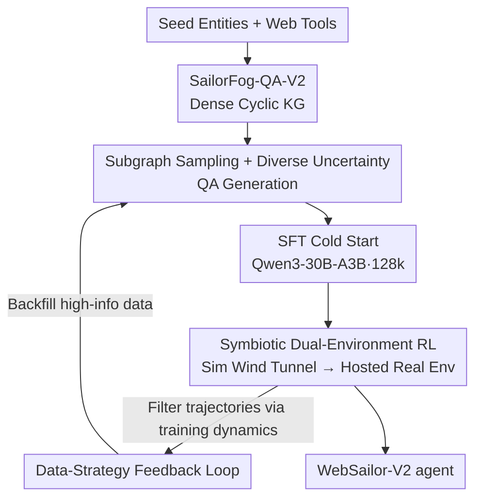

# WebSailor-V2: Bridging the Chasm to Proprietary Agents via Synthetic Data and Scalable Reinforcement Learning

**Conference**: ICLR 2026  
**Paper**: Published as a conference paper at ICLR 2026  
**Code**: None (No explicit link provided in the paper, ⚠️ subject to the original text)  
**Area**: Agent / LLM Reasoning / Synthetic Data / Reinforcement Learning  
**Keywords**: Web Agent, Deep Research, Knowledge Graph Synthetic Data, Dual-environment RL, GRPO

## TL;DR
WebSailor-V2 utilizes a complete post-training pipeline consisting of "dense cyclic knowledge graph data synthesis + sim/real dual-environment RL." This pipeline trains a 30B (3B active) MoE web agent to achieve 35.3 on BrowseComp-EN and 30.6 on HLE, surpassing the 671B DeepSeek-V3.1 and bringing open-source deep research agents close to the level of closed-source systems.

## Background & Motivation
**Background**: Autonomous web agents (the "Deep Research" paradigm) rely on tools such as search, browsing, and code execution to decompose complex multi-step research tasks into "think-act-observe" loops. While the community has made efforts in both data and training, a significant chasm remains between open-source solutions and closed-source systems like OpenAI DeepResearch.

**Limitations of Prior Work**: The authors attribute this chasm to two critical stages. First, **data-side uncertainty is too homogeneous**—existing synthetic data often uses "easy-to-hard" iterative expansion, growing graphs from a seed problem that results almost exclusively in tree-like/acyclic structures, with "obfuscation" being the primary form of uncertainty. Without exposure to complex logic involving cyclic dependencies and feedback loops, models struggle to generalize to the intricate information found in real research. Second, **the training side lacks scalable RL environments**—agentic RL requires numerous tool calls per rollout. Directly interfacing with real web APIs leads to high costs, low QPS, timeout failures, and inconsistent returns. This noise contaminates training data and degrades learned policies, hindering rapid algorithmic iteration.

**Key Challenge**: There exists a trade-off between the stochasticity of real environments and the stability required for RL algorithm iteration. The more one attempts to train deployable policies using the real web, the more one is hampered by its volatility; conversely, focusing on stable iteration risks a mismatch between simulation and reality.

**Goal**: (1) Synthesize data with sufficiently rich logical structures and diverse uncertainties; (2) Build an RL training environment that supports high-frequency stable iteration while ultimately grounding in the real web.

**Key Insight**: Information retrieval is essentially "navigating within an entity relationship network." Consequently, the data side starts with graph theory—actively constructing dense cyclic graphs and sampling subgraphs that require traversing "cut vertices/bridges" to force the agent to learn abstract graph search patterns. The training side draws from robotics (sim-to-real), using a high-fidelity simulator as a "wind tunnel" to stabilize the algorithm before transitioning to the real environment.

**Core Idea**: Use **topological data synthesis** to address reasoning diversity and a **symbiotic dual-environment + data-strategy feedback loop** to address RL stability. These two threads are integrated into a complete post-training pipeline.

## Method

### Overall Architecture
WebSailor-V2 is an end-to-end post-training pipeline built on the basic ReAct framework (the authors intentionally avoid complex multi-agent structures, following "The Bitter Lesson" in the belief that scalable computation eventually outperforms handcrafted designs). The action space consists of only five tools: search, visit, Google Scholar, Python interpreter, and final answer. The pipeline involves four steps: first, the SailorFog-QA-V2 generator creates dense cyclic knowledge graphs, samples subgraphs, and generates QA with diverse uncertainties; next, **SFT cold start** is performed using high-quality trajectories obtained via rejection sampling (Base: Qwen3-30B-A3B-Thinking, context extended to 128k) to provide a sufficiently strong initial policy for RL; then, it enters **symbiotic dual-environment RL**, where hyperparameter tuning and reward shaping are first conducted in an offline Wikipedia simulator before moving the validated configuration to a real environment managed by a unified tool interface; the entire process is linked by a **data-strategy feedback loop** that automatically synthesizes and filters the most informative trajectories based on training dynamics.

### Key Designs

**1. SailorFog-QA-V2: Replacing Tree Expansion with Dense Cyclic Knowledge Graphs**

To address the limitation that "existing synthetic data is almost entirely tree-like/acyclic with simple logical structures," V2 still starts from seed entities and uses web tools to discover related entities and extract information. However, during the graph expansion stage, it **actively constructs dense connections and deliberately builds cyclic structures**. The result is a fully interconnected network rather than an ever-growing tree, more closely resembling the non-linear structures of real-world knowledge characterized by cyclic dependencies and feedback loops. It preserves more complete process information (specific search queries, source URLs) and stores statistical features for each entity to generate more challenging QA tasks. The final dataset contains over 30,000 instruction pairs, with the underlying graph averaging approximately 30 nodes and a mean degree of 2.5. This is effective because the model learns abstract search capabilities that generalize to new problems only when training data covers sufficiently broad and complex logical structures.

**2. Subgraph Extraction + QA Generation with Diverse Uncertainties**

As graphs become denser, random sampling of all fixed-edge sub-structures suffers from combinatorial explosion. Thus, V2 uses **random walk sampling** for subgraphs and validates subgraph non-isomorphism using the Weisfeiler-Leman algorithm. This efficiently covers the full spectrum of structures from simple chains to complex cycles and dense clusters without exhaustive search. When generating QA, the entire subgraph is not fed to the LLM; instead, the topology is analyzed to identify non-isomorphic nodes (orbit nodes occupying different structural roles), ensuring the question focus is uniformly distributed across node types. Crucially, uncertainty is expanded from "obfuscation" into three categories: (1) **Semantic Ambiguity**—deliberately leaving key entities/dates underspecified (e.g., "the mathematician who popularized this result" instead of a specific name), forcing the agent to disambiguate via graph context rather than keyword matching; (2) **Interference Noise**—injecting plausible but factually incorrect distractors (e.g., the year of another paper by the same author), forcing the agent to perform cross-validation; (3) **Structural Constraints**—identifying critical paths like bridges or cut vertices via non-isomorphic node analysis to create tasks that "must traverse these cut edges," forcing the agent to perform global graph exploration rather than local greedy search.

**3. Symbiotic Dual-Environment RL: Sim "Wind Tunnel" + Hosted Real Environment Sim-to-Real**

To resolve the contradiction where "real web API fluctuations contaminate training and drown out algorithmic signals," training is decoupled into two environments. The **simulation environment** is built from scratch based on an offline Wikipedia library, equipped with simulated web tools, and uses the SailorFog-QA-V2 pipeline adapted for this offline corpus. This environment is low-cost, fast, and fully controllable. Its key role is as an algorithmic "wind tunnel" rather than a content replica of the real web; the authors validated that the simulator and real environment are highly correlated in Reward and Pass@1 trends. Consequently, a **staged training** approach is adopted: high-frequency hyperparameter tuning and reward shaping are done in simulation, followed by production training in the real environment. The engineering challenges of the **real environment** side (consistency of tool returns, reproducibility of trajectory sampling, high concurrency, and fault tolerance) are addressed by a **unified tool execution interface**. This layer manages QPS limits, result caching, timeout retries, non-critical failure degradation, and seamless switching of data sources, abstracting tool calls into a deterministic and stable interface for the agent.

**4. Stabilized RL Algorithm + Data-Strategy Feedback Loop**

The RL algorithm is a customized modification of GRPO, using group-based leave-one-out estimation to reduce variance:

$$\hat{A}_{i,t} = R_i - \text{mean}(\{R_i\}_{i=1}^{G})$$

The objective function performs token-level policy gradients on each trajectory and uses a clipped importance sampling ratio $r_{i,t}(\theta)=\pi_\theta(o_{i,t}\mid \text{context})/\pi_{\theta_{old}}(o_{i,t}\mid \text{context})$ to control update magnitude. Training is strictly on-policy. A key finding was the **conservative handling of negative samples**: unfiltered negative trajectories can cause "format collapse" after long training periods. Therefore, **loss is masked** (signal is ambiguous) for "over-length trajectories without a final answer," while **negative rewards are assigned** for "explicit format errors/illegal tool calls" (teaching the model to avoid them). This prevents collapse while maintaining stability. For efficiency, static sampling is replaced by larger batches/groups to maintain low variance. The higher-level **data-strategy feedback loop** automatically adjusts the training set based on real-time dynamics, continuously feeding the most informative trajectories into the model.

### Loss & Training
SFT cold start utilizes pure synthetic trajectories produced by the SailorFog-QA-V2 generator (reasoning by high-performance open-source models + rejection sampling), providing a sufficiently strong initial policy—essential because sparse rewards in these tasks make exploration difficult otherwise. The RL phase uses the customized GRPO with token-level loss, leave-one-out advantages, and differentiated handling of negative samples (masking vs. negative rewards). Training data is a mix of SailorFog-QA (basic web navigation), SailorFog-QA-V2 (complex reasoning and error correction), and IterBench (enhanced mathematical and academic reasoning, targeting HLE).

## Key Experimental Results

### Main Results
The base model is Qwen3-30B-A3B-2507, evaluated across six difficult benchmarks using Pass@1 (temperature 0.85 / top-p 0.95, LLM-as-judge).

| Backbone | BrowseComp-EN | BrowseComp-ZH | xbench-DeepSearch | GAIA | HLE |
|----------|------|------|------|------|------|
| OpenAI DeepResearch‡ | 51.5 | 42.9 | - | 67.4 | 26.6 |
| OpenAI-o3 | 49.7 | 58.1 | 66.7 | 70.5 | 20.2 |
| DeepSeek-V3.1-671B‡ | 30.0 | 49.2 | 71.2 | 63.1 | 29.8 |
| GLM-4.5-355B‡ | 26.4 | 37.5 | 70.0 | 66.0 | 21.2 |
| WebSailor-72B | 12.0 | 30.1 | 55.0 | 55.4 | - |
| **WebSailor-V2-30B-A3B (SFT)** | 24.4 | 28.3 | 61.7 | 66.0 | 23.9 |
| **WebSailor-V2-30B-A3B (RL)** | **35.3** | **44.1** | **73.7** | **74.1** | **30.6** |

The 30B (3B active) MoE agent leads all open-source agents on BrowseComp-EN / xbench / GAIA / HLE and surpasses the 671B DeepSeek-V3.1 (35.3 vs 30.0 EN, 30.6 vs 29.8 HLE). On xbench/GAIA, it even exceeds strong closed-source systems. Its 30.6 on HLE sets a new SOTA, outperforming larger models and confirming that "strong retrieval + synthesis capabilities can enhance logical reasoning."

### Ablation Study

| Configuration / Contrast | Key Metric | Description |
|------|---------|------|
| SFT only | EN 24.4 / HLE 23.9 | Already exceeds many fully-trained open-source agents; necessary for RL. |
| + RL (Full) | EN 35.3 / HLE 30.6 | RL simultaneously boosts Pass@1 and Pass@3 on hard tasks, extending the capability ceiling. |
| Direct training on BrowseComp | Significantly worse | Human data is noisy and small-scale; synthetic data provides a more consistent, learnable distribution. |
| Real environment without unified interface | Unstable training | The unified interface isolates stochasticity, allowing rewards to rise stably. |

### Key Findings
- **SFT cold start is indispensable**: Due to sparse rewards, agents cannot explore successful trajectories without a strong initial policy; RL only converges with the dense feedback provided by an SFT-boosted policy.
- **RL functions differently on hard vs. easy tasks**: For difficult tasks like BrowseComp, Pass@1 and Pass@3 rise together (RL extends core capability). For easier tasks like xbench/GAIA, Pass@1 increases significantly while Pass@3 remains nearly flat (RL primarily improves sampling efficiency/reliability).
- **Data and environment stability > Algorithm**: The authors found that data quality and environmental stability are more critical than specific algorithmic tricks for agentic RL.
- **Deep Research Comparison**: The agent scored 47.7 on the DeepResearch Bench, second only to Gemini-2.5-pro-DeepResearch (49.7). The gap is primarily in report "writing style and polishing" rather than retrieval or reasoning.

## Highlights & Insights
- **Mapping data diversity to graph topology**: Defining reasoning difficulty via "whether cut vertices/bridges must be traversed" or "existence of cyclic dependencies" is more controllable than "easy-to-hard" expansion and forces abstract search capabilities.
- **"Wind tunnel" sim-to-real**: There is no requirement for the simulator to match the content of the real web; it only needs to provide highly correlated training dynamics. This is a pragmatic and cost-effective engineering choice.
- **Differentiated negative sample handling**: Masking loss for long, answer-less trajectories while penalizing illegal formal errors prevents "format collapse" during long-term training—a practical trick for agentic RL.
- **30B surpassing 671B**: Using strong agentic capabilities to "compensate" for fewer parameters provides evidence for the "small model + strong tools/retrieval" strategy.

## Limitations & Future Work
- The performance gap against Gemini on DeepResearch Bench is attributed to "presentation layer" polishing, indicating training currently favors retrieval/reasoning over final report generation.
- The pipeline involves high engineering complexity (simulators, unified interfaces, automated loops), creating a high barrier to reproduction; no explicit code links were provided.
- Cross-comparisons with closed-source systems often involve "manual evaluation through websites," meaning conditions are not perfectly identical.
- Pass@3 may still be insufficient to reflect the true capability ceiling of models on extremely difficult tasks.

## Related Work & Insights
- **vs. SailorFog-QA / WebSailor (Predecessor)**: Previous iterations used tree-like expansion and primarily obfuscation-based uncertainty; V2 introduces dense cyclic graphs, three types of uncertainty, and uses Qwen3-30B-A3B-Thinking with a 128k context.
- **vs. Easy-to-Hard Data Expansion**: Unlike methods that result in acyclic structures, this work actively builds cycles and samples cut-vertex subgraphs to force global graph search.
- **vs. Direct RL in Real Environments**: Real API fluctuations contaminate training; this work uses a simulation wind tunnel and a unified tool interface to isolate stochasticity.

## Rating
- Novelty: ⭐⭐⭐⭐⭐ Translating data diversity to graph topology and using sim-to-real dual environments are distinct and clear entries into web agent post-training.
- Experimental Thoroughness: ⭐⭐⭐⭐⭐ Six major benchmarks, extensive comparisons with open/closed agents, plus training dynamics and context scaling analysis.
- Writing Quality: ⭐⭐⭐⭐ The logic from motivation to method is clear, though some engineering details remain summarized.
- Value: ⭐⭐⭐⭐⭐ A 30B model surpassing a 671B model and nearing closed-source performance has high reference value for open-source deep research agent development.

<!-- RELATED:START -->

## Related Papers

- [\[ICLR 2026\] Repurposing Synthetic Data for Fine-grained Search Agent Supervision](repurposing_synthetic_data_for_fine-grained_search_agent_supervision.md)
- [\[ICLR 2026\] MobileRL: Online Agentic Reinforcement Learning for Mobile GUI Agents](mobilerl_online_agentic_reinforcement_learning_for_mobile_gui_agents.md)
- [\[ICLR 2026\] Language Agents for Hypothesis-driven Clinical Decision Making with Reinforcement Learning](language_agents_for_hypothesis-driven_clinical_decision_making_with_reinforcemen.md)
- [\[ICLR 2026\] AlphaAgentEvo: Evolution-Oriented Alpha Mining via Self-Evolving Agentic Reinforcement Learning](alphaagentevo_evolution-oriented_alpha_mining_via_self-evolving_agentic_reinforc.md)
- [\[ICLR 2026\] WebSeer: Training Deeper Search Agents through Reinforcement Learning with Self-Reflection](webseer_training_deeper_search_agents_through_reinforcement_learning_with_self-r.md)

<!-- RELATED:END -->
