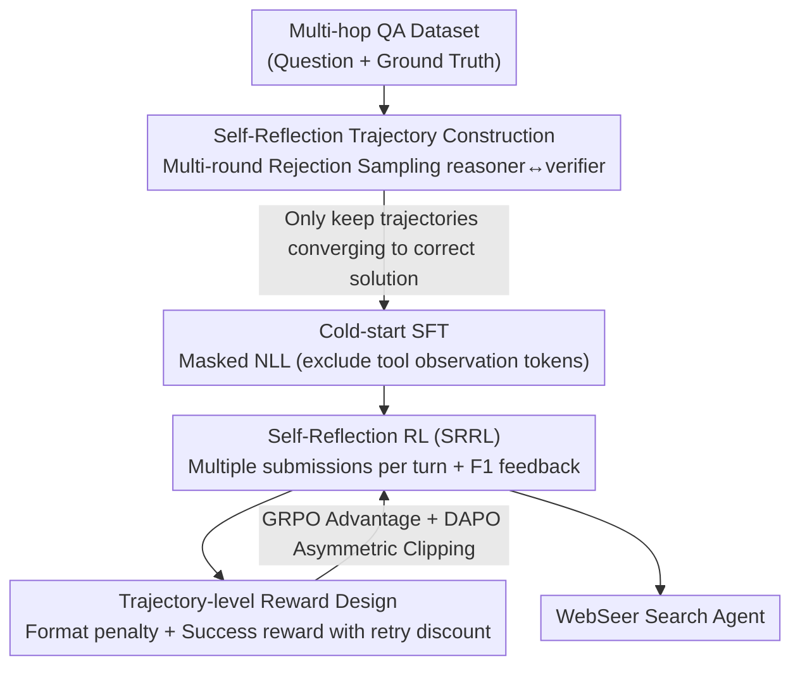

# WebSeer: Training Deeper Search Agents through Reinforcement Learning with Self-Reflection

**Conference**: ICLR 2026  
**OpenReview**: [https://openreview.net/forum?id=YCXWIfVakj](https://openreview.net/forum?id=YCXWIfVakj)  
**Code**: https://github.com/ (Paper refers to Github/WebSeer, link subject to original text)  
**Area**: Agent / Tool Use / Reinforcement Learning  
**Keywords**: Search agent, self-reflection, multi-turn retrieval, RL, rejection sampling

## TL;DR
WebSeer trains a 14B search agent using a two-stage process: "rejection sampling to construct cold-start data with reflection trajectories" and "Self-Reflection Reinforcement Learning (SRRL) allowing multiple answer submissions per turn." This enables the model to actively extend tool chains and backtrack or rewrite queries when uncertain, achieving SOTA results of 72.3% and 90.0% on HotpotQA and SimpleQA, respectively.

## Background & Motivation

**Background**: For open-domain multi-hop QA using LLMs, the mainstream approach is agentic RAG—allowing the model to decide when to search, read web pages, or run code, retrieving and reasoning along a multi-step chain. Compared to traditional one-shot RAG, it can browse the internet freely and combine tools to handle complex tasks.

**Limitations of Prior Work**: The authors highlight three specific issues. First, **Insufficient Search Calls**: Models tend to force existing information into a plausible answer rather than continuing to seek evidence, resulting in short tool chains and premature convergence. Second, **Lack of Spontaneous Self-Reflection**: Existing agents do not actively cross-verify or backtrack to rewrite queries when uncertain; once early retrieval is incomplete, subsequent generation snowballs on a flawed context. Third, **Ignoring Real Web Scenarios**: Most work retrieves only from local vector databases and is not trained in open, real-world web environments.

**Key Challenge**: A tension exists between search depth (multiple tool calls and verification rounds) and the "early-stopping preference" of the model. Models naturally intend to provide answers as quickly as possible, whereas high-quality multi-hop reasoning requires resisting this impulse to extend the chain and perform self-correction. Standard RL provides sparse signals based only on the final answer's correctness, which is insufficient to teach the model how to reflect and retry.

**Goal**: To train a single-model search agent that (1) is willing to extend the tool chain, (2) actively performs self-reflection and backtracking, and (3) generalizes stably in real web environments.

**Key Insight**: Since standard trajectory data only demonstrates "correct on first attempt" paths without teaching how to handle failures, specifically constructed trajectories **containing reflection patterns** are used for cold starting. Furthermore, the RL stage incorporates the ability to submit answers multiple times within the environment, allowing correctness signals to be fed back repeatedly within a single turn to explicitly reward reflection behavior.

**Core Idea**: Unify SFT cold-start and RL under a "Self-Reflection" paradigm—using rejection sampling to create long trajectories with reflection for cold starting, followed by Self-Reflection Reinforcement Learning (SRRL) that allows multiple submissions and F1-based rewards to teach the model to "actively use tools and retry when uncertain."

## Method

### Overall Architecture

WebSeer is a **single-model** search agent: all decisions, tool calls, and answer verifications are performed by the same 14B model without requiring extra agent controllers or stronger auxiliary models. The task is formalized as a tool-augmented reasoning chain—at each step, the model generates reasoning output, decides which tool to call, and appends the returned observation back to the context. This continues until the model stops calling tools or uses a special `answer_submit` tool. A maximum step count $T_{max}$ (up to 50 during inference) prevents infinite loops. The model is equipped with three complementary tools: **Search Engine** (keywords $\rightarrow$ Google Search $\rightarrow$ Titles/URLs/Snippets), **Web Reader** (URL + Question $\rightarrow$ HTML reading and summarization, bypassing raw HTML), and **Code Executor** (Python for precise calculation).

Training is divided into two stages unified under the self-reflection paradigm:

### Key Designs

**1. Multi-round Rejection Sampling for Self-Reflection Trajectories: Demonstrating "Error $\rightarrow$ Reflection $\rightarrow$ Correction" in Cold-start Data**

Existing cold-start trajectories only show successful paths, so models never see how to remedy errors. The authors use two roles (**the same model with different prompts**) to generate data: reasoner $G$ generates reasoning paths and proposes an answer $\hat{y}^{(t)}_i$ based on history, while verifier $V$ uses tools to judge the answer and returns a judgment (CORRECT/INCORRECT) and a verification path. A key **validity criterion** $\Psi$ is used: a judgment is accepted only if "judged CORRECT and answer equals ground truth" or "judged INCORRECT and answer does not equal ground truth," ensuring the verifier's judgment **matches the facts**. Otherwise, the verifier is re-sampled within a budget $K$. This iterates until $\hat{y}^{(t)}_i = y^*_i$ and is judged CORRECT, at which point the complete trajectory $T_i = \{P_1, R_1, \dots, P_t, R_t\}$ is recorded. The specific form of reflection is not restricted as long as it converges to the correct solution, ensuring diversity. These trajectories naturally contain multi-round refinements and much longer tool chains than conventional dialogue data.

**2. Masked SFT Excluding Observation Tokens: Learning Agent Reasoning, Not Tool Output Recitation**

Applying NLL to the entire trajectory forces the model to "memorize" external observations like search snippets, which is neither meaningful nor stable. The authors mask out tool observation subsequences $O \subset T$ from the loss, with the objective:

$$L(x, T; \theta) = -\frac{\sum_{t=1}^{T} \mathbb{I}[y_t \notin O] \cdot \log p_\theta(y_t \mid x, y_{<t})}{\sum_{t=1}^{T} \mathbb{I}[y_t \notin O]}.$$

This ensures the loss is calculated only on "agent's own outputs" (internal reasoning, tool call decisions), skipping raw tool observations. This focuses the model on learning "when to search and how to organize intermediate steps," improving performance and robustness while providing a stable starting point for RL.

**3. Self-Reflection Reinforcement Learning (SRRL): Repeated Feedback by Allowing Multiple Submissions**

Standard RL allows only one answer submission per turn, preventing reflection. The core modification in SRRL **allows multiple answer submissions within a single dialogue**: when the action is `answer_submit`, the submitted answer $\hat{y}^{(t)}$ is compared to the ground truth to calculate a token-level F1 reward $r(t) = \text{F1}(\hat{y}^{(t)}, y^*) \in [0,1]$. This scalar is fed back **in text form** (e.g., "Incorrect! The F1 score is …"). If $r(t)$ is below a threshold, the environment allows the model to continue reasoning and submit an improved answer later (up to 20 attempts during training). The optimization uses a hybrid objective: following GRPO's group relative advantage estimation $\hat{A}_{i,t} = \frac{R(o_i) - \mu_{group}}{\sigma_{group} + \delta}$ while employing DAPO's **asymmetric clipping** $\epsilon_{low}, \epsilon_{high}$ to adapt to skewed reward distributions, preventing overfitting to sparse high-reward noise.

**4. Trajectory-level Reward: Balancing Correctness and Efficiency**

Rewarding only correctness might lead to verbose outputs or endless retries. The authors design a trajectory-level reward $R(\tau) = R_{format}(\tau) + R_{correct}(\tau)$. The **format term** penalizes length: no penalty within $L_{expect}$, linear penalty $-\frac{|y| - L_{expect}}{L_{max} - L_{expect}}$ between $L_{expect}$ and $L_{max}$, and a maximum penalty of $-1$ beyond $L_{max}$. The **correctness term** uses $R_{correct}(\tau) = r \cdot \alpha^T$, where $r$ is the task score (token-level F1), $T$ is the number of attempts, and $\alpha \in (0,1]$ is an exponential discount—more retries lead to heavier reward decay, providing a clear gradient signal to balance reflection and efficiency.

### Loss & Training
SFT utilizes the masked NLL mentioned above. RL utilizes a PPO-style objective with GRPO advantages and DAPO asymmetric clipping (Equation (1)), with rewards consisting of format penalties and retry-discounted F1 correctness (Equations (3)-(5)). Training is based on the verl framework, sampling 12 prompts per step, 8 candidate trajectories per prompt, and up to 30 interaction rounds, totaling 100 steps and approximately 480 A800 GPU hours. Training is restricted to Wikipedia (Google Site Search + Wikipedia API) to reduce noise/cost, while deployment uses Google Web Search API + Jina API for real web scraping.

## Key Experimental Results

### Main Results
Evaluation covers NQ, TQ, HotpotQA, 2Wiki, MuSiQue, Bamboogle, and PopQA (512 samples each, 125 for Bamboogle), using LLM-as-a-Judge. Only one final answer is allowed during evaluation.

| Method | Environment | NQ | TQ | Hotpot | 2Wiki | In-domain Avg |
|------|------|----|----|--------|-------|---------|
| Search-r1 (14B) | Local RAG | 66.9 | 82.6 | 69.8 | 57.0 | 69.1 |
| DeepResearcher (7B) | Web Search | 61.9 | 85.0 | 64.3 | 66.6 | 69.5 |
| **WebSeer (14B)** | Local RAG | **81.9** | 86.7 | 70.9 | 76.0 | **78.9** |
| **WebSeer (14B)** | Web Search | **82.8** | **91.0** | **72.3** | **84.2** | **82.6** |

The in-domain average reached 82.4%, outperforming Search-r1 by 12.5 points, with the largest gains in NQ and 2Wiki (+15.9 / +27.2). It also leads on harder benchmarks:

| Model | FanoutQA | FRAMES | SimpleQA | Avg |
|------|----------|--------|----------|-----|
| Qwen2.5-14B | 45.5 | 52.7 | 85.7 | 61.3 |
| Search-r1-14B | 12.6 | 29.5 | 36.4 | 26.2 |
| **WebSeer** | **55.4** | **56.1** | **90.0** | **65.3** |

WebSeer almost matched GPT-4o on FanoutQA (55.4 vs 55.8). Despite using restricted retrieval during training, it performed better on the open web, indicating it learned transferable retrieval-reasoning strategies.

### Ablation Study

| Configuration | HotpotQA Acc | Tool Call | SimpleQA Acc | Tool Call | Description |
|------|-------------|-----------|-------------|-----------|------|
| SFT only | 68.75 | 13.43 | 76.17 | 10.82 | Cold-start only |
| w/ GRPO | 67.27 | 7.38 | 75.98 | 6.15 | Standard RL (single attempt) |
| w/ SRRL (WebSeer) | **70.90** | 7.91 | **78.91** | 8.61 | Multi-submission reflection RL |
| SRRL w/o SFT | 0.00 | N/A | 0.00 | N/A | Crashes without cold-start |

### Key Findings
- **SRRL > Standard GRPO**: Incorporating "multi-submission per turn" into RL improved HotpotQA and SimpleQA by +3.63 and +2.93 respectively, with more reasonable tool call counts.
- **Cold-start is Essential**: Removing SFT led to model collapse (0% accuracy), as the 14B model produced malformed JSON and could not generate valid tool calls without the reflection patterns learned in SFT.
- **Scale Matters**: While SFT increased tool usage across scales, only the 14B model consistently benefited in accuracy (+5.86 on HotpotQA, +10.74 on SimpleQA). 3B/7B models often saw performance drops and RL instability.
- **Tool Usage Evolution (Few $\rightarrow$ Many $\rightarrow$ Refined)**: Prior to SFT, models were conservative (~3 calls). Post-SFT, usage peaked (~10 calls, up to 50). Post-RL, usage converged to 5–8 strategic calls.
- **SFT Data Mixture is Critical**: The ratio of single-shot vs. multi-round refinement trajectories significantly affects behavior. A ratio of 1.5 achieved the best balance on HotpotQA (72.3).

## Highlights & Insights
- **Explicit Instruction on Handling Errors**: Unlike most cold-start data that only shows success, WebSeer uses rejection sampling to retain trajectories with reflection/correction, using the $\Psi$ criterion to filter verifier noise.
- **Environment Mechanism for Multiple Submissions**: Using an `answer_submit` tool with F1 text feedback enables reflection during RL training rather than hoping for it to emerge spontaneously.
- **Retry Exponential Discount $r \cdot \alpha^T$**: Provides a clean, tunable knob to balance encouraging reflection and preventing tool abuse, transferable to any agent training allowing multiple attempts.
- **Generalization from Restricted to Open Web**: Training in a restricted environment reduces noise, while the learned strategies generalize effectively to the open web.

## Limitations & Future Work
- **Strong Scale Dependency**: The method appears tied to the 14B parameter range; usability for smaller models (3B/7B) remains questionable.
- **High Training Cost**: 480 A800 GPU hours plus multi-round rejection sampling poses a high barrier to reproduction.
- **F1-dependent Reward**: F1 as a process reward might be biased for open-domain QA where answers vary in surface form; though evaluation uses LLM-as-a-Judge, training still relies on F1.
- **Single Model for Reasoner/Verifier**: Using the same model for both might lead to systematic blind spots. While $\Psi$ relies on ground truth during training, self-verification in deployment remains an open problem.

## Related Work & Insights
- **vs Search-r1**: Search-r1 is a pure RL local RAG agent with short chains and accumulated errors; WebSeer adds cold-start reflection and real web access for longer chains and better correction.
- **vs DeepResearcher**: DeepResearcher requires auxiliary controllers/stronger backbones; WebSeer consolidates all into a **single model**.
- **vs Standard GRPO/DAPO RL**: WebSeer focuses on the environmental design of "multi-submission + text feedback" rather than just a new RL algorithm.

## Rating
- Novelty: ⭐⭐⭐⭐
- Experimental Thoroughness: ⭐⭐⭐⭐
- Writing Quality: ⭐⭐⭐⭐
- Value: ⭐⭐⭐⭐

<!-- RELATED:START -->

## Related Papers

- [\[ICLR 2026\] GUI-Shift: Enhancing VLM-Based GUI Agents through Self-supervised Reinforcement Learning](gui-shift_enhancing_vlm-based_gui_agents_through_self-supervised_reinforcement_l.md)
- [\[ICLR 2026\] Tree Search for LLM Agent Reinforcement Learning](tree_search_for_llm_agent_reinforcement_learning.md)
- [\[ICLR 2026\] AlphaAgentEvo: Evolution-Oriented Alpha Mining via Self-Evolving Agentic Reinforcement Learning](alphaagentevo_evolution-oriented_alpha_mining_via_self-evolving_agentic_reinforc.md)
- [\[ICLR 2026\] MATHMO: Automated Mathematical Modeling Through Adaptive Search](mathmo_automated_mathematical_modeling_through_adaptive_search.md)
- [\[ICLR 2026\] PolySkill: Learning Generalizable Skills through Polymorphic Abstraction for Continual Agents](polyskill_learning_generalizable_skills_through_polymorphic_abstraction_for_cont.md)

<!-- RELATED:END -->
