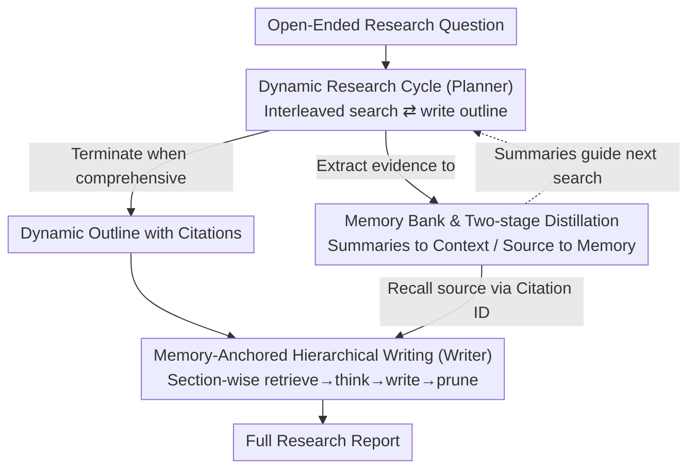

# WebWeaver: Structuring Web-Scale Evidence with Dynamic Outlines for Open-Ended Deep Research

**Conference**: ICLR 2026  
**Paper**: [OpenReview / ICLR 2026 conference paper]  
**Code**: https://github.com/Alibaba-NLP/DeepResearch (Yes)  
**Area**: Agent / Deep Research / LLM Retrieval-Augmented Generation  
**Keywords**: Open-Ended Deep Research, Dual-Agent, Dynamic Outline, Memory Bank, Citation Anchoring

## TL;DR
WebWeaver utilizes a "Planner + Writer" dual-agent system to simulate the human research process: the Planner iteratively optimizes a cited outline during searching, while the Writer performs "evidence retrieval-writing-pruning" section by section. It achieves SOTA on DeepResearch Bench, DeepConsult, and DeepResearchGym, with a citation accuracy of up to 92%.

## Background & Motivation
**Background**: Open-Ended Deep Research (OEDR) requires AI agents to handle complex questions without standard answers, autonomously retrieving and digesting hundreds of web pages or PDFs (often exceeding 100,000 tokens) to produce a long report with accurate citations. This represents a frontier for autonomous agents, testing curiosity-driven information synthesis rather than simple problem-solving.

**Limitations of Prior Work**: Existing open-source solutions fall into two categories, both with structural flaws. "Search-then-generate" methods lack outline guidance, leading to disjointed reports. "Outline-guided search" or "search-then-outlining" approaches fix the outline too early; the former relies on outdated internal LLM knowledge, while the latter locks the scope based on an initial directional-less search.

**Key Challenge**: The commonality among these methods is a **one-way pipeline** where planning and evidence gathering are decoupled and fixed, preventing mutual feedback. Furthermore, the final writing stage often floods the context with all retrieved materials, leading to "lost in the middle" effects, contextual bleeding, hallucinations, and poor citation accuracy.

**Goal**: (1) Enable the outline and retrieval to **co-evolve** rather than being fixed; (2) Ensure long report writing only considers relevant evidence to eliminate hallucinations and cross-section interference caused by noisy contexts.

**Key Insight**: Human experts do not separate "drafting" and "researching" into fixed stages; instead, these processes interweave until a complete outline converges. During writing, they only refer to notes relevant to the current section. WebWeaver engineers this "human-like research" intuition.

**Core Idea**: Replace the one-way pipeline with a **Dynamic Research Cycle** (interleaved search ⇄ outline optimization) to produce cited outlines, and replace one-shot generation with **Memory-Anchored Hierarchical Writing** (section-wise retrieval, writing, and pruning).

## Method

### Overall Architecture
WebWeaver is a dual-agent framework comprising a **Planner** for exploratory "evidence gathering + outline optimization" and a **Writer** for evidence-anchored synthesis, linked via a **Memory Bank**. Both agents operate using the ReAct paradigm—generating thought, executing actions, and processing observations until a `<terminate>` tag is reached.

The pipeline consists of two phases: The **Planning Phase**, where the Planner alternates between searching and outline optimization, using new evidence to restructure the outline with citations linked to Memory Bank IDs. The **Writing Phase**, where the Writer processes the outline section by section: first retrieving only necessary evidence via citation IDs, then synthesizing the content, and finally pruning the used materials from the context. The Memory Bank manages context by feeding only **short summaries** to the Planner while storing **full evidence** for the Writer.

### Key Designs

**1. Dynamic Research Cycle: Co-evolution of Outline and Retrieval**

To address the flaw of one-way pipelines, the Planner's core is an iterative loop of searching and outline optimization. It chooses between `search`, `write outline`, or `terminate`. When evidence is insufficient, it performs a search with two-stage filtering: the LLM selects relevant URLs based on titles/snippets, then distills query-relevant summaries (for the Planner's context) and extracts verifiable evidence (for the Memory Bank). The `write outline` action continuously refines the structure, adding sections and mapping them to Memory Bank IDs. This refined outline acts as a strategic blueprint to guide subsequent searches into knowledge gaps. On average, the process involves 15.7 search steps and 2.16 outline optimizations.

**2. Memory Bank and Two-Stage Evidence Distillation**

To manage context limits (processing >100 pages and >100k tokens), WebWeaver decouples "awareness of evidence" from "viewing source text." During search, only **short summaries** enter the agent's context, preventing the Planner from being overwhelmed. **Source-level evidence** is stored in the Memory Bank and only retrieved via IDs when writing specific sections. This serves as a prerequisite for the framework's stability, preventing "lost in the middle" effects. Ablations show that replacing the distillation model (GPT-oss-120b) with a smaller model (Qwen3-30b-a3b) results in negligible performance drops, indicating the architecture itself drives the performance.

**3. Memory-Anchored Hierarchical Writing: Preventing Contextual Bleeding**

To prevent attention saturation and hallucinations, the Writer uses a hierarchical, citation-anchored synthesis. Each section follows a "within-section reasoning loop": identifying the sub-task, performing a `retrieve` action (pulling only relevant evidence for that section), a `think` stage for synthesis, and finally `write`. Once a section is completed, its source materials are explicitly **pruned** from the context window. This ensures the Writer's context only contains relevant information, significantly improving citation accuracy (92.13%) by suppressing context-bleeding and citation hallucinations.

### Loss & Training
WebWeaver is a **training-agnostic** inference framework. However, the authors leverage it as a "data engine" to generate a high-quality SFT dataset, **WebWeaver-3k**, covering ten domains. Distilling the "think-search-write" skills into a Qwen3-30b-a3b-Instruct model via SFT allows the smaller model to approach the performance of large proprietary systems, proving that complex agentic skills are learnable.

## Key Experimental Results

### Main Results
On the DeepResearch Bench, WebWeaver achieves SOTA in report quality (RACE) and citation quality (FACT), even surpassing reference answers:

| System | Overall (RACE) | Comp. | Insight | Eff.c | C.acc (%) |
|------|------|------|------|------|------|
| ReAct (Qwen3-235b) | 46.16 | 45.04 | 43.20 | - | - |
| openai-deepresearch | 46.45 | 46.46 | 43.73 | 39.79 | 75.01 |
| Gemini-2.5-pro-deepresearch | 49.71 | 49.51 | 49.45 | 165.34 | 78.30 |
| **Ours (Qwen3-235b)** | **50.80** | 51.45 | 51.39 | 152.70 | 75.72 |
| **Ours (Claude-sonnet-4)** | 50.48 | **51.65** | 49.67 | **216.99** | **92.13** |

On DeepConsult and DeepResearchGym, WebWeaver consistently leads, demonstrating strong generalization:

| Benchmark | Metric | Ours (Claude-4) | Strongest Competitor |
|------|------|------|------|
| DeepConsult | Win Rate (%) | 67.69 | ReAct 51.55 |
| DeepResearchGym | Avg Score | 96.74 | ReAct 86.72 |

### Ablation Study

| Config | DeepResearchGym Avg | Description |
|------|------|------|
| GPT-oss-120b for Summary (Default) | 96.74 | Full Framework |
| Qwen3-30b-a3b for Summary | 96.68 | Minimal drop; architecture is the lead factor |

Outline optimization distribution: 1 round (15%), 2 rounds (59%), 3 rounds (21%), 4 rounds (5%). An average of 2.16 rounds confirms that the dynamic cycle continuously restructures the outline.

### Key Findings
- **Citation accuracy is the primary highlight**: 92.13% significantly outperforms openai-deepresearch (75.01%) and Gemini-2.5-pro (78.30%).
- **Architecture > Sub-models**: Swapping the distillation model to a 30B version has minimal impact, proving gains come from the dynamic cycle and memory-anchored writing.
- **Distillability**: WebWeaver-3k enables 30B models to reach expert-level performance, democratizing capabilities previously reserved for proprietary systems.

## Highlights & Insights
- **Engineering "Human-like Research"**: By interleaving drafting with research and using targeted notes for writing, WebWeaver elegantly maps human intuition to a technical framework.
- **Memory Bank Decoupling**: Separating "awareness" (summaries) from "viewing" (sources) preserves context and optimizes citation accuracy.
- **Pruning for Coherence**: Explicitly removing materials after each section solves the persistent issue of "inter-section pollution" in long-form generation.
- **Framework as Data Engine**: The strategy of using a robust framework to distill agentic trajectories provides a clear path for enhancing smaller models.

## Limitations & Future Work
- **Dependency on strong base LLMs**: The Planner's ability to judge evidence sufficiency and restructure outlines relies heavily on the reasoning power of base models like Claude-sonnet-4.
- **Cost and Latency**: The dynamic cycle involves multiple steps and significant token output, leading to high API costs and wall-clock times.
- **LLM-as-judge Evaluation**: While supported by human evaluation, the main metrics rely on LLM judges.
- **Future Directions**: Exploring "marginal information gain" estimation to shorten loops and extending the Memory Bank into a persistent knowledge base.

## Related Work & Insights
- **vs. search-then-generate (WebShaper, etc.)**: These lack outline guidance. WebWeaver provides precise structure and significantly higher citation accuracy.
- **vs. outline-guided/search-then-outlining (STORM, etc.)**: These are limited by fixed scopes. WebWeaver's bi-directional feedback allows for discovery-driven research.
- **vs. One-shot Long Report Generation**: WebWeaver's "retrieve-and-prune" mechanism decomposes long-form writing into manageable, context-controlled sub-tasks.

## Rating
- Novelty: ⭐⭐⭐⭐ The combination of co-evolving dynamic outlines and memory-anchored writing is a solid engineering of human intuition.
- Experimental Thoroughness: ⭐⭐⭐⭐⭐ Comprehensive SOTA across three benchmarks, including statistical analysis, human evaluation, and SFT distillation.
- Writing Quality: ⭐⭐⭐⭐ Clear motivation and methodology, though some metric definitions require appendix consultation.
- Value: ⭐⭐⭐⭐⭐ Excellent citation performance and clear path for model distillation; high practical value for deep research agents.

<!-- RELATED:START -->

## Related Papers

- [\[ICLR 2026\] Open Data Synthesis for Deep Research](open_data_synthesis_for_deep_research.md)
- [\[ICLR 2026\] ChinaTravel: An Open-Ended Travel Planning Benchmark with Compositional Constraint Validation for Language Agents](chinatravel_an_open-ended_travel_planning_benchmark_with_compositional_constrain.md)
- [\[ICLR 2026\] A Benchmark for Deep Information Synthesis (DeepSynth)](a_benchmark_for_deep_information_synthesis.md)
- [\[ICLR 2026\] Deep Ignorance: Filtering Pretraining Data Builds Tamper-Resistant Safeguards into Open-Weight LLMs](deep_ignorance_filtering_pretraining_data_builds_tamper-resistant_safeguards_int.md)
- [\[ICLR 2026\] EXP-Bench: Can AI Conduct AI Research Experiments?](exp-bench_can_ai_conduct_ai_research_experiments.md)

<!-- RELATED:END -->
