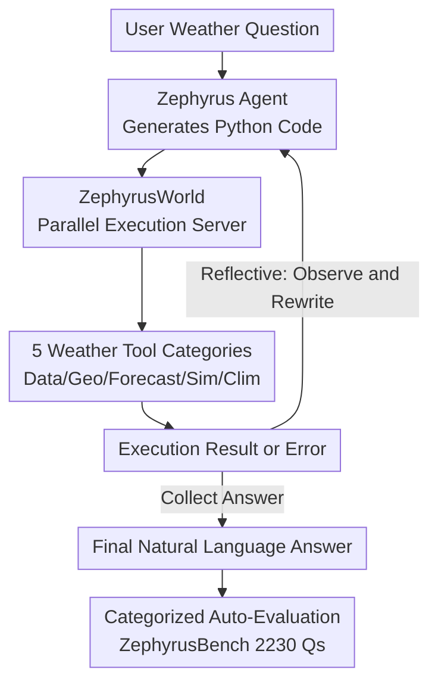

# Zephyrus: An Agentic Framework for Weather Science

**Conference**: ICLR 2026  
**OpenReview**: [https://openreview.net/forum?id=aVeaNahsID](https://openreview.net/forum?id=aVeaNahsID)  
**Code**: https://github.com/Rose-STL-Lab/Zephyrus  
**Area**: Agent / Weather Science / Tool Use / Benchmarking  
**Keywords**: Weather Agent, Code Generation, ReAct, Tool Environment, WeatherBench 2

## TL;DR
This paper constructs the first agentic framework for weather science: using a unified Python tool environment (ZephyrusWorld), LLMs solve tasks by writing code to call weather data, forecasting models, and climate simulators. It includes two execution strategies (Direct / Reflective) and a benchmark (ZephyrusBench) containing 2,230 problems across 49 task categories. Results show an accuracy improvement of up to 44 percentage points over text-only baselines, though difficult tasks remain challenging.

## Background & Motivation

**Background**: In recent years, neural foundation models (GraphCast, Pangu, Stormer, etc.) have outperformed traditional numerical models in medium-range forecasting with significantly faster speeds. Simultaneously, LLMs have demonstrated strong capabilities in literature reading, code generation, and structured data processing, leading to their integration into scientific agents for chemistry, materials, and biology (ChemCrow, Coscientist, Biomni).

**Limitations of Prior Work**: Weather foundation models consume structured numerical reanalysis data and lack natural language interfaces, preventing conversational querying or reasoning. Conversely, LLMs struggle to interpret high-dimensional, multi-channel, spatio-temporally coupled meteorological fields. Both are powerful yet disconnected. Furthermore, weather workflows require manual integration across fragmented data sources, forecast systems, coordinate/location conversions, and statistical tools, creating a high barrier to entry for non-experts.

**Key Challenge**: The spatio-temporal multi-channel structure of weather data differs fundamentally from standard modalities like RGB images or text. Standard multimodal VLMs are poor at quantitative analysis and can only handle a small subset of variables. Existing "weather + language" hybrid models still struggle to beat domain-specific baselines on many tasks. No system currently unifies "weather data" and "natural language reasoning" for generalized, interactive scientific applications.

**Goal**: To enable LLMs to perform language-level reasoning and analysis on high-dimensional weather data within an interactive, extensible, and systematically evaluable framework.

**Key Insight**: Instead of training an end-to-end multimodal model that "understands" both weather and language, the approach wraps weather tools into clean Python APIs. This allows LLMs to manipulate data through "writing code + observing execution results"—the modality they excel at most. Code serves as the interface, delegating high-dimensional data handling to programs and reasoning to language models.

**Core Idea**: Replace "end-to-end multimodal models" with "agents writing code to call weather tool environments" to bridge the gap between weather data and linguistic reasoning.

## Method

### Overall Architecture

The Zephyrus framework comprises four pillars. The first is **ZephyrusWorld**, an agentic environment unifying fragmented weather capabilities into Python APIs across five categories (data indexing, geocoding, forecasting, climate simulation, and climatological statistics), supported by a FastAPI-based parallel code execution server. The second is the **Zephyrus Agent Family**: given a weather problem, the agent generates Python code for the execution server and either refines the code based on results or provides an answer. It supports Direct (one-step generation) and Reflective (multi-turn ReAct style) strategies. The third is **ZephyrusBench**, a verifiable benchmark constructed via a manual and semi-synthetic pipeline, covering 49 task categories. The fourth is **Categorized Auto-Evaluation**, employing specific scoring methods for numerical, temporal, boolean, geographical, and descriptive answers.

The flowchart below illustrates the agent-environment interaction loop:

### Key Designs

**1. ZephyrusWorld: Unifying Fragmented Weather Tools in a Sandbox**

To address the barrier of manual weather workflows, all scientific capabilities are encapsulated into high-level Python APIs. During inference, tool docstrings are provided in the context. The environment offers five tool categories: (1) **WeatherBench 2 Data Indexer**, accessing ERA5 data via `xarray`; (2) **Geocoder**, performing forward/reverse geocoding, regional masking, area-weighted mapping, and distance calculations using `geopandas` and `shapely`; (3) **Forecaster**, integrating the Stormer neural model for short-to-medium range forecasts; (4) **Simulator**, using the JCM atmospheric model for 5-day simulations in ~25 seconds on an A100; (5) **Climatology Tools**, supporting queries for means/extremes based on the 1979–2000 reference period. A **FastAPI Parallel Execution Server** ensures thread-safe, isolated, and non-blocking code execution.

**2. Zephyrus Agent Family: Direct vs. Reflective**

The design measures the agentic capability of LLMs in solving weather problems. **Zephyrus-Direct** generates a complete Python solution in one go and maps the output to an answer, running only error-correction loops (up to 20 times). **Zephyrus-Reflective** implements a ReAct workflow where the agent executes blocks of code, observes outputs to judge scientific plausibility, and rewrites subsequent blocks iteratively (up to 20 turns).

**3. ZephyrusBench: Manual + Semi-Synthetic Verifiable Benchmark**

ZephyrusBench uses ERA5 data from WeatherBench 2 (1.5° resolution) with 2,230 problems categorized by complexity (Easy/Medium/Hard). **Manual tasks** are created using templates and expert-verified Python code; extreme events are matched with the EM-DAT disaster database. **Semi-synthetic tasks** use a pipeline where a "Claim Extraction Agent" extracts scientific statements from NOAA reports to create templates, for which LLMs then write verification code checked by humans.

**4. Categorized Auto-Evaluation: Scoring Open-ended Weather Answers**

A multi-stage pipeline extracts structured answers using `gpt-4.1-mini`. Numerical questions use **Normalized Median Absolute Error** (NMAE). Geographical questions use **Earth Mover's Distance (EMD)**. Descriptive answers are decomposed into discussion points and compared against references using LLM logits to determine if each statement is SUPPORTED, REFUTED, or NEUTRAL. Precision and recall are defined as:
$$\text{Precision}=\frac{\sum_{i\in S}P_{\text{model}\to\text{ref}}(\text{Supported}_i)}{\sum_{i\in S}P_{\text{model}\to\text{ref}}(\text{Supported}_i)+\sum_{i\in S}P_{\text{model}\to\text{ref}}(\text{Refuted}_i)}$$
$$\text{Recall}=\frac{1}{N}\sum_{i=1}^{N}P_{\text{ref}\to\text{model}}(\text{Supported}_i)$$
The final discussion score is the F1 of these two metrics.

## Key Experimental Results

Evaluation utilizes five LLM backbones: GPT-5.2, GPT-5-Mini, Gemini 2.5 Flash, gpt-oss-120b, and Qwen3-30B-A3B-Thinking.

### Main Results

Overall accuracy (%) across the full dataset:

| LLM Backbone | Reflective | Direct | Text-Only | Agentic Gain |
|--------------|------------|--------|-----------|--------------|
| GPT-5.2      | 58.9       | 57.7   | 17.6      | ~ +41        |
| GPT-5-Mini   | 61.2       | 58.5   | 17.0      | +44.2        |
| gpt-oss-120b | 56.2       | 55.4   | 13.3      | ~ +43        |
| Qwen3-30B    | 44.2       | 51.2   | 16.4      | ~ +35        |
| Gemini 2.5 Flash | 52.5   | 56.0   | 15.7      | ~ +40        |

Ours (Zephyrus) significantly outperforms text-only baselines by 27.8–44.2 percentage points.

### Key Findings
- **Grounding is Decisive**: Text-only accuracy is only 13–18%, while tool-equipped agents reach 44–61%, showing LLM internal knowledge is insufficient for weather tasks.
- **Difficulty Ceiling**: Easy tasks achieve 90%+, but Hard tasks drop to 14–38%. Global long-term climate forecasting remains an open challenge.
- **Reflective is not always superior**: While helpful for descriptive reports, Reflective mode can sometimes lead weaker models astray compared to Direct generation.

## Highlights & Insights
- **"Code as Interface" bypasses multimodal alignment**: Transitioning from "end-to-end" to "code-based tool manipulation" allows LLMs to focus on reasoning while programs handle high-dimensional computation.
- **Semi-synthetic pipelines enable scalable verification**: Generating templates from real NOAA reports ensures scientific relevance while allowing for massive automated answer generation.
- **Bidirectional NLI Scoring**: Using SUPPORTED/REFUTED/NEUTRAL logic for descriptive answers provides a more rigorous evaluation than character matching for scientific text.

## Limitations & Future Work
- **Weak Performance on Hard Tasks**: Accuracy on Hard tasks (14–38%) suggests current LLMs cannot yet reason through complex global phenomena even with tools.
- **Report Generation Gap**: Discussion scores remain low (~0.27), indicating generated weather discussions are not yet production-ready.
- **Simplistic Agent Logic**: The current Direct/Reflective loops lack memory, complex planning, or multi-agent collaboration.

## Related Work & Insights
- **Vs. Weather Foundation Models**: Models like GraphCast are numerical tools; Zephyrus integrates them into a text-driven reasoning layer rather than replacing them.
- **Vs. Multimodal Weather Models**: Prior works focus on narrow tasks like extreme event detection; Zephyrus offers a generalized framework using code to access all WeatherBench 2 variables.
- **Vs. Science Agents**: Similar to ChemCrow or Coscientist, Zephyrus adapts the tool-augmented LLM paradigm to the previously vacant domain of weather science.

## Rating
- **Novelty**: ⭐⭐⭐⭐⭐ First systematic weather science agent framework including environment, agents, and benchmarks.
- **Experimental Thoroughness**: ⭐⭐⭐⭐ Deep analysis across 5 backbones and 49 tasks, though some fine-grained data is relegated to the appendix.
- **Writing Quality**: ⭐⭐⭐⭐ Clear system design and documentation of tools/benchmarks.
- **Value**: ⭐⭐⭐⭐⭐ High platform-level value for the intersection of LLMs and weather science.

<!-- RELATED:START -->

## Related Papers

- [\[ICML 2026\] Towards a Science of AI Agent Reliability](../../ICML2026/llm_agent/towards_a_science_of_ai_agent_reliability.md)
- [\[ACL 2025\] REPRO-Bench: Can Agentic AI Systems Assess the Reproducibility of Social Science Research?](../../ACL2025/llm_agent/repro-bench_can_agentic_ai_systems_assess_the_reproducibility_of_research_claims.md)
- [\[ICLR 2026\] SciNav: A General Agent Framework for Scientific Coding Tasks](scinav_a_general_agent_framework_for_scientific_coding_tasks.md)
- [\[ACL 2025\] REPRO-Bench: Can Agentic AI Systems Assess the Reproducibility of Social Science?](../../ACL2025/llm_agent/repro-bench_can_agentic_ai_systems_assess_the_reproducibility_of_social_science_.md)
- [\[ICLR 2026\] CoDA: Agentic Systems for Collaborative Data Visualization](coda_agentic_systems_for_collaborative_data_visualization.md)

<!-- RELATED:END -->
