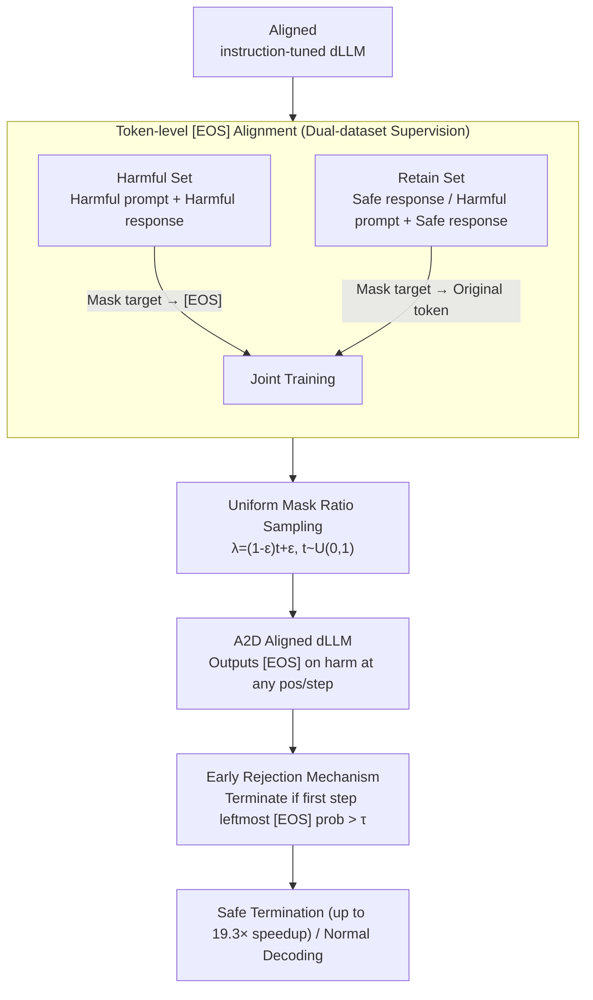

# A2D: Any-Order, Any-Step Safety Alignment for Diffusion Language Models

**Conference**: ICLR 2026  
**arXiv**: [2509.23286](https://arxiv.org/abs/2509.23286)  
**Code**: Available  
**Area**: LLM Alignment  
**Keywords**: diffusion language model, safety alignment, token-level defense, jailbreak, masked diffusion

## TL;DR
The authors propose A2D, a token-level safety alignment method for diffusion language models (dLLMs). By training the model to output the `[EOS]` token at masked positions when encountering harmful content, it achieves safety defense across any decoding order and any decoding step. This reduces the DIJA template attack success rate from 80%+ to near zero (1.3%/0.0%) and supports early rejection for 19.3x acceleration.

## Background & Motivation
**Background**: Diffusion language models (e.g., LLaDA, Dream) generate text via iterative de-masking instead of left-to-right generation, supporting any-order decoding. Existing safety alignment methods inherited from AR models rely on response-level rejection and the assumption of a fixed decoding order.

**Limitations of Prior Work**: The any-order decoding of dLLMs significantly expands the attack surface—harmful content can appear at any position. DIJA attacks bypass early rejection by interleaving adversarial text between `[MASK]` tokens, achieving success rates over 80%. Per-token KL analysis indicates that dLLM safety alignment is "shallow"—effective only in the first few steps, with safety signals decaying rapidly in subsequent steps.

**Key Challenge**: Response-level rejection in AR models assumes fixed left-to-right decoding, whereas dLLM decoding can occur in any order or at any step—traditional alignment simply does not apply to dLLMs.

**Goal**: How can dLLMs reliably reject harmful content across any decoding order and any decoding step?

**Key Insight**: Transition safety alignment from the response level to the token level—enabling the model to output `[EOS]` as a universal suppression signal whenever it encounters harmful content at any masked position.

**Core Idea**: Token-level `[EOS]` alignment + random mask training, enabling dLLMs to reject harmful continuations at any position and any step during decoding.

## Method

### Overall Architecture
A2D aims to ensure that an instruction-tuned dLLM, regardless of decoding order or step, outputs the `[EOS]` termination signal whenever a masked position is supposed to be filled with harmful content. It does not modify the architecture or add external classifiers; it only adjusts the standard masked diffusion training objective in two ways. First, training data is split into a Harmful set and a Retain set: for the Harmful set (harmful prompt + harmful response), the supervision target for all masked positions is changed from the original token to `[EOS]`; for the Retain set (safe responses and "harmful prompt + safe response" samples), the normal reconstruction target is maintained—teaching the model to "output `[EOS]` only for harmful content and generate normally otherwise." Second, the mask ratio is sampled uniformly during training to ensure the model encounters both early decoding (nearly all masked) and late decoding (nearly no mask), spreading safety signals across the entire decoding trajectory. After training, harmful inputs cause the `[EOS]` probability at masked positions to spike—A2D reads this as an internal safety signal to detect and terminate decoding at the first step if it exceeds a threshold.

### Key Designs

**1. Token-level [EOS] Alignment: Localizing response-level rejection to every masked position**

The any-order decoding of dLLMs allows harmful content to emerge at any position, which traditional "full response-level rejection" cannot contain. A2D shifts alignment to the token level: training data is split into Harmful and Retain sets. For the Harmful set, all masked positions are supervised with `[EOS]`, forcing the model to learn that "regardless of the current context, if harmful continuation is identified, output a termination signal here." For the Retain set, original tokens are reconstructed as usual. `[EOS]` is chosen because it is a familiar token (used for padding/ending), avoiding the need for new vocabulary. A key design choice is **including "harmful prompt + safe response" samples in the Retain set**—this teaches the model that it can provide safe answers to harmful questions, ensuring `[EOS]` is only triggered for truly harmful continuations rather than all sensitive queries (resulting in a 0% over-refusal rate on XSTest). Token-level supervision is naturally compatible with dLLM any-order decoding.

**2. Uniform Mask Ratio Sampling: Closing the "shallow alignment" loophole**

Per-token KL analysis shows that existing dLLM safety alignment is shallow—only effective in the first few decoding steps. A2D samples the timestep $t \sim U(0,1)$ for each sample during training and sets the mask ratio as $\lambda = (1-\epsilon)t + \epsilon$. This covers all ratios from "almost fully masked" (early decoding) to "almost no mask" (late decoding). Consequently, safety supervision is no longer concentrated in the initial steps but is evenly distributed across every decoding phase, achieving true any-step defense. In experiments, this drives the success rate of attacks like DIJA (which pre-fill partial harmful continuations) to near zero.

**3. Early Rejection Mechanism: Utilizing [EOS] probability as an internal safety signal**

After alignment, the model assigns a high `[EOS]` probability to masked positions for harmful inputs. A2D detects the `[EOS]` probability of the **leftmost** masked position during the first decoding step. If it exceeds a threshold $\tau$, generation is immediately terminated. Examining only the leftmost position avoids misinterpreting short benign replies (like "Okay") as rejections. Since the process stops at the start of decoding and skips subsequent de-masking steps, safety termination is significantly accelerated: at $\tau=0.9$, it provides a ~6x speedup on AdvBench with only 1.6% over-refusal; at $\tau=0.8$, it reaches 19.3x speedup.

### Loss & Training
The method uses the standard cross-entropy loss for all masked positions in masked diffusion. The only modification is substituting the supervision target with `[EOS]` for Harmful set samples. Training uses 30K samples from BeaverTails (split into Harmful and Retain sets). The method is applied to an already instruction-tuned dLLM, trained for 10 epochs with a batch size of 16 and a learning rate of $5\times10^{-5}$ (AdamW, weight decay 0.1).

## Key Experimental Results

### Main Results (Attack Success Rate ↓%)

| Model | Method | Zeroshot | PAIR | ReNeLLM | Prefilling | DIJA | Avg |
|------|------|----------|------|---------|------------|------|-----|
| LLaDA | Original | 14.6 | 77.5 | 56.5 | 69.6 | 82.9 | 60.2 |
| | VRPO | 2.5 | 32.3 | 19.2 | 9.0 | 45.0 | 21.6 |
| | **A2D** | **2.1** | **~Low** | **~Low** | **~Low** | **1.3** | **~Lowest** |
| Dream | A2D | - | - | - | - | **0.0** | - |

### Capacity Preservation

| Metric | Original | A2D |
|------|----------|-----|
| General (MMLU, etc.) | 66.6 | **66.2** |
| Math (GSM8K, etc.) | 41.4 | **40.6** |
| Coding (HumanEval, etc.) | 32.6 | **35.0** |

### Key Findings
- A2D reduces the DIJA attack success rate from 82.9% to 1.3% (LLaDA) and 0.0% (Dream)—effectively eliminating template attacks.
- General capabilities are maintained or even slightly improved (coding from 32.6 → 35.0), indicating token-level alignment does not harm general performance.
- 0% over-refusal rate on XSTest—no over-rejection of benign prompts.
- Early Rejection mechanism achieves 19.3x faster safety termination.
- Effective across three decoding strategies (left-to-right, confidence-based, random)—true any-order defense.

## Highlights & Insights
- **Reveals core dLLM safety vulnerabilities**: KL divergence analysis provides the first systematic proof that dLLM safety alignment is shallow and more severe than in AR models.
- **Simplicity of token-level [EOS] alignment**: Does not introduce new architectures or external classifiers; it achieves maximal defense with minimal modifications to the training objective.
- **Built-in safety monitoring capabilities**: `[EOS]` probability naturally serves as a real-time safety signal, supporting continuous monitoring during the decoding process.

## Limitations & Future Work
- Only trained on BeaverTails; harmful type coverage may not be fully comprehensive.
- Applied on top of aligned models (rather than from-scratch alignment); the interaction with original alignment is not fully understood.
- Robustness against adaptive attacks (attacks designed with knowledge of A2D) has not been analyzed in depth.
- Early rejection thresholds may need separate tuning for different models.

## Related Work & Insights
- **vs. AR Model Safety Alignment**: AR's RLHF/DPO assumes a fixed decoding order and is unsuitable for dLLMs; A2D natively supports any-order.
- **vs. DIJA Attack**: DIJA exploits the dLLM mask mechanism for template attacks; A2D uses the same mask mechanism for defense.
- **vs. Circuit Breaker / AlphaSteer**: While those methods target the activation space of AR models, A2D focuses directly on the dLLM training objective.

## Rating
- Novelty: ⭐⭐⭐⭐⭐ First systematic study on dLLM safety alignment; token-level `[EOS]` scheme is highly novel.
- Experimental Thoroughness: ⭐⭐⭐⭐⭐ 3 dLLMs, 5 attack types, multi-dimensional capability evaluation, KL analysis.
- Writing Quality: ⭐⭐⭐⭐⭐ Clear logical chain from vulnerability analysis to method design to experimental verification.
- Value: ⭐⭐⭐⭐⭐ Paves the way for the secure deployment of dLLMs.

<!-- RELATED:START -->

## Related Papers

- [\[ICLR 2026\] GuardAlign: Test-time Safety Alignment in Multimodal Large Language Models](guardalign_test-time_safety_alignment_in_multimodal_large_language_models.md)
- [\[CVPR 2026\] DRM: Diffusion-based Reward Model With Step-wise Guidance](../../CVPR2026/llm_alignment/drm_diffusion-based_reward_model_with_step-wise_guidance.md)
- [\[ICLR 2026\] Keep the Best, Forget the Rest: Reliable Alignment with Order-Aware Preference Optimization](keep_the_best_forget_the_rest_reliable_alignment_with_order-aware_preference_opt.md)
- [\[ICLR 2026\] JULI: Jailbreak Large Language Models by Self-Introspection](juli_jailbreak_large_language_models_by_self-introspection.md)
- [\[ICLR 2026\] Mitigating the Safety Alignment Tax with Null-Space Constrained Policy Optimization](mitigating_the_safety_alignment_tax_with_null-space_constrained_policy_optimizat.md)

<!-- RELATED:END -->
