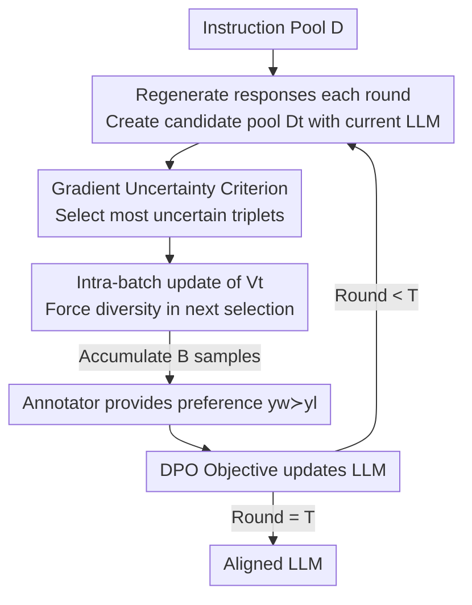

# ActiveDPO: Active Direct Preference Optimization for Sample-Efficient Alignment

**Conference**: ICLR2026  
**OpenReview**: [https://openreview.net/forum?id=RD4XgyVyGh](https://openreview.net/forum?id=RD4XgyVyGh)  
**Code**: To be confirmed  
**Area**: Alignment RLHF / Active Learning / DPO  
**Keywords**: Active Preference Selection, DPO, Implicit Reward, Gradient Uncertainty, Sample-Efficient Alignment

## TL;DR
ActiveDPO utilizes the "aligned LLM itself" as a reward model. Based on the gradient of its implicit reward, it derives a theoretically guaranteed uncertainty criterion to actively select the most valuable preference triplets for annotation. This allows the LLM to reach higher alignment levels using fewer human preference labels under a fixed annotation budget.

## Background & Motivation
**Background**: Aligning LLMs with human preferences (RLHF / DPO) has become the standard for enhancing downstream capabilities such as Q&A, mathematical reasoning, and code generation. Both approaches rely on high-quality preference datasets—where annotators provide binary preferences $y_w \succ y_l$ for two responses $y_1, y_2$ given the same prompt—to train the model.

**Limitations of Prior Work**: Preference annotation requires skilled labor, making it expensive and slow. This has led to research into "actively selecting a small subset of the most valuable triplets." However, existing active selection methods suffer from two major flaws: one category (e.g., APLP) is **purely heuristic**, lacking theoretical guarantees and potentially performing worse than random sampling given different tasks or models; the other category (e.g., APO) possesses theoretical guarantees but is built on the overly strong assumption of a **linear implicit reward function**, whereas implicit rewards in LLM alignment are inherently highly non-linear.

**Key Challenge**: A deeper issue is that most data selection methods are **independent of the LLM being aligned** (using an external reward model to score and select data). This implicitly assumes that "all LLMs require the same data for alignment." In practice, different models cover different information during the SFT phase and require different supplementary data. Selecting data without considering the target model leads to suboptimal selection.

**Goal**: Design an active preference selection algorithm that is **theoretically grounded, effective for non-linear rewards, and explicitly considers the target LLM**.

**Key Insight**: A key property of DPO is that it parameterizes the LLM itself as an implicit reward function $r_\theta$. Given this, instead of training an external reward model, one can **directly use the gradient of this implicit reward** to measure the uncertainty of the preference estimation for a triplet, naturally binding the selection to the model being aligned.

**Core Idea**: Drawing from uncertainty quantification in neural dueling bandits, the authors prove that the "reward difference estimation error" is upper-bounded by the gradient norm $\|\nabla r_\theta(x,y_1)-\nabla r_\theta(x,y_2)\|_{V^{-1}}$. Consequently, this gradient uncertainty is used as the selection criterion to prioritize annotating triplets where the model is most uncertain.

## Method

### Overall Architecture
ActiveDPO is an iterative "generation-selection-annotation-training" loop. Starting from a pool of task-specific instructions/prompts, each round involves: ① Re-generating responses using the current LLM to form a candidate pool $D_t$; ② Selecting a batch (size $B$) from the pool based on the gradient uncertainty criterion; ③ Handing these triplets to annotators (simulated by a trained reward model oracle in experiments) to obtain preference labels; ④ Updating the model on the newly annotated data using the DPO objective. The final aligned model is obtained after $T = k/B$ rounds. Compared to existing methods, this pipeline only modifies "how data is selected," keeping the training and annotation processes consistent to attribute performance gains solely to the selection strategy.

### Key Designs

**1. Implicit Reward Gradient Uncertainty Criterion: Using the Aligned Model to Select Data**

This step addresses the pain point of "selection independent of the target model." DPO parameterizes the LLM as an implicit reward $r_\theta(x,y) = \beta\left(\log\frac{\pi_\theta(y\mid x)}{\pi_{\text{ref}}(y\mid x)} + Z(x)\right)$, where preferences are determined by the BTL model $p(y_1\succ y_2\mid x)=\sigma(r_\theta(x,y_1)-r_\theta(x,y_2))$. Proposition 1 (based on neural dueling bandits) provides an upper bound for the reward difference estimation error:

$$\left|\big(r_\theta(x,y_1)-r_\theta(x,y_2)\big)-\big(r(x,y_1)-r(x,y_2)\big)\right| \le \nu_T \left\|\tfrac{1}{\sqrt{m}}\big(\nabla r_\theta(x,y_1)-\nabla r_\theta(x,y_2)\big)\right\|_{V_{t-1}^{-1}} + \varepsilon$$

In other words, the **larger the norm of the gradient difference measured under $V_{t-1}^{-1}$, the less certain the model is about the preference between the pair**. The selection criterion thus becomes picking the triplet that maximizes this norm:

$$x,y_1,y_2 = \arg\max_{x,y_1,y_2\sim D_t\setminus D_t^s} \left\|\nabla r_\theta(x,y_1)-\nabla r_\theta(x,y_2)\right\|_{V_{t-1}^{-1}}$$

(The implementation removes $1/\sqrt{m}$ as it only scales the gradient and the LLM's "width $m$" is not well-defined.) Compared to APLP, which uses "estimated reward difference" (tending to favor samples with large margins that are already correctly predicted), the gradient criterion measures how "new" a pair is relative to annotated data, thus consistently favoring exploration. Crucially, this criterion is built on the **LLM currently being trained**, making the selected data **model-specific** to fill information gaps from the SFT phase.

**2. $V_{t-1}^{-1}$ Diversity Regularization: Suppressing Explored Gradient Directions**

The matrix $V_{t-1}=\sum_{p}\sum \varphi\varphi^\top$ (where $\varphi=\frac{1}{\sqrt{m}}(\nabla r_\theta(x,y_1)-\nabla r_\theta(x,y_2))$) accumulates the outer product of gradients from all previously selected samples. In the criterion, it acts as **diversity regularization**: as a gradient direction is repeatedly sampled, the eigenvalue of $V_{t-1}$ in that direction increases, and $V_{t-1}^{-1}$ dampens it. Consequently, scores for samples with gradients similar to already selected data are lowered. This encourages selecting data with "complementary gradient directions and broader coverage," avoiding redundant annotation of homogeneous samples.

**3. Batch Selection + Intra-batch Incremental Update of $V$: Amortizing Costs**

Selecting samples one-by-one requires re-calculating all gradients and re-training the model after every single sample, which is computationally prohibitive. Batch selection picks $B$ samples per round over $T=k/B$ rounds, such that gradients and DPO training only occur once per $B$ samples. To prevent selecting redundant samples within a single batch, the authors use **incremental updates** of $V$ within the batch: upon selecting $(x_b^t,y_{b,1}^t,y_{b,2}^t)$, $V_{t-1}$ is immediately updated:

$$V_{t-1} = V_{t-1} + \varphi_{t-1}(x_b^t,y_{b,1}^t,y_{b,2}^t)\,\varphi_{t-1}(x_b^t,y_{b,1}^t,y_{b,2}^t)^\top$$

This forces the selection of the next sample in the same batch to be different from the previous ones, maintaining diversity constraints at a batch granularity.

**4. LoRA Gradients + Random Projection + Gradient Normalization: Scalability for Modern LLMs**

The criterion requires computing and storing gradients for every prompt-response pair. Since full gradients are as large as the LLM weights, computing $V_{t-1}$ and its inverse is unfeasible. Three techniques are combined: (a) Using **LoRA** to calculate gradients only for low-rank adapters (rank 128, $\alpha=512$ in experiments); (b) Since LoRA gradients still constitute 1–2% of the model, **Random Projection** is used to reduce the dimension to a fixed size (8192). The Johnson-Lindenstrauss lemma ensures inner products are preserved, maintaining the criterion's fidelity while lowering inversion costs; (c) **Gradient Normalization**: prior work found that longer responses tend to have smaller $\ell_2$ gradient norms. Without normalization, the criterion would bias towards short responses. Normalizing all gradients to unit norm removes the confounding factor of "length," ensuring selection is driven purely by information content.

### Loss & Training
The training Objective is the standard DPO loss (on selected and annotated data $D_l^t$):

$$\mathcal{L}_{\text{DPO}}(\pi_\theta,\pi_{\text{ref}}) = -\mathbb{E}_{(x,y_w,y_l)\sim D_l}\big[\log\sigma\big(r_\theta(y_w\mid x)-r_\theta(y_l\mid x)\big)\big]$$

The theoretical portion requires an additional regularization term when training the implicit reward $r_\theta$ (to support the error bound in Proposition 1). For each task, an initial model $\pi_{\text{SFT}}$ is obtained via SFT (1 epoch, lr 2e-5) serving as the reference model. Each round, 1000 prompts are sampled, each generating 3 responses (forming 3000 triplet candidates), from which 50 are selected for annotation. DPO training is performed for 4 epochs (lr 1e-4).

## Key Experimental Results

### Main Results
- **Datasets**: TLDR Summarization, WebGPT Long-form Q&A (both with existing human preference annotations used as an oracle).
- **Models**: Llama-2-7B, Gemma-2B, Qwen3-4B (across 3 families and sizes).
- **Baselines**: Random, APO (linear reward assumption, designed for RLHF), APLP (heuristic active learning for DPO).
- **Evaluation**: Mean reward of generated responses for 100 prompts as judged by a reward model (higher reward indicates better alignment).

| Setting | Key Observations | Comparison to Baselines |
|------|---------|---------|
| 6 groups (3 models × 2 tasks) | ActiveDPO average reward consistently higher than all baselines | Consistent lead |
| TLDR / WebGPT + Llama-2 | APLP performs well initially but falls below Random later | Heuristics are unstable |
| Final round for large models | Performance of different methods converges | Expected as data sufficiency increases |

### Ablation Study

| Configuration | Key Metrics | Explanation |
|------|---------|------|
| Full ActiveDPO | Optimal reward / win-rate | Gradient criterion + Norm + Projection 8192 |
| w/o Gradient Normalization | Reward/win-rate decreases | Criterion biases toward short answers, confounding length with quality |
| Projection Dim < 8192 | Performance degrades with lower dim | Information loss at low dimensions |
| Projection Dim > 8192 | Performance saturates | Dim 8192 chosen for performance-overhead balance |
| Model 1 vs Model 2 same data | Same dataset yields different results for different models | Validates "optimal data is model-specific" |

### Key Findings
- **"Model-specific" hypothesis empirically verified**: By training two Gemma models on disjoint SFT subsets and performing DPO on three distinct subsets, it was found that Dataset 2 was best for Model 2 but worst for Model 1 (win-rate). This proves selection must consider the target model, justifying ActiveDPO's use of model-specific gradients.
- **Gradient Normalization is necessary, not optional**: Without it, the criterion systematically favors long responses, mistaking length for quality. Normalization ensures selection is driven by information value.
- **Instability of APLP**: Its "estimated reward difference" criterion selects uninformative samples once the reward function becomes accurate. ActiveDPO’s gradient criterion measures "novelty" relative to annotated data, enabling continuous exploration.
- **Compute cost justified by labeling efficiency**: ActiveDPO introduces extra forward/backward passes for gradients, but since manual annotation costs are significantly higher than compute, the trade-off is highly beneficial.

## Highlights & Insights
- **Integrating the "Model to be Aligned" into the criterion**: Using the DPO implicit reward gradient as the source of uncertainty ensures the selection and final alignment target share the same $r_\theta$. this bypasses the misalignment in two-stage RLHF where improving an external reward model might not translate to model alignment.
- **Theoretical and Engineering synergy**: Adopting error bounds for non-linear rewards from neural dueling bandits (avoiding linear assumptions) and implementing them via LoRA + Random Projection + Batch Incremental updates makes the $V^{-1}$ criterion computationally feasible.
- **Transferable tricks**: Gradient normalization to remove length bias, JL random projection for high-dimensional inner product approximation, and intra-batch covariance updates for diversity are robust techniques applicable to any gradient-based active selection task.

## Limitations & Future Work
- **Oracle as Reward Model**: For feasibility, a pre-trained reward model simulates human annotation; performance under real human preferences remains to be verified.
- **Theory Gap**: Proposition 1 strictly holds for fully connected networks; the authors argue for its extrapolation to Transformers in the Appendix, but this is an argument rather than a formal proof.
- **Non-zero compute overhead**: Each round requires gradient calculation for candidates, which is heavier than Random/APLP. Gains also diminish for very large models or datasets.
- **Hyperparameter dependence**: Projection dimension, LoRA rank, and batch size require tuning. Future work could explore adaptive batching and dimensionality.

## Related Work & Insights
- **vs APO (Das et al., 2024)**: APO has theoretical guarantees but assumes **linear** rewards, is designed for RLHF, and is independent of the aligned LLM. ActiveDPO handles **non-linear** rewards, is built on DPO's implicit reward, and is model-specific.
- **vs APLP (Muldrew et al., 2024)**: APLP is a heuristic using estimated reward difference. It lacks theoretical guarantees and can underperform Random (e.g., on Llama-2). ActiveDPO uses gradient uncertainty, providing bounds and continuous exploration.
- **vs Classic RLHF Active Learning**: Traditional routes select data to improve an **independent reward model**, which then requires RL to impact the LLM. ActiveDPO aligns the selection directly with the LLM's implicit reward, creating a unified single-stage process.

## Rating
- Novelty: ⭐⭐⭐⭐⭐ Adapting uncertainty bounds from neural dueling bandits to DPO implicit rewards is theoretically solid and novel.
- Experimental Thoroughness: ⭐⭐⭐⭐ Covers 3 models × 2 tasks and validates the "model-specific" hypothesis, though lacks real human evaluation.
- Writing Quality: ⭐⭐⭐⭐ Clear chain from motivation to theory to engineering; trade-offs between formulas and approximations are well-explained.
- Value: ⭐⭐⭐⭐⭐ Directly reduces manual budgets in annotation-heavy alignment scenarios, offering high practicality.

<!-- RELATED:START -->

## Related Papers

- [\[ICML 2026\] Autoregressive Direct Preference Optimization](../../ICML2026/llm_alignment/autoregressive_direct_preference_optimization.md)
- [\[ICML 2026\] Boosting Direct Preference Optimization with Penalization](../../ICML2026/llm_alignment/boosting_direct_preference_optimization_with_penalization.md)
- [\[ICLR 2026\] SafeDPO: A Simple Approach to Direct Preference Optimization with Enhanced Safety](safedpo_preference_optimization_safety.md)
- [\[ICLR 2026\] Is On-Policy Data always the Best Choice for Direct Preference Optimization-based LM Alignment?](is_on-policy_data_always_the_best_choice_for_direct_preference_optimization-base.md)
- [\[ICLR 2026\] Token-Importance Guided Direct Preference Optimization (TI-DPO)](token-importance_guided_direct_preference_optimization.md)

<!-- RELATED:END -->
