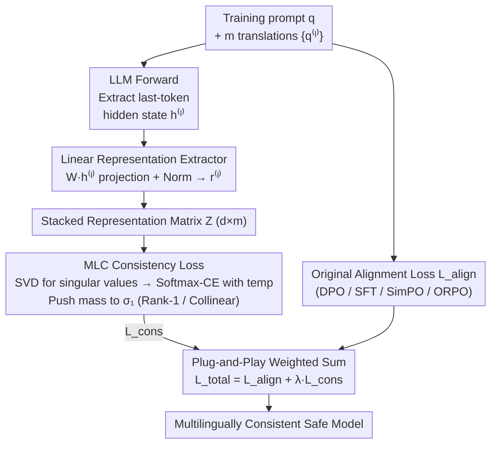

# Align Once, Benefit Multilingually: Enforcing Multilingual Consistency for LLM Safety Alignment

**Conference**: ICLR 2026  
**arXiv**: [2602.16660](https://arxiv.org/abs/2602.16660)  
**Code**: None  
**Area**: LLM Alignment  
**Keywords**: multilingual safety, consistency alignment, singular value decomposition, cross-lingual transfer, DPO

## TL;DR
The authors propose the Multi-Lingual Consistency (MLC) auxiliary loss. By using SVD to manipulate the singular values of the multilingual representation matrix toward rank-1 (i.e., making multilingual representations collinear), safety alignment effects from a single language can be consistently transferred to all languages using only multilingual prompt translations (without needing target language responses).

## Background & Motivation
**Background**: LLM safety alignment (SFT/DPO) is primarily conducted in high-resource languages like English. Consequently, while models perform safely in English, safety rates in low-resource languages (e.g., Swahili, Kurdish) can plummet from 93% to as low as 6-12%.

**Limitations of Prior Work**: The two main approaches for scaling multilingual alignment have limitations: (a) collecting high-quality safety data for every target language is extremely costly; (b) using English as an anchor for pairwise transfer (e.g., SDRRL/MPO) scales poorly and yields inconsistent performance, with some languages still lagging behind.

**Key Challenge**: Theoretically, if all languages are aligned to the same anchor, they should achieve similar safety levels. However, huge performance gaps remain—indicating that existing methods fail to fully exploit the safety signals already present in the anchor language.

**Goal**: How to align multiple languages simultaneously in a single training session without requiring response data in the target languages?

**Key Insight**: Behavioral consistency is determined by the consistency of multilingual representations. If the internal representations of the same query across different languages are aligned in the same direction (collinear), the model will produce consistent safe behaviors.

**Core Idea**: Use singular value analysis to constrain the multilingual representation matrix to rank-1, achieving the effect of "aligning once, benefiting multilingually."

## Method

### Overall Architecture
This paper addresses how to transfer safe behavior consistently across all languages using alignment data from only one language (English), without collecting responses for every target language. The premise is that "behavioral consistency stems from representation consistency"—as long as the internal representations of the same query in different languages are directionally consistent (collinear), the model will naturally provide consistent safe responses.

The process functions as follows: given a training prompt $q$ and its translations into $m$ languages $\{q^{(\ell)}\}_{\ell=1}^m$, the LLM performs a forward pass for each. The hidden state of the last token for each language is extracted and passed through a trainable linear projection + normalization to obtain a representation vector. These $m$ representation vectors are stacked into a matrix $\mathbf{Z} \in \mathbb{R}^{d \times m}$. SVD is performed on $\mathbf{Z}$, and an MLC auxiliary loss forces it towards "rank-1" (i.e., making all languages collinear). Finally, this auxiliary loss is added to the original alignment loss for backpropagation: $\mathcal{L}_{total} = \mathcal{L}_{align} + \lambda_{aux}\,\mathcal{L}_{cons}$. This mechanism does not change the training data format; it simply adds an extra term to existing alignment pipelines.

### Key Designs

**1. Linear Representation Extractor: Capturing Cross-lingual Semantic Directions with a Trainable Projection**

The prerequisite for the success of MLC is determining which set of representations to apply the collinearity constraint to—selecting the wrong representation subspace means rank reduction won't target safety-related directions. This work takes the hidden state $\mathbf{h}^{(\ell)}$ of the last token for each language prompt and maps it to a low-dimensional representation space via a linear projection $\mathbf{r}^{(\ell)} = \mathbf{W}\mathbf{h}^{(\ell)} + b$ (where $\mathbf{W} \in \mathbb{R}^{d \times d_h}$), then normalizes and stacks these into matrix $\mathbf{Z}$. The projection matrix $\mathbf{W}$ is trained jointly with the LLM, allowing the model to learn which subspace best reflects cross-lingual semantic consistency. Notably, simpler linear projections were found to be superior to more complex extractors, suggesting that cross-lingual consistency directions are approximately linearly separable.

**2. MLC Consistency Loss: Translating "Multilingual Behavioral Consistency" into "Rank-1 Matrix"**

With matrix $\mathbf{Z}$, the remaining problem is how to formulate the abstract concept of "consistent representation directions" into an optimizable objective. This is quantified as a matrix rank problem: performing SVD on $\mathbf{Z}$ yields singular values $\{\sigma_j\}$. If $\sigma_1$ is much larger than the rest, the representations for all languages lie nearly in the same direction (collinear), meaning the matrix is approximately rank-1. Thus, pushing $\sigma_1$ up and suppressing other singular values is equivalent to forcing multilingual representations into the same direction. Specifically, singular values are treated as logits, and a softmax cross-entropy with temperature $\tau$ is used to concentrate the probability mass on $\sigma_1$:

$$\mathcal{L}_{cons} = -\frac{1}{N}\sum_{n=1}^N \log \frac{\exp(\sigma_1^{(n)}/\tau)}{\sum_j \exp(\sigma_j^{(n)}/\tau)}$$

This form is differentiable everywhere with smooth gradients, avoiding the non-differentiability of direct hard rank constraints. Theoretically, per the Eckart-Young theorem, a rank-1 constraint is equivalent to minimizing $\|\mathbf{Z} - \tilde{\mathbf{Z}}\|_F^2$, making multilingual representations as close as possible to their best rank-1 approximation. Proposition 1 in the paper further proves that minimizing this reconstruction error is equivalent to maximizing the dominance of $\sigma_1$ over other singular values.

**3. Plug-and-Play Integration: Auxiliary Loss without Altering Pipelines**

MLC does not replace existing alignment algorithms but acts as an additional term: $\mathcal{L}_{total} = \mathcal{L}_{align} + \lambda_{aux} \mathcal{L}_{cons}$, where $\lambda_{aux}$ controls the weight of the consistency constraint. Crucially, this constraint only reads representations of multilingual prompts and does not involve responses, thus preserving the original training data format. This is the source of the "no target language response needed" advantage. Consequently, it integrates seamlessly with SFT, DPO, SimPO, ORPO, etc., providing gains across all four paradigms in experiments.

### Loss & Training
The method requires only English response data and multilingual prompt translations (attainable at low cost via machine translation). During training, prompts for all languages are processed in a forward pass. The MLC loss is calculated and added to the original alignment loss as a weighted sum before backpropagation.

## Key Experimental Results

### Main Results: PKU-SafeRLHF Multilingual Safety Rates

| Method | EN | ZH | RU | JA | AR | BN | SW | UR | PS | KU | Avg↑ | Var↓ | PAG↑ |
|------|----|----|----|----|----|----|----|----|----|----|------|------|------|
| Qwen Raw | 93.3 | 96.1 | 93.3 | 92.2 | 93.9 | 53.3 | 6.1 | 33.9 | 21.1 | 12.2 | 59.6 | 13.14 | 0.50 |
| DPO | 99.4 | 98.3 | 97.2 | 97.8 | 96.1 | 70.6 | 7.2 | 50.6 | 30.0 | 17.2 | 66.4 | 12.44 | 0.54 |
| MPO | 81.1 | 81.7 | 82.2 | 77.2 | 78.3 | 77.2 | 4.4 | 70.6 | 59.4 | 42.8 | 65.5 | 5.53 | 0.70 |
| **DPO+MLC** | **99.4** | **96.7** | **97.8** | **98.3** | **98.3** | **95.0** | **92.8** | **92.8** | **91.1** | **97.2** | **95.9** | **0.07** | **0.97** |

### Ablation Study (MultiJail OOD, ASR↓)

| Method | EN | ZH | AR | BN | SW | Avg ID↓ | KO | IT | JV | TH | VI | Avg OOD↓ |
|------|----|----|----|----|----|---------|----|----|----|----|----|----------|
| DPO | 2.9 | 1.9 | 5.1 | 17.8 | 25.1 | 10.5 | 3.2 | 3.5 | 4.1 | 5.4 | 1.9 | 3.6 |
| **DPO+MLC** | **0.6** | **0.3** | **1.0** | **1.0** | **0.6** | **0.7** | **0.6** | **0.6** | **0.3** | **1.0** | **0.0** | **0.5** |

### Key Findings
- DPO+MLC improves the average safety rate of Qwen across 10 languages from 59.6% to 95.9%, reducing variance from 13.14 to 0.07.
- Key comparison: DPO only improves safety in English while low-resource languages remain largely unchanged (Swahili stays at 7.2%), whereas MLC raises it to 92.8%.
- On the OOD test set MultiJail, DPO+MLC reduces ASR to 0.5-0.7%, and remains effective for languages unseen during training (Korean, Italian, etc.).
- MLC is compatible with SFT/DPO/SimPO/ORPO, consistently providing positive gains.
- Impact on general utility (MMLU) is <1%.

## Highlights & Insights
- **Cross-lingual Consistency from an SVD Perspective**: Converts the problem of multilingual representation consistency into matrix rank minimization—theoretically elegant and simple to implement (one SVD + softmax loss). The core insight is: if multilingual representations are collinear, the model will exhibit consistent behavior across all languages.
- **High Resource Efficiency**: Does not require any response data in target languages, only prompt translations. This is a major breakthrough for low-resource language safety, as translating prompts is far cheaper than generating high-quality alignment data.
- **Significant Improvement of Safety Floors**: Beyond just "average safety," the real value is the jump in low-resource language safety from 6-12% to 91-97%, meaning there are no longer "short planks" in multilingual safety.

## Limitations & Future Work
- Reliance on prompt translation quality; machine translation for low-resource languages might introduce noise (the paper uses GPT-4 for translation, which might differ from real-world deployment costs/quality).
- Overly strong collinearity constraints might cause issues in scenarios requiring differentiated safety strategies based on cultural contexts (e.g., content acceptable in one culture but not another).
- Verified only on 7-9B models.
- Uncertainty whether linear extractors are optimal across all architectures; the paper has not verified this on completely different architectures like MoE.

## Related Work & Insights
- **vs MPO (Zhao et al., 2025)**: MPO uses reward gaps from high-resource languages as supervision (pairwise transfer), which is unstable across multilingual settings (e.g., Swahili at 4.4%). MLC achieves simultaneous alignment through representation consistency.
- **vs SDRRL (Zhang et al., 2024b)**: SDRRL generates target language responses via self-distillation, requiring additional data and computation. MLC requires no target language responses.
- **vs AlphaSteer**: AlphaSteer uses null-space to protect utility, while MLC uses collinearity for multilingual alignment. Both exploit linear structures in representation space but for different goals.

## Rating
- Novelty: ⭐⭐⭐⭐ Consistency constraints from an SVD perspective is a clever theoretical contribution.
- Experimental Thoroughness: ⭐⭐⭐⭐⭐ 10 languages × 2 models × 4 alignment paradigms × ID/OOD testing × MMLU utility.
- Writing Quality: ⭐⭐⭐⭐ Theoretical derivation is complete, though notations require careful attention.
- Value: ⭐⭐⭐⭐⭐ Addresses a core bottleneck in multilingual safety alignment; practical and high-impact.

<!-- RELATED:START -->

## Related Papers

- [\[ACL 2025\] MPO: Multilingual Safety Alignment via Reward Gap Optimization](../../ACL2025/llm_alignment/mpo_multilingual_safety_alignment.md)
- [\[ICLR 2026\] Verification and Co-Alignment via Heterogeneous Consistency for Preference-Aligned LLM Annotations](verification_and_co-alignment_via_heterogeneous_consistency_for_preference-align.md)
- [\[ICLR 2026\] Enforcing Axioms for AI Alignment under Loss-Based Rules](enforcing_axioms_for_ai_alignment_under_loss-based_rules.md)
- [\[ICLR 2026\] Alignment-Weighted DPO: A Principled Reasoning Approach to Improve Safety Alignment](alignment-weighted_dpo_a_principled_reasoning_approach_to_improve_safety_alignme.md)
- [\[ICLR 2026\] Superficial Safety Alignment Hypothesis](superficial_safety_alignment_hypothesis.md)

<!-- RELATED:END -->
