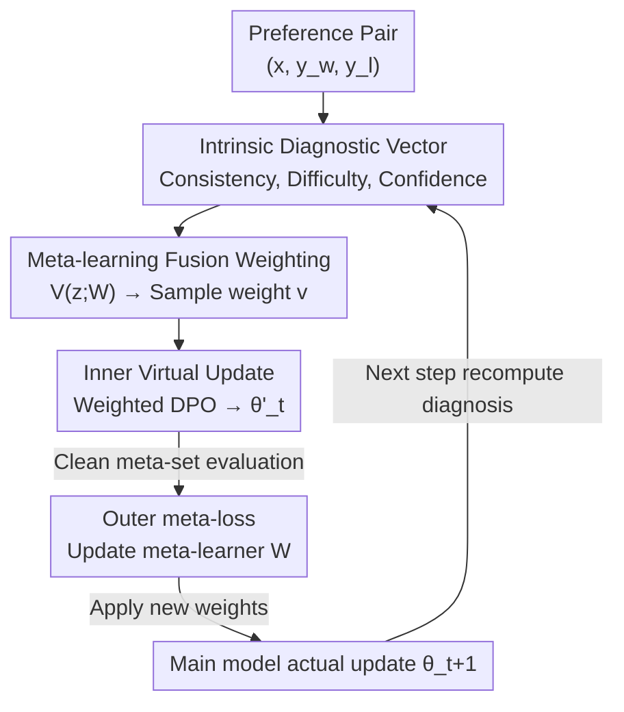

# Aligner, Diagnose Thyself: A Meta-Learning Paradigm for Fusing Intrinsic Feedback in Preference Alignment

**Conference**: ICLR2026  
**OpenReview**: [https://openreview.net/forum?id=oIAUP1K5Dq](https://openreview.net/forum?id=oIAUP1K5Dq)  
**Code**: To be confirmed  
**Area**: Alignment RLHF / Preference Optimization / Noise Robustness  
**Keywords**: Preference Alignment, DPO, Noisy labels, Meta-learning, Sample reweighting

## TL;DR
To address the issue where "mislabeled preference pairs" in preference datasets degrade DPO alignment, this paper moves beyond single heuristics like perplexity differences. It allows the model to "self-diagnose"—constructing a diagnostic vector from three intrinsic signals: consistency, learning difficulty, and generation confidence. A small network is then trained via meta-learning to fuse these signals and adaptively weight each sample, significantly outperforming existing robust alignment methods across various noise ratios.

## Background & Motivation
**Background**: The mainstream approach to aligning LLMs with human preferences (helpful/harmless/honest) is using preference datasets for RLHF or the lighter DPO (Direct Preference Optimization). These methods assume that "the chosen response $y_w$ is indeed superior to the rejected response $y_l$" in the data.

**Limitations of Prior Work**: Real-world preference data commonly contain "noisy preferences" (NP)—due to annotator disagreement, subjective bias, or AI auto-labeling errors, recorded preference labels are flipped ($y_w$ and $y_l$ are actually interchanged). Directly minimizing DPO loss on such data causes the model to learn incorrect behaviors, sharply decreasing alignment quality.

**Key Challenge**: Current robust alignment methods for handling NP are too "narrow." One category involves coarse-grained loss modification (e.g., cDPO, rDPO), which uses a global noise rate for uniform correction across all samples, failing to handle instance-level differences. Another category uses instance-level heuristics (e.g., PerpCorrect uses perplexity difference PPLDiff to judge if a label is flipped); while achieving instance granularity, they **rely on a single signal**. Single signals have inherent blind spots: PPLDiff can be fooled by "fluent but factually incorrect" responses; high training loss could indicate either noise or a truly difficult sample; generation uncertainty stems from both prompt ambiguity and insufficient model knowledge.

**Goal**: Enable the alignment model to perform a "holistic reliability assessment" for each preference pair rather than betting on a single heuristic.

**Key Insight**: The authors observe that "preference reliability is not a single attribute but a polyhedron," and the model's internal states provide multiple complementary feedbacks. By combining these signals, blind spots can be mitigated.

**Core Idea**: "Aligner, Diagnose Thyself"—fuse three intrinsic diagnostic signals (preference consistency, learning difficulty, and generation confidence) into a diagnostic vector. Use meta-learning to train a weight network to fuse these signals, assigning high weights to reliable samples and low weights to suspicious ones.

## Method

### Overall Architecture
The method is built upon DPO. The loss of standard DPO for a preference pair $(x, y_w, y_l)$ is:

$$\mathcal{L}_{\text{DPO}}(\pi_\theta,\pi_{\text{ref}}) = -\log\sigma\Big(\beta\log\tfrac{\pi_\theta(y_w|x)}{\pi_{\text{ref}}(y_w|x)} - \beta\log\tfrac{\pi_\theta(y_l|x)}{\pi_{\text{ref}}(y_l|x)}\Big),$$

where $\pi_{\text{ref}}$ is the reference policy (usually the SFT model) and $\beta$ controls the deviation from the reference. When $(y_w, y_l)$ are swapped in the data, directly minimizing this loss leads to poor learning outcomes.

The overall workflow is a **bi-level optimization loop**: at each step, the current policy $\pi_{\theta_t}$ computes a 3D diagnostic vector $z$ (consistency / difficulty / confidence) for each sample in the training batch, which is fed into a meta-learner $V(\cdot;W)$ to output a weight $v$ for each sample. These weights modulate the DPO loss to perform a "virtual" gradient update, resulting in temporary parameters $\theta'_t$. The loss of this virtual model is then evaluated on a small batch of clean meta-data (meta-loss) to update the meta-learner $W$. Finally, the updated meta-learner recomputes the weights to perform the actual update on the main model $\theta$. Through this cycle, the meta-learner gradually learns "how to fuse the three diagnostic signals."

### Key Designs

**1. Intrinsic Diagnostic Vector: Decomposing "Reliability" into Three Complementary Internal Signals**

To address the blind spots of a single heuristic, the authors do not use a scalar to judge sample quality. Instead, at each training step, a 3D vector $z\in\mathbb{R}^d$ is dynamically calculated using the current policy, where each component represents a different dimension.

- **Preference Consistency $z_{\text{ppl}}$**: A well-aligned model should assign higher likelihood (lower perplexity) to the truly superior response. This is characterized by the log-perplexity difference: $z_{\text{ppl}}^{(i)} = \log\text{PPL}(\pi_{\theta_t},[x;y_w]) - \log\text{PPL}(\pi_{\theta_t},[x;y_l])$, where $\text{PPL}(\pi,s)=\exp(-\tfrac{1}{|s|}\sum_k\log\pi(s_k|s_{<k}))$. $z_{\text{ppl}}>0$ implies the labeled "winner" is actually less probable under the current model, serving as a strong signal for NP. It is computed **dynamically** (using the latest $\pi_{\theta_t}$ at each step), which is more accurate than static pre-computation.
- **Learning Difficulty $z_{\text{loss}}$**: The instance-level DPO loss is used directly: $z_{\text{loss}}^{(i)}=\mathcal{L}_{\text{DPO}}(\pi_{\theta_t},\pi_{\text{ref}};(x,y_w,y_l))$. Since noisy sample gradients conflict with each other, their loss tends to be higher. This component measures "how surprising the preference pair is to the model."
- **Generation Confidence $z_{\text{uncert}}$**: Uncertainty is measured using the average token-level entropy of the generated response $H(y|x;\pi_{\theta_t})=-\tfrac{1}{m}\sum_{j}\sum_{v\in V}\pi_{\theta_t}(v|x,y_{<j})\log\pi_{\theta_t}(v|x,y_{<j})$, using the entropy of the preferred response as the signal. High entropy indicates the model is hesitating between plausible options, suggesting the preference label may be unreliable.

The final vector $z_t^{(i)}=[\text{norm}(z_{\text{ppl}}),\text{norm}(z_{\text{loss}}),\text{norm}(z_{\text{uncert}})]$ concatenates the normalized components. This setup is valuable because the signals are complementary: while PPLDiff is fooled by "fluent misinformation," high loss or high entropy can catch it; loss cannot distinguish "noise" from "truly difficult samples," but PPLDiff provides an anchor.

**2. Meta-learning Fusion Weighting: Learning a Weight Network Instead of Hand-tuning Fusion Rules**

Diagnostic signals may sometimes contradict each other (e.g., a sample with clean PPLDiff but high generation entropy). Balancing these via manual rules is difficult. The authors delegate "how to fuse" to meta-learning: a two-layer MLP meta-learner $V(z;W)$ is trained to take the diagnostic vector as input and output a non-negative sample weight $v=V(z;W)$. The quality of the weight is determined by "how well the main model, trained with these weights, performs on a small batch of clean meta-data." This follows the classical learning-to-reweight paradigm (Ren et al. 2018 / Shu et al. 2019), but the novelty here lies in **feeding the meta-learner a 3D diagnostic vector rather than a single loss**, allowing it to learn complex non-linear fusion strategies that compensate for individual signal blind spots. SHAP analysis confirms that the meta-learner does not simply learn a linear combination.

**3. Bi-level Optimization Training Loop: Virtual Update + Meta-evaluation Driven Weight Learning**

Training alternates between inner and outer loops (Algorithm 1). In the inner "virtual update," the diagnostic vector and weights are calculated, and the training batch DPO loss is modulated by weights $\mathcal{L}_{\text{weighted}}(\theta_t,W_t)=\tfrac{1}{|B_t|}\sum_{j}v_t^{(j)}\mathcal{L}_{\text{DPO}}(\cdot;j)$. A hypothetical gradient step yields virtual parameters $\theta'_t(W_t)=\theta_t-\alpha_\theta\nabla_{\theta_t}\mathcal{L}_{\text{weighted}}$. In the outer "meta-objective," this virtual model is evaluated on a clean meta-batch $\mathcal{L}_{\text{meta}}(W_t)=\tfrac{1}{|B_{\text{meta}}|}\sum_k\mathcal{L}_{\text{DPO}}(\pi_{\theta'_t(W_t)},\pi_{\text{ref}};k)$, and the meta-learner is updated via $W_{t+1}=W_t-\alpha_W\nabla_{W_t}\mathcal{L}_{\text{meta}}$. Finally, the main model undergoes a real update $\theta_{t+1}=\theta_t-\alpha_\theta\nabla_{\theta_t}\mathcal{L}_{\text{weighted}}(\theta_t,W_{t+1})$ using the **updated** weights. This design ensures the weighting function is optimized for generalization on reliable data.

### Loss & Training
The main model utilizes the weight-modulated DPO loss (Eq. 5), while the meta-learner uses the meta-loss (Eq. 7). The clean meta-set is very small: $M=100$ for Golden HH / OASST1 and $M=200$ for large-scale datasets. Sensitivity analysis shows performance saturates within this range. The meta-learner is a two-layer MLP. All DPO-related baselines are implemented using the TRL library for consistency.

## Key Experimental Results

### Main Results
On Golden HH and OASST1, noise is simulated by randomly flipping chosen/rejected labels with ratios $\epsilon\in\{0.1,0.2,0.3,0.4\}$. Validation is also performed on datasets with natural noise like StackExchange (10.8M) and GPT4All (0.8M). The primary metric is Reward Model Accuracy (using an independently trained RM), versioned alongside GPT-4 Win Rate.

| Setting | Comparison | Ours (Fusion) | Conclusion |
|------|---------|------|------|
| Golden HH / OASST1, various noise rates | Vanilla DPO / cDPO / rDPO / DR-DPO / PerpCorrect (Stat/Dyn) | SOTA across all non-zero noise levels | Advantage grows as noise increases ($\epsilon\ge0.3$) |
| Golden HH, $\epsilon=0.3$, GPT-4 Eval | vs DR-DPO | 62.5% Win Rate | Improvements translate to real generation quality |

Vanilla DPO's accuracy drops sharply as noise increases; cDPO/rDPO/DR-DPO show improvement but are significantly outperformed by Ours. Even compared to PerpCorrect (Dynamic), which also uses dynamic instance-level signals, multi-diagnostic fusion shows a decisive advantage.

### Ablation Study
On Golden HH with $\epsilon=0.3$, the method was restricted to single diagnostic inputs:

| Configuration | Reward Accuracy (%) | Description |
|------|---------|------|
| Ours (Uncertainty only) | 84.7 | Uses only generation confidence; weakest |
| Ours (Loss only) | 88.4 | Uses only learning difficulty |
| Ours (PPLDiff only) | 95.8 | Strongest single signal, confirming PPLDiff as the primary signal |
| Ours (Fusion) | 97.1 | Fusing all three significantly outperforms the best single signal |

### Key Findings
- **Fusion is essential**: While the strongest single signal (PPLDiff-only) reached 95.8%, Fusion improved this to 97.1%—loss and uncertainty provided critical corrective information for PPLDiff's blind spots.
- **SHAP quantifies signal importance**: Mean |SHAP| values were PPLDiff 0.96 > Loss 0.30 > Uncertainty 0.24, showing a clear hierarchy; however, the contributions of the latter two remain substantial.
- **Learning non-linear relationships**: Beeswarm plots show that high PPLDiff (red dots) consistently lowers weights; Loss shows a one-sided effect (low loss has little impact, high loss triggers strong down-weighting at a "red flag" threshold); Uncertainty acts as a subtle modulator, becoming significant when interacting with other signals.
- **Adaptive roles across noise levels**: At low noise ($\epsilon=0.1$), PPLDiff's relative importance is 78.3%, falling to 50.0% at high noise ($\epsilon=0.4$) as the roles of Loss/Uncertainty increase.

## Highlights & Insights
- **Problem Reformulation**: "Self-diagnosis" reframes alignment robustness as a multi-signal fusion problem, moving away from universal heuristics to complementary signals.
- **Dynamic + Meta-Learning Synergy**: Dynamic diagnostics computed at each step and meta-calibration via a clean set avoid the trap of "self-reinforcement" on noisy signals.
- **First Quantitative Analysis of Intrinsic Diagnostics**: Using SHAP to reveal how PPLDiff dominates while loss acts as a "red flag" and uncertainty acts as a "fine-tuner" provides a methodology applicable to other sample selection tasks.
- **Transferability**: The "internal state → diagnostic vector → meta-reweighting" framework can be applied to noisy SFT, reward model training, or data cleaning by simply redefining the diagnostic signals.

## Limitations & Future Work
- **Requirement for Clean Meta-Data**: Although strategies like expert labeling or high-consistency filtering are discussed, "absolutely clean" data can be hard to obtain in some domains, and meta-set quality limits the performance ceiling.
- **Increased Computation**: Dynamically calculating PPLDiff, loss, and token entropy for each sample, combined with bi-level optimization, increases training costs compared to vanilla DPO.
- **Hand-designed Diagnostics**: The signals are currently intuition-based; whether better, fully learnable diagnostic features exist remains an open question.
- **Synthetic Noise Dominance**: While natural noise is tested, the primary conclusions are based on random label flips, which may not fully capture systematic biases or correlational noise.

## Related Work & Insights
- **vs PerpCorrect (Kong et al. 2024)**: They use PPLDiff alone to detect/flip noisy labels. Ours treats PPLDiff as one of three diagnostics and uses meta-learning to fuse them, proving fusion's necessity (97.1% vs 95.8%).
- **vs cDPO / rDPO / DR-DPO**: These use coarse-grained robust losses with global noise rates, lacking instance-level precision provided by Ours.
- **vs Classic Learning-to-Reweight**: While following the framework of mapping sample features to weights (Ren et al. 2018), this work differs by **inputting multi-view diagnostic vectors** instead of just training loss, allowing for non-linear fusion that covers signal blind spots.

## Rating
- Novelty: ⭐⭐⭐⭐ Fusing multiple intrinsic signals for "self-diagnosis" is a novel way to apply the meta-learning framework.
- Experimental Thoroughness: ⭐⭐⭐⭐ Solid results across multiple datasets and noise rates, bolstered by SHAP analysis.
- Writing Quality: ⭐⭐⭐⭐ Motivation is logically sequenced, and diagnostic definitions are clear.
- Value: ⭐⭐⭐⭐ A practical and scalable paradigm for robust alignment under noisy conditions.

<!-- RELATED:START -->

## Related Papers

- [\[ICLR 2026\] Stackelberg Learning from Human Feedback: Preference Optimization as a Sequential Game](stackelberg_learning_from_human_feedback_preference_optimization_as_a_sequential.md)
- [\[ICLR 2026\] What's In My Human Feedback? Learning Interpretable Descriptions of Preference Data](whats_in_my_human_feedback_learning_interpretable_descriptions_of_preference_dat.md)
- [\[ACL 2026\] MAESTRO: Meta-learning Adaptive Estimation of Scalarization Trade-offs for Reward Optimization](../../ACL2026/llm_alignment/maestro_meta-learning_adaptive_estimation_of_scalarization_trade-offs_for_reward.md)
- [\[ICLR 2026\] Text2Grad: Reinforcement Learning from Natural Language Feedback](text2grad_reinforcement_learning_from_natural_language_feedback.md)
- [\[ICLR 2026\] COMAL: A Convergent Meta-Algorithm for Aligning LLMs with General Preferences](comal_a_convergent_meta-algorithm_for_aligning_llms_with_general_preferences.md)

<!-- RELATED:END -->
