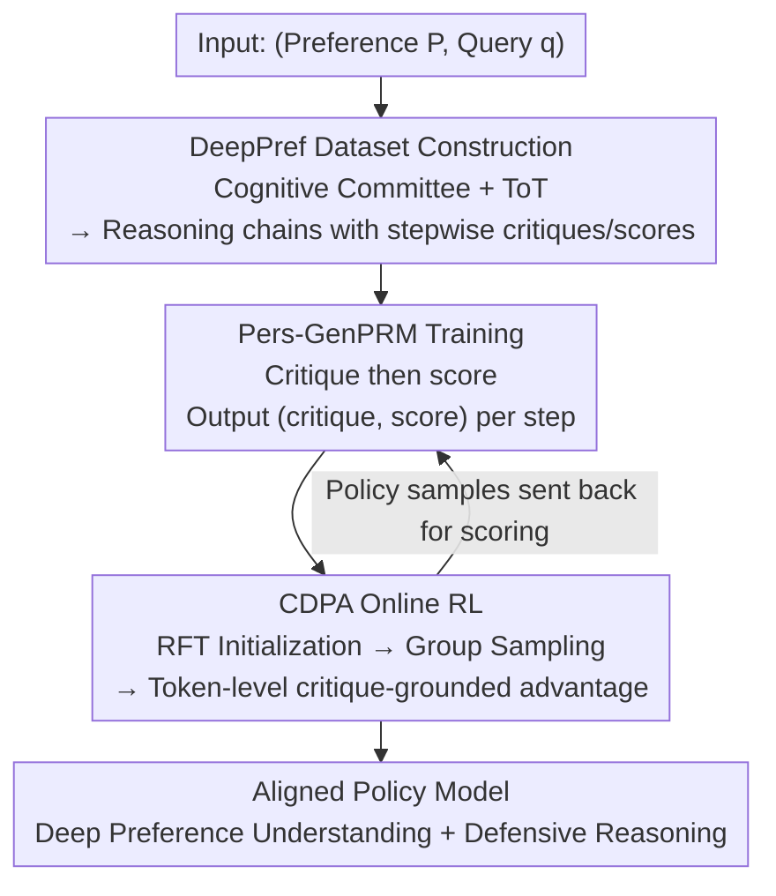

# Aligning Deep Implicit Preferences by Learning to Reason Defensively

**Conference**: ICLR2026  
**OpenReview**: [https://openreview.net/forum?id=ZA7i5Otjqd](https://openreview.net/forum?id=ZA7i5Otjqd)  
**Code**: https://DeepPref.github.io/ (Dataset)  
**Area**: Alignment RLHF / Personalized Alignment / Process Reward Models  
**Keywords**: Personalized Alignment, Implicit Preferences, Process Reward Models, Defensive Reasoning, Online Reinforcement Learning

## TL;DR
Addressing the problem in LLM personalization where models "merely parrot explicit user preferences while failing to infer deep intentions or proactively avoid risks," this paper reformulates alignment from scalar reward matching into a structured reasoning process. It first constructs DeepPref, a reasoning chain dataset with step-by-step critique annotations using a "Multi-role Cognitive Committee." Then, it trains Pers-GenPRM, a generative process reward model that "critiques before scoring." Finally, a token-level online RL strategy (CDPA) is employed to integrate numerical and natural language feedback, achieving SOTA results in both deep preference understanding and defensive reasoning.

## Background & Motivation
**Background**: Transitioning LLMs from "obedient instruction followers" to "understanding collaborative partners" primarily depends on personalized alignment. Current mainstream approaches include direct preference optimization like DPO and RLHF relying on outcome-based supervision, which use a scalar reward to fit the user's "surface-level" favored responses.

**Limitations of Prior Work**: Such outcome-based supervision suffers from two specific issues. First, models only mimic **explicit** preferences and fail to infer underlying deep intentions. The paper provides a pertinent example: a user states "I don't want to share my real-time location" but wants family to know they are safe. A shallow alignment model might suggest "automatically sharing a location pin upon arrival"—correctly addressing the explicit "no real-time" constraint while failing to grasp the user's true concern for **privacy and narrative autonomy** (the preference gap). Simultaneously, it fails to realize that "aggregated location logs themselves constitute a new privacy liability" (the process gap). Second, scalar reward signals are too sparse and uninterpretable to guide complex reasoning.

**Key Challenge**: The authors formalize this as a **dual gap**—the preference gap (failing to infer unstated goals, risk tolerances, and priorities) and the process gap (inability to perform defensive reasoning, i.e., proactively identifying and mitigating latent risks in ambiguous queries). The root cause is that supervision signals are tied to the "final answer" rather than the "reasoning process to reach the answer." There is also a "zero advantage" problem unique to RL: a set of sampled responses might be equally good in terms of outcome, but vary significantly in underlying reasoning quality and safety; outcome-level rewards provide no gradient to distinguish them.

**Goal**: (1) Construct process-level supervision data that teaches models to reason about deep intent and proactively avoid risks; (2) Convert these textual critiques into structured rewards usable for RL; (3) Design a policy optimization algorithm that leverages process-level feedback and addresses the zero-advantage problem.

**Key Insight**: Instead of supervising "whether the final answer is correct," it is better to supervise "whether the reasoning process is sound"—allowing the model to not only generate answers but also **critique** how well the answer respects deep preferences and manages potential risks. This critique serves as a form of cognitive process supervision.

**Core Idea**: Critique-Driven Reasoning Alignment (CDRA) reformulates alignment as a structured reasoning process via a three-part pipeline: a critique-annotated dataset + a generative process reward model + online RL with fused numerical/linguistic feedback.

## Method

### Overall Architecture
CDRA is a three-stage serial pipeline. Given a (user preference $P$, query $q$), the goal is to learn a policy $\pi(y|q,P)$ to generate response $y$ aligned with deep implicit preferences $P$. The workflow: First, a "Multi-role Cognitive Committee + Tree of Thoughts" is used to generate reasoning chains with step-by-step critiques and scores, forming the process-level data foundation (DeepPref). Next, this data trains the **Generative Process Reward Model** (Pers-GenPRM), which outputs a textual critique followed by a scalar score for each step. Finally, these critique-grounded stepwise rewards are fed into CDPA, a token-level online RL algorithm, to align the policy model. A tight feedback loop is formed between the reward model and policy optimization.

### Key Designs

**1. DeepPref Dataset: Process Supervision via "Cognitive Committee + Tree of Thoughts"**

The preference and process gaps exist due to a lack of process-level supervision data—existing datasets are outcome-based preference pairs that indicate "which answer is better" but not "how to reason step-by-step through deep intent and risk mitigation." DeepPref fills this void. It contains 3,000 unique scenarios across 20 domains (Personal Finance, Healthcare, etc.), each being a $(P,q)$ tuple. Preferences $P$ are designed with nuanced, often conflicting values and unstated goals (e.g., "valuing convenience but extremely sensitive to privacy"), while queries $q$ are intentionally open and ambiguous to force the model to infer $P$.

Construction involves two phases. **(1) Diverse Path Generation**: Use the Tree of Thoughts (ToT) framework to generate reasoning paths guided by a **Multi-role Cognitive Committee** (expert personas like Sociologists, Psychologists, Pragmatists, Educators, and Devil’s Advocates) with heuristic pruning to produce diverse reasoning chains $\tau_i=(s_i^{1},\dots,s_i^{T_i})$. **(2) Stepwise Critique and Scoring**: A strong LLM evaluator generates a detailed textual critique $c_i^j$ (evaluating alignment with $P$ and risk mitigation) and a scalar quality score $r_i^j$ for each step $s_i^j$ given the preceding path. The final entry is $(P,q,\tau_i,\{c_i^j,r_i^j\}_{j=1}^{T_i})$. A subset $D_{\text{Rea}}$ is used to train Pers-GenPRM, while the highest-quality paths $D_{\text{RFT}}$ are reserved for initial policy fine-tuning. The paper distinguishes "explicit preferences" (directly stated) from "deep implicit preferences" (latent in context/values), the latter being the core challenge of the preference gap. The multi-role adversarial design ensures reasoning chains both dig deep and are "stress-tested" for risks.

**2. Pers-GenPRM: Reward Modeling as a "Critique-then-Score" Reasoning Task**

Personalized preferences are inherently subjective, lacking objective ground truths like mathematics; simple scalar rewards risk reinforcing surface correlations over causal reasoning. Pers-GenPRM functions as a **stepwise critique model**. For each step $s_i^j$ in a reasoning chain, it takes the context $(P,q,\tau_i^{\le j})$ and generates a critique-score pair:

$$(P,q,\tau_i^{\le j}) \mapsto (c_i^j, r_i^j)$$

where $c_i^j$ is an explicit textual critique and $r_i^j$ is the resultant scalar reward. It is trained on $D_{\text{DeepPref}}$ using SFT to maximize the log-likelihood of generating ground-truth pairs; as it autoregressively generates the critique $c_i^j$ before the score $r_i^j$, the loss splits into two terms:

$$L_{\text{SFT}}(\theta) = -\mathbb{E}\Big[\sum_{j=1}^{T_i}\big(\log P_\theta(c_i^j|P,q,\tau_i^{\le j}) + \log P_\theta(r_i^j|c_i^j,P,q,\tau_i^{\le j})\big)\Big]$$

This provides dual-component rewards: an interpretable critique $c_i^j$ for semantic explanation and a scalar $r_i^j$ **grounded in that critique** as a quantitative distillation. This sequence is critical—it causally anchors numerical signals to human-readable rationales, making reward logic transparent. Aggregating stepwise scores into a dense reward $R_{\text{dense}}(\tau_i)=\sum_{j=1}^{T_i} r_i^j$ allows distinguishing paths by reasoning quality, mitigating the zero-advantage problem. This advances beyond using natural language feedback (NLF) alone as a reward by binding text to an optimizable scalar.

**3. CDPA: Converting Stepwise Critique Rewards to Token-level Advantages**

CDPA builds upon GRPO, introducing fine-grained advantages for **every token position**, derived directly from Pers-GenPRM's stepwise, critique-grounded rewards. This creates a tight loop between reward modeling and policy optimization. The five steps are: **Step 1 Policy Initialization**—Initialization via Rejection Sampling Fine-Tuning (RFT) on $D_{RFT}$; **Step 2 Group Sampling**—Sample $G$ responses for each input $(P,q)$; **Step 3 Process Reward Generation**—Pers-GenPRM scores each step $s_i^j$; **Step 4 Critique-Grounded Advantage Estimation**—Assign the reward of step $s_i^j$ to every token $t$ within it ($r_{i,t}=r_i^j$), then perform zero-mean unit-variance normalization within the group:

$$\hat{A}(t,y_i)=\frac{r_{i,t}-\mu_g}{\sigma_g+\epsilon}$$

where $\mu_g,\sigma_g$ are the empirical mean and standard deviation of token-level rewards at corresponding positions in the group; **Step 5 Policy Update**—PPO-style clipped objective with per-token advantages:

$$J_{\text{CDPA}}(\theta)=\mathbb{E}\Big[\frac{1}{G}\sum_{i=1}^{G}\sum_{t=1}^{C_i}\min\big(\rho_t\hat{A}(t,y_i),\,\text{clip}(\rho_t,1-\epsilon,1+\epsilon)\hat{A}(t,y_i)\big)\Big]-\beta D_{\text{KL}}(\pi_\theta\|\pi_{\text{ref}})$$

where $\rho_t$ is the importance ratio. CDPA succeeds where outcome-based RL fails by sinking rewards to the step/token level, comparing "step quality" within the group to provide dense gradients for models to become not just correct, but defensible and deeply aligned.

### Loss & Training
The base model used is Qwen2.5-7B-Instruct, trained on 4×H20 using trl + vLLM. Pers-GenPRM is trained using $L_{SFT}$ on DeepPref. For the policy, CDPA follows RFT initialization: $G=5$ responses per prompt, temperature 1.0. All RL methods report the best checkpoint within 400 optimization steps.

## Key Experimental Results

### Main Results
Evaluation covers core performance (Explicit Preference Following $\text{Acc}_{PF}$↑, Deep Alignment Accuracy $\text{Acc}_{DA}$↑, Misleading Risk $\text{Acc}_{Mis}$↓) and deep reasoning quality (Thoroughness $m_{th}$, Deep Mining $m_{dm}$, Innovation/Expansion $m_{ie}$, all ↑). CDRA was compared against baselines on DeepPref and PrefEval benchmarks:

| Dataset | Method | $\text{Acc}_{PF}$↑ | $\text{Acc}_{DA}$↑ | $\text{Acc}_{Mis}$↓ | $m_{dm}$↑ | $m_{ie}$↑ |
|--------|------|------|------|------|------|------|
| DeepPref | CoT | 59.7 | 49.3 | 50.3 | 25.3 | 0.7 |
| DeepPref | SFT | 83.3 | 75.0 | 34.7 | 63.7 | 40.3 |
| DeepPref | GRPO | 83.7 | 70.3 | **30.7** | 58.7 | 34.0 |
| DeepPref | **CDRA** | **84.7** | **76.3** | 32.3 | **65.0** | **42.7** |
| PrefEval | GRPO | 67.0 | 51.8 | 27.3 | 17.0 | 1.8 |
| PrefEval | **CDRA** | **68.8** | **62.5** | 21.0 | **37.5** | **15.2** |

CDRA achieved the highest Deep Alignment Accuracy on both benchmarks (DeepPref 76.3% / PrefEval 62.5%), notably leading the runner-up by 2.4%+ in Innovation/Expansion ($m_{ie}$), while maintaining the highest explicit preference following (84.7%). This indicates improved reasoning does not sacrifice basic instruction following.

Human evaluation on multi-turn dialogues (ALOE dataset, 1-5 scale) showed CDRA ranking first with an average of 3.92, with scores **steadily increasing** as dialogue progressed (peaking at 4.6), whereas baselines tended to plateau or degrade. This suggests CDRA accumulates user context and maintains deep alignment over long interactions:

| Model | k=1 | k=5 | k=8 | k=10 | Average |
|------|-----|-----|-----|------|------|
| TPO | 2.4 | 4.2 | 4.0 | 4.0 | 3.86 |
| GRPO | 2.0 | 3.6 | 3.4 | 3.4 | 3.18 |
| **CDRA** | 2.0 | 4.4 | 4.2 | 4.0 | **3.92** |

### Ablation Study
Comparing different reward modeling paradigms on DeepPref (Pro. Sup. = Process Supervision, Cri. Sup. = Critique Supervision):

| Configuration | Pro. Sup. | Cri. Sup. | $\text{Acc}_{DA}$↑ | $m_{ie}$↑ |
|------|:---:|:---:|------|------|
| Base (Qwen2.5-7B-Instruct) | – | – | 49.3 | 0.7 |
| GRPO (with RM) | – | – | 70.3 | 34.0 |
| GRPO (with GRM, Critique only) | – | ✓ | 74.7 | 37.0 |
| GRPO (with PRM, Process only) | ✓ | – | 73.0 | 38.3 |
| GRPO (Rubric-based RM) | – | – | 73.7 | 34.7 |
| GRPO (Test-Time Scaling) | – | – | 73.0 | 34.7 |
| **CDRA (Pers-GenPRM)** | ✓ | ✓ | **76.3** | **42.7** |

### Key Findings
- **Process + Critique Supervision is essential**: Adding only process supervision (PRM) or critique supervision (GRM) increased deep alignment to 73~74.7%, but only combining both (CDRA) reached 76.3% and boosted Innovation ($m_{ie}$) significantly from 34~38% to 42.7%. This proves supervising the critical reasoning process itself is more vital than just outcomes or intermediate steps.
- **Simple heuristics are insufficient**: Rubric-based RM and Test-Time Scaling lagged behind at 34.7% for innovation, failing to replicate the nuanced reasoning required to uncover latent preferences.
- **Controllable Trade-offs**: CDRA prioritizes deep mining and innovation ($m_{dm}$/$m_{ie}$), with a trade-off where Misleading Risk $\text{Acc}_{Mis}$ and Thoroughness $m_{th}$ are slightly lower than some baselines—considered a reasonable cost for high-value novel ideas.
- **Attention Evidence**: Attention distribution analysis shows CDRA concentrates 35.7% of attention quality on "preference regions," whereas SFT/GRPO are more dispersed. This suggests Pers-GenPRM teaches the model "where to look," proactively anchoring to user constraints.

## Highlights & Insights
- **Reformulating "Reward Modeling" as "Reasoning"**: Pers-GenPRM's "critique then score" approach transforms black-box scalar rewards into interpretable signals. This is the paper's cleverest move—providing both RL-ready scalars and semantically dense feedback.
- **Addressing the "Zero Advantage" Problem**: Identifying that RL lacks gradients when reasoning paths differ but outcomes are identical is a practical insight. Using token-level, critique-grounded advantages provides dense gradients transferable to any "process over result" task.
- **"Cognitive Committee + Devil's Advocate" for Data**: Using adversarial personas to stress-test responses is a smart way to engineer "defensive reasoning" into the supervision data, reusable for any task requiring proactive fault-finding.
- **Defensive Reasoning Task Setting**: Distinguishing between "explicit instruction following" and "unconscious violation of implicit principles" (the location pin example) identifies a neglected but real failure mode in personalization.

## Limitations & Future Work
- **Trade-off Acceptability**: CDRA is not optimal for misleading risk and thoroughness; in high-risk sectors (medical/legal), "innovation" may be less desirable than safety, requiring scenario-specific tuning.
- **Reward Model Ceiling**: Performance is capped by Pers-GenPRM (and the evaluator LLMs used). Risks include "LLM-as-judge" self-consistency bias where evaluator preferences are distilled into the policy without objective ground truth.
- **Scale and Base Model Constraints**: Only verified on Qwen2.5-7B; whether advantages persist for larger models or broader domains beyond the 20 chosen remains to be seen. The token-level reward assignment (all tokens in a step share one score) might be too coarse.
- **Future Improvements**: Integrating objective safety checkers to calibrate misleading risks and blending critique rewards with verifiable rewards (e.g., tool-based feedback) to mitigate subjective evaluation bias.

## Related Work & Insights
- **vs. DPO / Standard RLHF**: These fit surface preferences via outcome-based scalars; CDRA uses critiques as process supervision to infer deep intent, excelling at "reading between the lines."
- **vs. GRPO**: CDPA builds on GRPO but replaces outcome-level group normalization with critique-grounded stepwise rewards to solve the zero-advantage problem.
- **vs. TPO**: Both use tree structures, but TPO remains a preference optimization framework prone to literal following (failing to prevent unconscious violations); CDRA reasons through semantic/risk layers first.
- **vs. NLF (Saunders et al.)**: While prior work generates text feedback, Pers-GenPRM binds critiques to optimizable scalars, allowing natural language feedback to influence the RL gradient directly.

## Rating
- Novelty: ⭐⭐⭐⭐⭐ Reformulates personalization as "critique-driven process supervision" across data, rewards, and RL; identifies the "Dual Gap" and "Zero Advantage" problems.
- Experimental Thoroughness: ⭐⭐⭐⭐ Comprehensive metrics, human evaluation, and ablation studies, though limited to a single base model scale and subjective evaluation.
- Writing Quality: ⭐⭐⭐⭐⭐ Excellent motivation via the "location pin" example; clear phasing and memorable nomenclature.
- Value: ⭐⭐⭐⭐ The "Critique PRM + token-level advantage" paradigm has high transfer value for reasoning-heavy alignment tasks.

<!-- RELATED:START -->

## Related Papers

- [\[ICLR 2026\] COMAL: A Convergent Meta-Algorithm for Aligning LLMs with General Preferences](comal_a_convergent_meta-algorithm_for_aligning_llms_with_general_preferences.md)
- [\[ICML 2026\] Implicit Safety Alignment from Crowd Preferences](../../ICML2026/llm_alignment/implicit_safety_alignment_from_crowd_preferences.md)
- [\[ICLR 2026\] Learning Ordinal Probabilistic Reward from Preferences (OPRM)](learning_ordinal_probabilistic_reward_from_preferences.md)
- [\[ACL 2025\] Synergistic Weak-Strong Collaboration by Aligning Preferences](../../ACL2025/llm_alignment/synergistic_weak-strong_collaboration_by_aligning_preferences.md)
- [\[ICLR 2026\] Data Selection for LLM Alignment Using Fine-Grained Preferences](data_selection_for_llm_alignment_using_fine-grained_preferences.md)

<!-- RELATED:END -->
