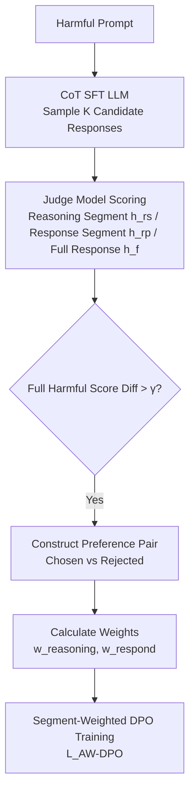

# Alignment-Weighted DPO: A Principled Reasoning Approach to Improve Safety Alignment

**Conference**: ICLR 2026  
**OpenReview**: [https://openreview.net/forum?id=OuMNJoKJBQ](https://openreview.net/forum?id=OuMNJoKJBQ)  
**Code**: TBD  
**Area**: LLM Safety Alignment / Preference Optimization  
**Keywords**: Safety Alignment, Jailbreak Attacks, Causal Intervention, Chain-of-Thought, DPO, Reasoning-Aware Alignment  

## TL;DR
The authors first use causal intervention to prove that "current safety alignment is shallow and unrelated to deep reasoning," then release an open-source CoT safety fine-tuning dataset to teach models to "refuse with reasoning." Finally, they propose **Alignment-Weighted DPO**: decomposing responses into a "reasoning segment" and a "response segment" with different weights, applying heavier preference updates to the segment that is more harmful in failed jailbreaks. This significantly improves robustness against various jailbreak attacks while preserving utility.

## Background & Motivation
- **Background**: Alignment techniques like SFT / RLHF / DPO enable LLMs to refuse harmful requests, but models remain vulnerable to jailbreaks—masking harmful intent via paraphrasing, role-playing, cipher encoding, low-resource languages, formal logic, or code injection to bypass safety guardrails.
- **Limitations of Prior Work**: Increasing research suggests existing alignment is "surface-level"—alignment signals often only affect the first few tokens; once the start deviates from the safety pattern, harmful content is generated rapidly. Alignment frequently fails when harmful intent is expressed indirectly. However, there is a lack of explanation for **why** alignment is so shallow and what the underlying mechanism is.
- **Key Challenge**: The authors hypothesize that the key reason lies in the model's reliance on **shallow refusal heuristics rather than deep reasoning**. The alignment task collapses into simple pattern recognition—the model learns to identify "harmful surface markers" and provides a generic refusal ("Sorry, I cannot help"), without understanding why the content is harmful, making it easy to deceive with different expressions.
- **Goal**: To first verify this "shortcut hypothesis," then design a reasoning-aware post-training method that enables models to not only say "no" but also understand "why," without sacrificing general utility.
- **Core Idea**: **(1) Causal Probes**—using linear probes to locate reasoning-critical attention heads and disabling them to show that while reasoning performance collapses, safety performance remains unaffected, proving "alignment $\neq$ reasoning"; **(2) CoT Safety Data**—open-sourcing a fine-tuning dataset with step-by-step reasoning that balances utility and safety; **(3) Segment-level Weighted DPO**—scoring the harmfulness of the "reasoning segment" and "response segment" separately to assign weights for fine-grained targeted correction.

## Method

### Overall Architecture
The method consists of two layers: first, "reasoning-based refusal" is injected into the model using CoT fine-tuning (already significantly outperforming standard SFT). Qualitative analysis shows about 15% of failures are fine-grained errors of "inconsistency between reasoning and answer," which standard DPO fails to capture by optimizing only the whole response preference. Thus, **AW-DPO** is layered on top: multiple candidate responses are sampled for each harmful prompt, a judge model scores the harmfulness of the "reasoning segment / response segment / full response," preference pairs are selected where the harmful score difference exceeds a threshold, and weights are calculated based on "which segment is more harmful" to modulate the contribution of both segments in the DPO loss.

### Key Designs

**1. Causal Intervention revealing "Alignment is Shallow": Probe localization + Attention head ablation.** The authors train logistic regression probes $f(x^{(h)}_l)=Wx^{(h)}_l+b$ on the hidden states $x^{(h)}_l$ of the last token for each head and layer to classify "safe vs. unsafe responses" (alignment task) and "correct vs. incorrect answers" (reasoning task). Results show alignment task accuracy reaches ~100% from very early layers, meaning models easily distinguish harmful/safe prompts; however, reasoning task accuracy hovers around random (50%) for the first 11 layers, only rising above 60% in deep layers. The top 10% of attention heads in the first 11 layers with the highest probe accuracy (reasoning-critical) are then selected for **causal ablation** (setting Q/K/V weights to zero). After ablation, reasoning performance collapses to random levels, but **safety performance remains almost unchanged (still near 100%)**—proving reasoning has a strong causal effect on reasoning tasks but almost none on alignment, confirming that current safety alignment is a shallow heuristic.

**2. CoT Safety SFT Data: "Rational Refusal" balancing utility and safety.** Existing CoT alignment works either do not open-source data or ignore utility trade-offs. The authors create and open-source a long CoT dataset merging "safety-oriented CoT alignment data" with "general CoT instruction data," ensuring models are safer while preserving broad utility. The training format follows reasoning LLM conventions: the thought process is placed between `<think>...</think>` tags followed by the final answer. This step alone significantly exceeds SFT baselines in safety while maintaining general performance.

**3. Alignment-Weighted DPO: Fine-grained preference optimization weighted by segment harmfulness.** Error analysis reveals two types of persistent failures: (i) correct reasoning but harmful final answer; (ii) incorrect reasoning but accidentally safe answer—these account for ~15% of failures, which standard DPO fails to address. AW-DPO splits responses into reasoning and response segments using `</think>`, aiming to give "more harmful" segments higher training weights. Given output sequence $y=(y_1,\dots,y_T)$ and $s_t\in\{\text{reasoning},\text{response}\}$ as the token type at position $t$, the weighted reward is defined as:
$$\phi_{AW}(x,y)=\sum_{t=1}^{T} w_{s_t}\cdot \log\frac{\pi_\theta(y_t\mid x,y_{<t})}{\pi_{ref}(y_t\mid x,y_{<t})}$$
DPO losses $L^{rs}_{DPO}, L^{rp}_{DPO}$ are calculated for reasoning and response segments, respectively. The final loss is:
$$L_{AW\text{-}DPO}=w_{reasoning}L^{rs}_{DPO}+w_{respond}L^{rp}_{DPO}$$
Weights are determined by the difference in harmfulness scores between chosen/rejected for that segment: $d_{reasoning}=h^{chosen}_{rs}-h^{rejected}_{rs}$, $d_{respond}=h^{chosen}_{rp}-h^{rejected}_{rp}$, normalized as $w_{reasoning}=d_{reasoning}/(d_{reasoning}+d_{respond})$ and $w_{respond}=d_{respond}/(d_{reasoning}+d_{respond})$. The intuition is: whichever segment has a larger "safety gap" between chosen and rejected is the primary cause of failure and should receive a larger update weight, achieving targeted and interpretable correction.

## Key Experimental Results

### Main Results
Evaluated on SorryBench (20 jailbreaks + 44 harmful prompts, metric: ASR, lower is better) and MMLU (utility accuracy, higher is better) across LLaMA-2-7B / LLaMA-3.2-3B / LLaMA-3.1-8B / Mistral-7B models. (Excerpt):

| Model | Method | Avg. ASR↓ | Utility↑ |
|-------|--------|-----------|----------|
| Llama-2-7B | Base | 41.32% | 17.80% |
| | +Safety SFT | 25.99% | 43.77% |
| | +CoT Safety SFT | 7.57% | 44.14% |
| | +DPO | 9.11% | 41.45% |
| | **+AW-DPO** | **3.41%** | **45.23%** |
| Llama-3.2-3B | +DPO | 1.04% | 50.64% |
| | **+AW-DPO** | **0.58%** | 48.52% |
| Llama-3.1-8B | +DPO | 1.00% | 57.98% |
| | **+AW-DPO** | **0.81%** | 58.27% |
| Mistral-7B-v0.3 | +DPO | 3.78% | 41.45% |
| | **+AW-DPO** | **0.91%** | **54.70%** |

Key findings: CoT fine-tuning significantly lowers ASR; standard DPO reduces ASR further but often at the cost of utility (e.g., on Mistral 48.32% → 41.45%); AW-DPO achieves the lowest ASR in most settings while preserving or even restoring utility (e.g., Mistral utility returns to 54.70%).

### Comparison with Advanced Alignment Methods
Comparison on LLaMA-3.1-8B with recent strong baselines (Excerpt from Table 2):

| Method | Avg. ASR↓ | Utility↑ |
|--------|-----------|----------|
| SAFECHAIN | 25.80% | 44.88% |
| RR (PP) | 4.55% | 61.84% |
| STAIR | 3.09% | 70.38% |
| STAIR-DPO-3 | 1.33% | 71.34% |
| **Ours (Base)** | **0.81%** | 58.27% |
| Ours (Instruct) | 2.92% | 65.29% |

STAIR-DPO-3 has higher utility but requires three iterations of SFT+DPO with high training costs; ours achieves strong safety and competitive utility in a single round.

### Ablation Study & Key Findings
- **Data Transferability** (Table 3): AW-DPO preference data pre-constructed with LLaMA2-7B can be used to train other models, maintaining ASR at 1–3%, showing cross-model transferability.
- **Scaling Factor $\alpha$ Ablation**: Safety remains stable for $\alpha$ in the 0.05–0.2 range (Avg. ASR ~0.57%–0.69%), showing low sensitivity to this hyperparameter.
- **vs. Reasoning LLMs**: Models like Phi-4-Reasoning / Phi-4-Reasoning-Plus are not superior in safety, showing general reasoning does not automatically translate to safety alignment; targeted post-training is necessary.
- **Failure Distribution**: ~15% of jailbreak failures are fine-grained inconsistencies, where AW-DPO provides specific improvements over standard DPO.

## Highlights & Insights
- **Explain Mechanism First, then Design Method**: Use of linear probes and causal ablation provides clean causal evidence ("alignment is shallow"). This is more convincing than just chasing jailbreak metrics and directly leads to the direction of "supplementing reasoning."
- **Natural Perspective of Segment-Level Weighting**: Splitting responses by `</think>` and assigning weights based on "safety gaps" upgrades coarse preference optimization to "locating the cause of failure and correcting it," with weights driven by explainable judge scores.
- **Utility-Safety Balance**: While many methods sacrifice utility for safety, AW-DPO restores utility lost by standard DPO on several models.
- **Engineering Friendly**: Single-round SFT+DPO, transferable data, and low hyperparameter sensitivity make it cost-effective for deployment.

## Limitations & Future Work
- **Dependency on Judge Models**: Harmful scores for segments and full responses rely on another LLM judge; bias and noise in the judge propagate to weights and preference pairs.
- **Coarse Two-Segment Split**: Using only `</think>` might be insufficient for complex multi-step reasoning where risks are hidden in individual steps; step-level or clause-level weighting could be explored.
- **Evaluation Scope**: Safety is primarily verified on SorryBench; generalization to evolving jailbreaks (e.g., adaptive attacks, agent scenarios) remains to be tested.
- **Utility Ceiling**: Compared to multi-round iterative methods like STAIR-DPO-3, there is still a gap in utility, and the safety-utility frontier can be pushed further.

## Related Work & Insights
- **Shallow Alignment / Jailbreak Mechanisms**: Extends findings from Qi et al. (alignment only affects initial tokens) and Zhou et al. (alignment discriminates layers) but provides definitive causal evidence of the "independence from reasoning."
- **CoT Safety Fine-tuning**: Shares similarities with Guan et al. 2024, SAFECHAIN, etc.; the difference lies in open-sourcing utility-balanced data and systematic failure analysis.
- **DPO Refinement**: Implements segment-level weighting on Rafailov et al.’s DPO framework, complementing token/segment preference optimization and iterative alignment.
- **Insight**: When a capability "appears to exist" but "fails under causal intervention," it is likely a shortcut rather than true understanding; re-weighting loss based on "failure attribution" is a general paradigm for refining coarse preference learning goals such as reasoning or factuality.

## Rating
- **Novelty**: ⭐⭐⭐⭐ — Combining causal evidence that "alignment ignores reasoning" with segment-weighted DPO is novel and forms a closed loop.
- **Experimental Thoroughness**: ⭐⭐⭐⭐ — Solidly tested across 4 model families, 20 jailbreaks, and strong baselines, including transferability and reasoning LLM comparisons.
- **Writing Quality**: ⭐⭐⭐⭐ — Clear logic from hypothesis to verification; Figures 1 and 2 effectively explain the causal evidence and pipeline.
- **Value**: ⭐⭐⭐⭐ — Provides a low-cost, transferable way to improve safety robustness without sacrificing utility, with open-source data benefiting the community.

<!-- RELATED:START -->

## Related Papers

- [\[ICLR 2026\] SafeDPO: A Simple Approach to Direct Preference Optimization with Enhanced Safety](safedpo_preference_optimization_safety.md)
- [\[ICML 2026\] Curriculum Learning for Safety Alignment](../../ICML2026/llm_alignment/curriculum_learning_for_safety_alignment.md)
- [\[ICLR 2026\] Superficial Safety Alignment Hypothesis](superficial_safety_alignment_hypothesis.md)
- [\[ICLR 2026\] Mitigating the Safety Alignment Tax with Null-Space Constrained Policy Optimization](mitigating_the_safety_alignment_tax_with_null-space_constrained_policy_optimizat.md)
- [\[ICLR 2026\] Align Once, Benefit Multilingually: Enforcing Multilingual Consistency for LLM Safety Alignment](align_once_benefit_multilingually_enforcing_multilingual_consistency_for_llm_saf.md)

<!-- RELATED:END -->
