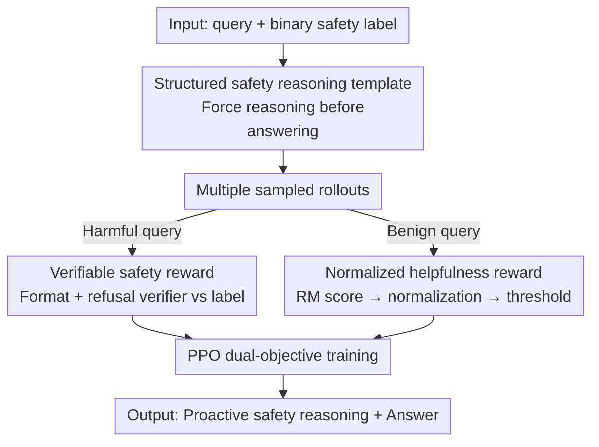

# AlphaAlign: Incentivizing Safety Alignment with Extremely Simplified Reinforcement Learning

**Conference**: ICLR2026  
**OpenReview**: [https://openreview.net/forum?id=2XNb1JUKW3](https://openreview.net/forum?id=2XNb1JUKW3)  
**Code**: https://github.com/zy20031230/AlphaAlign  
**Area**: Alignment RLHF / LLM Safety  
**Keywords**: Safety Alignment, Verifiable Rewards, Reinforcement Learning, Proactive Safety Reasoning, safety-utility trade-off

## TL;DR
AlphaAlign utilizes an extremely simplified pure reinforcement learning framework—requiring only binary "harmful/benign" labels and fewer than 200 RL steps—to incentivize the "latent safety self-awareness" embedded in large models during pre-training. By requiring the model to generate a safety rationale before answering and employing a dual-reward system (verifiable safety reward + normalized helpfulness reward), it breaks the "safety-utility" trade-off.

## Background & Motivation
**Background**: Large models have encountered extensive safety-related knowledge within massive pre-training corpora. Research indicates they can detect their own unsafe outputs at the prompt level and exhibit distinguishable activation patterns for benign, harmful, or jailbroken inputs at the representation level. Thus, models possess "latent safety self-awareness." Current mainstream safety alignment follows two paths: **refusal training** (teaching models to say "Sorry, I can't..." via SFT/RLHF/DPO) and **reasoning-based alignment** (distilling safety Chain-of-Thought or rationales into the model).

**Limitations of Prior Work**: Refusal training learns **shallow alignment**—models merely memorize "trigger word → refusal prefix" shortcuts, which fail against jailbreak packaging or "prefilling" attacks (e.g., forcing "Sure, here is" at the start). It also leads to **over-refusal** of benign queries and **general utility degradation** after safety fine-tuning. Reasoning-based methods, while more robust and generalizable, rely on strong teacher distillation or manual safety rationales, resulting in **high supervision costs and poor scalability**.

**Key Challenge**: Neither approach effectively mobilizes the model's existing internal safety awareness—one compresses safety into surface memory, while the other imposes safety externally (via distillation or manual rules). Simultaneously, a natural tension exists between safety and utility: prioritizing safety alone risks degrading the model into a "harmfulness classifier" that fails to provide quality answers to benign questions.

**Goal**: To incentivize the model’s **internal** safety awareness with minimal supervision while improving safety without sacrificing (and potentially enhancing) general utility.

**Key Insight**: The authors draw inspiration from RLVR (Reinforcement Learning with Verifiable Rewards, following the DeepSeek-R1 trajectory). Since "correctness" can be automatically verified to incentivize reasoning, "whether to refuse" is also a **verifiable property** of the output (by comparing model output with the input's harmfulness label). Consequently, safety alignment can dispense with safety CoT annotations and rely purely on RL incentives.

**Core Idea**: Use a structured template of "safety reasoning before answering" combined with a **verifiable safety reward** to **incentivize** rather than **inject** latent safety awareness. This is paired with a **normalized helpfulness reward** to maintain utility, achieving safety, low over-refusal, and high utility through minimalist RL.

## Method

### Overall Architecture
AlphaAlign takes a query and its binary safety label (harmful/benign) as input and outputs a safety reasoning segment wrapped in `<safety_reasoning>...</safety_reasoning>` tags followed by the final answer in `<answer>...</answer>`. The pipeline progresses in two stages: **AlphaAlign-Zero**, which uses only a "verifiable safety reward" to elicit the ability to distinguish harmful/benign inputs and reliably refuse harmful ones; and **AlphaAlign**, which adds a "normalized helpfulness reward" to specifically reward high-quality non-refusal responses to benign queries. Both rewards score each rollout, and the policy is updated using PPO.

The process requires no supervised safety reasoning data, only prompt-level binary labels—hence the term "extremely simplified." The structured template (Figure 2) explicitly mandates: evaluate the safety implications in `<safety_reasoning>`; if deemed unsafe, output `\boxed{Sorry, I can't comply}` in `<answer>` (using the box for easy extraction); otherwise, provide a normal response.

### Key Designs

**1. Structured Safety Reasoning Template + AlphaAlign-Zero: Incentivizing rather than Injecting**

To address the "shallow shortcut" issue in refusal training, the authors force the model to **think before answering** using a fixed template instead of feeding it safety CoTs. This reasoning originates entirely from the model's own awareness rather than external manual policies (like Constitutional AI). The authors verified this: on WildGuardTest, the Pass@1 safety score of Qwen2.5-3B directly answering was only 58.7%, but using the safety reasoning template raised it to 68.4% (Pass@1) and nearly 96.3% (Pass@32). This confirms that "safety knowledge" exists from pre-training; step-by-step reasoning simply unlocks it. AlphaAlign-Zero uses this template and the reward below to drastically reduce Attack Success Rate (ASR) in just a few RL steps.

**2. Verifiable Safety Reward: Using Binary Labels as Verifiers**

This is the core of applying RLVR to safety. The authors define a **refusal verifier** $V_r(y)$: if the answer $y$ matches predefined refusal patterns (e.g., "Sorry, I can't comply"), $V_r=1$; otherwise 0. A **format verifier** $V_f$ checks if the structural requirements are met. The safety reward is derived by comparing $V_r$ with the ground-truth harmfulness label:

$$R_s(x, o_i) = \begin{cases} r_f V_f(o_i) + r_a V_r(y_i), & x \in X_h \\ r_f V_f(o_i) - r_a V_r(y_i), & x \in X_b \end{cases}$$

For harmful inputs $X_h$, refusal is encouraged; for benign inputs $X_b$, refusal is penalized. $r_f$ always rewards explicit reasoning traces. This incentivizes reliable refusal for harmful queries and suppresses over-refusal for benign ones, using only binary labels without human rationales.

**3. Normalized Helpfulness Reward: Breaking the Safety-Utility Trade-off**

Relying solely on safety discrimination turns the model into a "harmfulness classifier." AlphaAlign introduces a helpfulness Reward Model $R_r$, trained on human preferences, to score benign query responses. For $n$ rollouts of a benign input $x_b$, the raw scores $r_i = R_r(x_b, y_i)$ are processed via **within-group normalization** to obtain relative scores $\tilde{r}_i = \frac{r_i - \text{mean}(r)}{\text{std}(r)}$, followed by threshold clipping:

$$R_h(x_b, o_i, \{o_1,\dots,o_n\}) = \begin{cases} \max(\tilde{r}_i, 0), & V_r(y_i)=0 \\ 0, & V_r(y_i)=1 \end{cases}$$

Only **non-refusal** responses ($V_r=0$) are eligible for helpfulness rewards, proportional to their **relative** quality in the sample group; refusing benign queries always yields 0. Normalization is crucial—it aligns high-variance utility signals with safety signals, preventing the former from destabilizing optimization. Final rewards are $R_s$ for harmful queries and $R_s + R_h$ for benign queries.

**4. PPO Dual-Objective Optimization: Stable Training under Dual Rewards**

PPO is used for training. Candidate rollouts $\{o_1,\dots,o_n\}$ are sampled and scored. Rewards are assigned to the final token of each output, advantages are estimated via GAE, and the clipped PPO loss is minimized:

$$J_{PPO}(\theta) = \mathbb{E}\left[\min\left(\frac{\pi_\theta(a_t|s_t)}{\pi_{\theta_{old}}(a_t|s_t)} \hat{A}_t, \ \text{clip}\left(\frac{\pi_\theta(a_t|s_t)}{\pi_{\theta_{old}}(a_t|s_t)}, 1-\epsilon, 1+\epsilon\right)\hat{A}_t\right)\right]$$

The framework is decoupled from the specific RL algorithm and can work with GRPO. AlphaAlign demonstrates that "verifiable rewards + preference feedback" are sufficient for effective alignment.

### Loss & Training
Training data: Harmful data from SCoT, benign data from Dolly, adversarial benign data from XSTest. The Reward Model is FsfairX-LLaMA3-RM-v0.1. Instruct-tuned models (Qwen2.5-3B/7B, Llama3.2-3B) are used as backbones because base models lack instruction-following capabilities. Training requires **fewer than 200 RL steps** for significant improvement.

## Key Experimental Results

### Main Results
Safety benchmarks: StrongREJECT, AdvBench, WildGuardTest, JailbreakTrigger (ASR); PAIR, GCG (adaptive jailbreak); CoCoNot (over-refusal accuracy). Utility benchmarks: MMLU, AlpacaEval, BBH-CoT, GSM8K, GPQA.

| Model (Qwen2.5-3B) | StrongREJECT ASR↓ | WildGuard ASR↓ | PAIR ASR↓ | GCG ASR↓ | CoCoNot Acc↑ |
|--------|------|------|------|------|------|
| Original Instruct | 3.51 | 31.6 | 67.69 | 49.04 | 88.92 |
| + Direct Refusal | 1.27 | 18.51 | 11.54 | 5.77 | 86.54 |
| + Circuit Breaker | 3.51 | 13.98 | 5.38 | 4.81 | 87.34 |
| + SCoT | 0.63 | 9.42 | 8.62 | 9.61 | 74.93 |
| **+ AlphaAlign** | **0.31** | **6.38** | **4.61** | **0.77** | **91.29** |

AlphaAlign achieves the lowest ASR across all categories while maintaining the highest over-refusal accuracy (91.29% vs. 74.93% for SCoT). While SCoT is safe, it suffers from severe over-refusal. AlphaAlign achieves a superior trade-off via explicit safety reasoning.

Utility: Qwen2.5-3B+AlphaAlign improved AlpacaEval (+6.7), GSM8K (+4.4), and GPQA (+0.9). Qwen2.5-7B+AlphaAlign improved AlpacaEval (+7.9) and GPQA (+3.3). Unlike refusal-based baselines that generally degrade performance, AlphaAlign **enhances instruction-following and reasoning**.

### Ablation Study

| Configuration | Jailbreak ASR | Utility | Note |
|------|---------|------|------|
| Full AlphaAlign | Lowest & Balanced | Highest & Balanced | Full dual rewards |
| w/o utility reward | Higher Safety | Sudden Drop | Safety-only, degrades to classifier |
| w/o normalized | Weak Robustness | Partially Saved | Unstable optimization due to variance |

### Key Findings
- **Safety awareness pre-exists**: Simply adding the template (without training) increased Qwen2.5-3B's Pass@32 from 82.4% to 96.3%, proving reasoning unlocks hidden capabilities.
- **Normalization is vital for stability**: Removing normalization allows the utility signal's variance to overpower the safety signal, leading to training instability.
- **Deep vs. Shallow Alignment**: Under "prefilling" attacks (forcing "Sure, here is"), SFT remains at 17.2% ASR, whereas AlphaAlign drops to 2.4%. CKAS analysis shows AlphaAlign shifts probability mass from jailbreak-inducing words like "here" toward safety words like "illegal."

## Highlights & Insights
- **Verifiability as a Lever**: The key observation is that "refusal status" is as verifiable as "math correctness." This eliminates the cost of safety CoT labels.
- **Philosophy of "Incentivizing"**: The model is not taught safety but triggered to use what it already knows. The Pass@k experiments provide strong evidence for this.
- **Relative Scoring with Normalization**: The group standardization + max(·,0) thresholding rewards relatively better answers while zeroing out rewards for refusing benign queries. This logic is transferable to any safety-utility dual-objective RL task.
- **Breaking the Trade-off**: Improving utility alongside safety is counter-intuitive; it stems from explicitly encouraging high-quality non-refusal rather than just suppressing harmful output.

## Limitations & Future Work
- **Hard Refusal Focus**: The work focuses on binary refusal. **Soft refusal** for "sensitive but legal" queries remains unaddressed due to a lack of benchmarks/datasets.
- **Label Sensitivity**: Improperly labeled harmful prompts could inversely incentivize "harmful awareness," making the framework highly sensitive to label quality.
- **Pattern Matching Limits**: The refusal verifier relies on string matching. It may miss novel refusal expressions (reference: Appendix B.1).
- **Future Directions**: Extending verifiable rewards to multi-level safety responses or finer format/content verifiers.

## Related Work & Insights
- **vs. Refusal / Circuit Breaker**: These approaches learn surface patterns and are weak against adaptive/prefilling attacks. AlphaAlign achieves deep alignment through reasoning.
- **vs. SCoT**: SCoT relies on heavy supervision and suffers from high over-refusal (74.93% on CoCoNot). AlphaAlign uses RL to achieve 91.29% accuracy without reasoning labels.
- **vs. RLVR (DeepSeek-R1 Trajectory)**: While RLVR uses correctness, AlphaAlign recognizes safety as a verifiable trait and adds normalized helpfulness rewards to manage the safety-utility tension unique to the safety domain.

## Rating
- Novelty: ⭐⭐⭐⭐⭐ Clean migration of RLVR to safety. The "safety as verifiable reward" insight is simple yet powerful.
- Experimental Thoroughness: ⭐⭐⭐⭐ Extensive benchmarks and deep analysis (prefilling/CKAS), though some figures lack exact numerical values.
- Writing Quality: ⭐⭐⭐⭐⭐ Logical flow from latent awareness hypothesis to the dual-stage framework.
- Value: ⭐⭐⭐⭐⭐ Minimal supervision + breaking the trade-off + prefilling resistance; highly attractive for practical safety alignment.

<!-- RELATED:START -->

## Related Papers

- [\[ICML 2026\] TruthRL: Incentivizing Truthful LLMs via Reinforcement Learning](../../ICML2026/llm_alignment/truthrl_incentivizing_truthful_llms_via_reinforcement_learning.md)
- [\[ICLR 2026\] Inverse Reinforcement Learning with Dynamic Reward Scaling for LLM Alignment](inverse_reinforcement_learning_with_dynamic_reward_scaling_for_llm_alignment.md)
- [\[ICML 2026\] Curriculum Learning for Safety Alignment](../../ICML2026/llm_alignment/curriculum_learning_for_safety_alignment.md)
- [\[ICLR 2026\] Superficial Safety Alignment Hypothesis](superficial_safety_alignment_hypothesis.md)
- [\[ICLR 2026\] Text2Grad: Reinforcement Learning from Natural Language Feedback](text2grad_reinforcement_learning_from_natural_language_feedback.md)

<!-- RELATED:END -->
