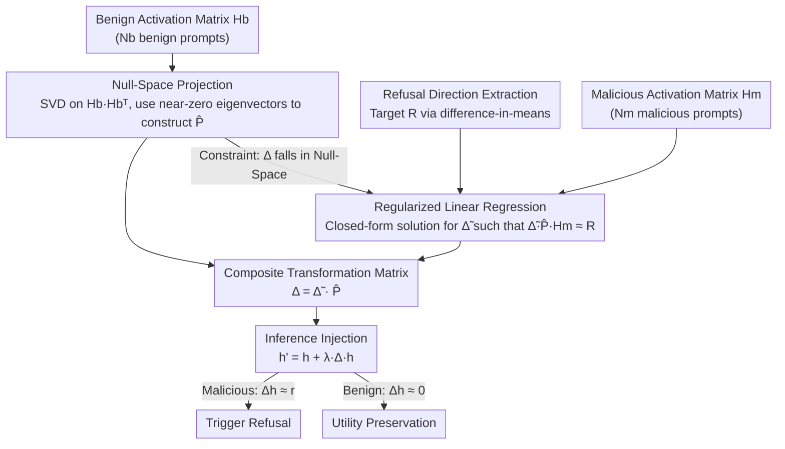

# AlphaSteer: Learning Refusal Steering with Principled Null-Space Constraint

**Conference**: ICLR 2026  
**arXiv**: [2506.07022](https://arxiv.org/abs/2506.07022)  
**Code**: [https://github.com/AlphaLab-USTC/AlphaSteer](https://github.com/AlphaLab-USTC/AlphaSteer)  
**Area**: LLM Alignment  
**Keywords**: activation steering, refusal direction, null-space projection, jailbreak defense, safety-utility trade-off

## TL;DR
AlphaSteer is proposed to dynamically construct steering vectors by learning a transformation matrix subject to null-space constraints. It generates near-zero vectors for benign inputs (preserving utility) and reconstructs refusal direction vectors for malicious inputs (enhancing safety), providing a theoretical guarantee for the decoupling of safety and utility.

## Background & Motivation
**Background**: Activation steering is an emerging method for LLM safety enhancement. The core idea is to inject a "refusal direction vector" $\mathbf{r}$ into the model's internal activations during inference to induce refusal behavior in response to malicious prompts.

**Limitations of Prior Work**: Directly injecting the same $\mathbf{r}$ for all inputs leads to over-refusal of benign prompts, creating a trade-off between safety and utility. Existing works either perform vector calibration (e.g., Surgical using PCA decomposition/subtraction of false refusal components) or use conditional steering (e.g., CAST using thresholds to apply steering only to "malicious" activations), but these are heuristic designs lacking theoretical guarantees.

**Key Challenge**: Safety enhancement and utility preservation are inherently opposing requirements for the same steering operation—malicious activations need significant modification, while benign activations must remain unchanged. Existing methods cannot mathematically guarantee this separation.

**Goal**: (1) How can steering be made strictly non-interfering for benign activations? (2) How can steering reliably reconstruct refusal directions specifically for malicious activations?

**Key Insight**: The authors leverage the mathematical property of the null space—if the row vectors of a transformation matrix lie within the null space of the benign activation matrix, applying this transformation to benign activations necessarily yields a zero vector.

**Core Idea**: Replace "fixed refusal direction vectors" with a "trainable transformation matrix under null-space constraints" to achieve adaptive steering for benign vs. malicious inputs.

## Method

### Overall Architecture
AlphaSteer addresses the classic problem in activation steering where injecting a single refusal vector harms benign prompts. Instead of a fixed vector, steering vectors adapt to the input—benign inputs are nearly untouched, while malicious ones are pushed toward a refusal direction. Specifically, for an activation $\mathbf{h}^{(l)}$ at layer $l$, a transformation matrix $\Delta^{(l)}$ dynamically generates a steering vector $\mathbf{s}^{(l)} = \Delta^{(l)} \mathbf{h}^{(l)}$, which is added back: $\mathbf{h}'^{(l)} = \mathbf{h}^{(l)} + \lambda \Delta^{(l)} \mathbf{h}^{(l)}$. The key is decomposing $\Delta$ into two components: $\Delta = \tilde{\Delta} \hat{\mathbf{P}}$. The right term $\hat{\mathbf{P}}$ is a null-space projection matrix derived from benign activations, ensuring "inactivity on benign inputs." The left term $\tilde{\Delta}$ is a matrix solved via regularized least squares with the refusal direction as the regression target, ensuring "refusal direction reconstruction for malicious inputs." The pipeline prepares these two branches: benign activations are processed via SVD to obtain the projection matrix, while malicious activations are paired with refusal directions to solve for the transformation matrix. At inference, only one additional matrix multiplication is required. This structure decouples safety and utility without gradient-based training.

### Key Designs

**1. Null-Space Projection: Ensuring Steering is Naturally Inactive for Benign Activations**

This step targets the "over-refusal" problem. The method collects activations from $N_b$ benign prompts into matrix $\mathbf{H}_b$ and performs SVD on the non-centered covariance matrix $\mathbf{H}_b \mathbf{H}_b^\top$. The null-space is spanned by eigenvectors corresponding to near-zero eigenvalues, forming the projection matrix $\hat{\mathbf{P}} = \hat{\mathbf{U}} \hat{\mathbf{U}}^\top$. Since $\hat{\mathbf{P}}$ projects any vector into the null space of benign activations, $\tilde{\Delta} \hat{\mathbf{P}} \mathbf{H}_b = \mathbf{0}$ holds strictly. Unlike heuristics like Surgical or CAST, this provides a mathematical guarantee. Computationally, Lemma 1 is used to reduce the null-space calculation complexity from $N_b$ dimensions to the activation dimension $d$ ($d \ll N_b$).

**2. Regularized Linear Regression: Reconstructing Refusal Directions for Malicious Activations**

While the null space handles utility, $\tilde{\Delta}$ ensures malicious inputs are actually refused. The objective is framed as regularized least squares:

$$\min_{\tilde{\Delta}} \ \|\tilde{\Delta} \hat{\mathbf{P}} \mathbf{H}_m - \mathbf{R}\| + \alpha \|\tilde{\Delta} \hat{\mathbf{P}}\|$$

The goal is to make the generated steering vector $\tilde{\Delta}\hat{\mathbf{P}}\mathbf{H}_m$ for malicious activations $\mathbf{H}_m$ as close as possible to the target refusal direction $\mathbf{R}$, with $\alpha$ controlling magnitude to prevent overfitting. This has a closed-form solution:

$$\tilde{\Delta}^\star = \mathbf{R} \mathbf{H}_m^\top \hat{\mathbf{P}}^\top \big(\hat{\mathbf{P}} \mathbf{H}_m \mathbf{H}_m^\top \hat{\mathbf{P}}^\top + \alpha \hat{\mathbf{P}} \hat{\mathbf{P}}^\top\big)^+$$

The closed-form solution implies no iterative optimization or backpropagation. The inclusion of $\hat{\mathbf{P}}$ in the regression ensures $\Delta = \tilde{\Delta}\hat{\mathbf{P}}$ remains within the null-space constraint.

**3. Refusal Direction Extraction: Targeting "What Refusal Looks Like"**

The target $\mathbf{R}$ in the regression is derived from a refusal direction vector $\mathbf{r}$, extracted using the difference-in-means method—calculating the mean activation difference between refusal and compliance responses. AlphaSteer uses $\mathbf{r}$ as a regression target specifically for malicious activations, allowing $\Delta$ to learn to produce $\mathbf{r}$ only for malicious inputs and zero for benign ones.

### Loss & Training
The method requires no gradient optimization. Both the projection matrix $\hat{\mathbf{P}}$ and the transformation matrix $\tilde{\Delta}$ are obtained via analytical solutions (SVD and regularized least squares). The process involves only forward passes to collect activations followed by matrix operations.

## Key Experimental Results

### Main Results: Defense Success Rate (DSR)

| Model | Method | AIM | AutoDAN | Cipher | GCG | Jailbroken | PAIR | ReNeLLM | Avg DSR |
|------|------|-----|---------|--------|-----|------------|------|---------|---------|
| Llama-3.1-8B | Vanilla | 92 | 48 | 0 | 58 | 75 | 45 | 28 | 48.0 |
| | Surgical | 100 | 76 | 61 | 98 | 88 | 90 | 67 | 82.8 |
| | Circuit Breaker | 100 | 100 | 34 | 100 | 80 | 96 | 81 | 84.4 |
| | **AlphaSteer** | **100** | **99** | **63** | **97** | **92** | **98** | **100** | **91.9** |
| Qwen2.5-7B | Vanilla | 25 | 2 | 1 | 22 | 71 | 19 | 4 | 20.6 |
| | **AlphaSteer** | **100** | **100** | **100** | **100** | **95** | **88** | **98** | **97.3** |
| Gemma-2-9b | Vanilla | 0 | 5 | 0 | 75 | 68 | 17 | 8 | 24.7 |
| | **AlphaSteer** | **100** | **98** | **100** | **100** | **99** | **91** | **99** | **98.2** |

### Utility Preservation Comparison

| Model | Method | XSTest CR↑ | AlpacaEval WR↑ | MATH Acc↑ | GSM8K Acc↑ | Utility Score |
|------|------|------------|----------------|-----------|------------|---------------|
| Llama-3.1-8B | Vanilla | 92.4 | 50.0 | 45.0 | 81.0 | 67.1 |
| | CAST | 90.0 | 31.1 | 0.0 | 0.0 | 30.2 |
| | RV (Direct) | 4.0 | 10.4 | 37.0 | 65.0 | 29.1 |
| | **AlphaSteer** | **91.2** | **48.1** | **46.0** | **84.0** | **67.3** |
| Qwen2.5-7B | Vanilla | 97.2 | 50.0 | 67.0 | 96.0 | 77.6 |
| | **AlphaSteer** | **95.6** | **48.1** | **65.0** | **95.0** | **75.9** |

### Key Findings
- AlphaSteer achieves over 90% average DSR across three models while utility scores remain nearly identical to the vanilla models (gap < 2%).
- CAST drops to 0% accuracy on math tasks (misclassifying them as malicious), while direct injection (RV) sees utility scores plummet to 2.4%–29.1%.
- PCA visualization confirms the L2 norm of steering vectors for benign activations is significantly smaller than for malicious activations under the null-space constraint.
- As steering intensity $\lambda$ increases, AlphaSteer's safety improves while utility remains stable, whereas baselines suffer from rapid utility degradation.

## Highlights & Insights
- **From Theory to Practice**: The introduction of null-space projection—a classic linear algebra tool—into activation steering provides a mathematical guarantee of non-interference. The closed-form solutions enable efficient, training-free deployment.
- **Complete Safety-Utility Decoupling**: Unlike previous trade-off-centric designs, AlphaSteer structurally decouples the two goals: null-space for utility and regression for safety.
- **Transferable Design**: The paradigm of "no effect on one class, maximum effect on another" via null-space constraints can be transferred to other intervention tasks (e.g., preventing forgetting in continual learning).

## Limitations & Future Work
- Evaluation was limited to 7-9B models; scalability to large reasoning models (e.g., o1/DeepSeek-R1) and the effectiveness of null-space dimensionality remains to be seen.
- The method relies on pre-collected activations; performance may drop if test-time malicious patterns deviate significantly from the training distribution.
- The selection of the eigenvalue threshold (treating the bottom $p\%$ as zero) is a hyperparameter affecting the safety-utility balance.
- Since modifications occur only at the activation level during inference, the method lacks inherent defense against weight-level attacks.

## Related Work & Insights
- **vs Surgical (Wang et al., 2024)**: Surgical uses PCA to calibrate the refusal direction but still applies it uniformly, which distorts benign activations. AlphaSteer's null-space constraint avoids this distortion mathematically.
- **vs CAST (Lee et al., 2024)**: CAST uses heuristic thresholds, often misclassifying complex benign tasks (like math) as malicious. AlphaSteer requires no explicit thresholding.
- **vs Circuit Breaker (Zou et al., 2024)**: Circuit Breaker requires fine-tuning, whereas AlphaSteer is deployable via simple matrix operations at much lower cost.
- The null-space projection approach shares intellectual roots with OWM/PackNet in continual learning, where projections onto orthogonal spaces protect existing functionalities.

## Rating
- Novelty: ⭐⭐⭐⭐ 
- Experimental Thoroughness: ⭐⭐⭐⭐ 
- Writing Quality: ⭐⭐⭐⭐⭐ 
- Value: ⭐⭐⭐⭐ 

<!-- RELATED:START -->

<!-- RELATED:END -->

## Related Papers

- [\[CVPR 2026\] Principled Steering via Null-space Projection for Jailbreak Defense in Vision-Language Models](../../CVPR2026/llm_alignment/principled_steering_via_null-space_projection_for_jailbreak_defense_in_vision-la.md)
- [\[ICLR 2026\] Mitigating the Safety Alignment Tax with Null-Space Constrained Policy Optimization](mitigating_the_safety_alignment_tax_with_null-space_constrained_policy_optimizat.md)
- [\[ICLR 2026\] RECAST: Expanding the Boundaries of LLMs' Complex Instruction Following with Multi-Constraint Data](recast_expanding_the_boundaries_of_llms_complex_instruction_following_with_multi.md)
- [\[ICLR 2026\] Alignment-Weighted DPO: A Principled Reasoning Approach to Improve Safety Alignment](alignment-weighted_dpo_a_principled_reasoning_approach_to_improve_safety_alignme.md)
- [\[ICLR 2026\] Sysformer: Safeguarding Frozen Large Language Models with Adaptive System Prompts](sysformer_safeguarding_frozen_large_language_models_with_adaptive_system_prompts.md)

<!-- RELATED:END -->
