# Anchored Supervised Fine-Tuning

**Conference**: ICLR 2026  
**OpenReview**: [https://openreview.net/forum?id=PORko7QT64](https://openreview.net/forum?id=PORko7QT64)  
**Code**: [https://github.com/zhuchichi56/ASFT](https://github.com/zhuchichi56/ASFT)  
**Area**: LLM Alignment / Post-training  
**Keywords**: Supervised Fine-Tuning, Dynamic Fine-Tuning, reward-weighted regression, KL anchoring, distribution drift  

## TL;DR
This paper provides a rigorous interpretation of the nature of Dynamic Fine-Tuning (DFT) being "tighter but prone to drift" using the reward-weighted regression (RWR) framework. It proposes ASFT, which superimposes a lightweight KL anchoring term onto the DFT reweighting objective, achieving stable gains in both reasoning and knowledge tasks with SFT-level computational costs.

## Background & Motivation
- **Background**: There exists a fundamental trade-off between SFT and RL in LLM post-training—SFT is efficient in imitating demonstrations but tends to memorize surface patterns with weak generalization, while RL yields stronger generalization via outcome rewards but is expensive and unstable. Compromise methods viewing "SFT through an RL lens" have emerged, such as DFT, which reweights the SFT objective using token probabilities and shows significant effects on mathematical reasoning.
- **Limitations of Prior Work**: DFT is a heuristic construction lacking theoretical explanation, and its effectiveness is highly domain-dependent—performing well in reasoning tasks but becoming unstable or even regressing in knowledge-intensive tasks (e.g., an average drop of -2.19 points on a 10k scale in medical QA). No prior work has clarified why it works in some domains but fails in others.
- **Key Challenge**: DFT's reweighting indeed provides a tighter RL lower bound than SFT, but this construction **lacks any distribution anchoring mechanism**. During training, the policy distribution gradually deviates from the reference distribution, making the lower bound increasingly loose, causing importance weight variance to explode and the effective sample size to drop, eventually leading to training divergence. Thus, "tightness" and "stability" cannot coexist.
- **Goal**: To clarify DFT within the RWR framework (which auxiliary distribution it corresponds to, why it is tighter, and why it drifts) and design a lightweight method that preserves tightness while restoring stability.
- **Core Idea**: **"Tightness from reweighting, stability from anchoring"**—preserve the probability reweighting objective of DFT and add a KL regularization term to constrain the policy within the trust region of the pre-trained model. This achieves RL-level generalization and SFT-level efficiency with minimal computational overhead.

## Method

### Overall Architecture
The paper first performs a theoretical breakdown under the RWR framework: SFT is a stable but loose lower bound of the RL objective, while introducing an auxiliary distribution $q(\tau)$ can construct a tighter lower bound. The authors prove that DFT corresponds exactly to a specific choice of $q$, which is strictly tighter but lacks anchoring, leading to drift. The implementation of ASFT is minimalist: it adds a KL term to the DFT objective to pull the policy back toward the pre-trained base model, providing variance control without destroying the tight structure of the lower bound.

```mermaid
flowchart LR
    A[RL Objective J&#40;θ&#41;] --> B[SFT: Stable but Loose Bound]
    A --> C[RWR: Introduce Aux Dist q&#40;τ&#41;<br/>Construct Tighter Bound]
    C --> D[DFT: Specific q Choice<br/>Strictly Tighter but No Anchoring → Drift]
    D --> E[ASFT: DFT Objective + λ·KL Anchoring<br/>Preserve Tightness + Control Variance]
```

### Key Designs
**1. Providing a precise identity for DFT via the RWR framework: a stop-gradient weighted auxiliary distribution.** Starting from reward-weighted regression, the authors write a family of auxiliary distribution lower bounds for the RL objective $J(\theta)\ge c_{\text{ref}}\cdot\mathbb{E}_{\tau\in D^+}\big[\tfrac{q(\tau)}{\pi_{\text{ref}}(\tau)}\log\pi_\theta(\tau)\big]$, where the auxiliary distribution $q$ determines both the tightness of the bound and optimization stability. The key finding is that DFT is equivalent to choosing $q(\tau)=\pi_{\text{ref}}(\tau\mid D^+)\cdot\tfrac{\text{sg}[p_\theta(\tau)]}{\mathbb{E}[\text{sg}[p_\theta(\tau)]]}$, which perfectly reproduces the sequence-level objective of DFT $L_{\text{DFT}}=-\mathbb{E}_{\tau\in D^+}[\text{sg}(p_\theta(\tau))\log p_\theta(\tau)]$. This grounds a heuristic "probability reweighting" trick onto the formal foundation of RWR.

**2. Proving that DFT is strictly tighter, but also proving it inevitably drifts—two sides of the same coin.** Theorem 1 states that as long as the policy probability for demonstrations on $D^+$ is non-uniform ($\mathrm{Var}(p_\theta(\tau))>0$), the auxiliary distribution of DFT provides a **strictly tighter** lower bound than SFT, explaining its advantage in high-variance reasoning domains. However, the same construction embeds a risk: the inequality $u\ge 1+\log u$ used to derive the RL lower bound holds with equality only when $u=1$. In DFT, $u=\pi_\theta(\tau)/q_\theta(\tau)$, and tightness only holds when $p_\theta(\tau)$ is constant on $D^+$. As training progresses, $p_\theta$ becomes more non-uniform, $q$ concentrates on high-probability trajectories, forming a feedback loop where the effective sample size shrinks—this is the root cause of DFT's divergence in knowledge tasks.

**3. ASFT: Superimposing KL anchoring on the reweighted objective to control variance without moving the bound structure.** The solution adds only one term:
$$L_{\text{ASFT}}(\theta)=L_{\text{DFT}}(\theta)+\lambda\,\mathbb{E}_s\big[D_{\text{KL}}(\pi_{\text{base}}(\cdot\mid s)\,\Vert\,\pi_\theta(\cdot\mid s))\big]$$
where $\pi_{\text{base}}$ is the fixed pre-trained model and $\lambda>0$ controls anchoring strength (experimentally set to $\lambda=0.05$). This KL term defines a trust region around the reference policy, allowing the policy to explore the tighter lower bound in a "controlled" manner without drifting away. Crucially, it **does not change the tightness structure of the lower bound** (DFT reweighting remains active) but provides explicit variance control to prevent the exponential growth of importance weights seen in pure DFT.

**4. Using Forward KL (mode-covering) instead of Reverse KL, implemented via token normalization.** By choosing $D_{\text{KL}}(\pi_{\text{base}}\Vert \pi_\theta)$ (forward, mode-covering), the policy is encouraged to maintain the wide distribution of the base model and prevent collapse; Reverse KL is mode-seeking and tends to narrow the model's distribution. The implementation follows mainstream training paradigms, spreading sequence-level weights to each token via position normalization, ensuring mathematical equivalence to the sequence-level theoretical framework with minimal computational cost (approx. 3% of full RL).

## Key Experimental Results
- **Models**: LLaMA-2-7B and Qwen2.5-7B for medical knowledge; Qwen2.5-7B for mathematical reasoning.
- **Data**: NuminaMath CoT (10k/30k/100k) for math, evaluated on Math500/Minerva/Olympiad/AIME24/AMC23; MedMCQA (10k/30k/100k) for medicine, evaluated on MMLU-medical/MedQA/MedMCQA.

### Main Results
Average scores (Avg.) across benchmarks for Medicine (LLaMA-2-7B) and Mathematics (Qwen2.5-7B):

| Data Size | Method | Medical Avg. | Math Avg. |
|---|---|---|---|
| Base | — | 31.38 | 12.61 |
| 10k | SFT | 33.37 | 16.73 |
| 10k | DFT | 29.19 (↓ Drop) | 27.77 |
| 10k | **ASFT** | **42.03** | **28.75** |
| 30k | SFT | 36.02 | 19.93 |
| 30k | DFT | 33.14 | 27.66 |
| 30k | **ASFT** | **42.01** | 27.18 |
| 100k | SFT | 35.71 | 19.15 |
| 100k | DFT | 38.06 | 26.04 |
| 100k | **ASFT** | **39.98** | **30.50** |

Key Point: On medical tasks, DFT drops below the base at 10k, while ASFT consistently gains +8.6 to +10.65 points across all scales. In math, ASFT and DFT both significantly outperform SFT, but ASFT shows more pronounced advantages in difficult problems (AMC23 100k: 36.72 vs DFT 27.19).

### Ablation Study

| Ablation Dimension | Setting | Conclusion |
|---|---|---|
| KL Direction | Forward $D_{\text{KL}}(P\Vert Q)$ vs Reverse $D_{\text{KL}}(Q\Vert P)$ | Forward KL is consistently superior; mode-covering prevents collapse and preserves base model distribution. |
| Hyperparameter Robustness | Learning rate / batch size sweeps | ASFT is robust to key hyperparameters. |

### Key Findings
- **Stability is ASFT's core value proposition**: Figure 1 shows DFT's KL divergence skyrocketing during training (severe drift), while ASFT flattens the KL through anchoring, yielding higher scores in both in-domain (MedMCQA) and out-of-domain (MMLU) tests.
- **Cross-domain Consistency**: DFT gains fluctuate in math and are sometimes negative in knowledge; ASFT provides larger and more consistent improvements across both domains.
- **Scaling Robustness**: On medical tasks, ASFT gains +10.65 / +10.63 / +8.60 across scales, showing little degradation with data volume, confirming that anchoring mitigates DFT's scaling instability.
- **Computational Efficiency**: ASFT gains +10.65 points over the base model on medical tasks with only ~3% of the training cost of full RL.
- **Higher Gains on Hard Problems**: On Math 100k, ASFT reaches 36.72 on AMC23 (vs DFT 27.19), suggesting that anchoring not only stabilizes but also unlocks reaching a higher generalization ceiling.

## Highlights & Insights
- **Example of the "Explain-then-Improve" Paradigm**: Rather than proposing another trick, the authors use RWR to prove that DFT's tightness and instability are two sides of the same construction and then target the fix through anchoring—theoretical analysis directly leads to stronger guarantees and practical gains.
- **Minimalist yet Effective**: The method is simply `L_DFT + λ·KL`, requiring near-zero engineering changes, yet it expands DFT from "reasoning-only" to "general-purpose reasoning and knowledge."
- **Unifying SFT/DFT/RL in one framework**: The RWR framework provides a systematic lens for post-training—SFT as a loose bound, DFT as a tight bound without anchoring, RL as direct optimization, and ASFT as a tight bound with a trust region.

## Limitations & Future Work
- Experiments are concentrated on 7B scale and math/medical/code tasks; performance on larger models and broader tasks (open-ended generation, Agents) remains to be verified.
- Anchoring strength $\lambda$ is fixed at 0.05; whether dynamic scheduling of $\lambda$ or adaptive anchoring can further approach the RL ceiling has not been explored.
- Anchoring to a "fixed pre-trained base model" is a choice; if the task distribution is far from the base model prior, the coverage constraint of Forward KL might become a burden.
- Sistemic comparisons with true RL like PPO/GRPO under equal budgets could be more comprehensive; currently, comparisons are mainly against SFT/DFT.

## Related Work & Insights
- **DFT (Wu et al., 2025a)**: The direct predecessor and target; provides the probability reweighting objective. ASFT adds theoretical grounding and anchoring.
- **Reward-Weighted Regression / Importance Sampling (Peters & Schaal 2007; Rubinstein & Kroese 2016)**: The foundation of the formal analysis in this paper.
- **Trust Region / PPO (Schulman et al., 2015; 2017)**: The source of the KL anchoring idea, borrowing the "constrain policy to reference" concept from RL to use in SFT reweighting.
- **Proximal SFT / Importance-weighted SFT (Zhu et al., 2025; Qin & Springenberg, 2025)**: Shares the research line of "tightening SFT via an RL lens." ASFT's differentiator is anchoring the auxiliary distribution itself to the base model.
- **Insight**: When a heuristic method yields inconsistent results, instead of stacking tricks, identify a unified framework to prove its success and failure come from the same source. Often, the "root cause of failure" points directly to the minimal repair solution.
- **Transferability**: The "reweighting + trust region anchoring" skeleton of ASFT is decoupled from specific reweighting methods. Theoretically, any auxiliary distribution used to tighten the SFT lower bound can be paired with similar KL anchoring to stabilize training.

## Rating
- **Novelty**: ⭐⭐⭐⭐ — Precisely embedding DFT into RWR and proving the "tightness-drift" duality, then fixing it with minimal KL anchoring, creates a clean and persuasive blend of theory and method.
- **Experimental Thoroughness**: ⭐⭐⭐⭐ — Covers two domains, three data scales, two base models, plus KL direction and hyperparam ablations. Training dynamics are well-visualized; model and task breadth could be further expanded.
- **Writing Quality**: ⭐⭐⭐⭐ — Theoretical narrative is clear, with three Key Findings progressing logically. Contrastive charts (drift vs. stability) are intuitive.
- **Value**: ⭐⭐⭐⭐ — Upgrades DFT from "domain-restricted" to "generally stable" at near-zero cost, offering direct value for post-training practice. The RWR lens is also methodologically significant.

<!-- RELATED:START -->

## Related Papers

- [\[ICLR 2026\] TS²: Sparsemax+ for Training and Softmax for Testing for Accurate and Diverse LLM Fine-tuning](ts2_training_with_sparsemax_testing_with_softmax_for_accurate_and_diverse_llm_fi.md)
- [\[ACL 2026\] Why Supervised Fine-Tuning Fails to Learn: A Systematic Study of Incomplete Learning in Large Language Models](../../ACL2026/llm_alignment/why_supervised_fine-tuning_fails_to_learn_a_systematic_study_of_incomplete_learn.md)
- [\[ICLR 2026\] Safety Subspaces are Not Linearly Distinct: A Fine-Tuning Case Study](safety_subspaces_are_not_linearly_distinct_a_fine-tuning_case_study.md)
- [\[ICLR 2026\] Semi-Supervised Preference Optimization with Limited Feedback](semi-supervised_preference_optimization_with_limited_feedback.md)
- [\[ACL 2026\] Compatibility-Aware Dynamic Fine-Tuning for Large Language Models](../../ACL2026/llm_alignment/compatibility-aware_dynamic_fine-tuning_for_large_language_models.md)

<!-- RELATED:END -->
