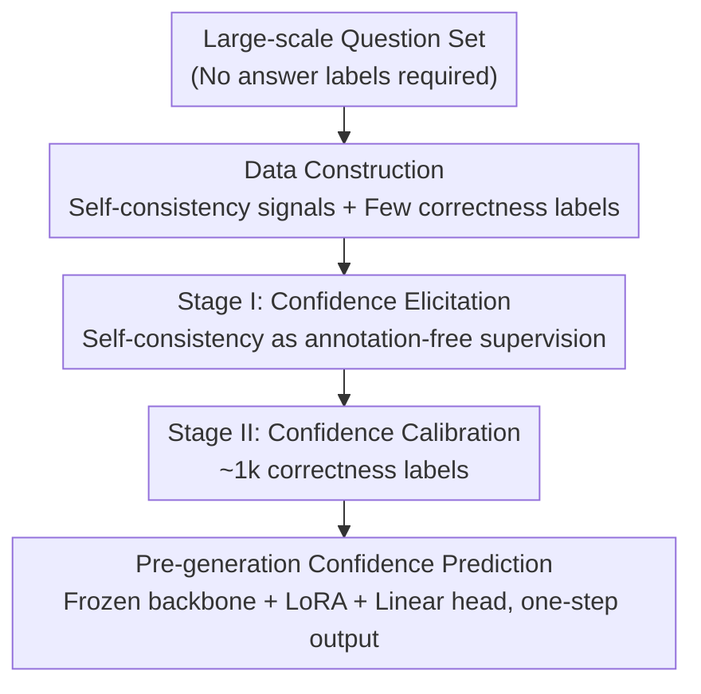

# Annotation-Efficient Honesty Alignment via Confidence Elicitation and Calibration

**Conference**: ICLR2026  
**OpenReview**: [https://openreview.net/forum?id=cW6oDsPobl](https://openreview.net/forum?id=cW6oDsPobl)  
**Code**: TBD  
**Area**: RLHF Alignment / LLM Honesty  
**Keywords**: Honesty Alignment, Confidence Calibration, Self-consistency, Annotation Efficiency, AUROC

## TL;DR
This paper decomposes "honesty alignment" (enabling LLMs to accurately state their confidence before answering) into an "Elicitation-then-Calibration" two-stage paradigm: first, the model is taught to externalize its internal confidence using annotation-free self-consistency signals; second, this elicited confidence is calibrated to actual accuracy using a minimal amount of correctness labels (~1k samples, approximately 0.18% of the full set). The authors release HonestyBench with 560k training samples, demonstrating that using only 1k labels achieves 98% of the performance of full supervision.

## Background & Motivation
**Background**: Honesty alignment is one of the HHH (Helpful, Harmless, Honest) principles, aiming to make models "know what they know and what they do not know." Ideally, a model should provide a calibrated confidence score *before* generating an answer: providing a direct answer for high confidence, and refusing or triggering retrieval-augmented generation (RAG) for low confidence. Existing approaches fall into two categories: **training-free** methods (token probabilities, verbalized confidence, self-consistency) and **training-based** methods (calibrating confidence using correctness labels). Among training-free methods, self-consistency (sampling multiple answers and measuring semantic consistency) shows the strongest correlation with actual accuracy.

**Limitations of Prior Work**: While training-based methods are generally more accurate, building a *general-purpose* honest model across tasks requires massive amounts of data with correctness labels (i.e., ground truth for every question), which is extremely expensive. Conversely, while self-consistency is annotation-free, it requires repeated sampling of $k$ responses during inference, leading to high computational overhead and an inability to produce results in a single pass.

**Key Challenge**: The authors decouple the role of "correctness labels" into two tasks: **first, teaching the model to express its confidence; second, calibrating the expressed confidence to match actual accuracy.** If the first task can be replaced by a cheaper signal (self-consistency), then expensive correctness labels are only needed for the second task, significantly reducing label requirements. Existing methods mix these two tasks, learning both from scratch using correctness labels, which leads to high annotation demand.

**Goal**: (1) Design an annotation-efficient training framework that achieves performance close to full supervision with minimal correctness labels; (2) Provide a large-scale, cross-task benchmark to explore the upper bounds of honesty alignment performance.

**Key Insight**: The authors observe (Fig. 2) that although models are generally **overconfident**, their self-consistency confidence is highly correlated with actual accuracy across questions (Spearman $\rho=0.789$). This suggests that "internal confidence" itself is a learnable signal—once elicited from the model's internal states, the remaining task is merely a lightweight calibration.

**Core Idea**: Replace the "learning from scratch with correctness labels" approach with an "elicitation-then-calibration" two-stage paradigm (analogous to pre-training and fine-tuning), transforming honesty alignment into an annotation-efficient problem.

## Method

### Overall Architecture
EliCal (Elicitation-Then-Calibration) reformulates honesty alignment as a two-stage learning problem. The input is a large set of questions (without answers), and the output is a model capable of providing a 0~1 confidence score **before generating the answer**. The pipeline is: first, construct self-consistency data from a large-scale question set (sample $k$ responses per question and calculate the proportion semantically consistent with the greedy answer as the target confidence); **Stage 1: Confidence Elicitation** uses these annotation-free signals to train the model to "one-shot" its internal confidence without repeated sampling; **Stage II: Confidence Calibration** then uses a small set of QA pairs with correctness labels to fine-tune the elicited confidence to actual accuracy. Both stages share the same architecture: a "frozen backbone + LoRA + linear head," allowing the final model to predict confidence in a single step during inference.

### Key Designs

**1. Reforming Honesty Alignment into "Elicitation-then-Calibration": Core Reformulation**

The pain point is that previous training-based methods learn confidence "from scratch" using correctness labels, forcing an expensive signal to both "teach confidence expression" and "calibrate to accuracy." This leads to high annotation demand and task-specific overfitting. EliCal's insight is that these roles can be decoupled—cheap self-consistency suffices for expressing confidence, leaving correctness labels only for final calibration. Formally, the goal of honesty alignment is to learn a target confidence $\text{Confidence}^*_\theta(q)$ such that it equals the expected accuracy $\text{Accuracy}_\theta(q)=\mathbb{E}_{r\sim p^\pi_\theta(\cdot\mid q)}[\,\mathbb{I}[r\in G(q)]\,]$ (where $G(q)$ is the set of correct answers). EliCal splits this: Stage I approximates self-consistency confidence $\text{Confidence}_\theta(q)$, and Stage II fine-tunes from this starting point to $\text{Accuracy}_\theta(q)$. This works because it is isomorphic to "pre-training/fine-tuning"—Stage I builds the foundation of "expressing confidence" using massive annotation-free data, and Stage II only needs minimal labels for domain calibration.

**2. Stage I: Confidence Elicitation: Teaching the model to "speak" its internal confidence using free signals**

To address the overhead of repeated sampling and the expense of labels, Stage I requires no human annotation. For each question $q$, $k$ responses are sampled (the paper uses $k=20$, temp=1) alongside one greedy response. The "proportion of responses semantically consistent with the greedy answer" serves as the target confidence: $p^\pi_\theta(\tilde r\mid q)\approx\frac1k\sum_{r\in\hat R}s(r,\tilde r)$, where $s(r,\tilde r)=\mathbb{I}[\text{two responses are semantically consistent}]$. The model is then trained via MSE to directly predict this value: $\mathcal{L}=\frac1{|Q|}\sum_q(\hat c(q)-\text{Confidence}_\theta(q))^2$. This works because self-consistency confidence essentially depends on internal representations and is thus "naturally learnable." After training, the model internalizes the "sample $k$ and count" process into a single forward pass, eliminating inference overhead and improving generalization by fitting internal signals rather than task-specific labels.

**3. Stage II: Confidence Calibration: 1k Correctness Labels are Sufficient**

Elicited confidence still exhibits systematic bias (e.g., general overconfidence) relative to actual accuracy and requires calibration. Starting from the parameters $(\phi^1,\theta^1_{\text{LoRA}})$ obtained in Stage I, a small batch of QA pairs $Q_{\text{small}}$ with correctness labels is used for MSE fine-tuning to align predictions with actual accuracy: $\mathcal{L}=\frac1{|Q_{\text{small}}|}\sum_{q\in Q_{\text{small}}}(\hat c(q)-\text{Accuracy}_\theta(q))^2$. The key is "small"—because Stage I already solved the difficult task of confidence expression, only a lightweight calibration remains, making ~1k labels (approx. 0.18% of the total) sufficient to reach performance near full supervision levels. This contrasts sharply with the Cal-Only baseline (learning from scratch), which fails to outperform training-free methods on many datasets with only 1k labels because it lacks the elicitation foundation.

**4. Frozen Backbone + LoRA + Linear Head: Step-one Prediction Before Generation**

To preserve the model's original capabilities, EliCal freezes the backbone $\theta$, inserts LoRA modules $\theta_{\text{LoRA}}$ into all linear layers for interaction with internal states, and attaches a linear head $f_\phi$ to map the hidden state of the final question token to a confidence score: $\hat c=f_\phi(h^{(L)}_T(\theta,\theta_{\text{LoRA}}))=w^\top h^{(L)}_T+b$. Only $\theta_{\text{LoRA}}$ and $\phi=\{w,b\}$ are updated. This design has two benefits: first, confidence prediction occurs at the final question token, **before answer generation**, supporting "evaluate-before-answering" or "decide-to-retrieve" scenarios; second, the frozen backbone ensures honesty training does not degrade original QA performance.

### Loss & Training
Both stages utilize MSE regression: Stage I regresses to self-consistency confidence $\text{Confidence}_\theta(q)$ (Eq. 10), and Stage II regresses to accuracy $\text{Accuracy}_\theta(q)$ (Eq. 11). The supervision signals are scalars between 0 and 1. Stage I is conducted on all 560k questions in HonestyBench-Train, while Stage II samples correctness labels ranging from 1k to 560k to evaluate scaling curves.

## Key Experimental Results

The authors constructed **HonestyBench**: integrating 10 free-form factoid QA datasets, including 567k training samples, ~38k in-domain evaluation samples, and ~33k out-of-distribution (OOD) evaluation samples. It covers single-hop/multi-hop/template-generated questions. For three representative LLMs (Qwen2.5-7B/14B-Instruct, Llama3-8B-Instruct), it provides 20 sampled responses + 1 greedy response per question, labeled for semantic consistency and correctness. The primary metric is **AUROC** (discriminating between correct and incorrect responses), alongside alignment (percentage matching between binarized confidence and correctness).

### Main Results
AUROC on Qwen2.5-7B-Instruct (Mean of 5 In-domain + 5 OOD datasets):

| Method | Labels | In-domain Avg. | OOD Avg. |
|------|--------|-----------|----------|
| Consis-Sem (Strongest Training-free) | 0 | 73.62 | 70.20 |
| Eli-Only (Elicitation only) | 0 | 71.19 | 69.66 |
| Cal-Only (Calibration only) | 1k | 73.41 | 77.32 |
| **EliCal** | **1k** | **84.36** | **84.47** |
| Cal-Only (Upper bound) | 560k | 86.20 | 85.75 |
| EliCal (Upper bound) | 560k | 86.49 | 85.83 |

Key points: (1) Under full supervision, both EliCal and Cal-Only outperform training-free methods by over 17%, establishing an honesty upper bound at this scale; (2) **EliCal with only 1k labels (~0.18%) reaches ~98% of the full-supervision upper bound** (84.36 vs 86.49 in-domain); (3) At 1k labels, Cal-Only (73.41) fails to beat training-free methods on several datasets (e.g., NQ, HQ).

### Ablation Study

| Configuration | Key Finding | Description |
|------|---------|------|
| Elicitation Volume ↑ | AUROC increases, then plateaus toward Consis-Sem (73.62) | More data in Stage I builds a stronger foundation (Fig. 7). |
| Sample count $k\in\{2,5,10,20\}$ | Consis-Sem scales with $k$; EliCal remains stable | With $k=2$, EliCal(1k) still achieves 84.41 AUROC; highly robust (Table 3). |
| Linear head only (No LoRA) | EliCal still beats Cal-Only, but is lower than LoRA | Limited interaction/expressive capacity with just a head. |
| MMLU (Multiple choice, high shift) | Cal-Only lags EliCal even at 560k labels | Internal signals elicit better generalization than task labels alone. |

### Key Findings
- **The Elicitation stage is the source of generalization**: On MMLU (the largest distribution shift), Cal-Only cannot match EliCal even with 560k labels, indicating that eliciting "internal signals" transfers across tasks better than fitting task-specific labels.
- **Confidence is binarizable for decision-making**: EliCal significantly outperforms Cal-Only on the alignment metric; its confidence scores can be reliably binarized for "answer vs. refuse" decisions, serving real-world RAG triggers.
- **LLMs can be taught to externalize internal confidence**: Eli-Only (zero labels) matches the multi-sampling Consis-Sem but eliminates the sampling overhead during inference.

## Highlights & Insights
- **Decoupling the two roles of annotation is the most elegant insight**: By separating "teaching expression" from "performing calibration" and matching them with cheap and expensive signals respectively, the label requirement is slashed from 560k to 1k. This logic is transferable to other "expensive label, free weak signal" alignment tasks (e.g., safety, refusal).
- **Internalizing self-consistency into a single forward pass**: Distilling a 20-sample process into the model's internal states saves inference costs while retaining discriminative power. This is a reusable trick for any uncertainty estimation relying on multi-sampling.
- **Pre-generation confidence prediction** naturally fits the deployment logic of RAG or refusal: assessing certainty before committing to an answer, rather than attempting post-generation correction.
- **HonestyBench** (560k training + dual OOD evaluation + triple model labeling) is a substantial infrastructure contribution, pushing honesty alignment from small-scale evaluation to large-scale general-model upper-bound exploration.

## Limitations & Future Work
- Evaluation is concentrated on **free-form factoid QA**, mostly derived from Wikipedia. In-domain and OOD scenarios are quite similar due to shared formats and knowledge sources; only MMLU represents a truly heterogeneous task. Honesty in reasoning-heavy, long-form, or code tasks remains unverified.
- Confidence is modeled as a single scalar regression (MSE), assuming a fixed expected accuracy per question. This may not hold for open-ended questions where **multiple answers are valid** or correctness varies with context.
- Self-consistency confidence is itself "polluted" by the model's systematic overconfidence. Stage I fits this biased signal, meaning the final upper bound is still limited by signal quality (elicitation approaches but does not exceed Consis-Sem).
- Future Work: Expanding elicitation signals beyond self-consistency (e.g., multi-layer hidden states, attention) or extending to verbalized confidence (natural language refusal) to serve conversational scenarios.

## Related Work & Insights
- **vs. Training-free methods (Consis-Sem, etc.)**: These estimate confidence via sampling at inference time; they require no training but are costly and cannot calibrate systematic overconfidence. EliCal distills this into a single pass and calibrates it with minimal labels.
- **vs. Pure Calibration (Cal-Only / Yang et al. 2023)**: These learn "expression + calibration" from scratch using labels, resulting in high label demand and weak generalization. EliCal's initialization allows 1k labels to match their 560k upper bound.
- **vs. Temperature Scaling (Thermometer, DACA)**: These perform post-processing on logits, which is limited by original logit quality. EliCal learns a confidence head from internal states, providing higher expressive power (as shown in Table 2).
- **vs. Internal Uncertainty Works (Zhang et al. 2024)**: While others use internal uncertainty for "refusal," EliCal uses it as a learnable supervision signal to **teach the model to express its own confidence**.

## Rating
- Novelty: ⭐⭐⭐⭐⭐ Decoupling label roles + Elicitation-Calibration reformulation is clean and insightful.
- Experimental Thoroughness: ⭐⭐⭐⭐⭐ Three models, in-domain/dual OOD, annotation scaling, and extensive ablations on $k$/architecture/volume.
- Writing Quality: ⭐⭐⭐⭐ Clear formalization and well-structured; some equations are slightly dense.
- Value: ⭐⭐⭐⭐⭐ Reduces honesty alignment costs by two orders of magnitude and contributes the reusable HonestyBench.

<!-- RELATED:START -->

## Related Papers

- [\[ICML 2026\] Decoupling Reasoning and Confidence: Resurrecting Calibration in Reinforcement Learning from Verifiable Rewards](../../ICML2026/llm_alignment/decoupling_reasoning_and_confidence_resurrecting_calibration_in_reinforcement_le.md)
- [\[ICLR 2026\] PALC: Preference Alignment via Logit Calibration](palc_preference_alignment_via_logit_calibration.md)
- [\[ICLR 2026\] When Weak LLMs Speak with Confidence, Preference Alignment Gets Stronger](when_weak_llms_speak_with_confidence_preference_alignment_gets_stronger.md)
- [\[ICLR 2026\] ActiveDPO: Active Direct Preference Optimization for Sample-Efficient Alignment](activedpo_active_direct_preference_optimization_for_sample-efficient_alignment.md)
- [\[CVPR 2026\] EcoAlign: An Economically Rational Framework for Efficient LVLM Alignment](../../CVPR2026/llm_alignment/ecoalign_an_economically_rational_framework_for_efficient_lvlm_alignment.md)

<!-- RELATED:END -->
