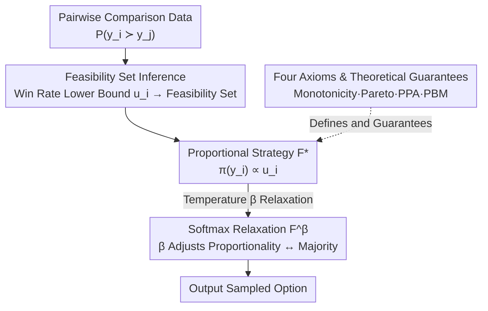

# Beyond RLHF and NLHF: Population-Proportional Alignment under an Axiomatic Framework

**Conference**: ICLR 2026  
**arXiv**: [2506.05619](https://arxiv.org/abs/2506.05619)  
**Code**: Experimental code included in supplementary materials  
**Area**: AI Alignment / Social Choice Theory  
**Keywords**: RLHF, NLHF, Preference Learning, Social Choice Theory, Population-Proportional Alignment, Axiomatic Framework  

## TL;DR
This paper proposes a preference learning framework based on social choice theory axioms. It infers a feasibility set of evaluator population distributions from pairwise comparison data and constructs policies satisfying Population-Proportional Alignment (PPA) and Population Bounded Manipulability (PBM) axioms.

## Background & Motivation

**Background**: Mainstream preference learning follows two paths. RLHF utilizes the Bradley-Terry model to compress multi-user preferences into a single scalar reward for policy optimization, equivalent to the Maximin Borda rule in social choice—deterministically selecting a winner. NLHF models preference learning as a two-player zero-sum game to find a Nash Equilibrium policy, corresponding to maximal lotteries. While both aggregate preferences, neither guarantees that the policy reflects each evaluator group **proportionally to their population**.

**Limitations of Prior Work**: When the preferences of two evaluator groups for two options are close to 50:50 (e.g., $50{+}\epsilon$ vs $50{-}\epsilon$), both RLHF and NLHF output deterministic policies, placing all probability on the slim majority. The minority group is completely erased—this subtle proportional difference is lost during policy optimization.

**Key Challenge**: Multi-alignment methods capable of "proportional alignment" (mixture-based, steerable models) typically require explicit group labels for evaluators. In reality, group identities are often implicit and unobservable. Axiomatic solutions like Random Dictatorship satisfy proportional alignment but cannot be implemented using only pairwise comparison data.

**Goal**: To construct a preference learning algorithm that is both proportionally aligned and resistant to strategic manipulation, relying solely on pairwise comparison data without any additional group information.

## Method

### Overall Architecture

The method reformulates "alignment" as a social choice problem. Instead of compressing preferences into a single scalar reward, it proceeds in two steps: first, inferring a feasibility set of "what the evaluator population might look like" from pairwise comparison data; second, constructing a policy on this set that selects options proportionally to each group's share and remains difficult to manipulate. The first step estimates an upper bound on the population share for each option, forming a polyhedral outer approximation of the true population distribution. The second step assigns selection probabilities accordingly to obtain a proportional policy $F^*$, which is then relaxed via a temperature parameter into $F^\beta$ to allow sliding between "proportional fairness" and "majority rule." Finally, four axioms define the properties such policies should satisfy, proving that RLHF/NLHF violate proportionality and anti-manipulation axioms, while the proposed strategy provides theoretical guarantees.

### Key Designs

**1. Feasibility Set Inference: Reconstructing Population Structure Without Group Labels**

Multi-alignment methods usually require explicit group labels, but practically only pairwise comparison data is available. This paper bypasses this by defining $u_i = \min_{y \neq y_i} P(y_i \succ y)$ for each option $y_i$. This represents the minimum win rate of $y_i$ across all matchups, serving as an upper bound for the population share supporting $y_i$. Since any group ranking $y_i$ first must make $y_i$ win against all opponents, that group's share cannot exceed the lowest win rate of $y_i$. Combining these bounds yields a polyhedral outer approximation of the true population distribution $w$:

$$\bar{\mathcal{W}}(P) = \{w \in \Delta(\mathcal{Y}) \mid w_i \leq u_i\}.$$

The number of constraints grows linearly with the number of options $M$, making it tractable, though the approximation may broaden as options increase. This characterizes the "possible population structure" using only comparison probabilities.

**2. Proportional Strategy F*: Proportional Selection Probabilities**

With the upper bounds established, the most natural alignment policy is selecting randomly proportional to the shares: $\pi(y_i) = u_i / \sum_j u_j$. This contrasts with the deterministic outputs of RLHF/NLHF. When preference shares for two options are near $50{+}\epsilon$ and $50{-}\epsilon$, a deterministic policy favors the slim majority entirely, whereas the proportional policy accounts for the minority with nearly 50% probability. It provides a conservative solution for worst-case proportional mismatch, ensuring minority preferences are not erased by a slim majority advantage.

**3. Softmax Relaxation F^β: Adjustable Trade-off Between Proportionality and Majority**

While pure proportional strategies are fair, they may appear too "soft" when a clear majority exists. A temperature parameter $\beta$ is introduced for relaxation:

$$\pi(y_i) = \frac{u_i \exp(\beta u_i)}{\sum_j u_j \exp(\beta u_j)}.$$

At $\beta = 0$, it reverts to the proportional strategy $F^*$. As $\beta \to \infty$, probability mass concentrates on the option with the largest upper bound, converging to the minimax Condorcet method (favoring winners who beat all others in pairwise matchups). Thus, larger $\beta$ favors the majority and higher win rates, though proportional alignment weakens—a trade-off verified by experiments.

**4. Four Axioms & Theoretical Guarantees: RLHF/NLHF Comparison**

To justify the proposed policy, four axioms are used as criteria. The two basic axioms are **Monotonicity** (improving an option's rank should not decrease its selection probability) and **Pareto Efficiency** (if everyone prefers $y$ over $y'$, the policy should favor $y$). The core contributions are two new quantitative axioms: $\alpha$-PPA (Population-Proportional Alignment) requires that the selection probability of each group's top preference is at least weakly proportional to its population share, i.e., $\pi(y_k)/w_k^\sigma \geq \alpha(\sigma)$; $\gamma$-PBM (Population Bounded Manipulability) requires that the strategic gain a group can achieve by misreporting preferences is bounded by an affine upper bound $\gamma_1 w_k^\sigma + \gamma_2$, preventing non-majority groups from seizing majority status via manipulation. The paper proves that RLHF and NLHF violate PPA and PBM of any strength, while the proposed strategy offers theoretical guarantees for both.

## Key Experimental Results

### Main Results: MovieLens Recommendation

| Method | Win Rate | PPA Level | PBM Gain |
|------|------|----------|----------|
| RLHF | 0.7784 | 0 | 0.0611 |
| NLHF | 0.7712 | 0 | 0.0124 |
| $F^\beta$($\beta=1$) | ~0.60 | 0.4869 | 8.9e-4 |

- As β increases, win rates rise while PPA decreases, confirming the predicted trade-off.
- The proposed method significantly outperforms baselines in manipulation resistance when β ≤ 10.

### Ablation Study: LLM Alignment (Qwen2.5-3B-Instruct)

| Dataset | β=0 PPA | DPO PPA |
|--------|---------|---------|
| Synthetic-Color | 0.0883 | 0.0000 |
| Alpaca-Expertise | 0.1428 | 0.1321 |
| Alpaca-Style | 0.5012 | 0.3786 |

- The trade-off is evident on synthetic data; Alpaca data shows weaker effects due to GPT-4.1 annotation noise.
- Computational cost is comparable to RLHF and higher than DPO.

## Highlights & Insights
- Theoretical Rigor: Proof that RLHF/NLHF violate PPA and PBM axioms of any strength.
- Population distribution feasibility sets can be inferred solely from pairwise data without group labels.
- Softmax relaxation provides an adjustable trade-off between proportional alignment and Condorcet consistency.
- Manipulation resistance is theoretically guaranteed: non-majority groups cannot obtain majority status via strategic misreporting.

## Limitations & Future Work
- PPA only focuses on selection probabilities of top-ranked preferences, ignoring lower-ranked preferences.
- Evaluating PPA levels in LLM scenarios remains an open problem (both logit estimation and group classification are noisy).
- The two-stage function approximation method has computational overhead no less than RLHF; a direct policy optimization version is needed.
- The outer approximation $\bar{\mathcal{W}}$ may become too loose when the number of options is large.

## Related Work & Insights
- **RLHF / DPO**: Equivalent to the Maximin Borda rule, deterministically selecting the winner.
- **NLHF**: Equivalent to Maximal Lotteries; satisfies Pareto but not PPA.
- **Random Dictatorship**: Perfect PPA but cannot be implemented from pairwise comparisons.
- **Multi-Alignment** (Sorensen 2024, Chen 2024): Requires explicit group labels.
- **Anti-Manipulation Mechanisms** (Buening 2025, Park 2024): Pursue strict strategy-proofness; this paper constrains gains at the population level.

## Rating
- Novelty: ⭐⭐⭐⭐⭐
- Experimental Thoroughness: ⭐⭐⭐⭐
- Writing Quality: ⭐⭐⭐⭐⭐
- Value: ⭐⭐⭐⭐

<!-- RELATED:START -->

## Related Papers

- [\[ICLR 2026\] Enforcing Axioms for AI Alignment under Loss-Based Rules](enforcing_axioms_for_ai_alignment_under_loss-based_rules.md)
- [\[ICLR 2026\] Beyond Binary Preferences: A Principled Framework for Reward Modeling with Ordinal Feedback](beyond_binary_preferences_a_principled_framework_for_reward_modeling_with_ordina.md)
- [\[ICLR 2026\] Beyond Pairwise: Empowering LLM Alignment With Ranked Choice Modeling](beyond_pairwise_empowering_llm_alignment_with_ranked_choice_modeling.md)
- [\[ICLR 2026\] The Alignment Auditor: A Bayesian Framework for Verifying and Refining LLM Objectives](the_alignment_auditor_a_bayesian_framework_for_verifying_and_refining_llm_object.md)
- [\[ICLR 2026\] General Exploratory Bonus for Optimistic Exploration in RLHF](general_exploratory_bonus_for_optimistic_exploration_in_rlhf.md)

<!-- RELATED:END -->
