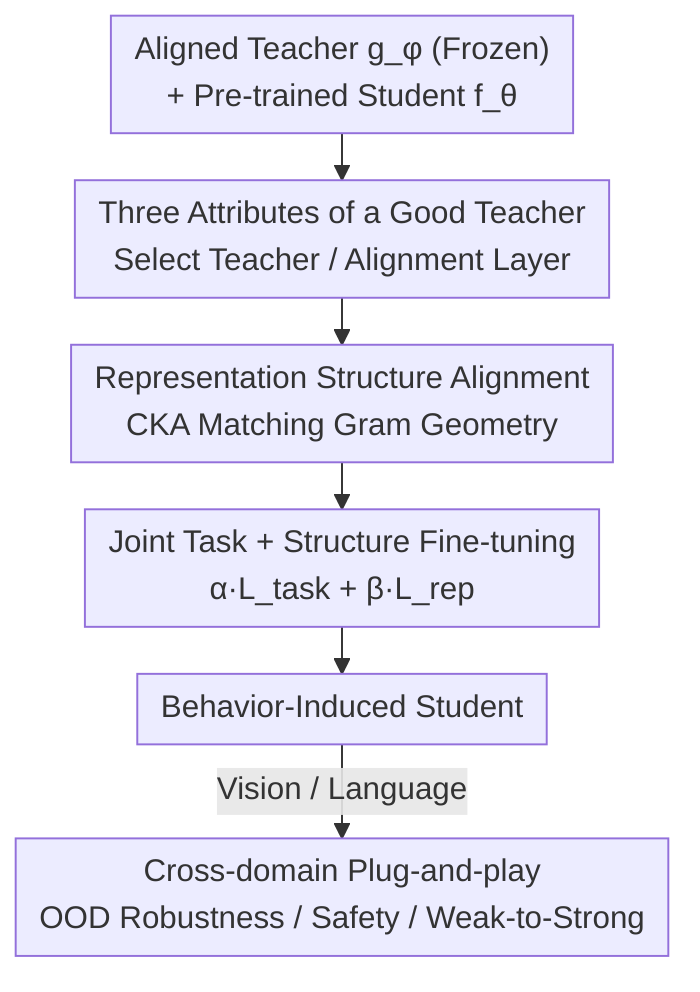

# BIRD: Behavior Induction via Representation-structure Distillation

**Conference**: ICLR2026  
**OpenReview**: [https://openreview.net/forum?id=jbJGhHpwmJ](https://openreview.net/forum?id=jbJGhHpwmJ)  
**Code**: https://github.com/gpogoncheff/bird  
**Area**: Alignment / Behavior Transfer / Weak-to-Strong Generalization  
**Keywords**: Representation Structure Distillation, CKA, Weak-to-Strong Generalization, Safety Alignment, Behavior Transfer

## TL;DR
BIRD transfers "alignment behaviors" such as robustness and safety from a heterogeneous teacher to a student by matching the internal representation **structure** (the geometry of pairwise similarities within a batch, measured via CKA) of the student to that of an aligned teacher. The teacher and student can differ entirely in tasks, data, architectures, and output spaces. In image OOD robustness transfer, BIRD achieves up to 18% higher robust accuracy than fine-tuning, transfer learning, or continual learning, and enables weak-to-strong transfer from a teacher $25\times$ smaller than the student.

## Background & Motivation

**Background**: Endowing models with behaviors aligned with human values (robustness, safety, fairness) is typically expensive, requiring adversarial training, human feedback, or specialized datasets. A natural and efficient direction is to treat an already aligned model as a teacher and "transfer" its alignment behavior to a student performing other tasks. A recent popular paradigm, **weak-to-strong generalization**, involves using a small but aligned weak model to supervise a larger and more general strong model.

**Limitations of Prior Work**: Alignment behaviors are highly susceptible to catastrophic forgetting during fine-tuning. Furthermore, existing transfer or distillation methods almost all assume that the teacher and student **share training data, output spaces, or tasks**. Worse, the data used to train aligned models is often private and inaccessible.

**Key Challenge**: Current methods transfer "instance-level" information—either by aligning output logits (soft-label distillation) or internal hidden **activations** (hint-based distillation). These are strongly coupled with the teacher's specific outputs or samples, making shared tasks and data mandatory. Once the teacher and student are heterogeneous, these signals become ineffective or unavailable.

**Goal**: Is it possible to transfer alignment behavior even when the teacher and student have **different architectures, tasks, and training data**, without requiring access to the teacher's training data?

**Key Insight**: A core hypothesis from NeuroAI and representation engineering is that **task-agnostic behavioral attributes (robustness, invariance, safety) are encoded in the "geometric structure" of the model's latent representation space**, rather than in specific activation values. If so, transfer should not align activations but rather the **structure** of the representation space (the organization of pairwise similarities).

**Core Idea**: Use Centered Kernel Alignment (CKA) to measure the **pairwise similarity structure** of teacher and student representations. By using "$1 - \text{CKA}$" as a representation loss and fine-tuning the student alongside the original task loss, the framework aligns only geometry and not activations, thereby removing the constraints of shared data or output spaces.

## Method

### Overall Architecture

BIRD (Behavior Induction via Representation-structure Distillation) is a plug-and-play framework. Given a **teacher** $g_\phi:\mathcal{D}_{teacher}\to\mathcal{Y}_{teacher}$ already possessing a specific alignment behavior and a **student** $f_\theta:\mathcal{D}_{student}\to\mathcal{Y}_{student}$ pre-trained on its own task, the goal is to induce the teacher's behavioral attributes into the student without degrading the student's original task performance. The process consists of three steps: (1) Freezing the pre-trained teacher; (2) Selecting a "guiding layer" in the teacher and a "guided layer" in the student as distillation interfaces; (3) Fine-tuning the student using its **own** training data to make the guided layer's representation structure approximate that of the teacher's guiding layer.

Crucially, the supervisory signal **originates only from the structure obtained by projecting the student's inputs into the teacher's representation space**, requiring neither teacher training data, paired samples, nor shared output spaces.

### Key Designs

**1. Representation Structure Alignment: Distilling Geometry via CKA instead of Activations**

This is the core of BIRD, directly addressing the failure of instance-level signals across domains. Instead of matching teacher outputs or activations, BIRD matches the **similarity structure** between pairs of inputs within a batch (the geometry after computing the Gram matrix of representations). The representation loss is defined as:

$$L_{rep}\big(u(B),v(B)\big)=1-\mathrm{CKA}_{linear}\big(u(B),v(B)\big),$$

where $u$ and $v$ map a batch $B$ to the intermediate representations of the teacher's guiding layer and the student's guided layer, respectively. Linear CKA is expressed as:

$$\mathrm{CKA}_{linear}(u,v)=\frac{\lVert v(B)^{\top}u(B)\rVert_F^2}{\lVert u(B)^{\top}u(B)\rVert_F^2\cdot\lVert v(B)^{\top}v(B)\rVert_F^2}.$$

CKA is chosen because it is validated for comparing deep network representations, robust to high-dimensional spaces, and interpretable. Unlike L2 or KL divergence used in standard KD—which enforce **per-sample** alignment and are thus tied to specific outputs—CKA evaluates **pairwise** similarities within a batch. It captures higher-order, behavior-related geometric relationships that remain valid despite heterogeneity. Using Hints (same layers, but using linear mapping + L2) as a baseline, BIRD is found to be more robust across all settings and corruption types, suggesting that success comes from "how to supervise" rather than "where to supervise."

**2. Joint Task + Structure Fine-tuning: A Three-Step Pipeline**

To prevent the forgetting of alignment behaviors during fine-tuning, BIRD optimizes a weighted combination of target objectives:

$$\mathbb{E}_{B\sim\mathcal{D}_{student}}\Big[\alpha\,L_{task}\big(f_\theta(B),\cdot\big)+\beta\,L_{rep}\big(u(B),v(B)\big)\Big],$$

where $L_{task}$ is the student's original training loss (e.g., cross-entropy). The parameters $\alpha$ and $\beta$ balance task performance and structural alignment. Notably, the entire process uses the **student's own** training distribution $\mathcal{D}_{student}$; $L_{rep}$ is calculated by passing these inputs through both models. Since the teacher remains frozen and only the student is updated, BIRD serves as a "drop-in" addition to existing training pipelines.

**3. Three Computable Attributes of a Good Teacher: Task and Behavioral Relevance**

BIRD attributes transfer effectiveness to three **computable and interpretable** properties of the teacher's representation space:

- **Task relevance**: How useful the teacher's representation is for the student's downstream task. Measured by (i) **Probe Accuracy**: training a linear probe on student data using teacher representations, and (ii) **Complementary Knowledge**: the fraction of samples correctly predicted by the teacher probe but missed by the student's own probe.
- **Behavioral relevance**: The extent to which the teacher's representation supports the target alignment behavior. Measured by aggregated **$\gamma$-robust usefulness**, evaluating if features remain predictive under corruptions.

A linear model fitted on **432 teacher-student pairs** predicts post-transfer robust accuracy with an $R^2$ of 73.6%–85.5% across datasets. **Behavioral relevance alone explains over 50% of the variance**, providing a practical guideline: prioritize teachers with high behavioral relevance, even if their task overlap with the student is minimal.

**4. Cross-domain Plug-and-play: From Vision Robustness to Language Safety**

Since BIRD relies solely on representation structure, it can serve as a universal additive to other alignment methods. Two LLM validations are provided: (i) **DPO+BIRD**: in DPO safety alignment, the generative student's representation structure is additionally aligned with a small discriminative classifier teacher that judges safety; (ii) **soft-label+BIRD**: in weak-to-strong generalization, the BIRD loss is added atop soft-label distillation at the last token embedding layer. This demonstrates BIRD as a "universal mechanism" complementary to existing alignment methods, where small aligned models act as "alignment seeds" for larger models.

### Loss & Training

The total loss is Equation (1): $\alpha L_{task}+\beta L_{rep}$, where $L_{rep}=1-\mathrm{CKA}_{linear}$. CKA is estimated over batches; larger batch sizes yield more accurate structural estimates. Ablations show that while sizes of 32/64 provide gains, 128 is significantly better, and even larger batches may enhance transfer. A linear kernel is used by default, with RBF kernels showing comparable results. In robustness transfer experiments, teachers are robust to 15 ImageNet-C corruptions while students see only clean images, all resized to $32\times32$. Alignment is performed on a **single layer** (selected heuristically); the paper notes low sensitivity to the specific layer chosen.

## Key Experimental Results

### Main Results

For image OOD robustness transfer across 4 architectures (MobileNetV2 / ResNet18 / DenseNet169 / ViT) and 5 dataset pairs, metrics include clean and corrupted test accuracy (%) averaged over 3 seeds. Selected results for DenseNet169:

| Teacher $\to$ Student Data | None | LP | FT | LP-FT | Hints | LwF | **BIRD** |
|----------------------------|------|------|------|-------|-------|------|----------|
| C10 $\to$ C100             | 54.51| 23.92| 55.84| 53.39 | 54.92 | 56.92| **59.04**|
| C100 $\to$ TIN              | 22.59| 23.55| 23.19| 24.86 | 22.75 | 26.14| **27.46**|
| C10 $\to$ TIN               | 22.59| 10.66| 23.39| 21.20 | 22.68 | 24.14| **25.25**|

In terms of PGR (Performance Gap Recovered), BIRD recovers **31.8%** for C10 $\to$ C100 (vs. 13.5% for second-best LwF) and **22.4% vs. 4.9%** for C10 $\to$ TIN. BIRD consistently achieves the highest robust accuracy and PGR across nearly all architecture and dataset combinations.

**Weak-to-strong / Extreme Capacity Mismatch**: Using a MobileNetV2 teacher for a ResNet152 student (the student having **$25\times$** the parameters) still yields 22.4% PGR, proving that small teachers can act as alignment scaffolds for large models.

### Language Model Transfer

| Task | Student | None | DPO | DPO+BIRD |
|------|---------|------|------|----------|
| Safety Alignment %Safe$\uparrow$ | SmolLM2-135M | 43.88 | 65.48 | **71.28** |
| Safety Alignment %Safe$\uparrow$ | SmolLM2-360M | 47.63 | 86.57 | **88.37** |

Weak-to-strong (GPT2-Small Teacher $\to$ GPT2-Medium/Large) PGR:

| Task | Student | Soft-Label | +BIRD |
|------|---------|------------|-------|
| SciQ | GPT2-Medium | 7.79 | **16.14** |
| SciQ | GPT2-Large | 17.70 | **24.19** |
| Cosmos QA | GPT2-Large | 65.51 | **68.02** |

### Key Findings
- **How to supervise > Where to supervise**: Using the same interface layers, CKA structure alignment (BIRD) outperforms activation alignment (Hints) in every setting, proving that geometry carries more generalizable behavioral information.
- **Behavioral Relevance is the Top Predictor**: The three-attribute linear model achieves an $R^2$ of 85.5%, with behavioral relevance explaining $>50\%$ of the variance, providing actionable criteria for teacher selection.
- **Failure Scenarios**: In BoolQ, both soft-label and +BIRD failed to exceed the weak teacher (0% PGR), suggesting that single-layer, final-layer structure alignment may be insufficient for complex reasoning tasks.
- **Batch Size Sensitivity**: CKA requires sufficiently large batches to characterize structure; benefits drop sharply at smaller sizes (32/64).

## Highlights & Insights
- **Redefining Alignment as Geometric Matching**: Instead of transferring logits or activations, BIRD transfers the pairwise similarity structure of the representation space. This fundamentally decouples the requirement for shared data, tasks, or output spaces.
- **Computable "Teacher Selection Guide"**: Three computable attributes transform the choice of teacher from "trial and error" to a predictable process ($R^2$ 0.74–0.86), revealing that behavioral relevance is more important than task relevance.
- **Small Models as Alignment Seeds**: Successful weak-to-strong transfer at $25\times$ capacity mismatch suggests that small, efficiently aligned models can serve as scaffolds for multiple larger models.
- **Transferable Trick**: $1-\text{CKA}$ as a plug-and-play regularization term can be added to any existing alignment pipeline (like DPO or soft-label distillation) with minimal intrusion.

## Limitations & Future Work
- **Behavioral Relevance Metric Bound to Classification**: The $\gamma$-robust usefulness metric is designed for classification; transferring other behaviors (e.g., honesty) would require different tools such as linear probing or causal mediation analysis.
- **Single-layer + Heuristic Selection**: Current alignment is limited to a single layer. Failures in reasoning tasks suggest a need for multi-layer supervision, which introduces new challenges in layer pairing and weighting.
- **Capacity and Complexity Bounds**: Transfer success is constrained by student capacity and task complexity; the paper provides initial evidence but lacks a precise characterization of these bounds.
- **Teacher as a Source of Risk**: If a teacher encodes biases or harmful behaviors, BIRD will transfer them to the student. Ensuring the teacher's "integrity" is a prerequisite for deployment.

## Related Work & Insights
- **vs. Weak-to-Strong Generalization (Burns et al. 2023)**: They rely on soft-label supervision, requiring shared output spaces and access to teacher data (even if unlabelled). BIRD uses representation structure, allowing total heterogeneity and complementarity with soft-labels.
- **vs. Knowledge Distillation (Hints / FitNets, Romero 2014)**: Hints align **activations** via linear mapping and L2 loss, which is instance-level and requires shared tasks. BIRD aligns batch-level **geometric structure**, proving more robust across all settings.
- **vs. LwF / Robust Transfer Learning (Shafahi 2019)**: These methods resist forgetting by constraining final-layer feature drift, assuming robust features generalize across domains (usually only true for diverse pre-training). BIRD can transfer behaviors from small, simple, low-resource teachers without shared inputs or labels.
- **vs. NeuroAI Representation Alignment (Dapello 2023 et al.)**: These align network representations with brain data (CKA/RSA targets) but require neural data and assume shared stimulus domains. BIRD removes these requirements, operationalizing the hypothesis that structured representations support universal behaviors into a general alignment framework.

## Rating
- Novelty: ⭐⭐⭐⭐⭐ Reframes behavior transfer as representation structure matching, decoupling shared data/task assumptions.
- Experimental Thoroughness: ⭐⭐⭐⭐⭐ Large-scale analysis of 432 pairs + interpretable modeling + cross-domain validation including failures.
- Writing Quality: ⭐⭐⭐⭐ Clear motivation and solid ablations; some details on metrics and heuristics are deferred to appendices.
- Value: ⭐⭐⭐⭐⭐ Concepts like "small models as alignment seeds" and "computable selection criteria" have direct practical implications for scalable safety alignment.

<!-- RELATED:START -->

## Related Papers

- [\[ACL 2026\] How Value Induction Reshapes LLM Behaviour](../../ACL2026/llm_alignment/how_value_induction_reshapes_llm_behaviour.md)
- [\[AAAI 2026\] Align to Structure: Aligning Large Language Models with Structural Information](../../AAAI2026/llm_alignment/align_to_structure_aligning_large_language_models_with_struc.md)
- [\[ACL 2026\] Pref-CTRL: Preference Driven LLM Alignment using Representation Editing](../../ACL2026/llm_alignment/pref-ctrl_preference_driven_llm_alignment_using_representation_editing.md)
- [\[ICML 2026\] When Distance Distracts: Representation Distance Bias in BT-Loss for Reward Models](../../ICML2026/llm_alignment/when_distance_distracts_representation_distance_bias_in_bt-loss_for_reward_model.md)
- [\[CVPR 2026\] MorphSeek: Fine-grained Latent Representation-Level Policy Optimization for Deformable Image Registration](../../CVPR2026/llm_alignment/morphseek_fine-grained_latent_representation-level_policy_optimization_for_defor.md)

<!-- RELATED:END -->
