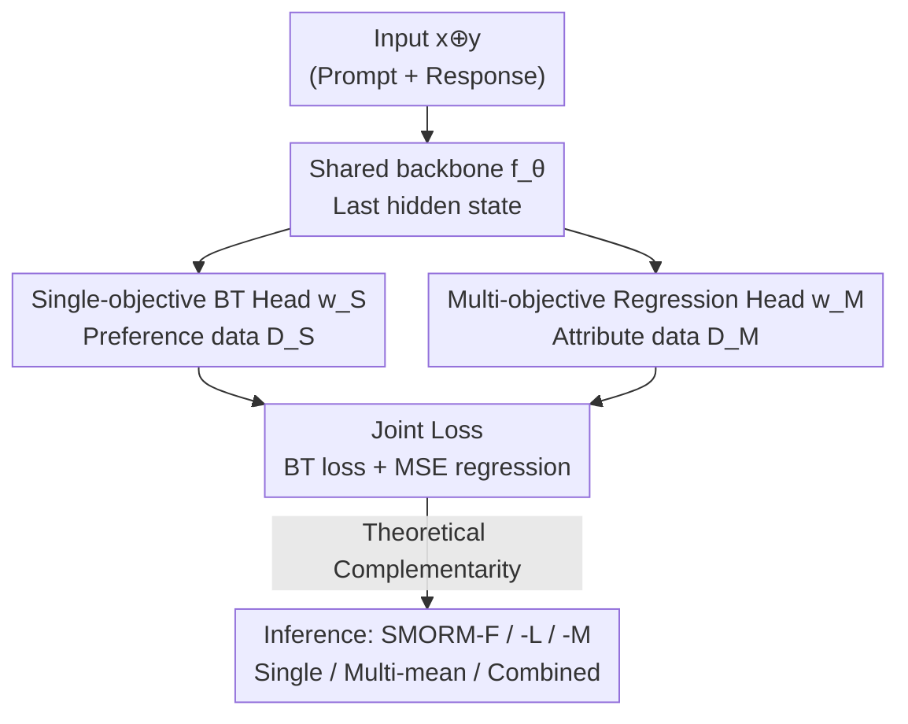

# Bradley–Terry and Multi-Objective Reward Modeling Are Complementary

**Conference**: ICLR 2026  
**OpenReview**: [https://openreview.net/forum?id=3QHKJcwnpb](https://openreview.net/forum?id=3QHKJcwnpb)  
**Area**: RLHF Alignment / Reward Modeling  
**Keywords**: Reward modeling, Bradley-Terry, Multi-objective reward, reward hacking, OOD robustness

## TL;DR
This paper proposes SMORM, which jointly trains a Bradley–Terry (BT) single-objective reward head and a multi-objective regression head on a shared embedding. The authors theoretically prove that the two are complementary: the regression head helps the single-objective head resist reward hacking under OOD conditions, while the BT head "lifts" the weaker multi-objective head. Consequently, a 7B model outperforms a 70B baseline.

## Background & Motivation

**Background**: RLHF decouples reward learning from policy learning. It first trains a proxy reward model using human preference data and then optimizes the policy using algorithms like PPO or BoN. Most current reward models are built on the Bradley–Terry (BT) framework: given a prompt $x$, a chosen response $y_c$, and a rejected response $y_r$, the model minimizes $-\log \sigma(r_\theta(x,y_c) - r_\theta(x,y_r))$ to assign higher scores to preferred responses.

**Limitations of Prior Work**: The greatest risk in RLHF is reward hacking—the policy learns to exploit loopholes in the reward function (e.g., generating repetitive or formulaic content) to achieve high proxy scores without actual improvement. Previous attempts to mitigate reward hacking (reward ensembles, constrained policy optimization, ODIN splitting quality/length, GRM adding text generation regularization) come with costs: ensembles require training multiple models, constrained optimization is sensitive to hyperparameters, ODIN's use of length as a bias is insufficient, and GRM's generation objective competes with the reward objective, leading to training instability. Crucially, these methods are almost exclusively evaluated in **in-distribution (ID)** settings.

**Key Challenge**: This paper finds that once the prompts used for PPO/BoN differ from the reward model's training distribution (**Out-of-Distribution, OOD**), existing SOTA methods fail. The authors hypothesize that BT models trained solely on binary chosen/rejected labels are biased and cannot distinguish fine-grained quality differences, making them vulnerable to exploitation OOD. A natural solution is **Multi-Objective Reward Modeling (MORM)**, which scores multiple attributes (e.g., helpfulness, correctness, verbosity), forcing the policy to improve across all dimensions. However, MORM has a fatal flaw: high-quality multi-attribute data is scarce (expensive for humans, poor quality from LLM-as-a-Judge), often making a standalone MORM **weaker** than a Single-Objective Reward Model (SORM) trained on massive preference data.

**Goal**: To efficiently mitigate reward hacking under OOD conditions using fine-grained attribute scores without introducing additional expensive multi-attribute preference data. Simple ensembles of SORM and MORM face two issues: (1) high overhead from dual independent inferences, and (2) the weaker MORM becoming a bottleneck for the aggregated results.

**Core Idea**: Instead of treating the two models as an independent ensemble, the authors propose joint training of two heads on a **shared backbone**. A single-objective BT head and a multi-objective regression head share the same embedding space, producing both sets of scores in a single forward pass. Furthermore, the authors theoretically prove that these two seemingly different losses **mutually enhance** each other beyond simple additive effects.

## Method

### Overall Architecture

The core of SMORM (Single and Multi-Objective Reward Model) is "one trunk, two heads, joint training." A decoder-only LLM (with its original output linear layer removed) serves as the feature extractor $f_\theta$. The prompt and response are concatenated as $x \oplus y$ and fed into the model, using the last-layer hidden state as a $d$-dimensional feature. Two linear heads are attached to this feature: a single-objective head with weights $w_S \in \mathbb{R}^{d\times 1}$ outputting a scalar score, and a multi-objective head with weights $w_M \in \mathbb{R}^{d\times k}$ outputting a $k$-dimensional attribute score vector. Since they share $f_\theta$, only **one forward pass** is needed to obtain both scores, solving the efficiency problem of ensembles.

During training, two types of data are used: the single-objective head utilizes chosen/rejected preference data $D_S$ (via BT loss), while the multi-objective head utilizes multi-attribute labeled data $D_M$ (via MSE regression loss). The joint loss is optimized for $\theta, w_S, w_M$. The elegance lies in the BT head adjusting sample positions in the embedding space along the preference direction, helping the MORM learn even with limited data; conversely, the MORM refines the embedding to distinguish quality across multiple attributes, enhancing the OOD robustness and generalization of the SORM. Inference supports three strategies: SMORM-F (single-objective head only), SMORM-L (mean of multi-objective attributes), and SMORM-M (average of both heads).

### Key Designs

**1. Dual-head Joint Loss on Shared Embedding: Training BT and Regression in One Pass**

This directly addresses the overhead and "weak bottleneck" issues of ensembles. SMORM trains two heads on a single $f_\theta$ using the following joint loss:

$$\min_{\theta, w_S, w_M} -\mathbb{E}_{D_S}\big[\log\sigma\big(w_S^\top(f_\theta(x_s,y_c)-f_\theta(x_s,y_r))\big)\big] + \mathbb{E}_{D_M}\big\|w_M^\top f_\theta(x_m,y_m)-r\big\|_2^2$$

The first term is the BT preference loss, separating scores along the chosen/rejected direction. The second term is the MSE for multi-attribute regression, approximating the ground truth attribute scores $r \in \mathbb{R}^K$. While this looks like a simple sum, the authors emphasize that joint training is **non-trivial** because the loss forms differ radically (sigmoid of differences vs. squared error of absolute values). A practical detail: training data for the two heads **does not need to be the same prompt-response pairs**; $D_S$ and $D_M$ can come from different sources or domains.

**2. Implicit Multi-Attribute Effect: BT Head "Lifting" the Weaker MORM**

MORM usually performs poorly due to data scarcity. Theorem 1 (Implicit Multi-Attribute Effect) proves that after joint training, the average attribute score $r_m(x,y)=\frac{1}{K}\sum_i w_{M,i}^\top f_\theta(x,y)$ is **lower-bounded** by the single-objective score $r_s$:

$$r_m(x,y) \geq c \cdot r_s(x,y) - \varepsilon$$

Where $c$ and $\varepsilon$ depend on feature bounds $B$ and second moments, assuming a mild positive correlation between multi-attribute scores and single-objective rewards ($1^\top\alpha \geq 0$). This yields two corollaries: (1) if $r_s$ is high, the multi-attribute quality is guaranteed to be at least $c\tau - \varepsilon$, explaining why **SMORM-F performs nearly as well as SMORM-M**; (2) the ranking of $r_s$ is inherited by the MORM's lower bound, allowing a strong SORM to "guide" a data-deficient MORM.

**3. BT–Regression Bridge Theorem: Proving Joint Training Superiority**

To ensure joint training doesn't degrade the SORM, Lemma 1 and Theorem 2 establish a bridge. Lemma 1 shows that pairwise preference prediction error is bounded by the square root of the regression MSE:

$$\mathbb{E}_{D_S}\big|P(y_A\succ y_B)-P^\star(y_A\succ y_B)\big| \leq \tfrac{1}{4}\mathbb{E}_{D_S}\big[\sqrt{2\,\mathrm{MSE}(r_s)}\big]$$

Thus, reducing MSE directly tightens preference prediction error. Theorem 2 proves that the joint architecture results in lower asymptotic MSE for both heads compared to separate training: $\mathrm{MSE}^{\text{SMORM}}_S < \mathrm{MSE}^{\text{single}}_S$ and $\mathrm{MSE}^{\text{SMORM}}_M < \mathrm{MSE}^{\text{multi}}_M$. This is the first theoretical guarantee that a shared BT–regression architecture is strictly better than independent training.

## Key Experimental Results

### Main Results

Reward modeling evaluation (RewardBench / RM-Bench) compared to single and multi-objective baselines:

| Setting | Metric | Ours (SMORM) | Baseline | Gain |
|--------|------|------|----------|------|
| Gemma-2B, UF400k/UltraFeedback, RewardBench Avg | SMORM-F vs Baseline(Single) | 72.8 | 68.2 | +4.6 |
| Gemma-2B, UF40k/HelpSteer2, RewardBench Avg | SMORM-F vs Baseline(Single) | 71.0 | 64.2 | +6.8 |
| Mistral-7B, UF40k/HelpSteer2, RewardBench | SMORM-L vs Baseline(Multi) | 79.9 | 66.0 | +13.9 |
| Mistral-7B, UF40k/HelpSteer2, RM-Bench | SMORM-L vs Baseline(Multi) | 64.4 | 52.0 | +12.4 |

Comparison with large-scale advanced multi-objective reward models (RewardBench Avg):

| Reward Model | $D_M$ Size | Model Size | Avg |
|------|---------|---------|------|
| Nemotron-4-340B-RM | 20K | 340B | 93.7 |
| ArmoRM-Llama3-8B-v0.1 | 585.4K | 8B | 90.4 |
| Llama-3-70B-RM | 20K | 70B | 88.8 |
| SMORM-L 7B (Ours) | 20K | 7B | 89.0 |
| SMORM-L 8B (Ours) | 20K | 8B | 90.4 |

SMORM-L 7B outperforms the 70B baseline with only 20K multi-objective data; the 8B version matches ArmoRM-8B with $15.9\times$ less data.

### Ablation Study

Reward hacking robustness in RLHF (PPO / BoN, checking if gold scores collapse as training/KL increases):

| Configuration | ID Setting Performance | OOD Setting Performance |
|------|---------|------|
| Baseline (Single) | Gold score rises then falls (over-optimization) | Fails due to hacking |
| GRM | Rises fast but eventually drops | Gap with SMORM widens |
| ODIN | Length-only bias; Gold score drops in PPO | Fails to mitigate hacking |
| Baseline SM (Ensemble) | Better than GRM/ODIN, but limited by weak MORM | Weak head is bottleneck |
| SMORM-F / SMORM-M | Gold scores rise stably throughout | Leads significantly OOD; most robust |

### Key Findings
- **Weak MORM is a Bottleneck**: Baseline SM (naive ensemble) performed worse than the single-objective baseline in BoN, confirming that simple concatenation is hindered by the weaker head—a problem SMORM solves via joint training.
- **SMORM-F ≈ SMORM-M**: Inference with only the single-objective head approximates the dual-head performance, empirically validating the implicit multi-attribute lower bound.
- **OOD Amplifies Gains**: The performance gap between SMORM and GRM is much larger in OOD settings, suggesting that ID evaluations mask the robustness issues of existing methods.

## Highlights & Insights
- **From Ensembling to Joint Training**: Instead of two independent models, SMORM uses a single trunk with two heads. This saves inference costs and allows the heads to mutually enhance each other—a case where architecture choice enables complementarity.
- **Theoretical Bridge for BT and Multi-objective Regression**: Lemma 1 bounds BT preference error to MSE, while Theorem 1/2 prove joint training is strictly better. This upgrades "empirically useful" to "theoretically necessary."
- **Transferable Paradigm**: When one has a task A with abundant coarse signals and task B with scarce fine signals, shared representations + joint training can allow the "strong" data of A to lift the "weak" head of B.

## Limitations & Future Work
- The theory relies on the assumption that multi-attribute scores positively correlate with single rewards ($1^\top\alpha\geq 0$). While usually true, this may fail if attributes conflict sharply or if labels are biased.
- Experiments focus on Gemma-2B and Mistral-7B (up to 8B). Performance on larger-scale models or complex pipelines (like GRPO) requires further verification.
- The attribute set depends on existing datasets; the choice and granularity of these dimensions were not deeply ablated.

## Related Work & Insights
- **vs GRM (Generation Regularization)**: GRM adds a text generation objective to RM, but the reward and generation objectives can conflict, and training is sensitive to balance weights. SMORM's multi-objective head is synergistic rather than adversarial.
- **vs ODIN (Quality/Length Split)**: ODIN uses two BT heads for quality and length, but length bias alone is insufficient for hacking. SMORM’s heterogeneous loss (BT + MSE) provides a more rigorous interaction.
- **vs Naive SORM+MORM Ensemble**: Ensembles require double inference and are dragged down by the weaker head; SMORM ensures the BT head "lifts" the MORM while providing single forward pass efficiency.

## Rating
- Novelty: ⭐⭐⭐⭐⭐ First work to theoretically link and prove the complementarity of BT preference modeling and multi-objective regression.
- Experimental Thoroughness: ⭐⭐⭐⭐ Coverage of ID/OOD, PPO/BoN, and multiple backbones, though limited to 8B.
- Writing Quality: ⭐⭐⭐⭐ Progressive motivation and clear alignment between theory and experiments.
- Value: ⭐⭐⭐⭐⭐ Enables a 7B model to beat a 70B baseline and resists OOD reward hacking, highly practical for RLHF.

<!-- RELATED:START -->

## Related Papers

- [\[ICLR 2026\] Robust Reward Modeling via Causal Rubrics](robust_reward_modeling_via_causal_rubrics.md)
- [\[ICLR 2026\] Multi-objective Large Language Model Alignment with Hierarchical Experts](multi-objective_large_language_model_alignment_with_hierarchical_experts.md)
- [\[ICLR 2026\] OrthAlign: Orthogonal Subspace Decomposition for Non-Interfering Multi-Objective Alignment](orthalign_orthogonal_subspace_decomposition_for_non-interfering_multi-objective_.md)
- [\[ICLR 2026\] Omni-Reward: Towards Generalist Omni-Modal Reward Modeling with Free-Form Preferences](omni-reward_towards_generalist_omni-modal_reward_modeling_with_free-form_prefere.md)
- [\[ACL 2026\] AdaJudge: Adaptive Multi-Perspective Judging for Reward Modeling](../../ACL2026/llm_alignment/adajudge_adaptive_multi-perspective_judging_for_reward_modeling.md)

<!-- RELATED:END -->
