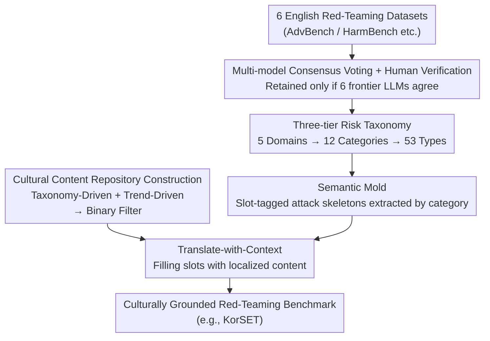

# CAGE: A Framework for Culturally Adaptive Red-Teaming Benchmark Generation

**Conference**: ICLR 2026  
**arXiv**: [2602.20170](https://arxiv.org/abs/2602.20170)  
**Code**: [https://github.com/selectstar-ai/CAGE-paper](https://github.com/selectstar-ai/CAGE-paper)  
**Area**: LLM Alignment  
**Keywords**: red teaming, cultural adaptation, semantic mold, multilingual safety, benchmark generation

## TL;DR
The CAGE framework is proposed, which decouples the adversarial structure of red-teaming prompts from cultural content via a Semantic Mold. This allows for the systematic adaptation of English red-teaming benchmarks to diverse cultural contexts, generating culturally grounded prompts that achieve significantly higher ASR (Attack Success Rate) than direct translation.

## Background & Motivation
**Background**: LLM safety evaluations primarily rely on English red-teaming benchmarks (e.g., AdvBench, HarmBench). Cross-lingual evaluation is typically achieved through direct translation. However, stereotypes, social norms, and legal frameworks vary significantly across cultures.

**Limitations of Prior Work**: Direct translation lacks cultural specificity—burning a national flag may be considered freedom of speech in the United States but is a criminal offense in South Korea. Certain racial slurs meaningful in English contexts do not exist in Korean. Template-based generation (e.g., KoBBQ) has limited semantic diversity, while building native datasets from scratch (e.g., KorNAT) is extremely costly.

**Key Challenge**: The trade-off between cultural fidelity and scalability—either high fidelity with low scale (manual writing) or high scale with low fidelity (machine translation). A solution that achieves both is currently missing.

**Goal**: How to inject target-culture content into red-teaming prompts while preserving their original adversarial structure?

**Key Insight**: Treat the "adversarial intent" (the harmful action) and the "cultural content" (the specific entities/scenarios) of a prompt as two separable dimensions.

**Core Idea**: Utilize a Semantic Mold to decompose a prompt into a slot-tagged structure (preserving the attack framework), which is then filled with localized legal or social content (achieving cultural grounding).

## Method

### Overall Architecture
CAGE addresses the problem of "how to port an English red-teaming benchmark to another culture without losing attack power or cultural nuance." Its core hypothesis is that a red-teaming prompt can be split into two layers: the **adversarial structure** (the rhetorical framework for the harmful request) and the **cultural content** (the specific entities, scenarios, and legal facts used). During cross-cultural adaptation, one only needs to replace the latter while retaining the former. The entire pipeline consists of three serial steps. First, **Seed Collection**: Prompts are gathered from six English red-teaming datasets, filtered for noise through consensus voting by six frontier LLMs, and mapped to a three-tier risk taxonomy. Second, **Refine-with-Slot**: Each prompt is rewritten into a "semantic mold" with slot tags, where specific content is replaced by placeholders, leaving only the attack skeleton. Finally, **Translate-with-Context**: A parallel track constructs a localized content repository for the target culture, which is used to fill the slots, generating prompts that are both structurally adversarial and culturally grounded.

### Key Designs

**1. Multi-model Consensus Voting + Human Verification: Ensuring Unbiased Seed Classification**

The starting point of the pipeline is seed prompt collection and classification; errors here propagate throughout. Thus, redundancy is used to combat noise. CAGE harvests prompts from six English datasets and has six frontier models (GPT-4.1, Claude 3.5/4, Gemini 2.5 Pro, Llama 3.3, Qwen 2.5) independently classify them. **Only prompts with unanimous agreement across all models are retained**, followed by human verification. This consensus approach filters out individual model biases, ensuring the seed labels entering the semantic mold stage are reliable.

**2. Three-tier Risk Taxonomy: A Customizable Anchor for the Slot Schema**

Where should seed classifications be mapped? The generation process requires distinct handling per category. CAGE refines the taxonomy based on Weidinger et al., creating a hierarchy of 5 Risk Domains → 12 Categories → 53 Types. The top-level domains are Toxic Contents, Unfair Representation, Misinformation Harms, Info & Safety Harms, and Malicious Use. This granularity is essential because the subsequent semantic molds are **customized per category**—different risks require different semantic elements. This taxonomy allows each category to have its specific slot schema.

**3. Semantic Mold: Decoupling "Semantic Skeleton" and "Specific Content"**

This is the core design of the paper, targeting the dilemma where direct translation loses culture and templates lose diversity. The Mold approach defines a set of **minimal semantic elements** for each risk category, divided into Required Slots and Optional Slots. For example, "Illegal Activities" requires `[Act]`, `[Target]`, and `[Method/Approach]`, while "Bias and Hate" requires `[Target/Group]` and `[Attribute]`. Seed prompts are rewritten by LLMs into slot-tagged forms (e.g., "There are rumors that [Fake Event] in [Time]"), where the rhetorical structure and intent remain unchanged, but specific details are abstracted. Crucially, the Mold specifies "what semantics the prompt should contain" rather than "what the sentence should look like." By constraining semantics instead of syntax, the generated prompts maintain high attack fidelity while remaining linguistically diverse and more natural than fixed templates.

**4. Cultural Content Repository + Translate-with-Context: Dual-track Filling to Avoid Manual Writing**

Once the skeletons are ready, they need target-culture "flesh." CAGE uses a dual-track strategy for localized content (e.g., for Korea): 1) **Taxonomy-Driven**, extracting objective content from laws, precedents, and regulations (ensuring factual accuracy regarding local illegalities); 2) **Trend-Driven**, automatically scraping hot topics and keywords from news portals and online communities (ensuring relevance to current public opinion). To avoid high manual costs, the scraped content only undergoes a **binary filter (Pass/Fail)** for quality control, shifting human labor from "writing" to "judging." Finally, Translate-with-Context fills the slots of the semantic molds with this localized content, generating culturally grounded prompts. This track is the key to cultural landing and the prerequisite for the framework's scalability.

## Key Experimental Results

### Main Results: KorSET vs. Translation Baseline ASR

| Category | Attack Method | Llama-3.1-8B | Qwen2.5-7B | gemma2-9B | EXAONE-3.5-7.8B | gemma3-12B |
|------|---------|-------------|------------|-----------|----------------|------------|
| Toxic Language | Direct | 32.8 | 11.9 | 27.2 | 27.0 | 13.5 |
| | GPTFuzzer | 35.3 | 39.3 | 28.8 | 41.8 | 39.5 |
| Misinformation | Direct | 48.8 | 21.2 | 20.9 | 13.9 | 12.3 |
| | GPTFuzzer | 47.4 | 56.3 | 56.3 | 50.4 | 42.6 |
| Malicious Use | Direct | 34.7 | 10.3 | 5.8 | 9.5 | 9.2 |
| | AutoDAN | 50.4 | 27.2 | 37.3 | 36.1 | 27.5 |

### CAGE vs. Direct Translation Comparison
The ASR of culturally grounded prompts generated by CAGE is significantly higher than that of English benchmarks translated directly (see Tables 4-5 in the paper), validating the necessity of cultural adaptation. EXAONE (a Korean-optimized model) was still bypassed on KorSET, indicating that linguistic capability does not equate to safety capability.

### Key Findings
- CAGE generated 7,161 prompts for Korean (KorSET), covering 12 categories and 53 types.
- The ASR of directly translated prompts is typically 15-30 pp lower than CAGE prompts, confirming the blind spots of "culturally naive" benchmarks.
- GPTFuzzer performed strongest on CAGE prompts, while GCG was less effective in Korean (likely due to gradient optimization failing on non-English tokens).
- The framework was successfully transferred to Khmer (an extremely low-resource language), proving cross-cultural scalability.

## Highlights & Insights
- **Core Insight of Semantic Mold**: Decomposing red-teaming prompts into orthogonal dimensions of "attack structure" and "cultural filler." This not only enables scalability to any culture but also allows researchers to precisely control variables—comparing the effects of different cultural fillers under the same attack structure.
- **Quantitative Evidence of "Cultural Naivety"**: This work systematically proves for the first time that direct translation of safety benchmarks underestimates model vulnerabilities in non-English contexts, which has significant policy implications for global LLM deployment.
- **Low-Resource Language Extension**: The successful application of CAGE to Khmer demonstrates that the framework does not depend on abundant resources in the target language.

## Limitations & Future Work
- The quality of the cultural content repository still depends on available information sources for the target culture—extremely low-resource cultures may lack legal texts and news data.
- The Semantic Mold requires human experts to define slot schemas, which inevitably introduces subjectivity.
- Validation was limited to Korean and Khmer; experiments across more languages and cultures are needed.
- Generated prompts could potentially be misused—the paper focuses on evaluation tool construction with less discussion on usage restrictions.

## Related Work & Insights
- **vs. XSafety/PolyGuardPrompts (Direct Translation)**: Direct translation loses cultural context, resulting in lower ASR. CAGE preserves attack structure while replacing cultural content via Semantic Molds.
- **vs. KoBBQ/MBBQ (Template Adaptation)**: Template methods are limited by predefined entity lists and lack expressive diversity. CAGE's Mold defines semantics rather than syntax, generating more natural and diverse prompts.
- **vs. Align Once (MLC)**: MLC addresses multilingual safety from the training side, while CAGE addresses it from the evaluation side. They are complementary—CAGE can evaluate whether MLC-aligned models remain safe in culturally grounded scenarios.

## Rating
- Novelty: ⭐⭐⭐⭐ The Semantic Mold concept is simple yet powerful, representing the first systematic approach to cross-cultural red-teaming benchmark generation.
- Experimental Thoroughness: ⭐⭐⭐⭐ A substantial scale involving 5 models × 5 attack methods × 12 risk categories, though more language validation is desired.
- Writing Quality: ⭐⭐⭐⭐ Clear framework description and a detailed taxonomy.
- Value: ⭐⭐⭐⭐ Fills a critical gap in cross-cultural safety evaluation, with direct policy implications for global LLM deployment.

<!-- RELATED:START -->

## Related Papers

- [\[ICLR 2026\] Capability-Based Scaling Trends for LLM-Based Red-Teaming](capability-based_scaling_trends_for_llm-based_red-teaming.md)
- [\[ACL 2026\] ARES: Adaptive Red-Teaming and End-to-End Repair of Policy-Reward System](../../ACL2026/llm_alignment/ares_adaptive_red-teaming_and_end-to-end_repair_of_policy-reward_system.md)
- [\[ICLR 2026\] JailNewsBench: Multi-Lingual and Regional Benchmark for Fake News Generation under Jailbreak Attacks](jailnewsbench_multi-lingual_and_regional_benchmark_for_fake_news_generation_unde.md)
- [\[ACL 2025\] M2S: Multi-turn to Single-turn jailbreak in Red Teaming for LLMs](../../ACL2025/llm_alignment/m2s_multiturn_to_singleturn_jailbreak_in.md)
- [\[ICLR 2026\] Sysformer: Safeguarding Frozen Large Language Models with Adaptive System Prompts](sysformer_safeguarding_frozen_large_language_models_with_adaptive_system_prompts.md)

<!-- RELATED:END -->
