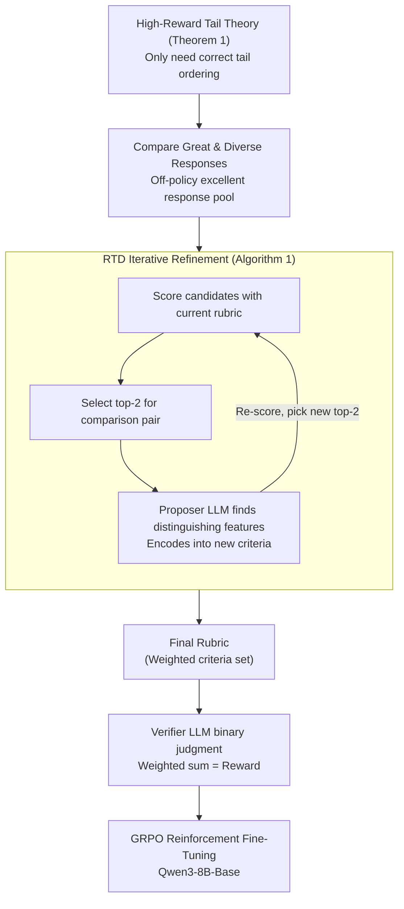

# Chasing the Tail: Effective Rubric-based Reward Modeling for Large Language Model Post-Training

**Conference**: ICLR 2026  
**arXiv**: [2509.21500](https://arxiv.org/abs/2509.21500)  
**Code**: [https://github.com/Jun-Kai-Zhang/rubrics](https://github.com/Jun-Kai-Zhang/rubrics)  
**Area**: Alignment RLHF  
**Keywords**: reward over-optimization, rubric-based reward, reinforcement fine-tuning, high-reward tail, off-policy data

## TL;DR
The authors theoretically prove that reward over-optimization primarily stems from reward model misspecification in the high-reward tail regions. They propose a rubric-based reward modeling method: utilizing off-policy data (excellent responses generated by strong models) to construct scoring rubrics and refining them through progressive "great vs. greater" differentiation to effectively mitigate over-optimization.

## Background & Motivation

**Background**: Reinforcement Fine-Tuning (RFT) is a core paradigm for LLM post-training, where a reward model guides policy optimization. However, in practice, reward models are inevitably approximate proxies of the true reward, leading to reward over-optimization—where the policy learns to exploit proxy reward loopholes to achieve high scores while actual quality remains low.

**Limitations of Prior Work**: (a) Bradley-Terry (BT) preference reward models are easily hacked in high-reward regions; (b) Online RLHF can mitigate this but requires continuous human feedback, which is costly and slow; (c) Existing RLRR (rubric-based reward) methods are more interpretable, but how to construct rubrics specifically to solve over-optimization remains unclear.

**Key Challenge**: Accurately modeling the high-reward tail requires high-quality samples—but these are extremely rare under the distribution of the base LLM. While off-policy data (from stronger models) provides high-quality samples, directly training reward models on it often leads to learning surface features of the off-policy data rather than true quality.

**Goal**: (a) Theoretically: What is the root cause of reward over-optimization? (b) Practically: How to construct rubrics that are precise in the high-reward tail?

**Key Insight**: Starting from theoretical analysis, the authors prove that in Pareto-optimal post-training, the utility-KL trade-off is entirely determined by the accuracy of the proxy reward in high-reward regions (where exponential weights amplify errors). They derive that as long as the ordering in the high-reward region is correct (even if the rest is entirely wrong), performance remains near-optimal.

**Core Idea**: Rubric construction should focus on differentiating "great vs. greater" responses rather than "good vs. bad"—because the root of over-optimization lies in misspecification at the high-reward tail.

## Method

### Overall Architecture
This paper seeks to answer two questions: where reward over-optimization originates and how to construct a reward that cannot be hacked. It first uses Theorem 1 to precisely locate the root cause in the "high-reward tail"—proving that as long as the reward model correctly ranks the small fraction of top-scoring responses, overall performance is near-optimal; conversely, if the tail ranking is wrong, training will inevitably collapse in later stages. This directly defines the goal: do not waste effort distinguishing "good vs. bad," but specifically clarify "great vs. greater." Based on this, a rubric construction workflow using off-policy excellent responses is designed. The core is a step called **RTD (Refinement-through-Differentiation)**—where a proposer LLM compares two high-scoring responses, identifies distinguishing features, and encodes them into new scoring criteria. This step is placed into the iterative loop of Algorithm 1, where the current rubric is used to re-score, and the new top-2 are selected for further refinement. The final rubric is a set of weighted criteria given to a verifier LLM for binary scoring, which are then weighted and summed as the reward for GRPO reinforcement fine-tuning.

### Key Designs

**1. High-Reward Tail Theory: Pinpointing the root of over-optimization to the tail**

The reward model is ultimately a biased proxy $r$ of the true reward $r^*$; the question is "where is the bias most fatal." The authors formalize this bias as a misspecification mapping $f: r^* \to r$ and derive that under Pareto-optimal post-training, the expected true reward obtained by the policy is:

$$\frac{\int_0^1 f^{-1}(u)\, e^{u/\beta}\, \mathrm{d}u}{\beta\,(e^{1/\beta}-1)}$$

The key lies in the exponential weight $e^{u/\beta}$: as $u \to 1$ (high-reward region), it amplifies exponentially, meaning tail ranking errors are multiplied in the final performance, while errors in low-reward regions are almost negligible. Furthermore, the KL divergence is invariant to $f$—regardless of reward errors, the "deviation budget" from the reference policy is the same. Thus, under the same KL, spending the budget on incorrect tail rankings causes win rates to collapse. This formula also explains why over-optimization typically appears in late-stage training: as $\beta$ decreases (the policy is pushed further into the high-score zone), the exponential term amplifies tail errors more severely. The conclusion is actionable—when constructing a rubric, one only needs to ensure the high-reward region is ranked correctly; the rest can be wrong. Every subsequent design goal is focused on one phrase: chasing the tail.

**2. RTD Iterative Refinement: Sharpening standards toward the tail through few comparisons**

Theory suggests "correct tail ranking is enough," but how to make the rubric truly accurate at the tail? The challenge is that a rubric is a double-edged sword—it only concerns quality-related dimensions, which suppresses off-policy surface features but also makes it prone to judging two excellent responses as a tie, losing discriminative power at the tail. RTD (Refinement-through-Differentiation) breaks these ties: a pair of candidate responses and the current rubric are fed to a proposer LLM, which analyzes "why exactly this one is better than that one" and encodes the identified features into a new criterion or refined existing one. Since a single RTD sharpens only one dimension, Algorithm 1 wraps it in an iterative loop—starting from all off-policy responses for a prompt, each round scores candidates with the current rubric, picks the top-2 for one RTD step, and re-scores with the updated rubric to find the next top-2. Because the rankings evolve with the rubric, the responses selected for comparison keep changing, focusing the rubric's "discovery power" continuously on the performance frontier, precisely addressing the weakness identified by Theorem 1.

**3. Feeding "Great and Diverse" Responses: Tailoring refinement without over-fitting style**

The quality of the RTD cycle depends on the input responses—governed by two principles. Principle 1 requires comparison pairs to be "great vs. greater" rather than "good vs. bad." Comparing responses with obvious quality gaps only teaches the rubric to punish basic errors, which is useless for the tail. Only when two responses are already excellent is the proposer forced to identify subtle yet decisive dimensions (in experiments, "great pairs" from Gemini 2.5 Pro produced standards like "breaking down complex criteria" or "enhancing verification," which were far more advanced than those from "good pairs"). Principle 2 requires these responses to be diverse: if the proposer only looks at homogeneous responses, the rubric becomes too narrow and overfits a specific style. By expanding the candidate pool to 16 responses sampled from various strong models, the rubric covers broader quality dimensions. Together, these principles leverage the rubric's compatibility with off-policy data—it characterizes "what features a response should have," making it insensitive to "who generated it" and avoiding the style-bias traps of BT preference models.

### Loss & Training
The final rubric reward is a weighted binary average of the criteria:

$$r(x,y) = \frac{\sum_i w_i\, V(x,y,c_i)}{\sum_i w_i}$$

Where $V$ is the binary judgment (satisfied/not satisfied) by the verifier LLM (GPT-4.1-mini in experiments) for the $i$-th criterion $c_i$, and $w_i$ is the weight. The authors intentionally use a simple weighted average to isolate the impact of the rubric quality itself (non-linear aggregation is left for future work). The RL phase follows the standard GRPO framework, replacing the traditional preference reward with the rubric reward above. The base policy model is Qwen3-8B-Base. Rubrics are generated and iteratively refined by GPT-4.1 as the proposer, and off-policy excellent responses come from stronger external models (e.g., Gemini 2.5 Pro) and samples from diverse high-performing models.

## Key Experimental Results

### Main Results

Win rates against Qwen3-8B across three domains (Generalist, Health, Finance) using Qwen3-8B-Base (higher is better):

| Method | Generalist Filtered / LMArena Win% | Health Medical-o1 Win% | Finance Win% |
|------|----------------------------------------|----------------------------|------------------|
| Base Policy | 5.2 / 4.1 | 10.8 | 5.8 |
| SFT | 35.9 / 29.6 | 25.8 | 26.0 |
| Initial Rubric (Prompt only) | 31.3 / 29.7 | 21.7 | 37.2 |
| 1 good pair refinement | 33.5 / 32.8 | 22.4 | 39.1 |
| 1 great pair refinement | 36.8 / 33.1 | 26.5 | 42.2 |
| 4 great pairs refinement | 38.7 / 34.7 | 31.4 | 48.9 |
| **4 great & diverse pairs** | **39.7 / 35.1** | **34.4** | **49.6** |

Two clear trends: comparing great pairs is superior to comparing good pairs (validating Principle 1), and iterative refinement with diverse great pairs further improves performance (validating Principle 2).

### Ablation Study

| Configuration | Key Finding |
|------|---------|
| Compare good vs good | Often produces basic corrections (punishing obvious errors, loosening strict standards) |
| Compare great vs great | Produces refined corrections (decomposing complex criteria, enhancing verification) |
| Top 10% High-reward Correct | Win rate stays close to the optimal curve |
| Top 10% High-reward Incorrect | Win rate collapses after moderate KL (over-optimization) |

### Key Findings
- **Theoretical Validation**: Having only the top 10% high-reward region ranked correctly is sufficient for near-optimal performance; having only that region ranked incorrectly causes over-optimization collapse.
- **Refinement Types from Great Responses**: Frequent refinements include "enhancing verification standards" and "breaking down into finer sub-criteria," which increase discriminative power in the high-reward tail.
- **Rubric vs BT Reward Model**: With moderate-sized off-policy data (5,000 samples), BT reward models fail to guide RL effectively, whereas the rubric method extracts generalizable principles.
- **Interpretability of Rubrics**: Each criterion corresponds to a clear quality dimension, and the refinement process is traceable.

## Highlights & Insights
- **Theoretical Insight of "Chase the tail"**: The simplified formula for Theorem 1 reveals why reward over-optimization always emerges in late training—as KL increases ($\beta$ decreases), the exponential amplification of the high-reward region becomes stronger. This provides a clear optimization direction for reward modeling research.
- **Rubric's natural fit for off-policy data**: Rubrics define "what features are required," making them insensitive to response origin (contrast this with BT models learning stylistic biases). This solves the chicken-and-egg problem of needing high-quality samples that can only be obtained from stronger models.
- **Progressive focus of iterative refinement**: By screening top candidates and re-refining each round, the rubric naturally focuses on the tail without requiring manual definitions of "the high-reward region."

## Limitations & Future Work
- **Rubric Score Aggregation**: Currently uses simple weighted averaging, which the authors admit is non-optimal as criteria may have non-linear dependencies.
- **Verifier Quality Dependency**: The verifier LLM's binary judgments may be biased, especially in edge cases.
- **Scale of Validation**: While evaluated across Generalist/Health/Finance domains, all experiments used Qwen3-8B-Base; performance on larger models or with different RL algorithms (e.g., DPO/KTO) remains to be confirmed.
- **Proposer LLM Ceiling**: The quality of rubric refinement is limited by the proposer's own discriminative capabilities.

## Related Work & Insights
- **vs Gao et al. 2023 (Reward Over-optimization Scaling Laws)**: That work focuses on global statistics for over-optimization; this paper is more actionable by pinpointing it to the high-reward region.
- **vs Rubrics as Rewards (Gunjal et al.)**: That paper introduced RLRR but didn't explain why it helps; this paper provides the theoretical explanation—rubrics are more precise in the high-reward tail.
- **vs Generative Reward Models (RM-R1)**: GRM generates rubrics dynamically at inference, which is computationally expensive; the pre-constructed rubrics here are better suited for large-scale training.

## Rating
- Novelty: ⭐⭐⭐⭐⭐ Theoretical analysis precisely identifies the tail as the root of over-optimization; the rubric refinement workflow is elegant.
- Experimental Thoroughness: ⭐⭐⭐⭐ Theoretical verification is strong, but RL experiments are limited to two domains with relatively small model sizes.
- Writing Quality: ⭐⭐⭐⭐⭐ Rigorous theoretical derivation with a cohesive storyline from theory to method to experiments.
- Value: ⭐⭐⭐⭐⭐ Extremely valuable to the RLHF/RFT community—a perfect blend of theory and practical workflow.

<!-- RELATED:START -->

## Related Papers

- [\[ICLR 2026\] Spectrum Tuning: Post-Training for Distributional Coverage and In-Context Steerability](spectrum_tuning_post-training_for_distributional_coverage_and_in-context_steerab.md)
- [\[NeurIPS 2025\] GVPO: Group Variance Policy Optimization for Large Language Model Post-Training](../../NeurIPS2025/llm_alignment/gvpo_group_variance_policy_optimization_for_large_language_model_post-training.md)
- [\[ICLR 2026\] Towards Understanding Valuable Preference Data for Large Language Model Alignment](towards_understanding_valuable_preference_data_for_large_language_model_alignmen.md)
- [\[ICLR 2026\] Fluent Alignment with Disfluent Judges: Post-training for Lower-Resource Languages](fluent_alignment_with_disfluent_judges_post-training_for_lower-resource_language.md)
- [\[ICLR 2026\] Multi-objective Large Language Model Alignment with Hierarchical Experts](multi-objective_large_language_model_alignment_with_hierarchical_experts.md)

<!-- RELATED:END -->
