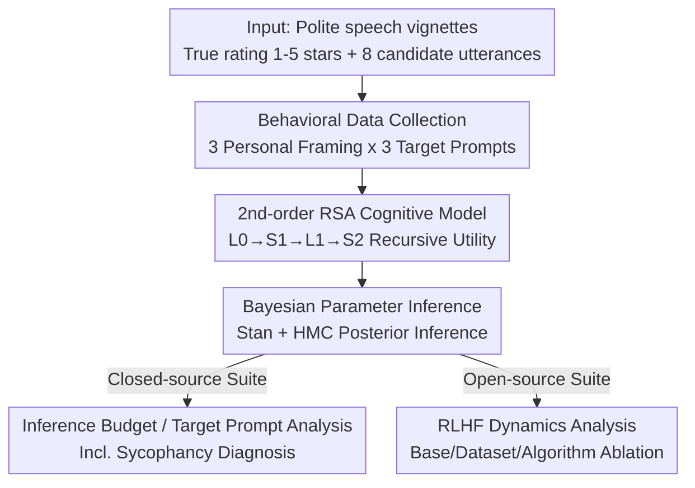

# Cognitive models can reveal interpretable value trade-offs in language models

**Conference**: ICLR2026  
**OpenReview**: [https://openreview.net/forum?id=nM2QhvybwI](https://openreview.net/forum?id=nM2QhvybwI)  
**Code**: https://github.com/skmur/many-wolves  
**Area**: Alignment RLHF / Interpretability  
**Keywords**: Cognitive Models, RSA, Value Trade-offs, RLHF, Interpretability, Sycophancy

## TL;DR
This paper employs the Rational Speech Act (RSA) cognitive model of "polite speech" as a probe to fit weights for three utilities (informational, social, and presentational) in a truth-versus-face-saving dilemma task. It translates "invisible low-level decisions" such as inference budget, system prompts, and RLHF training dynamics into a set of interpretable parameters representing value trade-offs.

## Background & Motivation
**Background**: Current value alignment paradigms mostly push models toward **single attributes** like "helpfulness" or "truthfulness," measuring alignment via scalar rewards. Interpretability tools (probes, SAEs, circuit analysis) primarily examine internal representations, making it difficult to directly address how a model weights multiple conflicting values.

**Limitations of Prior Work**: Human communication is essentially a **multi-objective trade-off**—e.g., telling a friend a cake is bad requires balancing "honesty" with "kindness." Existing alignment benchmarks flatten values into a single dimension, failing to show whether a model leans toward informational or social utility, or how these preferences correlate with specific training decisions (base model, feedback datasets, alignment algorithms, inference budget). Sycophancy is a typical manifestation of unbalanced trade-offs, yet it lacks formal characterization tools.

**Key Challenge**: Values are **dynamic, multi-faceted, and conflicting**, whereas mainstream evaluations are **static, one-dimensional, and scalar**. Diagnosing how alignment shifts a model's value preferences requires a "ground truth" model capable of decomposing behavior into multiple interpretable utility components.

**Goal**: To find a theoretically grounded and parameter-interpretable framework to decompose LLM behavior in value-conflict scenarios into utility weights, and use it to probe (a) inference budgets and prompt manipulation in closed-source frontier models, and (b) post-training RLHF dynamics in open-source models.

**Key Insight**: Cognitive science has long formalized human pragmatic communication using recursive probabilistic generative models like RSA—where a pragmatic speaker makes trade-offs between "informativeness," "social value," and "self-presentation." The authors view RLHF as a form of Inverse Reinforcement Learning (IRL): inferring latent objectives from human behavior. Thus, cognitive models fitted to human polite speech can serve as "reverse engineering" benchmarks for LLMs.

**Core Idea**: Use an RSA cognitive model **designed to explain human polite speech** as a probe to fit three utility weights $\omega_{inf}, \omega_{soc}, \omega_{pre}$ and a projection mixture parameter $\phi$ to the LLM's response distribution, mapping low-level training decisions to interpretable value trade-offs.

## Method

### Overall Architecture
The method adopts a generative model from cognitive science as a "behavioral decoder" for LLMs. The pipeline consists of three steps: first, collecting LLM responses from 8 candidate utterances across various **socially sensitive vignettes** (e.g., "a friend asks if the cake they baked is good"); second, fitting the second-order pragmatic speaker RSA model by Yoon et al. (2020) to these response frequencies to infer utility weights via Bayesian inference; third, analyzing these parameters across model suites—observing how inference budgets and prompts shift weights in closed-source models, and how values drift during RLHF in open-source models. The key is that **the parameters themselves are interpretable**: $\phi$ near 1 indicates a desire to project informational priority, while near 0 indicates social priority; the $\omega$ triplet represents the actual mixture of informational, social, and presentational utilities.

### Key Designs

**1. Second-order Pragmatic Speaker RSA: Decomposing "What to Say" into Competing Utilities**

To diagnose value trade-offs, a mathematical model of "weighting" is required. The core is a second-order pragmatic speaker $S_2$, where the probability of choosing utterance $u$ is proportional to the softmax of a total utility: $P_{S_2}(u|s,\omega)\propto\exp(\alpha U_{total})$, where $\alpha$ is optimality temperature. Total utility is decomposed into three components via weights $\omega$: $U_{total}=\omega_{inf}\cdot U_{inf}+\omega_{soc}\cdot U_{soc}+\omega_{pre}\cdot U_{pre}$. **Informational utility** $U_{inf}=\log P_{L1}(s|u)$ measures how well a pragmatic listener $L_1$ recovers the true state $s$ from $u$; **Social utility** $U_{soc}=\mathbb{E}_{P_{L1}(s|u)}[V(s)]$ measures the expected social value to the listener (where $V$ is mapped to star ratings); **Presentational utility** $U_{pre}=\log P_{L1}(\phi|u)$ measures how accurately the speaker's intended information-social trade-off $\phi$ is conveyed. These utilities are nested in a $L_0\to S_1\to L_1\to S_2$ recursion—where $S_1$ balances only information and social value, and $S_2$ adds the layer of "how I want to be perceived." This hierarchy allows "sycophancy" to be characterized by fine-grained parameters rather than just simple observation.

**2. Polite Speech Task and Multi-perspective Framing: Replicating Human Dilemmas for LLMs**

The authors reuse vignettes from Yoon et al. (2020) where a speaker has a true evaluation $s\in\{1,\dots,5\}$ of a listener's work and must choose from 8 utterances (4 descriptors and their negations). Order is shuffled to eliminate bias. **Polite speech was chosen** because it naturally pits "conveying useful information" against "making the listener feel good"—a core tension in alignment—and is more reflective of real LLM use cases than classic reference games. Perspectives include 1st/2nd/3rd person frames to simulate LLM-as-agent/assistant/judge. Closed-source models also receive **target prompts**—requesting purely informative, purely social, or balanced responses—to observe weight sensitivity.

**3. Literal Semantic Sub-task + Bayesian Inference: Decoding Posteriors from Responses**

To infer $\Theta=\{\phi,\alpha,\omega_{inf},\omega_{soc},\omega_{pre}\}$ from LLM frequencies $M$, the literal truth probability $\theta$ of each utterance $u$ for state $s$ is needed. A **literal semantic sub-task** asks the model "Does the speaker think the cake is [utterance]? Yes/No" to estimate $\theta$. Posterior inference $P(\Theta|M)\propto\prod_{i}\prod_{j}P_{S_2}(u_i|s_j;\Theta)^{M_{i,j}}$ is performed using the Stan probabilistic programming language with HMC (NUTS). This provides a set of utility weights with uncertainty (95% HDI) for each configuration. Posterior predictive checks confirmed generalization to held-out sets, with a parameter MSE (0.03) significantly lower than random sampling from priors (0.06, $z=-12.49, p<0.001$).

### Loss & Training
The method does not involve training new models but fits cognitive model parameters (HMC sampling). For open-source models, the training follows: starting from an instruct model, 1 epoch of SFT on chosen responses, followed by DPO or PPO (OpenRLHF implementation, PPO using ArmoRM). Utility weights are fitted at checkpoints to track value drift.

## Key Experimental Results

### Main Results
The closed-source suite covers Anthropic, Google, and OpenAI models across three inference budgets (none/low/medium). The open-source suite uses 2 base models (Qwen2.5-Instruct, Llama-3.1-Instruct) $\times$ 2 feedback datasets (UltraFeedback, HH-RLHF) $\times$ 2 algorithms (DPO, PPO).

| Subject | Manipulation | Main Findings |
| :--- | :--- | :--- |
| Closed-source Inference Budget | none → low/medium | Projection mixture $\phi$ increases significantly (more informative); $\beta_{low}=0.228, \beta_{medium}=0.211, p<0.001$. No significant difference between low/medium. |
| Closed-source Target Prompts | informative / social / both | Models shift weights consistently: informative increases $\omega_{inf}$ and $\phi$; social increases $\omega_{pre}$ and decreases $\omega_{inf}, \phi$. Models are **more sensitive to prompts than humans**. |
| Closed-source Sycophancy | social prompt | Sycophancy signature: low $\phi$ + high $\omega_{pre}$ + low $\omega_{inf}/\omega_{soc}$. Change is sharpest at none→low budget transition. |
| Open-source RLHF Dynamics | across checkpoints | Largest value drift occurs in the **first 1/4** of training. Base model and pre-training data impact outweighs feedback datasets/algorithms. |

### Ablation Study

| Factor | Key Phenomenon | Explanation |
| :--- | :--- | :--- |
| Base Model | Qwen-instruct consistently higher $\omega_{inf}$ and lower $\omega_{pre}$ than Llama. | Consistent with Qwen's stronger priors in math/reasoning tasks. |
| Feedback Dataset | UltraFeedback converges to higher $\omega_{inf}$; HH-RLHF higher $\omega_{soc}$. | Aligns with dataset attributes (Instruction following/Truthfulness vs Harmlessness). |
| Alignment Algorithm | PPO pulls $\phi$ to ~0.7 across configs; DPO shows $\phi \approx 1$ for Qwen. | Differences are relatively small, potentially due to short (1 epoch) training. |
| Speaker Optimality $\alpha$ | All three major models $\alpha > 1$ (Anthropic 3.52 / Gemini 6.19 / OpenAI 4.78). | Indicates utility weights indeed drive selection decisions. |

### Key Findings
- **Inference Budget as an Amplifier**: Even small budgets push models toward informational utility. Sycophancy signatures change most sharply at the none→low transition, suggesting reasoning traces reinforce behavioral attributes in system prompts.
- **Base Model Sets the Tone**: Value drift happens early; feedback datasets shift the trajectory defined by the base model but do not cause convergence across different bases.
- **Informational Utility is the Most Stable**: The relative patterns of $\omega_{inf}$ under various targets most closely mirror human signatures, whereas $\omega_{pre}/\omega_{soc}$ do not, suggesting models represent "informativeness" more consistently.

## Highlights & Insights
- **Cognitive Models as Interpretability Probes**: Unlike SAEs that look at internal activations, this work uses a theoretically grounded generative model to "read" behavioral distributions, providing an orthogonal, behavioral interpretability method.
- **Formalizing Sycophancy via Parameters**: Defining sycophancy as "low $\phi$ + high $\omega_{pre}$ + low $\omega_{inf}/\omega_{soc}$" provides a measurable and actionable formalization for a previously vague high-level concept.
- **IRL Linking Cognitive Science and RLHF**: Aligning RSA fitting (inferring goals from behavior) with RLHF (inferring rewards from feedback) under an IRL framework allows this pipeline to be applied to any behavior that can be modeled with low-dimensional interpretable utilities.

## Limitations & Future Work
- **Domain Specificity**: RSA politeness models are tailored for specific domains and do not easily generalize to open-ended natural language.
- **Inference Stability**: Second-order $S_2$ models have many parameters; sampling-based inference may not be stable or unbiased under limited compute.
- **Machine-specific Values**: The utilities used (information/social/presentational) are human-validated but may not be the optimal set to describe LLM behaviors.
- **PPO vs DPO Underestimation**: Short training durations and overlap in reward model data may have masked the full differences between alignment algorithms.

## Related Work & Insights
- **vs. Traditional Alignment Benchmarks**: Instead of a single scalar score, this method decomposes behavior into interpretable weights.
- **vs. Internal Interpretability**: While others look at representations, this method infers objectives from **behavioral distributions**, providing a functional explanation of value trade-offs.
- **vs. Original RSA Politeness**: This work flips the model's use from explaining humans to decoding LLMs, extending it with personal framing and target prompts to detect RLHF dynamics.

## Rating
- Novelty: ⭐⭐⭐⭐⭐ Uses RSA models as interpretable probes for LLM value trade-offs; theoretically robust.
- Experimental Thoroughness: ⭐⭐⭐⭐ Wide coverage across closed/open-source models and training dynamics; however, limited by domain and training epochs.
- Writing Quality: ⭐⭐⭐⭐ Clear formulas and diagrams; effectively explains cross-disciplinary concepts.
- Value: ⭐⭐⭐⭐⭐ Provides a formal, interpretable tool for alignment diagnosis and sycophancy measurement.

<!-- RELATED:START -->

## Related Papers

- [\[ICLR 2026\] Group-Normalized Implicit Value Optimization for Language Models](group-normalized_implicit_value_optimization_for_language_models.md)
- [\[ICLR 2026\] Reward Models Inherit Value Biases from Pretraining](reward_models_inherit_value_biases_from_pretraining.md)
- [\[ACL 2025\] Internal Value Alignment in Large Language Models through Controlled Value Vector Activation](../../ACL2025/llm_alignment/internal_value_alignment_in_large_language_models_through_controlled_value_vecto.md)
- [\[ICML 2026\] VALUEFLOW: Toward Pluralistic and Steerable Value-based Alignment in Large Language Models](../../ICML2026/llm_alignment/valueflow_toward_pluralistic_and_steerable_value-based_alignment_in_large_langua.md)
- [\[ACL 2026\] MAESTRO: Meta-learning Adaptive Estimation of Scalarization Trade-offs for Reward Optimization](../../ACL2026/llm_alignment/maestro_meta-learning_adaptive_estimation_of_scalarization_trade-offs_for_reward.md)

<!-- RELATED:END -->
