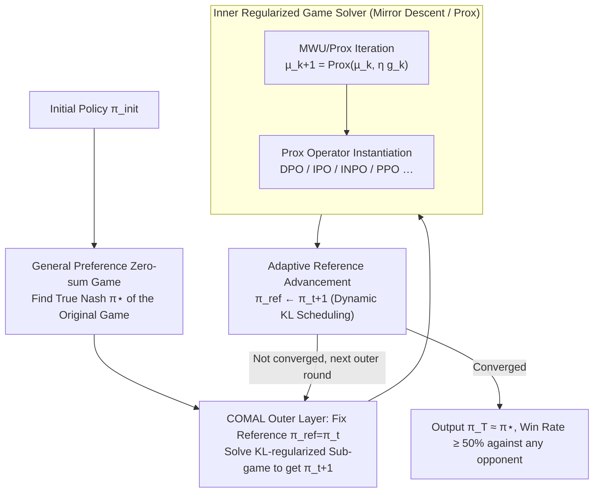

# COMAL: A Convergent Meta-Algorithm for Aligning LLMs with General Preferences

**Conference**: ICLR2026  
**OpenReview**: [https://openreview.net/forum?id=OsrE5DJ9Fu](https://openreview.net/forum?id=OsrE5DJ9Fu)  
**Code**: To be confirmed  
**Area**: Alignment RLHF  
**Keywords**: General Preferences, Nash Equilibrium, Zero-sum Game, Last-iterate Convergence, Proximal Operator  

## TL;DR
COMAL models "aligning to general human preferences" as an original (unregularized) two-player zero-sum game. Using the Conceptual Prox meta-algorithm derived from game theory—which solves a KL-regularized sub-game in each round and then advances the reference policy to the current solution—it proves for the first time that the algorithm achieves **last-iterate convergence to the exact Nash Equilibrium of the original game**. This guarantees a $\ge 50\%$ win rate against any opponent strategy. It can be implemented on top of existing methods like DPO/IPO/INPO with minimal changes, maintaining a $>60.2\%$ win rate against all baseline algorithms on Llama-3-8B-Instruct.

## Background & Motivation

**Background**: Current mainstream LLM alignment methods (RLHF, DPO, etc.) are predominantly built upon the Bradley-Terry (BT) reward model assumption—assuming each response has a scalar reward $r(y)$, and the preference probability is given by $\sigma(r(y_1)-r(y_2))$. Alignment is achieved by learning this reward model (or learning it implicitly like DPO) and then maximizing it.

**Limitations of Prior Work**: The BT model can only represent **transitive preferences**—if the majority prefers A > B and B > C, it necessarily implies the majority prefers A > C. However, real collective preferences are often **non-transitive (cyclic)**: for subjective questions like "What is the best way to spend Sunday?", one group may prefer outdoors over reading, another reading over TV, and a third TV over outdoors, aggregating into a cycle $A \succ B \succ C \succ A$. The paper also notes that even if each individual is transitive, **a mixture of two BT models can no longer be characterized by a single BT model**. Using the BT framework to fit such preferences is fundamentally flawed.

**Key Challenge**: To move beyond the BT assumption, one must use a more general preference model $P(y_1 \succ y_2 \mid x)$ (satisfying only $P(y_1\succ y_2)=1-P(y_2\succ y_1)$ without requiring transitivity). In this case, alignment is modeled as a **two-player zero-sum game**, aiming to find its **Nash Equilibrium strategy $\pi^\star$**—a strategy with at least a 50% win rate against any other strategy, representing a truly "robust" alignment solution. However, the problem is that existing self-play algorithms designed for this **either diverge or diverge to bias**. Iter-IPO and SPPO based on Multiplicative Weight Updates (MWU) cycle around the equilibrium without converging in the last iterate; while the Nash-MD and INPO line of work converges, it converges to the equilibrium of a **"modified" game with added KL regularization**, which no longer guarantees a 50% win rate against arbitrary opponents.

**Goal**: Is it possible to have an algorithm that achieves **last-iterate convergence to the Nash Equilibrium of the original (unregularized) alignment game**, truly realizing the 50% win rate guarantee? "Last-iterate" is crucial here—theoretically, many methods only guarantee **average-iterate** convergence (a uniform mixture of all checkpoints), but averaging dozens of deep network checkpoints is neither storage-efficient nor practical for LLMs; in practice, only the last checkpoint is used.

**Key Insight**: The authors start from the **Conceptual Prox-method** (Nemirovski 2004) in optimization and game theory—a classical framework for solving zero-sum games with convergence guarantees where each step is exactly a **Proximal operator (Prox operator)**. A key observation of the authors is that existing preference optimization algorithms like PPO, GRPO, DPO, IPO, SPPO, REBEL, DRO, and INPO **can essentially be interpreted as computing a Prox operator on LLMs**. This provides a path combining "theoretical guarantees + plug-and-play" capability.

**Core Idea**: Use the Conceptual Prox framework to create a **meta-algorithm**—in each round, solve a KL-regularized sub-game using the current policy as a reference point to obtain $\pi_t$, and then **adaptively advance the reference policy to $\pi_t$** before continuing. Regularization serves only as a "scaffolding" to stabilize training; the continuous advancement of the reference point allows the entire sequence to monotonically approach and eventually converge to the true Nash of the **original game**.

## Method

### Overall Architecture

COMAL (Convergent Meta Alignment Algorithm) aims to solve the alignment game under general preferences. Given an instruction distribution $\rho$, response set $Y$, and general preference model $P$, the win rate of policy $\pi_1$ over $\pi_2$ is denoted as $P(\pi_1\succ\pi_2)=\mathbb{E}_{x\sim\rho}\mathbb{E}_{y_1\sim\pi_1,y_2\sim\pi_2}[P(y_1\succ y_2\mid x)]$. The objective function of the alignment game is

$$J(\pi_1,\pi_2) := P(\pi_1\succ\pi_2) - \tfrac{1}{2},$$

where the max player controls $\pi_1$ to maximize and the min player controls $\pi_2$ to minimize (subtracting $\tfrac12$ merely makes it zero-sum). Due to the symmetry of the game, a symmetric Nash Equilibrium $(\pi^\star,\pi^\star)$ exists, and $\pi^\star$ satisfies $P(\pi^\star\succ\pi)\ge P(\pi^\star\succ\pi^\star)=50\%$ for any $\pi$—the robust alignment solution desired.

COMAL has a **two-layer nested** structure: the outer layer is the meta-algorithm (advancing the reference policy), and the inner layer is a regularized zero-sum game solver (using Mirror Descent / Prox), where the Prox step can be instantiated by existing algorithms like DPO/IPO/INPO. The overall execution is: starting from $\pi_{\text{init}}$, each outer round $t$ fixes the reference $\pi_{\text{ref}}=\pi_t$, solves a KL-regularized sub-game $J_\tau(\pi_1,\pi_2,\pi_{\text{ref}})$ to obtain Nash $\pi_{t+1}$, then advances the reference to $\pi_{t+1}$, and repeats until convergence.

### Key Designs

**1. Zero-sum Game under General Preferences: Focusing on "True Nash" instead of Compromised Solutions**

Since the BT assumption cannot fit cyclic preferences, COMAL operates directly on the general preference model $P$, defining the alignment as an alignment game $J(\pi_1,\pi_2)=P(\pi_1\succ\pi_2)-\tfrac12$ (Definition 2). This step defines the "target" of the paper: finding the Nash Equilibrium $\pi^\star$ of the **original game**, as only it satisfies the robustness guarantee of $\ge 50\%$ win rate against any opponent. This is fundamentally different from the Nash-MD/INPO line, which permanently adds a KL regularization term to the objective for training stability, solving a modified game:

$$J_\tau(\pi_1,\pi_2,\pi_{\text{ref}}) = J(\pi_1,\pi_2) - \tau\,\mathbb{E}_x[\mathrm{KL}(\pi_1\|\pi_{\text{ref}})] + \tau\,\mathbb{E}_x[\mathrm{KL}(\pi_2\|\pi_{\text{ref}})]$$

Its Nash $\pi^\star_\tau$ is pulled by the reference policy, leaving a **constant equilibrium gap** between it and the true Nash $\pi^\star$, thus losing the 50% win rate guarantee. COMAL does not accept this compromise: regularization is a temporary means, and the algorithm must eventually return to the unregularized true Nash.

**2. COMAL Meta-Algorithm: Adaptive Reference Policy Advancement for Last-Iterate Convergence**

This is the essence of the paper and the primary difference from existing methods: **instead of fixing the reference policy, it advances it to the latest solution in each round**. In each round $t$, the algorithm (Algorithm 1) solves a regularized sub-game centered at $\pi_{\text{ref}}=\pi_t$, obtains its Nash $\pi_{t+1}$, and then sets $\pi_{\text{ref}}\leftarrow\pi_{t+1}$ before continuing. This is an instantiation of the Conceptual Prox-method—only when a regularized sub-game is solved to equilibrium is the regularization center moved, steadily and robustly progressing toward the true Nash.

Why does it work? It possesses a **monotonicity guarantee** (Lemma 4 / Theorem 1): the KL distance to the true Nash does not increase round by round,

$$\mathrm{KL}(\pi^\star\|\pi_{t+1}) \le \mathrm{KL}(\pi^\star\|\pi_t),$$

and this holds for **any** $\tau>0$—meaning regularization strength can be adaptively adjusted during training without needing a specific decay schedule. Each round is proven to pull the policy closer to the true Nash; thus, $\lim_{t\to\infty}\pi_t$ exists and is the Nash of the original game. COMAL is the **first algorithm to provide provable last-iterate convergence** for unregularized alignment games. In contrast, Iter-IPO and SPPO only have average-iterate convergence (impractical), and Nash-MD and INPO only converge to the equilibrium of the regularized game (biased). The authors also prove a stronger Theorem 3—last-iterate convergence still holds even if each sub-game is only solved **approximately**, provided sufficient progress is made at each stage, which is more realistic than requiring an "exact solution for each regularized game."

**3. Inner Regularized Game Solver: Mirror Descent and Prox Operators**

The sub-game $J_\tau(\pi_1,\pi_2,\pi_{\text{ref}})$ to be solved in each outer round is handled by the **Mirror Descent (MD)** in the inner layer (Algorithm 2). MD is a "geometry-aware" generalization of gradient descent, using a generalized "distance" defined by a regularization term to constrain update directions; when regularization is negative entropy, it reduces to **Multiplicative Weight Update (MWU)**. Specifically, when maximizing an objective $f(\pi)$, an update step in Prox operator form is written as:

$$\pi_{t+1} := \mathrm{Prox}(\pi_t,\nabla f(\pi_t)) := \arg\max_{\pi}\Big\{\langle\nabla f(\pi_t),\pi\rangle - \eta^{-1}\mathrm{KL}(\pi\|\pi_t)\Big\},$$

intuitively meaning "follow the gradient + stay close to the previous policy (KL constraint)," preventing aggressive updates from compromising stability. For this strongly monotonic regularized sub-game, MWU has a **linear last-iterate convergence rate** (Theorem 2): the KL distance to the regularized Nash $\pi^\star_\tau$ decreases exponentially,

$$\mathrm{KL}(\pi^\star_\tau\|\mu_{k+1}) \le \Big(1-\tfrac{\eta\tau}{2}\Big)^k \mathrm{KL}(\pi^\star_\tau\|\pi_{\text{ref}}).$$

By taking $\tau=O(\varepsilon)$, the $\varepsilon$-approximate Nash of the original game can be approached within $\tilde O(1/\varepsilon^2)$ rounds.

**4. Unified Perspective of Prox Operators: Plug-and-Play and Dynamic KL Scheduling**

The practicality of COMAL lies in the authors' alignment of "computing a Prox operator" with a wide range of existing algorithms: PPO, GRPO (RL-based) and DPO, IPO, SPPO, REBEL, DRO, INPO (loss-minimization-based) can all be extended as implementations of Prox operators. Thus, applying COMAL to existing pipelines requires **minimal changes**—mainly adding an outer loop and periodic reference policy updates. The specific instance provided in the paper is **COMAL + INPO** (Algorithm 3): the inner layer uses INPO to solve the regularized sub-game, and the outer layer advances the reference policy every 6 iterations (i.e., after a full pass over the instruction set in UltraFeedback). Coupled with this outer structure, COMAL also allows for **dynamic KL scheduling**: the first round of INPO uses a smaller $\eta^{-1}=0.002$ (strong regularization for a stable start), while the next two rounds adjust to $\eta^{-1}=0.1$ (weak regularization for a higher performance ceiling). This matches the theoretical flexibility of "reference advancement + variable regularization," which is key to breaking the "collapse after 6 rounds" bottleneck observed in Iter-IPO/INPO on Llama-3.

## Key Experimental Results

### Main Results

**Synthetic Game**: A non-BT, cyclic $3\times3$ game was constructed on $Y=\{y_a,y_b,y_c\}$ ($P[y_b\succ y_a]=P[y_c\succ y_b]=0.9$, $P[y_a\succ y_c]=0.8$, cycle $y_c\succ y_b\succ y_a\succ y_c$). Iter-DPO, Iter-IPO, and SPPO all cycled around the unique Nash and diverged; INPO converged but stopped at the equilibrium of the modified game, leaving a constant equilibrium gap; **only COMAL converged to the true Nash**, pressing the equilibrium gap down to the $10^{-11}$ level.

**LLM Alignment (Llama-3-8B-Instruct, preference oracle as a mixture of two BT reward models)**: Reporting "Row vs. Column" pairwise win rates (%), COMAL exceeds 60.2% against all baseline algorithms.

| Opponent (Col) → | BASE | IPO | DPO | Iter-IPO-L | Iter-IPO | INPO-L | INPO | Average |
|--------|------|------|------|------|------|------|------|------|
| Iter-IPO (Best ckpt) | 94.16 | 79.25 | 78.63 | 50.68 | — | 89.19 | 53.79 | 66.93 |
| INPO (Best ckpt) | 92.92 | 74.78 | 73.54 | 47.08 | 46.21 | 87.20 | — | 63.44 |
| **COMAL (Final ckpt)** | 90.43 | 78.39 | 78.63 | 62.98 | 60.25 | 86.09 | 64.22 | **71.37** |

Similarly leads on Qwen2.5-7B: COMAL average win rate 68.93%, with $>56.8\%$ against the strongest opponents Iter-IPO/INPO.

### Ablation Study

| Configuration | Key Phenomenon | Explanation |
|------|---------|------|
| Iter-IPO / INPO (Small reg. $\eta^{-1}=0.002$) | **Sharp collapse** from iteration 7 | Reference policy fixed; Llama-3 is fragile after extensive post-training |
| Iter-IPO-L / INPO-L (Large reg. $\eta^{-1}=0.1$) | Stable training but **lower performance ceiling** | Strong regularization sacrifices expressivity |
| **COMAL (Ref. Adv. + Dynamic KL)** | **Steady improvement** through 18 iterations | Adaptive regularization strength balances stability and ceiling |
| COMAL vs. Standard Benchmarks | GSM8K 77.5 / MMLU 64.9 / BBH 63.3 / HumanEval 77.2 / AlpacaEval 53.5 | No degradation in general capabilities; stronger on alignment benchmarks |

### Key Findings
- **"Advancing the reference policy" is the root cause of non-collapsing performance**: Iter-IPO/INPO with fixed references collapse after 6 rounds on Llama-3, while COMAL advances the reference round by round and relaxes regularization in later rounds, allowing it to complete 18 iterations while still improving—fully echoing the theory that reference advancement brings last-iterate convergence.
- **Multi-round training is an undervalued dimension**: Previous works (like INPO) trained for 3 rounds at most (approx. one pass over UltraFeedback); COMAL trains for 18 rounds, making the difference in convergence apparent through long-term iteration.
- **COMAL is inferior to Iter-IPO's best point on Arena-Hard**. The authors honestly point out that Iter-IPO chooses the best checkpoint while COMAL chooses the final one, and Arena-Hard only compares against a fixed baseline (GPT-4), which is not perfectly aligned with COMAL's goal of "against any opponent."

## Highlights & Insights
- **"Regularization is just a scaffold, reference advancement is the main line"**: Downgrading KL regularization from a "permanent compromise" to a "temporary round-wise stabilizer" and relying on moving the reference center to return to the unregularized true Nash is the root of achieving both stability and a 50% win rate guarantee. The logic is clean and provable.
- **A unified perspective revitalizes the field**: Interpreting DPO/IPO/INPO/PPO/GRPO as "computing Prox operators" allows COMAL to be applied to almost any kernel by simply adding an outer loop. This "meta-algorithm" positioning gives it strong transferability, potentially incorporating other online learning convergence algorithms (Mirror-Prox, Optimistic MWU) in the future.
- **Theoretical depth**: Beyond proving last-iterate convergence under exact solutions, the proof of Theorem 3 for **approximate solutions** is the critical step in bridging the gap between "elegant theorems" and "practical LLM training."

## Limitations & Future Work
- **Dependency on preference oracle for evaluation**: Experiments use the "mixture of two BT" oracle from training as the evaluator. This is a controlled setting but implies conclusions hold under "oracle consistency"; the advantage is less stark when evaluating with GPT-4 (Arena-Hard).
- **Computation and multi-round costs**: 18 iterations take approximately 100 hours on 8×A6000. While the cost per iteration is similar to baselines, "multi-round" training increases total overhead. The stopping criteria and frequency of reference advancement (fixed at every 6 iterations here) are empirically set.
- **Manual dynamic KL scheduling**: The timing and values for switching $\eta^{-1}$ from 0.002 to 0.1 were determined via grid search and experience. While theory allows for any $\tau>0$, there is no automated solution for optimal tuning.
- **Future directions**: Making reference advancement frequency and regularization strength triggered by convergence signals (like equilibrium gap estimation), or validating robustness on real human preferences instead of synthetic oracles.

## Related Work & Insights
- **vs. INPO / Nash-MD (KL-regularized game line)**: They fix the reference policy and solve a modified regularized game, where the last iterate only converges to $\pi^\star_\tau$ (with a constant equilibrium gap), losing the 50% win rate guarantee. COMAL advances the reference and converges to the true Nash of the original game, guaranteeing the win rate. INPO is directly used as an inner solver by COMAL.
- **vs. Iter-IPO / SPPO (MWU line)**: Based on Multiplicative Weight Updates, they only have average-iterate convergence; the last iterate oscillates or diverges around the equilibrium. COMAL achieves linear last-iterate convergence through the proximal framework.
- **vs. Concurrent Work (Magnetic Mirror Descent, Wang et al. 2025)**: Both are variants of Conceptual Prox achieving last-iterate convergence, but the other work requires **exact** solutions for each regularized game. COMAL's Theorem 3 holds under **approximate** solutions, fitting LLM reality better.
- **vs. BT-based RLHF (PPO/DPO)**: BT can only model transitive preferences; COMAL works under general (potentially non-transitive) preferences and unifies PPO/DPO into the Prox perspective as optional kernels.

## Rating
- Novelty: ⭐⭐⭐⭐⭐ First meta-algorithm providing provable last-iterate convergence for unregularized alignment games; "Reference advancement + Unified Prox perspective" is a genuinely new framework.
- Experimental Thoroughness: ⭐⭐⭐⭐ Synthetic games + two LLMs + standard benchmarks; 18-round long-term training is convincing; dependency on preference oracle for self-evaluation is a minor minus.
- Writing Quality: ⭐⭐⭐⭐⭐ Theoretical and intuitive elements are well-interwoven; motivations are clear; honest handling of limitations (Arena-Hard, best vs. final ckpt).
- Value: ⭐⭐⭐⭐⭐ Plug-and-play with minimal changes while providing provable convergence guarantees; a solid advancement for the open problem of general preference alignment.

<!-- RELATED:START -->

## Related Papers

- [\[ICLR 2026\] Aligning Deep Implicit Preferences by Learning to Reason Defensively](aligning_deep_implicit_preferences_by_learning_to_reason_defensively.md)
- [\[ACL 2025\] Synergistic Weak-Strong Collaboration by Aligning Preferences](../../ACL2025/llm_alignment/synergistic_weak-strong_collaboration_by_aligning_preferences.md)
- [\[ACL 2026\] WildFeedback: Aligning LLMs With In-situ User Interactions And Feedback](../../ACL2026/llm_alignment/wildfeedback_aligning_llms_with_in-situ_user_interactions_and_feedback.md)
- [\[ICLR 2026\] General Exploratory Bonus for Optimistic Exploration in RLHF](general_exploratory_bonus_for_optimistic_exploration_in_rlhf.md)
- [\[ICLR 2026\] Aligner, Diagnose Thyself: A Meta-Learning Paradigm for Fusing Intrinsic Feedback in Preference Alignment](aligner_diagnose_thyself_a_meta-learning_paradigm_for_fusing_intrinsic_feedback_.md)

<!-- RELATED:END -->
