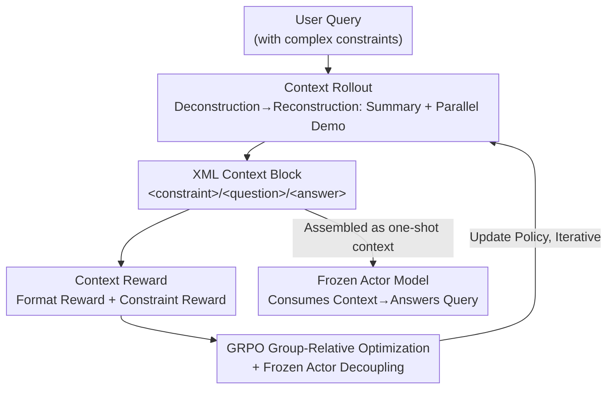

# ContextIF: Enhancing Instruction-Following through Context Reward

**Conference**: ICLR2026  
**OpenReview**: [https://openreview.net/forum?id=IuscGSmfEf](https://openreview.net/forum?id=IuscGSmfEf)  
**Code**: https://github.com/ECNU-Text-Computing/ContextIF  
**Area**: Alignment RLHF / Instruction Following / Reinforcement Learning  
**Keywords**: Instruction Following, In-Context Learning, Context Reward, GRPO, Catastrophic Forgetting

## TL;DR
ContextIF trains a "context generator" using reinforcement learning to automatically produce constraint summaries and parallel demonstrations for each instruction. This generated context is then fed into a frozen target model for In-Context Learning (ICL). Guided by a composite "Context Reward" that evaluates both structure and semantics, it improves an 8B model's IFEval score from 77.11 to 83.35 while maintaining or even enhancing general capabilities.

## Background & Motivation

**Background**: To improve the ability of LLMs to follow complex instructions (length limits, keywords, formats, tones, etc.), three mainstream paths exist: large-scale SFT, preference learning (such as DPO), and RLHF with verifiable rewards. Each of these methods involves updating model parameters. Another parameter-free path is In-Context Learning (ICL), where demonstrations are inserted into the prompt for the model to learn on the fly.

**Limitations of Prior Work**: Parameter fine-tuning consumes significant data and compute. More importantly, it often causes **catastrophic forgetting**, damaging original general knowledge and generalization capabilities (e.g., SPAR-SFT dropping 1.0 points on GSM8K). It also generalizes poorly to instruction constraints unseen during training. ICL preserves general capabilities by keeping parameters frozen, but its effectiveness is strictly limited by demonstration quality: manual selection is costly and unscalable, retrieval-based selection is limited by the coverage of the demonstration pool, and allowing LLMs to generate demonstrations often lacks structural rigor and semantic alignment—the generated items may look like demonstrations but fail to match the actual constraints of the user instruction.

**Key Challenge**: The performance ceiling of ICL depends on the ability to obtain high-quality demonstrations tailored to each instruction. However, static pools cannot cover the infinite variety of real-world instructions, and free generation lacks quality control. **The dilemma lies in needing demonstrations that are both adaptive (customized per-query) and reliable (both structurally and semantically correct).**

**Goal**: Transform "generating context for instructions" into an optimizable policy that is independent of static pools and ensures generation quality, while keeping target model parameters frozen to fundamentally avoid the alignment tax.

**Key Insight**: The authors decompose context generation into "deconstruction then reconstruction"—first extracting constraints from the original instruction into a **constraint summary**, then creating a pair of **parallel question-answer demonstrations** (new examples with identical structure and constraint types but different scenarios). This process can be scored using a reward that quantifies "structural + semantic" quality, making it naturally suitable for reinforcement learning.

**Core Idea**: Use RL (GRPO) to train a generator policy to produce "structurally rigorous + semantically aligned" ICL contexts for any instruction, which are then consumed by a frozen target model. This replaces "direct parameter tuning for instruction following" with "**learning to generate one's own learning context**."

## Method

### Overall Architecture

ContextIF reformulates instruction following into a closed loop: "Generate Context $\rightarrow$ Consume Context $\rightarrow$ Score Context $\rightarrow$ Optimize Generator." The system includes two replicas initialized from the **same base model**: a trainable **policy model (generator)** and a **frozen actor model (target LLM)**. Given a user query, the policy model does not answer directly; instead, it performs "analytical generation" to output a self-contained XML block containing `<constraint>` (constraint summary), `<question>`, and `<answer>` (parallel demonstrations). This XML is assembled as one-shot context for the frozen actor, which generates the final response. The generated context is evaluated by a multi-dimensional reward model, and signal is used to update the policy via GRPO.

### Key Designs

**1. Context Rollout: Deconstructing and Reconstructing Instructions into Reusable Demonstrations**

To address the lack of structure and alignment in freely generated demonstrations, ContextIF forces the model into a two-stage structural generation path, locking outputs into a fixed XML template. The policy model performs a **single rollout** for each query, producing: `<constraint>` (deconstruction of original instructions like "two paragraphs, under 120 words"); `<question>` and `<answer>` (reconstruction of a parallel demonstration with a different topic but **identical constraint structure**). Unlike selecting from static pools, this "creates" custom context per query, covering novel and rare constraints.

**2. Context Reward: Decoupling Structural Rigor and Semantic Alignment**

The total reward is explicitly split: $R_{\text{context}} = R_{\text{format}} + R_{\text{constraint}}$. 

Format reward $R_{\text{format}} \in \{0,1\}$ is a binary signal verifying strict adherence to the XML schema. Constraint reward $R_{\text{constraint}} \in \{0,1,2,3\}$ is the semantic core, using a strong LLM (e.g., LLaMA3-70B-Instruct) as a programmatic judge to score three binary criteria: $R_{\text{constraint}} = r_{\text{sum}} + r_{\text{demoq}} + r_{\text{demoa}}$. Here, $r_{\text{sum}}$ (Summary Accuracy) checks the summary's accuracy; $r_{\text{demoq}}$ (Question Parallelism) checks if the generated question instantiates an **isomorphic parallel constraint structure**; and $r_{\text{demoa}}$ (Constraint Adherence) checks if the generated answer satisfies the constraints defined in its own question.

**3. GRPO Group-Relative Optimization + Frozen Actor Decoupling**

To optimize the policy without an additional value network, GRPO is used. For query $q$, policy $\pi_\theta$ samples a group of $G$ independent rollouts $\{c_1,\dots,c_G\}$, scored as $r_i$. GRPO uses group statistics to estimate the baseline—calculating mean $\mu_G$ and standard deviation $\sigma_G$ to normalize advantage as:

$$\hat{A}_i = \frac{r_i - \mu_G}{\sigma_G + \epsilon}$$

The policy is updated with a clipped objective and KL constraint:

$$L_{\text{GRPO}}(\theta) = \mathbb{E}\Big[\tfrac{1}{G}\sum_{i=1}^{G}\big(\min(\rho_i(\theta)\hat{A}_i,\ \text{clip}(\rho_i(\theta),1-\alpha,1+\alpha)\hat{A}_i) - \beta D_{\text{KL}}(\pi_\theta\|\pi_{\text{ref}})\big)\Big]$$

Crucially, **the policy and actor are decoupled**: only the generator is updated via RL, while the target actor remains frozen. This mechanism circumvents catastrophic forgetting; general capabilities are preserved and even strengthened through the "self-distillation" of learning to deconstruct instructions (MMLU +1.7, BBH +1.6).

### A Complete Example

For a query "Write a movie overview in exactly two paragraphs, formal language, under 120 words, ending with 'A mind-bending experience awaits'": the policy model deconstructs these into `<constraint>`. It then reconstructs a parallel `<question>` (e.g., a review of a different film with the same constraints) and a satisfying `<answer>`. Assembling these as one-shot context helps the frozen actor meet all constraints for the original "Inception" query.

## Key Experimental Results

### Main Results

Evaluated on LLaMA3-8B-Instruct and Mistral-7B-Instruct across IFEval, Multi-IF, FollowBench, and LiveBench.

| Model | IFEval Avg | Multi-IF Turn3 | FollowBench SSR | LiveBench |
|------|-----------|----------------|-----------------|-----------|
| LLaMA3-8B-Instruct (Base) | 77.11 | 43.92 | 62.90 | 46.70 |
| SPAR-8B (SFT+DPO) | 83.11 | 51.32 | 68.80 | 49.80 |
| UltraIF-8B | 81.20 | 44.84 | 65.10 | 47.50 |
| **ContextIF-8B (Ours)** | **83.35** | **53.51** | **69.37** | **59.90** |
| LLaMA3-70B-Instruct (Ref) | 83.89 | 53.90 | 70.90 | 61.70 |

IFEval scores increased by 6.24 points over the base. In the multi-turn Multi-IF benchmark, it outperformed strong baselines in the final turn (Turn3). On LiveBench, it significantly outperformed same-sized models and approached the performance of the 70B model.

### Ablation Study

| Configuration | IFEval Avg | Multi-IF Turn3 | FollowBench SSR | LiveBench |
|------|-----------|----------------|-----------------|-----------|
| ContextIF-8B (Full) | 83.35 | 53.51 | 69.37 | 59.90 |
| w/o Format | 81.13 | 51.21 | 67.48 | 56.10 |
| w/o Summary ($r_{\text{sum}}$) | 79.22 | 50.88 | 65.05 | 52.10 |
| w/o Demoq ($r_{\text{demoq}}$) | 81.15 | 50.93 | 66.11 | 55.80 |
| w/o Demoa ($r_{\text{demoa}}$) | 78.50 | 49.15 | 64.20 | 51.70 |

### Key Findings

- **Semantic reward is more critical than structural reward**: Removing $r_{\text{demoa}}$ (Answer Adherence) caused the largest drop, followed by $r_{\text{sum}}$ (Summary Accuracy). Base models are already proficient in XML structure; the bottleneck is semantic deconstruction.
- **Improved general capabilities**: While SPAR-SFT regressed (GSM8K -1.0), ContextIF improved across MMLU, BBH, and GSM8K, proving that decoupling the actor avoids the alignment tax.
- **Strong generalization to unseen constraints**: Even when "Length" and "Keywords" constraints were removed from training, ContextIF consistently outperformed SPAR-SFT-DPO on these categories in testing.
- **Efficiency**: Only 4k unlabeled queries were used for GRPO, compared to the 50k+ synthetic samples required by SPAR/AutoIF.

## Highlights & Insights

- **Policy-based demonstration generation**: Shifting from "selecting demonstrations" to "learning a policy to generate demonstrations" bypasses the coverage limitations of static pools.
- **Generator-Actor decoupling**: A clean solution to avoid catastrophic forgetting by modularizing the instruction-following capability.
- **Deconstruction + Reconstruction reward**: Breaking rewards into deconstruction (summary) and reconstruction (parallel demo) provides a precise RL signal.
- **Learning context > Learning to answer**: "Learning to generate one's own learning context" is more robust and powerful than direct parameter tuning for answering, providing inspiration for self-distillation paradigms.

## Limitations & Future Work

- Inference requires running the generator first, introducing fixed token/forward pass overhead (double the forward passes of zero-shot).
- Reliance on a strong LLM judge for the constraint reward; judge bias/cost remains a factor.
- Training distribution covered content/style/format; future work could include more diverse constraint types.
- Scalability to larger-scale, closed-source, or multimodal models remains to be verified.

## Related Work & Insights

- **vs SFT/Preference Learning (Conifer, AutoIF, SPAR)**: These rely on massive synthetic data and multi-stage tuning, risking forgetting and poor generalization. ContextIF achieves higher performance with 10x less data (4k vs 50k+) and zero target parameter updates.
- **vs Traditional ICL**: Traditional ICL is limited by demonstration pools. ContextIF generates customized context on the fly for rare constraints.
- **vs LLM-generated Context**: Free generation lacks quality. ContextIF uses verifiable rewards and GRPO to optimize generation quality, outperforming context generated even by GPT-4o.
- **vs Direct RLHF**: Direct RL on the target model incurs an alignment tax; ContextIF enhances instruction following as a form of self-distillation without harming base capabilities.

## Rating
- Novelty: ⭐⭐⭐⭐⭐ 
- Experimental Thoroughness: ⭐⭐⭐⭐⭐ 
- Writing Quality: ⭐⭐⭐⭐ 
- Value: ⭐⭐⭐⭐⭐ 

<!-- RELATED:START -->

## Related Papers

- [\[ACL 2025\] Reverse Preference Optimization for Complex Instruction Following](../../ACL2025/llm_alignment/reverse_preference_optimization_for_complex_instruction_following.md)
- [\[ACL 2026\] What Makes Good Instruction-Tuning Data? An In-Context Learning Perspective](../../ACL2026/llm_alignment/what_makes_good_instruction-tuning_data_an_in-context_learning_perspective.md)
- [\[ICLR 2026\] RECAST: Expanding the Boundaries of LLMs' Complex Instruction Following with Multi-Constraint Data](recast_expanding_the_boundaries_of_llms_complex_instruction_following_with_multi.md)
- [\[ACL 2026\] MDP-GRPO: Stabilized Group Relative Policy Optimization for Multi-Constraint Instruction Following](../../ACL2026/llm_alignment/mdp-grpo_stabilized_group_relative_policy_optimization_for_multi-constraint_inst.md)
- [\[ACL 2025\] IOPO: Empowering LLMs with Complex Instruction Following via Input-Output Preference Optimization](../../ACL2025/llm_alignment/iopo_input_output_preference.md)

<!-- RELATED:END -->
