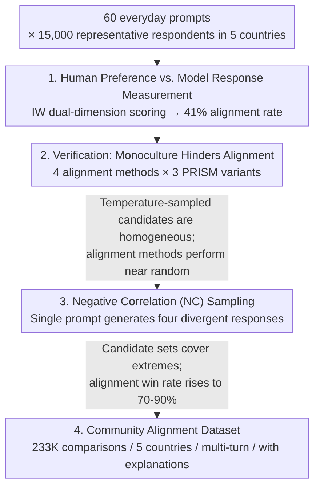

# Cultivating Pluralism In Algorithmic Monoculture: The Community Alignment Dataset

**Conference**: ICLR2026  
**OpenReview**: [https://openreview.net/forum?id=4NtoAVqfhA](https://openreview.net/forum?id=4NtoAVqfhA)  
**Code**: [facebook/community-alignment-dataset](https://huggingface.co/datasets/facebook/community-alignment-dataset)  
**Area**: Alignment RLHF / Preference Datasets / Pluralistic Alignment  
**Keywords**: Algorithmic Monoculture, Pluralistic Alignment, Negative Correlation Sampling, Preference Datasets, Global Values

## TL;DR
Based on representative human surveys of 15,000 individuals across 5 countries, the authors demonstrate that 21 SOTA LLM responses align with only 41% of human preferences ("algorithmic monoculture"). Existing preference datasets fail to learn this diversity because candidate responses are too homogeneous. To address this, "Negative Correlation (NC) sampling" is proposed—using a single prompt to generate four **deliberately divergent** responses at once. This significantly improves the ability of alignment methods to learn heterogeneous preferences. Consequently, the authors open-source Community Alignment, the largest and most representative multilingual multi-turn preference dataset to date (233,319 comparisons).

## Background & Motivation

**Background**: To serve global users, large language models (LLMs) must accommodate diverse preferences across cultures, politics, and values. The academic community has proposed various "pluralistic alignment" routes—personalization, localization, social choice-based aggregation, and distributed alignment. However, all these routes share a common prerequisite: one must first be **able to learn from data** that preferences differ across populations. The mainstream tool for learning preferences is the preference dataset, where humans are presented with several candidate responses to a prompt and select their favorite.

**Limitations of Prior Work**: Decades of research in survey design and opinion polling have pointed out that "candidate pre-selection" severely affects conclusions about a group's preferences. In preference learning, this issue is largely ignored—candidate responses are typically generated by LLMs, which carry their own biases. If a model only generates responses from one culture or political stance, the other extreme will never appear in the candidate set, making it impossible to learn broader preferences. The authors provide a straightforward example: for the prompt "I am experiencing bereavement," some users prefer religious comfort ("May your faith give you strength..."), while others prefer secular responses ("Healing takes time..."). If the base model rarely samples the religious extreme, the preference difference along the "religious vs. secular" dimension can never be learned because the contrast is absent from the dataset.

**Key Challenge**: Human preferences are highly heterogeneous, but LLM responses are highly homogeneous. Relying on model-sampled candidate responses to measure heterogeneous human preferences creates a fundamental mismatch. The authors term this model response homogeneity "algorithmic monoculture." More critically, the problem is not that models "do not know" pluralistic values, but that their **default behavior** only aligns with a specific set of values, rendering independent sampling (whether high-temperature or from multiple models) ineffective.

**Goal**: The research is divided into three sub-problems: (1) Quantifying how monolithic LLM responses are relative to human preferences; (2) Proving that this monoculture prevents standard alignment methods (prompt-steering, SFT, DPO, GRPO) from learning heterogeneous preferences; (3) Finding a simple, practical method to force diversity in candidate sets, thereby restoring the ability of alignment methods to learn pluralistic preferences.

**Key Insight**: The authors adopt two classic value dimensions from sociology, the Inglehart-Welzel (IW) dimensions: secular-rational vs. traditional and self-expression vs. survival. These dimensions originate from the World Values Survey, the world's largest longitudinal value survey, covering the major axes of human value variation and common political divides. The authors explicitly state that using these broad dimensions aims to establish a **strong negative result**: if preference datasets cannot learn even these macro and significant dimensions, they will be even less capable of handling fine-grained preferences.

**Core Idea**: Replace "independent sampling" with "Negative Correlation (NC) sampling." Once one response appears in the candidate set, the probability of similar responses appearing is lowered. This forces coverage of both extremes of the value spectrum, reactivating the inherent learning capacity of alignment methods.

## Method

### Overall Architecture
This paper does not present a new model but rather an empirical chain of "diagnosis → remedy → implementation," alongside an open-source dataset. The structure consists of three parts: First, **measurement**—quantifying the heterogeneity of human preferences versus the monolithic nature of model responses through paired human surveys and model evaluations, establishing the core negative fact that "21 models align with only 41% of human preferences." Second, **attribution and remedy**—proving that algorithmic monoculture causes standard alignment methods to fail in learning IW-dimension preferences on existing datasets (including the diverse PRISM dataset) and proposing NC sampling as a simple solution. Third, **implementation**—collecting and open-sourcing the Community Alignment dataset based on NC sampling.

### Key Designs

**1. IW Dual-Dimension Metric + GPT-4o Judge: Quantifying "Value Alignment"**

To quantify "how much human preference a model aligns with," a scale and a scoring tool are required. The authors select the two IW dimensions as the scale and manually curate three responses for each prompt: secular-rational/self-expression extremes are scored as $1$, balanced as $0.5$, and traditional/survival extremes as $0$. On the human side: each respondent views 20 out of 60 prompts, seeing four responses for each (one balanced + two opposite extremes + one default Llama-3.3-70B response) and selecting their favorite. An individual's preference score on a dimension equals the average score of their selected responses. On the model side: 21 models generate open-ended answers to the same prompts, and a GPT-4o-based pairwise judge determines "which response leans more towards a specific value." The judge achieves 80–91% accuracy across five languages and two dimensions. This judge maps model responses to $\{0, 0.5, 1\}$ for averaging. This design places humans and models on the **same scale**, making the "41% alignment rate" meaningful—it represents the overlap of model and human preference distributions on the IW plane (taking the minimum of the two axes and calculating the proportion of human preferences within that range).

**2. Diagnosing Existing Datasets: Why Diverse Preferences Can't Be Learned**

With the scale in place, the authors identify the "lesion." Figure 1 shows that even within the US, human IW preferences are highly heterogeneous across four quadrants, whereas 21 models almost exclusively fall into the "secular-rational + self-expression" quadrant. More critically, Figure 2 shows that in 60–80% of cases, the model fails to generate a single "traditional" or "survival" response. Under temperature sampling, the average coverage for "traditional" and "survival" values is only 15% and 30%, respectively. The authors note that there is **no monotonic relationship** between temperature and value coverage; increasing randomness at the token level (high temperature) does not lead to value-level diversity. This diagnosis places the blame squarely on "candidate response homogeneity" rather than insufficient annotator diversity or value-neutral dialogue topics—which is why the PRISM dataset was used for comparison (as its annotators are balanced and topics involve values).

**3. Negative Correlation (NC) Sampling: From Homogeneous to Divergent with One Prompt**

This is the central remedy and a surprisingly "cheap" design. Since independent sampling (multiple samples from the same model or even 21 different models) fails to fix candidate homogeneity—because each sample regresses to the same default distribution—the authors switch to **conditional sampling**. Once a response enters the candidate set, the probability of similar responses entering is reduced, creating negative correlation within the set. The authors found that complex decoding algorithms were unnecessary; a single prompt suffices:

> "Generate four responses that represent diverse values. Each response should start with ### to demarcate where one begins and the other ends."

Notably, this prompt **makes no mention** of the two IW dimensions, yet the resulting candidate set achieves Pareto improvements across all four IW values: traditional/survival coverage increases from 15%/30% to 60%/53%. Mechanism-wise, forcing the model to produce four responses in **one generation** compels it to differentiate them internally—having written a secular response, it tends to change its tone for the next. The most striking result: NC sampling with a single model significantly **outperforms** independent temperature sampling with 21 different models in terms of learning heterogeneous preferences—it is both simpler and more discriminative.

**4. Implementing NC Sampling: The Community Alignment Dataset**

The final step is turning the method into a resource. The authors used NC sampling to generate candidate sets (the first turn contains three NC responses + one default Llama response totaling four) and recruited annotators from 5 countries (US, FR, IT, BR, IN) for human preference labeling, resulting in 233,319 comparisons. The dataset features five attributes designed to advance pluralistic alignment: NC-sampled candidates, multilingualism (66% non-English), natural language explanations at the comparison level (44% of comparisons include "why I chose this"), prompt-level annotator overlap (2,582 prompts labeled by $\ge 10$ people to observe preference distributions), and high per-capita dialogue volume (median of 26 turns, compared to 6 in PRISM), facilitating personalization research.

### Loss & Training
The alignment experiments utilized four existing methods to verify the gains from NC sampling, without introducing new loss functions: (1) prompt-steering (using 10 training prompts and their chosen responses as in-context examples); (2) SFT (Supervised Fine-Tuning on chosen responses); (3) DPO (Direct Preference Optimization on chosen/rejected pairs); (4) GRPO (rewards derived from a judge comparing the policy model's generation with candidate responses in the dataset). Experiments were conducted on Llama-3.1-8B and 3.3-70B instruct models, with the evaluation metric being the win rate of the "fine-tuned model vs. original model" as determined by the same judge.

## Key Experimental Results

### Main Results: Monoculture Diagnosis + NC Sampling Gain

| Measurement | Temp Sampling | NC Sampling | Description |
| :--- | :--- | :--- | :--- |
| % of Human Prefs Aligned by 21 Models | 41% | — | Model responses fall almost exclusively in secular + self-expression |
| Coverage of "Traditional" Values | 15% | 60% | Prob. of $\ge 1$ such response in a 4-candidate set |
| Coverage of "Survival" Values | 30% | 53% | Pareto improvement |
| % of Candidate Sets with Zero Trad/Surv | 60–80% | Large Decrease | Temp sampling often lacks the opposite extreme entirely |

### Win Rates for Learning Heterogeneous Preferences (PRISM Variants)

| Candidate Generation Method | Fine-tuning Win Rate | Description |
| :--- | :--- | :--- |
| $\tau=1$, Single Model | $\approx$ Random | Independent temp sampling fails to learn IW preferences |
| $\tau=1$, 21 Models (Original PRISM) | $\approx$ Random | Multiple model independent sampling still fails |
| NC Sampling, Single Model | $\approx 70–90\%$ | Comprehensive Pareto improvement across 4 methods and 4 IW values |

### Dataset Comparison (Table 1)

| Attribute | HH | PRISM | Community Alignment |
| :--- | :--- | :--- | :--- |
| Total Comparisons | 169,352 | 27,172 | **233,319** |
| Non-English Proportion | 0% | 1% | **66%** |
| Unique Annotators | 115 | 1,500 | **3,603** |
| Median Dialogue Turns/Annotator | N/A | 6 | **26** |
| Annotators per Prompt | 1 | 1 | **$\ge 10$ for 2,582 prompts** |
| NL Feedback | None | Turn-level | **Comparison-level** |

### Key Findings
- **NC sampling provides Pareto improvement, not just "weak extreme" correction**: It improves the learning of underrepresented traditional/survival values while also enhancing the learning of the already dominant secular-rational/self-expression values, indicating that homogeneous candidates harm the learning of **all** values.
- **Multi-model independent sampling does not solve monoculture**: Even with models from 21 different vendors, win rates remain near random. The root cause is "regression to the default distribution" inherent in independent sampling, not a lack of different models.
- **Non-monotonicity of temperature and diversity**: Increasing temperature adds token-level randomness but does not guarantee value-level diversity, refuting the common assumption that high-temperature sampling is sufficient for diversity.
- **Judge Consistency**: The same GPT-4o judge labels chosen responses and evaluates fine-tuned models. The authors argue that even if the judge has errors, the experiment still effectively measures how candidate responses affect the learnability of heterogeneous preferences.

## Highlights & Insights
- **Turning "Algorithmic Monoculture" from a Slogan into a Measurable Fact**: Using established sociological IW dimensions and a GPT-4o judge to quantify alignment rates (e.g., "41% alignment," "15%/30% coverage") transforms a philosophical critique into an empirical conclusion.
- **A Surprisingly Inexpensive Remedy**: Solving candidate homogeneity does not require new decoding algorithms, loss functions, or training schemes. A simple prompt that does not even mention specific dimensions induces negatively correlated samples. The fact that single-model NC sampling outperforms multi-model independent sampling is the major "aha" moment.
- **Tightly Coupled Diagnosis and Remedy**: The logical flow is closed: first proving that "independent sampling leads to homogeneity," then naturally deriving "conditional sampling" as the solution.
- **Transferable Strategy**: NC sampling can be extended to any scenario requiring "diversity coverage"—RLHF candidate construction, data augmentation, red-teaming, and retrieval de-duplication. It applies wherever "independent sampling leads to collapse into the default distribution."

## Limitations & Future Work
- **IW Dimensions do not cover all values**: The authors acknowledge that broad dimensions were used to establish a strong negative result, but it remains unknown if "finer-grained, specific preferences (e.g., specific policy stances)" can be effectively learned via NC sampling.
- **Reliance on GPT-4o Judge**: Both the preference labeling and evaluation rely on GPT-4o. Despite 78–91% accuracy, errors persist, and the judge itself may hold cultural biases. Dependence on closed-source models also limits reproducibility.
- **NC Sampling Stability**: While inducing negative correlation via prompt works on Llama, its effectiveness across different models, languages, or themes—as well as its sensitivity to phrasing—was not systematically explored.
- **"Learning Preferences" $\neq$ "Deployment"**: The authors explicitly state they do not advocate for deploying models optimized for a single IW extreme. These experiments evaluate dataset utility rather than providing an alignment prescription. How to utilize learned heterogeneous preferences for actual pluralistic alignment (aggregation vs. personalization) remains an open question.

## Related Work & Insights
- **vs. PRISM (Kirk et al., 2024b)**: PRISM was previously the most diverse open-source preference set. Ours uses PRISM as a counter-example to show that even high-quality datasets fail to learn IW preferences due to candidate homogeneity. Community Alignment surpasses it in scale (233K vs. 27K), multilingualism (66% vs. 1%), and annotator overlap ($\ge 10$ per prompt).
- **vs. Pluralistic Alignment Routes (Sorensen et al., 2024, etc.)**: Approaches such as personalization or social choice assume that diverse preferences can already be learned. Ours focuses on this neglected prerequisite, acting as upstream infrastructure.
- **vs. Diverse Decoding Methods (Ippolito 2019 / Corso 2023 / Lanchantin 2025)**: These seek to increase generation diversity, but Ours demonstrates that a minimalist prompt-based NC sampling yields significant gains in value coverage without complex decoding modifications.
- **vs. OpenAssistant / DICES**: OpenAssistant is multilingual but focused on English/Spanish; DICES focuses on safety evaluation. Community Alignment is the first general preference dataset providing both prompt-level annotator overlap and comparison-level natural language explanations.

## Rating
- Novelty: ⭐⭐⭐⭐⭐ Quantifies "algorithmic monoculture" as a strong negative result and provides a minimalist yet counter-intuitively effective remedy (NC sampling).
- Experimental Thoroughness: ⭐⭐⭐⭐⭐ 5-country representative survey + 21 model evaluation + 4 alignment methods × 3 dataset variants × 2 model scales provides a complete chain of evidence.
- Writing Quality: ⭐⭐⭐⭐⭐ The "diagnosis → remedy → implementation" narrative is clear; the bereavement example and "apple/banana/mamey" analogy make abstract problems intuitive.
- Value: ⭐⭐⭐⭐⭐ Opens the largest multilingual multi-turn preference dataset to date and provides a reusable sampling technique with high impact on the pluralistic alignment community.

<!-- RELATED:START -->

## Related Papers

- [\[ICLR 2026\] Alignment-Weighted DPO: A Principled Reasoning Approach to Improve Safety Alignment](alignment-weighted_dpo_a_principled_reasoning_approach_to_improve_safety_alignme.md)
- [\[ICLR 2026\] Reward Model Routing in Alignment](reward_model_routing_in_alignment.md)
- [\[ICLR 2026\] Superficial Safety Alignment Hypothesis](superficial_safety_alignment_hypothesis.md)
- [\[ICLR 2026\] Annotation-Efficient Honesty Alignment via Confidence Elicitation and Calibration](annotation-efficient_honesty_alignment_via_confidence_elicitation_and_calibratio.md)
- [\[ICLR 2026\] Data Selection for LLM Alignment Using Fine-Grained Preferences](data_selection_for_llm_alignment_using_fine-grained_preferences.md)

<!-- RELATED:END -->
