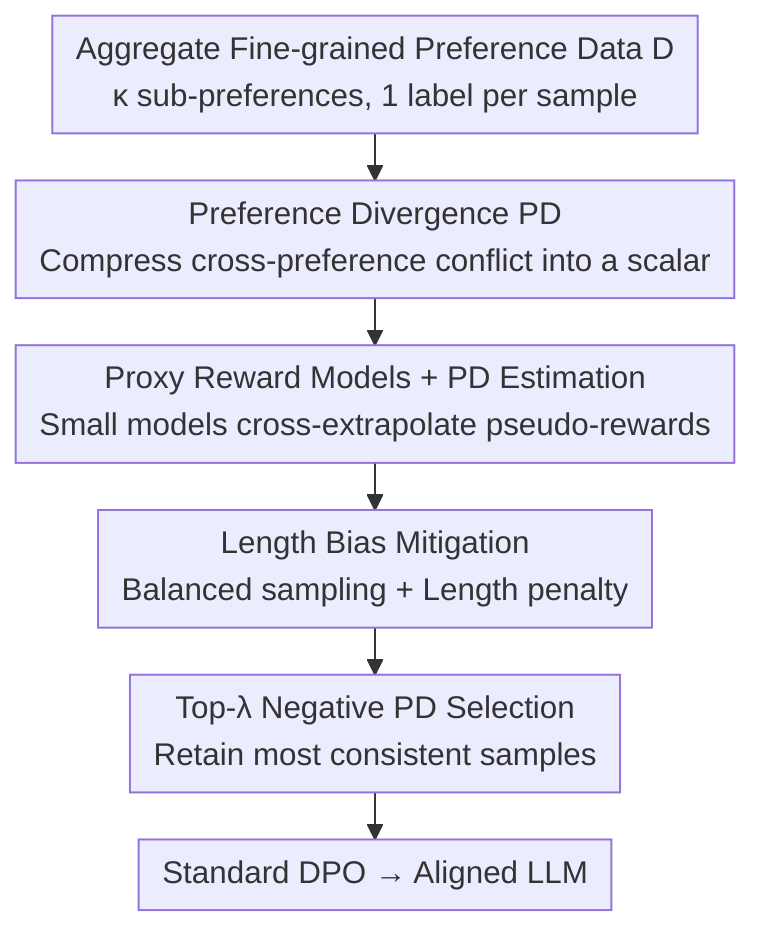

# Data Selection for LLM Alignment Using Fine-Grained Preferences

**Conference**: ICLR2026  
**OpenReview**: [https://openreview.net/forum?id=nRS87hbAqU](https://openreview.net/forum?id=nRS87hbAqU)  
**Code**: TBD  
**Area**: Alignment RLHF / LLM Alignment  
**Keywords**: Fine-grained preferences, Data selection, Preference divergence, DPO, Preference conflict

## TL;DR
Addressing the issue that training DPO on aggregated aspect-specific preferences is hindered by preference conflicts, this paper proposes Preference Divergence (PD) to quantify the degree of conflict between a sample and other preferences. It proves that "selecting only the samples with the most negative PD for standard DPO" achieves optimal upper and lower bounds for the loss. Consequently, using only 30% of data on UltraFeedback / HelpSteer consistently outperforms full-data alignment.

## Background & Motivation

**Background**: The mainstream offline approach for aligning LLMs with human preferences is DPO—direct fine-tuning on paired preference data ("A is better than B"), bypassing the expensive and unstable online RL of PPO. The effectiveness of DPO depends almost entirely on the quality of the offline preference data.

**Limitations of Prior Work**: Traditional "overall better-than" annotations are both vague and difficult to label. Consequently, some works advocate for decomposing overall preferences into several **fine-grained sub-preferences** (helpfulness, instruction-following, truthfulness, honesty, etc.), as single-dimensional criteria are simpler, more consistent, and easier to collect. However, **aggregating** these sub-preferences from different dimensions for training introduces two new problems: ① existing DPO-based methods are designed for a "single preference" and cannot handle multiple conflicting fine-grained preferences; ② more critically, aggregated data is filled with redundancy, noise, and especially **preference conflicts**—a sample might be judged better in the helpfulness dimension but is actually worse overall. Analysis on UltraFeedback shows that nearly 30% of samples exhibit explicit fine-grained $\leftrightarrow$ overall preference conflicts.

**Key Challenge**: While aggregating fine-grained preferences should provide more reliable annotations, the aggregation process itself introduces conflicting samples that "drown out" valuable preference signals. Feeding the full dataset into DPO can lead to performance degradation. The root cause is not the inherent incompatibility of different dimensions, but rather data quality—a group of samples simply should be discarded.

**Goal**: Select a high-quality, low-conflict subset from aggregated fine-grained preference data to align LLMs without adding extra annotations, while simultaneously reducing training costs.

**Key Insight**: The authors first formulate multi-preference alignment as a unified objective (DFPO). From the derivation of this objective, a natural sample weighting term emerges—Preference Divergence (PD). Since this weighting term already implicitly distinguishes sample quality, instead of solving the complex weighted optimization directly, it is used as a **data selection score**.

**Core Idea**: Use the "consistency/conflict degree of a sample relative to all other sub-preferences" (the PD term) as the selection signal. **Retain only the top-λ samples with the most negative PD (most consistent)**, and then perform standard DPO. The paper theoretically proves that this selection strategy simultaneously minimizes the upper and lower bounds of the DFPO loss.

## Method

### Overall Architecture

The method consists of a pipeline that quantifies conflicts into a calculable scalar and filters data accordingly. The input is a paired preference dataset $D$ aggregated from $\kappa$ fine-grained sub-preferences (each sample has only **one** binary preference label for a specific dimension); the output is an aligned policy model. The process involves four steps: derive Preference Divergence (PD) from the DFPO objective (a scalar measuring consistency/conflict between a sample and other dimensions); estimate the PD term for each sample using a set of small proxy reward models; mitigate length bias to ensure reliable reward model estimation; and finally select the top-λ subset with the most negative PD for standard DPO.

A key design element is that the entire pipeline **requires no new annotations**. By treating the dataset as disjoint subsets where each subset is labeled for a single sub-preference, each sample still only requires one preference label. The proxy models then cross-extrapolate these "single-dimension patterns" to the entire set to calculate PD values for all samples.

### Key Designs

**1. DFPO and Preference Divergence (PD): Compressing multi-preference conflicts into an optimizable weight**

To perform data selection, a metric for determining "whether a sample should be learned" is necessary. Starting from the PPO multi-preference objective (averaging $\kappa$ sub-preference rewards with a KL constraint), the authors re-derive it as a direct offline loss following the DPO derivation, termed Direct Fine-grained Preference Optimization (DFPO):

$$L_{\text{DFPO}}(\theta) = -\mathbb{E}_{z\sim D}\left[\log\sigma\big(\underbrace{\kappa M_\theta(z)}_{\text{Preference Margin}} + \underbrace{\Delta\phi_k(z)}_{\text{PD Term}}\big)\right]$$

Where $M_\theta(z)=\beta\log\frac{\pi_\theta(y_w|x)}{\pi_{\text{ref}}(y_w|x)} - \beta\log\frac{\pi_\theta(y_l|x)}{\pi_{\text{ref}}(y_l|x)}$ is the log-probability margin in DPO, and the emerging $\Delta\phi_k(z)=\phi_k(x,y_w)-\phi_k(x,y_l)$, $\phi_k(x,y)=-\sum_{k'\neq k} r_{k'}(x,y)$ is the **Preference Divergence (PD)**. It measures whether the winner selected in dimension $k$ is considered valuable by **all other dimensions**.

The difference between DFPO and standard DPO is the PD term, which acts as an implicit **per-sample weight**: when $\Delta\phi_k(z)>0$, it indicates that the preference in dimension $k$ **conflicts** with the majority of other dimensions. Learning it would harm overall behavior, so the PD term decreases the sample's contribution to the loss. When $\Delta\phi_k(z)<0$, it indicates the sub-preference is **consistent** with the consensus of many dimensions, representing a high-quality reliable sample; the PD term then elevates its priority. In short, PD transforms "cross-dimensional consensus vs. conflict" into a scalar that can directly rank samples.

**2. PD Data Selection Strategy: Selecting the top-λ subset with most negative PD with optimal loss bounds**

Directly optimizing DFPO faces high computational overhead and instability due to unavailable or unreliable reward models. Instead, the authors **reframe it as a data selection problem**: find a subset $\tilde D$ under budget $|\tilde D|/|D|=\lambda$ such that a policy trained only on $\tilde D$ is optimal for the original DFPO objective.

This selection is supported by theory. The authors derive the upper and lower bounds of the DFPO loss under subset partitioning (Theorem 3.4) and prove (Theorem 3.5): under normalized rewards $r_k\in[0,r]$ and mild conditions $\frac{2(\kappa-1)}{\kappa}r\le c_2-c_0$, the **optimal partition that simultaneously minimizes both bounds is to select the samples with the most negative PD terms**:

$$\tilde D = \operatorname*{arg\,top\text{-}\lambda}\{-\Delta\phi_k(z),\, z\in D\}$$

This elevates the intuition "negative PD = consensus = high quality" into a **strategy with guarantees**: it is not a heuristic but a proof that retaining the most negative PD minimizes the loss bounds. This distinguishes the approach from other heuristic filtering methods.

**3. PD Term Estimation: Cross-extrapolating pseudo-rewards with small proxy models**

To implement the strategy, a practical obstacle arises: calculating PD requires potential reward differences for every sample across **all** dimensions, but in reality, each sample only has a preference label for **one** dimension. The solution is "dimension-specific modeling, cross-dimension extrapolation": for each sub-preference $k$, a **smaller proxy model** is trained as a reward model $\hat r_k$ using Bradley–Terry loss (Eq. 11). This model is then used to predict pseudo-reward differences for samples in **other** sub-preference datasets: $\Delta\hat r_k(z')=\hat r_k(x',y'_w)-\hat r_k(x',y'_l),\ \forall z'\notin D_k$ (Eq. 12).

To make pseudo-rewards from different models comparable, quantile scaling is applied: the $\gamma$-quantile $q_k$ of the absolute scores on the external set is taken, and scores are divided by $q_k$ and clipped to $[-1,1]$ (Eq. 13–14). The final PD estimate for each sample is $\text{PD}(z)=-\sum_{k'\neq k}\Delta\tilde r_{k'}(z)$ (Eq. 15). This is feasible because fine-grained preference patterns are simpler and easier to learn than global ones, allowing small models and limited data to achieve accuracy and efficiency.

**4. Length Bias Mitigation: Balanced sampling and length penalty**

Proxy reward models often suffer from length bias: longer responses are naturally favored regardless of quality. If unaddressed, this bias propagates through the PD estimation and impairs selection. Two methods are used:

First, **length-balanced sampling**, where each sub-preference set is split into $D_k^+$ ($\text{len}(y_w)\ge\text{len}(y_l)$) and $D_k^-$. Sampling frequencies $\hat f_k^+=\frac{\exp(f_k^+/\tau)}{\exp(f_k^+/\tau)+\exp(f_k^-/\tau)}$ are adjusted with temperature $\tau$ to prevent the training set from favoring long responses. Second, **explicit length penalty**, assuming the total reward can be decomposed into a quality component and a length component modeled as a linear function of length $r_l(y)=\rho\cdot\text{len}(y)$, which is incorporated into the reward loss:

$$L(r)=\mathbb{E}_{D'_k}\left[-\log\sigma\big(r(x,y_w)-r(x,y_l)-\rho\,\Delta\text{len}(z)\big)\right]$$

Where $\Delta\text{len}(z)=\text{len}(y_w)-\text{len}(y_l)$. Pseudo-reward differences are adjusted accordingly (Eq. 17). Ablations show that removing this mitigation (PD (nl)) significantly degrades selection quality.

### Loss & Training
Proxy reward models are trained with a BT loss including length penalty (Eq. 16). The final alignment uses **standard DPO** without modifying the training objective—only the data is changed by feeding the high-value subset selected via top-λ. The budget λ is set to 30% for UltraFeedback and 50% for HelpSteer. Hyperparameters ρ (length penalty) and γ (quantile) are stable within reasonable ranges.

## Key Experimental Results

### Main Results

Using Llama3.1-8B on UltraFeedback (SELT methods use 30% data; FULL methods use 100%). WR = AlpacaEval 2 Win Rate, LC = Length-Controlled Win Rate, AW = Average Win Score across five open generation benchmarks (relative to OVA), GPU Hours includes selection and training.

| Category | Method | WR↑ | LC↑ | AW↑ | GPU h↓ |
|------|------|------|------|------|--------|
| INIT | SFT | 7.08 | 14.00 | 0.64 | 0.0 |
| FULL | OVA (Global Relabel) | 14.35 | 19.96 | 1.00 | 33.6 |
| FULL | AVG (Avg Fine-grained Relabel) | 16.63 | 22.21 | 1.15 | 33.6 |
| FULL | ALL (Full with Conflicts) | 15.18 | 21.14 | 1.08 | 33.6 |
| FULL | DFPO (Weighted Optimization) | 19.42 | 24.73 | 1.25 | 42.1 |
| SELT | RAND (Random 30%) | 14.72 | 19.56 | 1.02 | 10.1 |
| SELT | RAF (Unified Reward Filtering) | 19.64 | 23.34 | 1.18 | 16.2 |
| SELT | PD (rati.) (PD via Ground-truth) | 18.85 | 25.38 | 1.23 | 10.1 |
| SELT | **PD (ours)** | **21.00** | **26.11** | 1.24 | 18.6 |

With only 30% of the data, PD (ours) achieves an LC (26.11) that significantly exceeds ALL (21.14) and OVA (19.96) while reducing GPU time from 33.6h to 18.6h. Notably, while DFPO also outperforms FULL, its PD estimation errors directly impact policy updates, and low-value samples still consume compute and influence learning, leading to a performance bottleneck—motivating the "select then standard DPO" approach.

### Conflict Robustness (Table 2, UltraFeedback LC Win Rate)

| Method | Conflict 10% | Conflict 20% | Conflict 30% |
|------|---------|---------|---------|
| ALL (Full with Conflict) | 21.14 | 18.07 | 16.44 |
| DFPO | 24.73 | 23.28 | 20.99 |
| RAF (30% Selection) | 23.34 | 22.62 | 21.76 |
| **PD (ours) (30% Selection)** | **26.11** | **25.17** | **24.71** |

As conflict levels increase, full DPO (ALL) drops from 21.14 to 16.44, while PD (ours) remains stable at 24~26, proving that data selection effectively filters harmful conflict samples.

### Key Findings
- **Direction of selection is correct**: Selecting samples with the **highest** PD (PD (high)) performs worse than the initial model—confirming these samples are "negative assets".
- **Length debiasing is essential**: Removing explicit length mitigation (PD (nl)) results in sub-optimal selection quality.
- **Insensitive to proxy models**: Changing proxy model size/family or training sampling ratios ($p_r$) results in minimal performance fluctuations; 3B models are slightly better than 1B models.
- **Budget has a sweet spot**: Performance rises then plateaus/falls as λ increases—too small λ results in insufficient training, while too large λ degrades to ALL.
- **Effective in production**: On Taobao Live private tasks with 4 compatible sub-preferences, PD (ours) at 30%/40%/50% budgets outperformed ALL and other baselines.

## Highlights & Insights
- **Reframing hard optimization as easy data selection**: The PD weight term from DFPO derivation could have been used for complex weighted optimization, but the authors used it for ranking scores instead, avoiding instability and saving compute.
- **Bridging theory and heuristics**: Most alignment data filtering is heuristic; this paper provides a guarantee (Theorem 3.5) that PD selection minimizes loss bounds.
- **Zero additional labels**: Each sample only needs a binary label in one dimension; proxy models extrapolate patterns to obtain the full-set PD.
- **"Less is more"**: 30% curated data outperforms 100% full data, especially as conflicts increase, echoing the trend of data-centric alignment.

## Limitations & Future Work
- **Reliance on proxy model extrapolation**: The PD estimation relies on the assumption that fine-grained patterns are simple enough for small models to cross-extrapolate; this may fail if sub-preferences are highly complex or entangled.
- **Conflicts defined as quality issues rather than genuine trade-offs**: Definition 3.1 assumes conflicts come from labeling quality, not incompatible definitions. If helpfulness and safety have inherent trade-offs, discarding conflict samples might remove necessary negotiation signals.
- **Scalability of dimensions**: Experiments used a small number of dimensions ($\kappa \approx 4$). How noise accumulates for a large number of dimensions remains to be explored.
- **Evaluation bias**: Automatic evaluations (AlpacaEval 2) have inherent biases; though length was controlled, the correlation between the selection strategy and evaluation metrics could be further validated with human study.

## Related Work & Insights
- **vs. Multi-Objective Preference Optimization**: Prior works weight different sub-preferences to seek a Pareto frontier on all data; this work **filters data** to address degradation caused by conflicts.
- **vs. Single-Preference DPO Data Selection (RAF)**: RAF uses a unified reward model for difficulty filtering. This work derives PD specifically for **fine-grained** preferences with loss bound guarantees, consistently outperforming RAF.
- **vs. Full-Data Relabeling (OVA / AVG)**: Relabeling mitigates conflicts but still includes samples exceeding model capacity; PD selection discards these samples entirely.

## Rating
- Novelty: ⭐⭐⭐⭐⭐ Deriving the PD term from DFPO and reframing it as data selection with theoretical guarantees is complete and rare.
- Experimental Thoroughness: ⭐⭐⭐⭐ Coverage of multiple datasets, conflict levels, budgets, and real-world deployment is comprehensive; dimensions are relatively few.
- Writing Quality: ⭐⭐⭐⭐ Clear logical chain from motivation to theory to experiment.
- Value: ⭐⭐⭐⭐⭐ Zero extra labels, saves compute, and improves performance; directly applicable to industrial alignment.

<!-- RELATED:START -->

## Related Papers

- [\[ICLR 2026\] Holdout-Loss-Based Data Selection for LLM Finetuning via In-Context Learning](holdout-loss-based_data_selection_for_llm_finetuning_via_in-context_learning.md)
- [\[ACL 2026\] Alignment Data Map for Efficient Preference Data Selection and Diagnosis](../../ACL2026/llm_alignment/alignment_data_map_for_efficient_preference_data_selection_and_diagnosis.md)
- [\[AAAI 2026\] Importance-Aware Data Selection for Efficient LLM Instruction Tuning](../../AAAI2026/llm_alignment/importance-aware_data_selection_for_efficient_llm_instruction_tuning.md)
- [\[ICLR 2026\] Enhancing Trustworthiness of Fine-Tuned LLMs via Regularized Subset Selection](enhancing_trustworthiness_of_fine-tuned_llms_via_regularized_subset_selection.md)
- [\[ACL 2025\] Fine-grained Video Dubbing Duration Alignment with Segment Supervised Preference Optimization](../../ACL2025/llm_alignment/fine-grained_video_dubbing_duration_alignment_with_segment_supervised_preference.md)

<!-- RELATED:END -->
