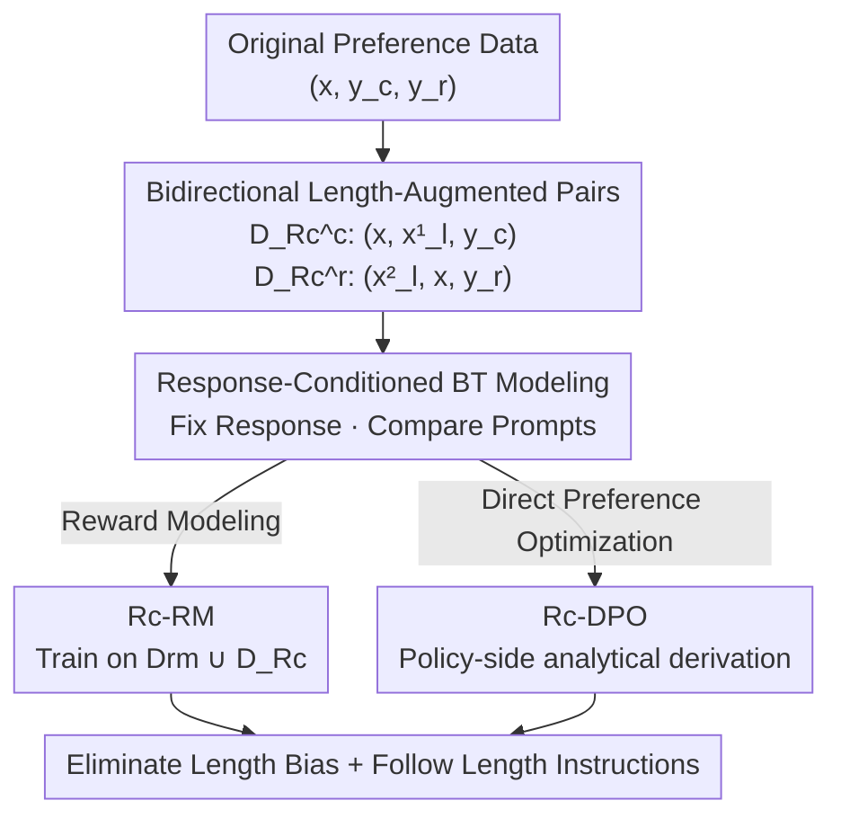

# Disentangling Length Bias in Preference Learning via Response-Conditioned Modeling

**Conference**: ICLR2026  
**OpenReview**: [https://openreview.net/forum?id=hKxYESOzen](https://openreview.net/forum?id=hKxYESOzen)  
**Code**: TBD  
**Area**: RLHF Alignment  
**Keywords**: Length bias, preference learning, reward modeling, Bradley-Terry, response conditioning  

## TL;DR
This paper transforms the implicit "length bias" in reward models into explicit "length instruction understanding." It proposes the Response-conditioned Bradley-Terry (Rc-BT) model—fixing the response and comparing different prompts—to simultaneously eliminate length cheating and enable the model to follow length instructions. This approach integrates seamlessly with Reward Modeling (Rc-RM) and DPO (Rc-DPO).

## Background & Motivation

**Background**: RLHF employs a learned reward model as a proxy for human preferences and uses RL (or Direct Preference Optimization like DPO) to maximize reward scores for LLM alignment. The standard practice centers on the Bradley-Terry (BT) model: given a prompt $x$ and a pair of responses $(y_c, y_r)$, it assumes a latent true reward $r^*$ and fits human-labeled preferences using $p^*(y_c \succ y_r) = \frac{\exp(r^*(x,y_c))}{\exp(r^*(x,y_c))+\exp(r^*(x,y_r))}$.

**Limitations of Prior Work**: Reward models are highly susceptible to "surface confounders," with **length bias** being the most prevalent and difficult to address—models tend to assign higher scores to longer responses regardless of semantic quality. Preliminary experiments in this paper solidify this: (1) Even when replacing prompts with empty or randomly mismatched ones, reward models maintain ~60% accuracy and over 85% preference consistency with the original data, indicating they score based on length rather than the prompt; (2) Evaluation sets like $D_{eval}$ are themselves biased—59.78% of chosen responses are longer than rejected ones, allowing a "longer is better" strategy to achieve nearly 60% accuracy, which distorts evaluation; (3) Models with length bias achieve only ~50% accuracy on explicit length instructions (e.g., "within 150 words"), no better than random guessing.

**Key Challenge**: Previous works treat length information as "harmful" to be suppressed—either by adding KL/length penalties or reward clipping during policy optimization (highly sensitive to hyperparameters and base models, with limited effect), or by forcing quality to be "orthogonal/linearly independent" to length during reward modeling (over-parameterization in dual-branch setups can be unstable, and regularization does not guarantee true independence). However, forced decoupling ignores two facts: length is sometimes **indeed** part of quality (e.g., in length-constrained datasets), and length information might be **leveraged** for better preference modeling rather than being discarded.

**Goal**: Simultaneously solve two sub-problems—eliminating reward-cheating length bias and enabling models to truly follow explicit length instructions—without one compromising the other.

**Key Insight**: The authors observe that reward models "unconsciously" learn length bias during preference learning but do not treat length as a measurable attribute. They hypothesize that **explicitly learning length instructions allows the model to form a clear perception of target length, thereby converting implicit length bias into explicit length understanding**. However, training directly on a naive $\{x_l, y_c, y_r\}$ format (concatenating length constraints into prompts) causes overfitting to length instructions and degrades semantic capability ($D_l^{eval}$ accuracy spikes while $D_q^{eval}$ rises then falls).

**Core Idea**: Shift the modeling perspective—instead of "comparing two responses given a prompt," the model should "**compare two prompts given the same response**." By constructing length-augmented prompt variants, the model is forced to explicitly distinguish between "human semantic intent" and "length instruction requirements," letting each find its place without contamination.

## Method

### Overall Architecture

The method revolves around one core concept: **flipping the conditional variable from the prompt to the response**. Standard BT fixes the prompt $x$ and compares responses $y_c \succ y_r$; Response-conditioned BT (Rc-BT) fixes the response $y$ and compares prompts $x_c \succ x_r$. Specifically, starting from original preference data $D_{rm}=\{(x,y_c,y_r)\}$, each response is paired with a "prompt variant containing a length constraint" to construct two types of augmented preference pairs. These are modeled in BT form, and the combined dataset $D_{Rc}$ is used for Reward Modeling (Rc-RM) and DPO (Rc-DPO).

### Key Designs

**1. Bidirectional Length-Augmented Preference Pairs: Complementary chosen and rejected ends to prevent new biases**

The naive $\{x_l, y_c, y_r\}$ format fails because it bundles "length constraints" and "semantic preferences" in the same comparison, leading the model to take shortcuts to satisfy length at the expense of semantics. This paper splits data into two categories. For chosen response $y_c$: a length-augmented prompt $x_l^1$ is constructed so that **$y_c$ intentionally violates** the constraint, making $(x,y_c) \succ (x_l^1,y_c)$. For rejected response $y_r$: $x_l^2$ is constructed such that **$y_r$ exactly satisfies** the constraint, making $(x_l^2,y_r) \succ (x,y_r)$. Ablations (Table 6) show both ends are indispensable; using only one causes quality accuracy to drop back to baseline levels as the model develops new biases.

**2. Response-Conditioned BT Modeling (Rc-BT): Fixing responses and comparing prompts to transform length from an implicit bias into an explicit comparable quantity**

This is the core of the paper. Standard BT compares which of two responses is better given a prompt; Rc-BT flips this—fixing the response and having the model compare two prompts. This is modeled as:

$$p^*(x \succ x_l^1 \mid y_c) = \frac{\exp(r^*(x,y_c))}{\exp(r^*(x,y_c))+\exp(r^*(x_l^1,y_c))}, \quad p^*(x_l^2 \succ x \mid y_r) = \frac{\exp(r^*(x_l^2,y_r))}{\exp(r^*(x_l^2,y_r))+\exp(r^*(x,y_r))}$$

Maximizing likelihood yields the Rc-BT target $L_{Rc}$. Since the **responses are identical while only prompts change**, the model is forced to explicitly perceive length rather than using it as a proxy for quality.

**3. Rc-RM: Unchanged structure, modified data format, using $\lambda$ to balance contributions**

Rc-RM requires almost zero structural changes—the reward model $r_\phi$ is still initialized from $\pi_{SFT}$ with a linear projection layer. Only the data format changes from prompt-conditioned to response-conditioned. The optimization target is rewritten in sigmoid form:

$$L_{r_\phi}(D_{Rc}) = -\mathbb{E}_{(x,x_l^1,y_c)}[\log\sigma(r_\phi(x,y_c)-r_\phi(x_l^1,y_c))] - \lambda\,\mathbb{E}_{(x_l^2,x,y_r)}[\log\sigma(r_\phi(x_l^2,y_r)-r_\phi(x,y_r))]$$

Rc-RM is trained on $D_{rm} \cup D_{Rc}$ to preserve original semantic signals while adding explicit length understanding.

**4. Rc-DPO: Following the DPO derivation path to rewrite rewards as a function of the optimal policy**

Following the standard DPO derivation, the Rc-BT objective is substituted with the analytical expression of the reward under the optimal policy, leading to the Rc-DPO objective:

$$L_{DPO}^{Rc} = -\mathbb{E}_{(x,x_l^1,y_c)}\Big[\log\sigma\big(\beta\log\tfrac{\pi_\theta(x,y_c)}{\pi_{ref}(x,y_c)} - \beta\log\tfrac{\pi_\theta(x_l^1,y_c)}{\pi_{ref}(x_l^1,y_c)}\big)\Big] - \mathbb{E}_{(x_l^2,x,y_r)}\Big[\log\sigma\big(\beta\log\tfrac{\pi_\theta(x_l^2,y_r)}{\pi_{ref}(x_l^2,y_r)} - \beta\log\tfrac{\pi_\theta(x,y_r)}{\pi_{ref}(x,y_r)}\big)\Big]$$

This allows for offline, stable policy optimization while simultaneously gaining de-biasing and instruction-following capabilities.

### Loss & Training
Rc-RM uses a learning rate of $1\times10^{-5}$, cosine schedule, 10-step warmup, batch size 64, and 5 epochs. Rc-DPO uses the same settings but with a learning rate of $1\times10^{-6}$. To avoid being misled by the inherent length bias of original evaluation sets, the authors used GPT-4o to rewrite $(x,y_c,y_r)$ triplets into a de-biased quality evaluation set $D_q^{eval}$ where semantic quality is consistent but length directions are reversed.

## Key Experimental Results

### Main Results

Reward Model Quality Accuracy ($D_q^{eval}$, higher indicates less reliance on length cheating):

| Model | Baseline | ODIN | R-DA | Rc-RM (Ours) |
|------|----------|------|------|-------|
| Qwen2-1.5B-Base | 59.14 | 56.12 | 60.17 | **69.55** |
| Qwen2.5-7B-Instruct | 59.31 | 67.55 | 66.34 | **73.07** |
| Llama-3.1-8B-Instruct | 55.59 | 60.90 | 60.78 | **72.44** |
| Gemma-2-9B-it | 53.45 | 55.85 | 55.21 | **63.56** |
| Qwen2.5-14B-Instruct | 65.57 | 76.22 | 75.14 | **81.70** |

Rc-RM outperforms all baselines across all models. For instance, Llama-3.1-8B-Instruct improves by 16.85% over the baseline.

DPO Models on AlpacaEval (Quality Win Ratio and Average Response Length):

| Model | Metric | Baseline | SimPO | Dr.DPO | Rc-DPO (Ours) |
|------|------|----------|-------|--------|--------|
| Qwen2.5-7B-Base | Quality Win Rate (%) | 33.54 | 41.26 | 39.74 | **45.39** |
| Qwen2.5-7B-Base | Response Length | 517.30 | 286.54 | 311.49 | **208.42** |
| Llama-3.1-8B-Instruct | Quality Win Rate (%) | 42.52 | 58.13 | 52.18 | **64.34** |
| Llama-3.1-8B-Instruct | Response Length | 247.74 | 218.46 | 229.17 | **204.77** |

Rc-DPO achieves the highest quality win rate with controlled response lengths.

### Ablation Study

| Configuration | Model | Quality Accuracy (%) | Length Accuracy (%) |
|------|------|---------------|---------------|
| Full Rc-RM | Llama-3.1-8B-Instruct | 72.44 | High |
| w/o $D_{Rc}^c$ | Llama-3.1-8B-Instruct | 58.51 | 37.18 |
| w/o $D_{Rc}^r$ | Llama-3.1-8B-Instruct | 52.13 | 33.65 |

### Key Findings
- **Bidirectional pairs are mandatory**: Removing either end causes quality accuracy to drop to baseline levels and length accuracy to remain near 50%. This suggests single-ended training induces a new bias toward (or against) length-constrained prompts.
- **De-biased evaluation is crucial**: On the biased $D_{eval}$, the baseline appears competent due to length cheating. The gap only becomes clear on the GPT-4o-restructured $D_q^{eval}$.
- **Quality and length are not zero-sum**: Reward Score-Length curves show Rc-RM scores are the most stable across different lengths, whereas other methods often show monotonic increases or sharp fluctuations.

## Highlights & Insights
- **"Flipping conditional variables" is an elegant perspective shift**: It requires no network changes or complex regularization, simply switching the "comparison axis" to make length measurable. This can potentially be extended to other confounders (format, politeness).
- **Treating "data bias" as a primary problem**: The authors proved the inherent bias in common evaluation sets before building their own de-biased benchmark, a highly recommended experimental practice.
- **Unified interface**: The same Rc-BT framework applies to both RM and DPO with minimal engineering cost.

## Limitations & Future Work
- **Dependency on constructible constraints**: Constructing bidirectional pairs is easy for length but might be difficult for less quantifiable attributes like style or politeness.
- **Reliance on GPT-4o for evaluation**: $D_q^{eval}$ quality depends on the rewriting capabilities of GPT-4o, which may introduce its own biases.
- **Hyperparameter $\lambda$**: The sensitivity of the balance between chosen/rejected ends is not fully analyzed.
- **Generalization**: While the framework is theoretically general, empirical validation remains focused on length.

## Related Work & Insights
- **vs. Policy-side corrections**: These adjust length post-hoc during RL and are sensitive to hyperparameters. Ours addresses the root cause during preference modeling.
- **vs. Decoupling methods (ODIN/R-DA)**: These use dual branches or regularization to force independence, which can be unstable and ignores that length can be useful.
- **vs. Dataset-based instruction following (LIFT)**: These often overfit to length at the cost of semantic quality; Rc-BT avoids this side effect by fixing the response during prompt comparison.

## Rating
- Novelty: ⭐⭐⭐⭐⭐ 
- Experimental Thoroughness: ⭐⭐⭐⭐ 
- Writing Quality: ⭐⭐⭐⭐ 
- Value: ⭐⭐⭐⭐⭐ 

<!-- RELATED:START -->

## Related Papers

- [\[ICLR 2026\] Bradley–Terry and Multi-Objective Reward Modeling Are Complementary](bradley-terry_and_multi-objective_reward_modeling_are_complementary.md)
- [\[NeurIPS 2025\] ResponseRank: Data-Efficient Reward Modeling through Preference Strength Learning](../../NeurIPS2025/llm_alignment/responserank_data-efficient_reward_modeling_through_preference_strength_learning.md)
- [\[NeurIPS 2025\] Short-length Adversarial Training Helps LLMs Defend Long-length Jailbreak Attacks](../../NeurIPS2025/llm_alignment/short-length_adversarial_training_helps_llms_defend_long-length_jailbreak_attack.md)
- [\[ICLR 2026\] Learning from Noisy Preferences: A Semi-Supervised Learning Approach to Direct Preference Optimization](learning_from_noisy_preferences_a_semi-supervised_learning_approach_to_direct_pr.md)
- [\[ICLR 2026\] Aligner, Diagnose Thyself: A Meta-Learning Paradigm for Fusing Intrinsic Feedback in Preference Alignment](aligner_diagnose_thyself_a_meta-learning_paradigm_for_fusing_intrinsic_feedback_.md)

<!-- RELATED:END -->
